# 自学习人工智能代理第二部分:深度 Q 学习

> 原文：<https://towardsdatascience.com/self-learning-ai-agents-part-ii-deep-q-learning-b5ac60c3f47?source=collection_archive---------1----------------------->

## 深度 Q 学习的数学指南。在这个关于深度强化学习的多部分系列的第二部分中，我将向您展示一种有效的方法，来说明 AI 智能体如何在具有离散动作空间的环境中学习行为。

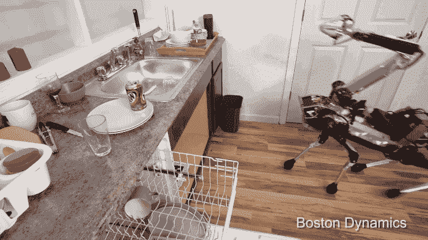

## 自学习人工智能代理系列—目录

*   [第一部分:马尔可夫决策过程](/self-learning-ai-agents-part-i-markov-decision-processes-baf6b8fc4c5f)
*   第二部分:深度 Q-Learning ( **本文**)
*   [第三部分:深度(双)Q 学习](/deep-double-q-learning-7fca410b193a)
*   第四部分:持续行动空间的政策梯度
*   第五部分:决斗网络
*   第六部分:异步演员-评论家代理
*   …

## 深度 Q-学习-目录

*   **0。简介**
*   **1。时间差异学习**
*   **2。q-学习**
*   2.1 开启和关闭策略
*   2.2 贪婪政策
*   **3。深度 Q 学习**
*   3.1 目标网络和 Q 网络
*   3.2ε-贪婪政策
*   3.3 勘探/开采困境
*   3.4 体验回放
*   **4。具有经验重放伪算法的深度 Q 学习**

## 如果你喜欢这篇文章，想分享你的想法，问问题或保持联系，请随时通过 LinkedIn 与我联系。

## 0.介绍

> 在本系列的第一篇文章中，我向您介绍了*马尔可夫决策过程*的概念，这是深度强化学习的基础。为了完全理解下面的主题，我建议你重温一下第一篇文章。

通过深度 Q 学习，我们可以编写能够在具有离散动作空间的环境中运行的人工智能代理。离散动作空间是指定义明确的动作，例如向左或向右、向上或向下移动。

FIg. 1\. Atari’s Breakthrough as an example for discrete action spaces.

*雅达利的突破*是一个具有离散行动空间的环境的典型例子。人工智能代理可以向左或向右移动。每个方向的运动都有一定的速度。

如果代理可以决定速度，那么我们将有一个连续的动作空间，有无限多的可能动作(不同速度的运动)。这一案件将在今后审议。

## 1.动作值函数

在上一篇文章中，我介绍了动作值函数的概念 ***Q(s，a)***由 ***Eq 给出。1.*** 提醒一下，动作值函数被定义为 AI 智能体通过从状态 **s** 开始，采取动作 **a** 然后遵循策略 **π而获得的预期回报。**

> **记住**:直观地说，策略π可以描述为代理根据当前状态 **s** 选择某些动作的策略。

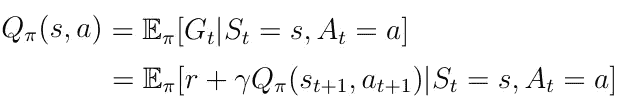

Eq. 1 Action-Value function.

***【s，a】***告诉代理人一个可能动作的值(或质量)****s***。给定一个状态 ***s*** ，动作值函数计算该状态下每个可能动作 ***a_i*** 的质量/值，作为标量值(图 1)。更高的质量意味着对于给定的目标更好的行动。*

*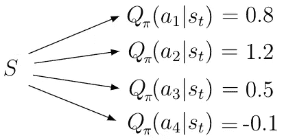*

*Fig. 1 Given a state **s**, there are many actions and appropriate values of Q(s,a)*

*如果我们执行**等式中的期望运算符 *E* 。1** 我们获得了一种新形式的行动价值函数，在这里我们处理概率。***【Pss’***是从一个状态*到下一个状态***【s’***的转移概率，由环境决定。***【π(a ')***是政策或从数学上讲是给定状态下所有行动的分配**

***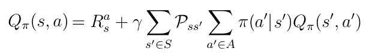***

***Eq. 2 Another form of **Q(s,a)** incorporates probabilities.***

## ***1.时间差异学习***

***我们在深度 Q-Learning 中的目标是求解动作值函数 ***Q(s，a)*** 。我们为什么想要这个？如果 AI 智能体知道 ***Q(s，a)*** ，那么给定的目标(比如赢得一场与人类玩家的象棋比赛或者玩 *Atari 的*突破)可以被认为是已解决的。这样做的原因是这样一个事实，即 ***Q(s，a)*** 的知识将使代理人能够确定在任何给定状态下任何可能行动的质量。因此，代理可以相应地行动。***

**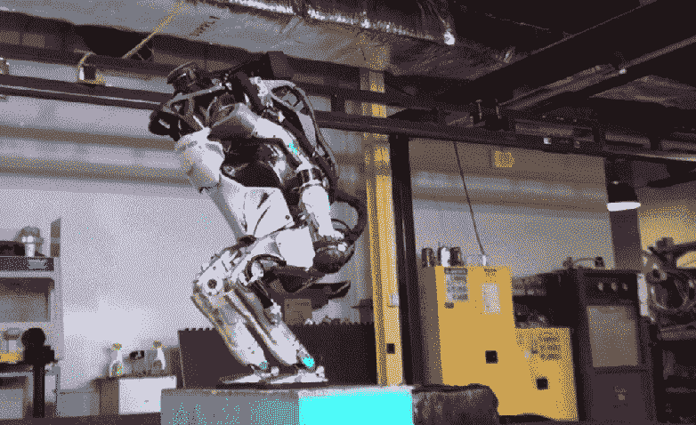**

****情商。2** 还给出了一个递归解，可以用来计算 ***Q(s，a)*** 。但是因为我们在考虑递归，而且用这个方程来处理概率是不实际的。而是必须使用所谓的*时间差分* ( *TD* )学习算法来迭代求解 ***Q(s，a)*** 。**

**在 TD 学习中我们更新 ***Q(s，a)*** 对于每一个动作 ***a*** 处于一种状态 ***s*** 朝向估计返回 ***R(t+1)+γQ(s(t+1)，a(t+1))*** ( **Eq。3** )。估计回报也称为 TD 目标。对每个状态*和动作*多次迭代地执行该更新规则，对于环境中的任何状态-动作对，产生正确的动作值***【Q(s，a)***。****

**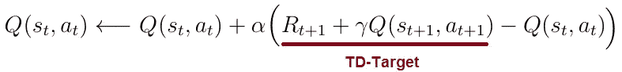**

**Eq. 3 Update rule for **Q(s,a)****

**TD-Learning 算法可以总结为以下步骤:**

*   **对于状态 ***s_t*** 中的动作 **a_t** 计算 ***Q(s_t，a_t)*****
*   **转到下一个状态***【t+1】***，在那里采取一个动作***【t+1】***并计算值 ***Q( s_(t+1)，a(t+1))*****
*   **使用 ***Q( s_(t+1)，a(t+1))*** 和即时奖励 ***R(t+1)*** 进行动作 ***a_t*** 最后状态 ***s_t*** 计算 TD-Target**
*   **通过将***【Q(s _ t，a _ t)】***添加到 TD-Target 和***【Q(s _ t，a _ t)】******α***之间的差值来更新先前的***【s _ t，a _ t】***。**

## **1.1 时间差异**

**让我们更详细地讨论 TD 算法的概念。在 TD- learning 中我们考虑了 ***Q(s，a)*** — 两个“版本”之间的差异**【a】**Q(s，】一旦**在**之前我们采取行动*处于状态***

## ***采取行动前:***

***请看图 2。假设 AI 代理处于状态 ***s*** (蓝色箭头)。在**状态下，他可以采取两种不同的动作***【a _ 1】******【a _ 2】***。基于来自一些先前时间步骤的计算，代理知道该状态下两个可能动作的动作值***【s，a _ 1】***和 ***Q(s，a_2)*** 。*****

**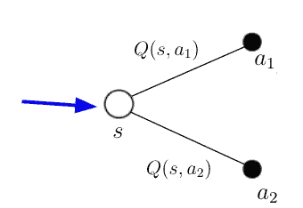**

**Fig. 2 Agent in state **s** knows every possible **Q(s,a)**.**

## **采取行动后:**

**基于这个知识，代理决定采取行动 ***a_1*** 。采取此操作后，代理处于下一个状态***‘s’***。因为采取了行动 ***a_1*** 他获得了直接奖励 ***R*** 。处于状态***s’***时，代理可以再次采取两种可能的动作***a’_ 1***和***a’_ 2***，他从先前的一些计算中再次知道了这些动作的值。**

**如果从方程 **Eq 中 ***Q(s，a)*** 的定义上看。1** 你会发现，在状态***s’***中，我们现在有了新的信息，可以用来计算 ***Q(s，a_1)*** 的新值。该信息是针对上一个状态中的上一个动作而接收到的即时奖励 ***R*** 以及针对动作***a’***而接收到的***Q(s’，a’)***代理将在这个新状态中获取。根据图 3 中的等式可以计算出 ***Q(s，a_1)*** 的新值。等式的右边也是我们所说的 TD 目标。TD-target 与旧值或***【s，a _ 1】***的'*时态版本*之差称为时态差。**

> ****记住**:在 TD-learning 期间，我们为任何可能的动作值*Q(s，a)*【s，a】**计算时间差，并同时使用它们来更新***【Q(s，a)*** *，直到* ***Q(s，a)*** 收敛到其真实值。****

**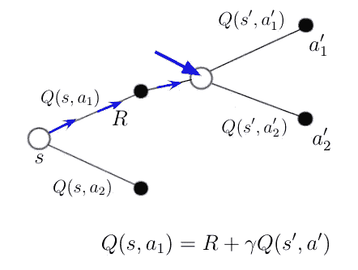**

**Fig, 3 Agent in state **s’** after taking action **a_1**.**

## **2.萨尔萨**

**应用于***【S，A】***的 TD-Learning 算法俗称 *SARSA* 算法(**S**tate—**A**action—**R**eward—**S**tate—**A**action)。 *SARSA* 是被称为 *on-policy* 算法的特殊学习算法的一个很好的例子。**

**前面我介绍了策略 **π(a|s)** 作为从状态 ***s*** 到动作 ***a*** 的映射。此时需要记住的一点是， *on-policy* 算法使用与**相同的**策略来获取 TD-Target 中***【s _ t，a _ t】***以及 ***Q(s(t+1)，a_(t+1))*** 的动作。这意味着我们正在**跟随**和**同时改进**同样的政策。**

**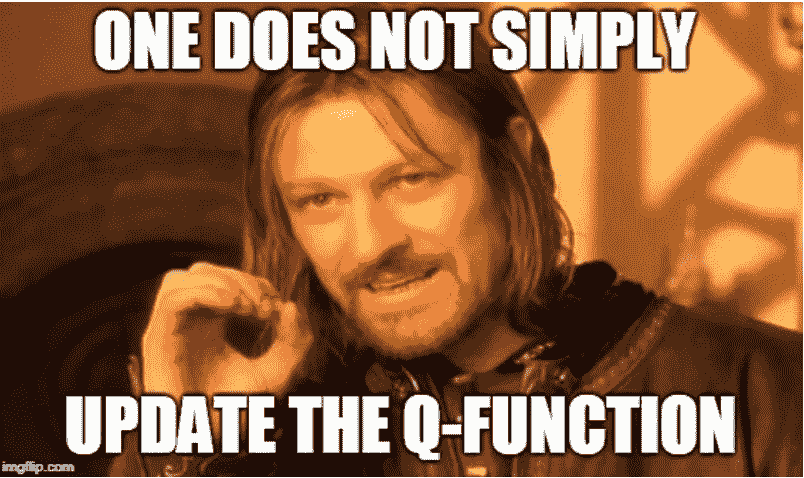**

## **3.q 学习**

**我们最终到达文章的核心，在这里我们将讨论 Q-Learning 的概念。但在此之前，我们必须先看看第二种特殊类型的算法，称为*非策略*算法。正如你可能已经想到的，Q-Learning 属于这种算法，这是一个区别到 *on-policy* 算法，如 *SARSA* 。**

**为了理解非策略算法，我们必须引入另一个策略 ***(a|s)*** ，并将其称为*行为策略*。行为策略决定行动***a _ t ~(a | s)***for***Q(s _ t，a _ t)***for all*在 *SARSA、*的情况下，行为策略将是我们同时遵循并试图优化的策略。***

***在 ***非策略*** 算法中，我们有两种不同的策略***(a | s)****和 **π(a|s)** 、 ***(a|s)*** 是行为，而**π(a|s)** 是所谓的*目标策略。*行为策略用于计算 ***Q(s_t，a _ t)***目标策略用于计算 ***Q(s_t，a_t)* 只有**中的*TD-Target。(这一概念将在下一节进行实际计算时更加全面)*****

> ******记住**:行为策略为所有 ***Q(s，a)*** 挑选动作。相比之下，目标策略只为 TD 目标的计算确定行动。****

****我们实际上称之为 Q 学习算法的算法是一个特例，其中目标策略***【π(a | s)***是一个贪婪的 w.r.t. ***Q(s，a)***这意味着我们的策略正在采取导致最高值 ***Q*** 的行动。这产生了以下目标策略:****

***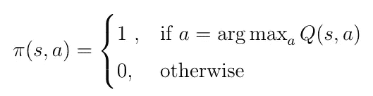***

***Eq. 4 Greedy target policy w.r.t **Q(s,a)**.***

***在这种情况下，目标策略被称为*贪婪策略*。贪婪策略意味着我们只选择产生最高***【s，a】***值的行为。这个贪婪的目标策略可以被插入到行动等式中-值***【Q(s，a)】***其中我们之前已经遵循了随机策略***【π(a | s)***:***

***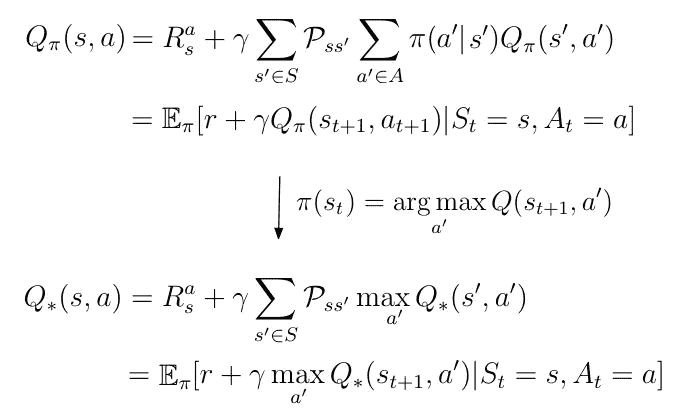***

***Eq. 5 Insertion of greedy policy into **Q(s,a)**.***

***贪婪策略为我们提供了*最优*动作值 ***Q*(s，a)*** ，因为根据定义 ***Q*(s，a)*** 是 ***Q(s，a)*** 遵循最大化动作值的策略:***

***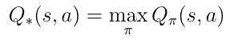***

***Eq. 6 Definition of optimal **Q(s,a)**.***

*****Eq 中的最后一行。5** 就是我们在上一篇文章中推导出的*贝尔曼最优方程*。这个方程作为递归更新规则，用来估计*最优*动作值函数 ***Q*(s，a)。******

***然而，TD-learning 仍然是找到 ***Q*(s，a)*** 的最佳方法。利用贪婪目标策略，对等式中的 **Q(s，a)** 的 TD 学习更新步骤。3 变得更加简单，如下所示:***

***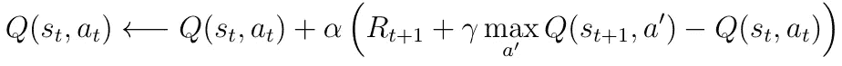***

***Eq. 7 TD-learning update rule with greedy policy.***

***用于具有贪婪目标策略的***【Q(s，a)】***的 TD-学习算法可以概括为以下步骤:***

*   ***对于状态 ***s_t*** 中的动作 **a_t** 计算 ***Q(s_t，a_t)******
*   ***转到下一个状态***【s _(t+1)***，采取动作***‘a’***，产生最高值 ***Q*** ，并计算 ***Q( s_(t+1)，a’)******
*   ***使用 ***Q( s_(t+1)，a’)***和即时奖励 ***R*** 进行动作 ***a_t*** 最后状态 ***s_t*** 计算 TD-Target***
*   ***更新先前的 ***Q(s_t，a_t)*** ，将 ***Q(s_t，a_t)*** 添加到 TD-Target 和 ***Q(s_t，a_t)之间的差值，α*** 为学习率。***

***考虑前面的图(图 3)，其中代理处于状态***【s’***，并且知道该状态下可能动作的动作值。遵循贪婪目标策略，代理将采取具有最高动作值的动作(图 4 中的蓝色路径)。这个策略还为我们提供了一个新的值 ***Q(s，a_1)*** (图中的等式)，这就是定义的 TD 目标。***

***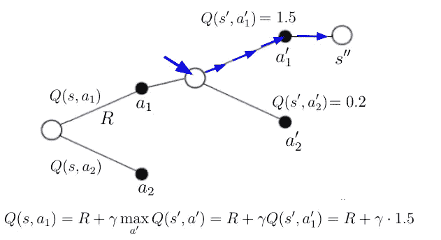***

***Eq. 8 Calculation of **Q(s,a_1)** following the greedy policy.***

## ***3.深度 Q 学习***

***我们终于到达了这篇文章的标题得到其序言*深度的地方—* 我们终于利用了深度学习。如果您查看 ***Q(s，a)*** 的更新规则，您可能会认识到，如果 TD-Target 和 ***Q(s，a)*** 具有相同的值，我们不会得到任何更新。在这种情况下 ***Q(s，a)***收敛到真实的动作值，目标达到。***

***这意味着我们的目标是最小化 TD-Target 和***【Q(s，a)】***之间的距离，这可以通过平方误差损失函数(等式 1)来表示。10).这种损失函数的最小化可以通过通常的梯度下降算法来实现。***

******

***Eq. 10 Squared error loss function.***

## ***3.1 目标网络和 Q 网络***

***在深度 Q 学习中，TD-Target***y _ I***和 ***Q(s，a)*** 分别由两个不同的神经网络估计，这两个网络通常称为 Target-和 Q-网络(图 4)。目标网络的参数 ***θ(i-1)*** (权重、偏差)对应于 Q 网络在较早时间点的参数***【θ(I)***。意味着目标网络参数在时间上被冻结。在用 Q 网络的参数进行了 *n* 次迭代之后，它们被更新。***

> ******记住*** :给定当前状态 ***s*** ，Q 网络计算动作值 **Q(s，a)** 。同时，目标网络使用下一个状态**s’**来计算 TD 目标的**Q(s’，a)** 。***

******

***Fig. 4 Target,- and Q-Network. **s** being the current and **s’** the next state.***

***研究表明，对 TD-Target 和 ***Q(s，a)*** 计算采用两种不同的神经网络，模型的稳定性更好。***

## ***3.2ε-贪婪政策***

***虽然目标策略***【π(a | s)***仍然是贪婪策略，但是行为策略 ***(a|s)*** 决定了 AI 代理采取的动作 ***a_i*** ，因此必须将哪个 ***Q(s，a_i)*** (由 Q-网络计算)插入到平方误差中***

***行为方针通常选择*ε-贪婪。使用ε-贪婪策略，代理在每个时间步选择一个具有固定概率ε的随机动作。如果ε具有比随机生成的数 *p* ，0 ≤ *p* ≤ 1 更高的值，则 AI 代理从动作空间中选取一个随机动作。否则，根据学习的动作值 ***Q(s，a):*** 贪婪地选择动作****

**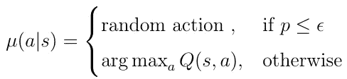**

**Eq. 11 Definition of the ε-Greedy policy.**

**选择ε-贪婪策略作为行为策略解决了探索/剥削权衡的困境。**

## **3.3 勘探/开采**

**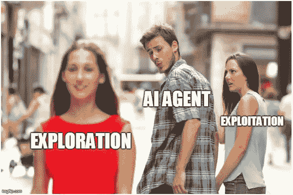**

**关于采取何种行动的决策涉及一个基本选择:**

*   ****利用**:根据当前信息做出最佳决策**
*   **探索:收集更多信息，探索可能的新路径**

**就**利用而言，**代理根据行为策略采取可能的最佳行动。但是这可能会导致一个问题。也许有时可以采取另一种(替代的)行动，在状态序列中产生(长期)更好的路径，但是如果我们遵循行为策略，这种替代行动可能不会被采取。在这种情况下，我们**利用**当前政策，但不探索其他替代行动。**

**ε-贪婪策略通过允许 AI 代理以一定的概率从动作空间中采取随机动作来解决这个问题。这叫**探索**。通常，根据等式，ε的值随着时间而减小。12.这里 ***n*** 是迭代次数。减小ε意味着在训练开始时，我们试图探索更多的可选路径，而在最后，我们让政策决定采取何种行动。**

**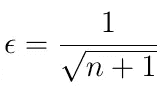**

**Eq. 12 Decreasing of *ε over time.***

## **3.4 体验回放**

**过去，可以表明，如果 Deep-Q 学习模型实现**经验重放**，则估计 TD-Target 和 ***Q(s，a)*** 的神经网络方法变得更加稳定。经验回放无非是存储 ***< s，s’，a’，r>*元组的记忆，其中****

*   *****s***:AI 代理的状态**
*   *****a’***:代理在 ***s*** 状态下采取的动作**
*   *****r*** :在 ***s*** 状态下行动***a’***获得即时奖励**
*   *****s'*** :状态 ***s*** 后代理的下一个状态**

**在训练神经网络时，我们通常不使用最近的 ***< s，s’，a’，r >*** 元组。而是我们从经验回放中随机取一批 ***< s，s’，a’，r >*** 来计算 TD-Target， ***Q(s，a)*** 最后应用梯度下降。**

## **3.5 具有经验重放伪算法的深度 Q 学习**

**下面的伪算法实现了具有经验重放的深度 Q 学习。我们之前讨论的所有主题都以正确的顺序包含在这个算法中，就像它在代码中是如何实现的一样。**

**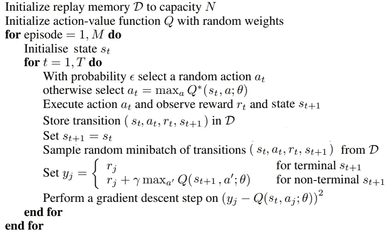**

**Pseudo-Algorithm for Deep-Q Learning with Experience Replay.**