# 带有交互代码的 Tensroflow 中的自组织地图/图层[带 TF 的手动后道具]

> 原文：<https://towardsdatascience.com/self-organizing-map-layer-in-tensroflow-with-interactive-code-manual-back-prop-with-tf-580e0b60a1cc?source=collection_archive---------3----------------------->

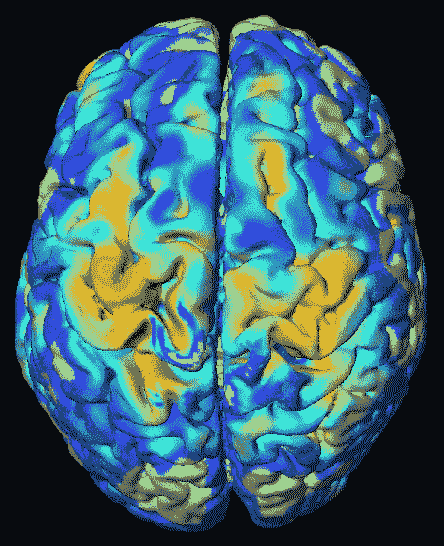

GIF from this [website](https://giphy.com/gifs/brain-OobrZ7bRjXoM8)

Teuvo Kohonen 是一位传奇的研究者，他发明了自组织地图。(能读到他 1990 年发表的原创论文，我感到荣幸和感谢)。有不同类型的自组织映射，如[递归 Som](https://www.ncbi.nlm.nih.gov/pubmed/12416688) 和[无参数 Som](https://ieeexplore.ieee.org/document/1603618/) 。它们还与神经气体密切相关。

Paper from this [website](http://sci2s.ugr.es/keel/pdf/algorithm/articulo/1990-Kohonen-PIEEE.pdf)

**附加阅读和帮助实现**

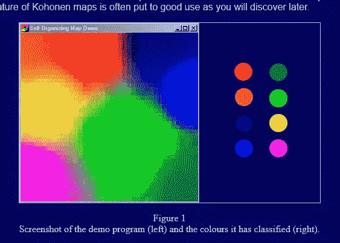

Image from this [website](http://www.ai-junkie.com/ann/som/som1.html)

对于任何有兴趣阅读更多这方面内容的人，请查看这个链接(ai-junkie)，它在更深入地解释这个问题方面做了令人惊讶的工作。我在网上找到了两种实现方式，[这篇博文](https://wonikjang.github.io/deeplearning_unsupervised_som/2017/06/30/som.html)通过在线训练的方式实现，而[这篇博文](https://github.com/cgorman/tensorflow-som)通过批量训练实现。

**自组织地图作为图层**

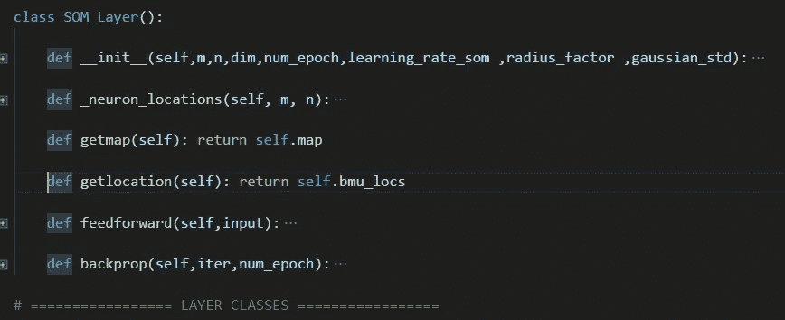

通过使用这里完成的实现，我修改了这里和那里的代码，以便我使用 SOM 作为神经网络中的典型层。如果你想看完整的代码，请看下面。

**颜色数据结果**

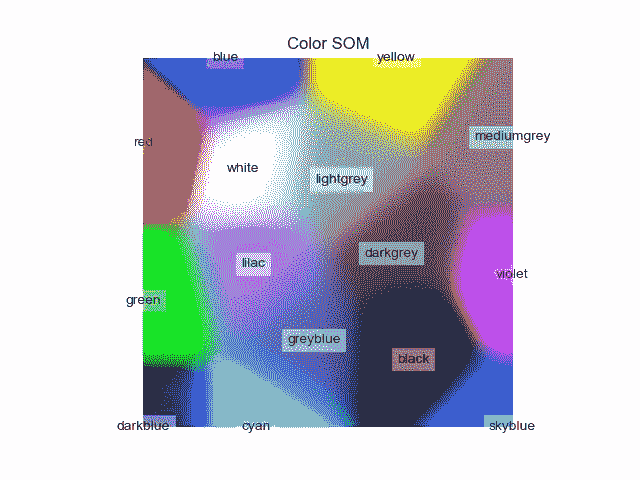

如上所述，当我们将一些颜色数据(如下所示)应用到 SOM 时，我们可以清楚地看到它在颜色聚类方面做得很好。

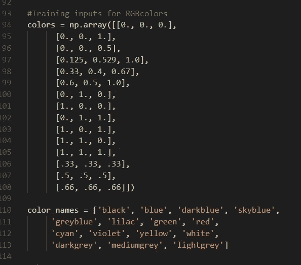

**MNIST 数据结果**

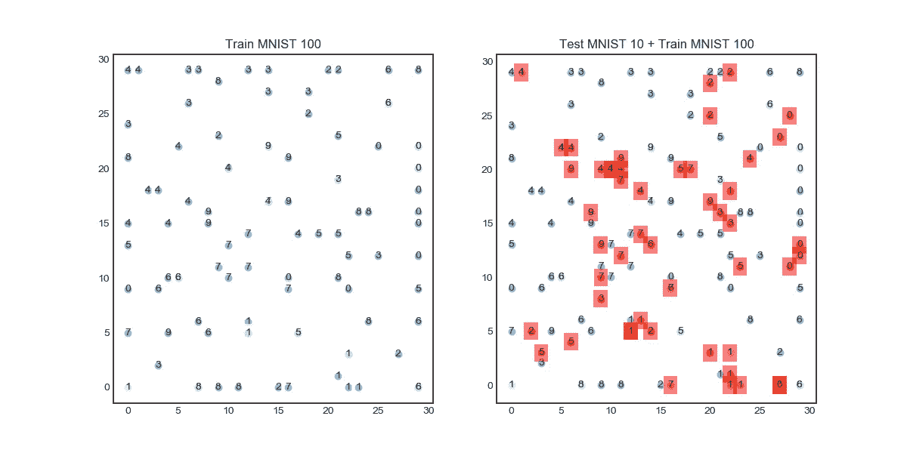

上图是对 30 * 30 * 784 维的 SOM 进行无监督学习的结果，值得一提的是，这个 SOM 的总维数相当大。现在，我们可以做一些有趣的事情，因为我们已经将 SOM 修改为一个层，我们可以在 SOM 之前连接任何类型的神经网络，希望聚类将更加清晰，并减少维数。

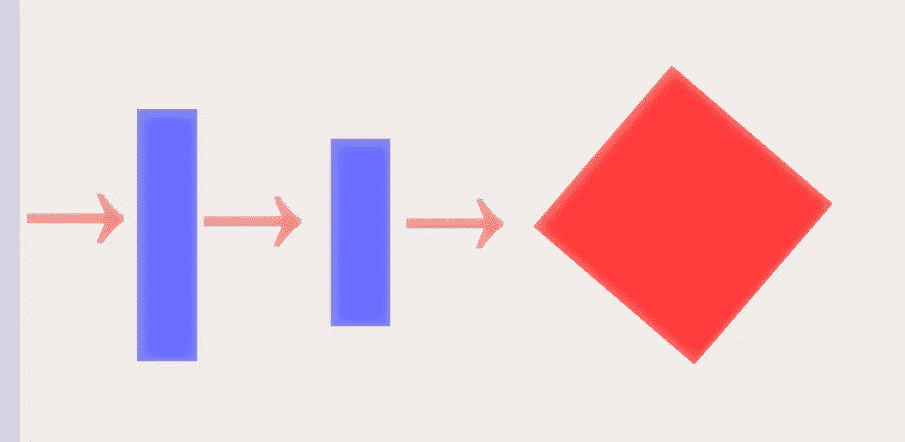

**蓝色矩形** →全连通层
**红色立方体** →自组织地图

如上所述，在将我们的 MNIST 向量(784*1)传递到 SOM 之前，我们可以有几个完全连接的层来处理数据。同时也降低了向量的维数。结果可以在下面看到。

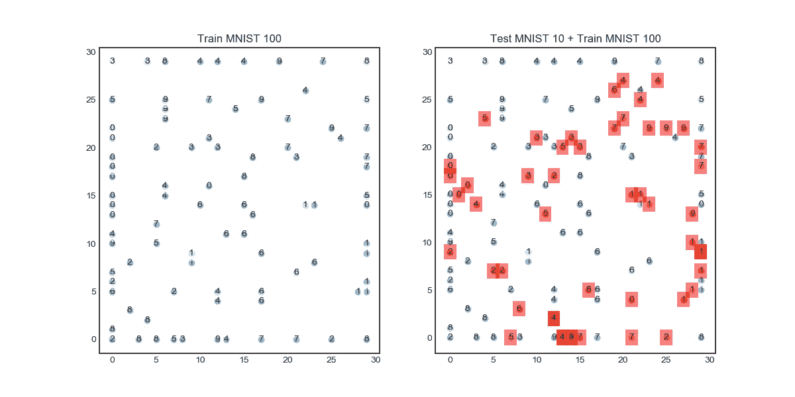

关于上面的 SOM 需要注意的一件重要事情是，它只有(30*30*256)维，所以现在我们使用 256 而不是 784 的向量大小。但是我们仍然能够在这里和那里得到一些好的结果。但我真的相信我们可以做得比上述结果更好。

**结果于** [**CIFAR 10 数据**](https://www.cs.toronto.edu/~kriz/cifar.html)

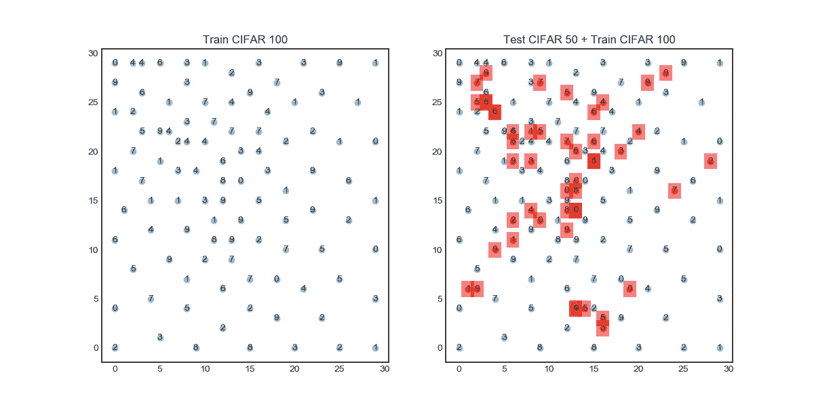

上图显示了矢量化 CIFAR 10 上的聚类结果，我们可以直接观察到聚类有多糟糕。对自然图像进行聚类实际上是一项相当具有挑战性的任务，即使它们的维数仅为 3072 的向量。(32*32*3).

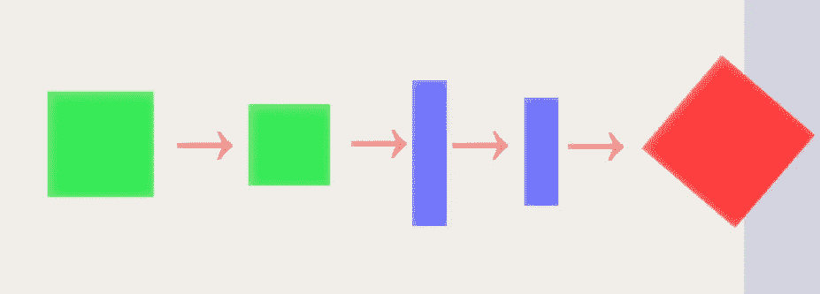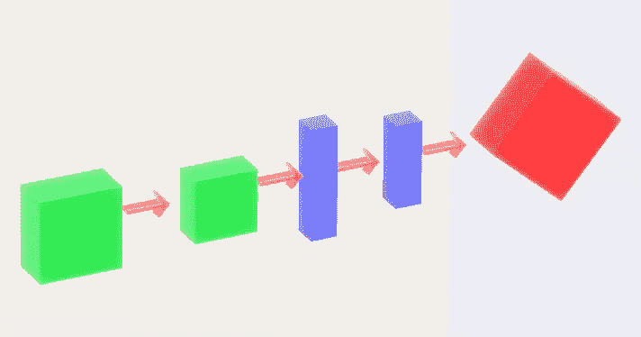

**绿色矩形** →卷积层
**蓝色矩形** →全连通层
**红色立方体** →自组织图

现在对于 CIFAR 10，让我们使用完全连接层和卷积层的组合来(希望)有效地减少维度和集群数据。

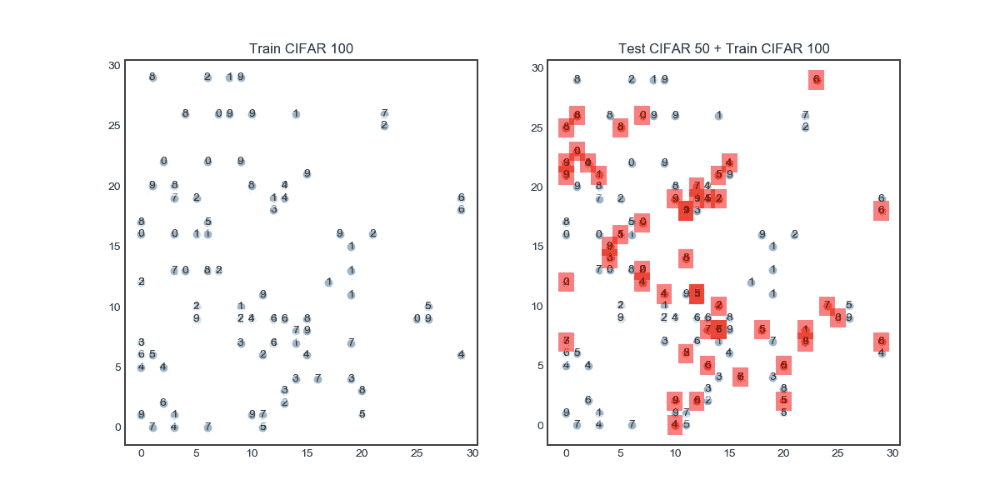

与直接使用 SOM 的情况相比，它做得更好。但总的来说，这是可怕的集群。(再次注意，上述 SOM 具有(30*30*256)的维数，这比直接使用 SOM 小 12 倍。(230400 个参数用于带网络的 SOM，2764800 个参数用于直接使用 SOM，不计算网络参数。)

然而，我对结果很失望。

**交互代码**

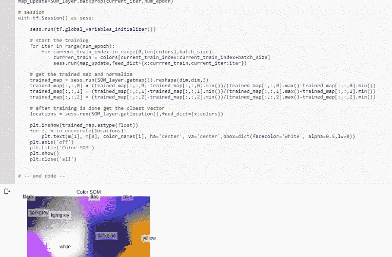

*对于 Google Colab，你需要一个 Google 帐户来查看代码，而且你不能在 Google Colab 中运行只读脚本，所以在你的操场上做一个副本。最后，我永远不会请求允许访问你在 Google Drive 上的文件，仅供参考。编码快乐！*

要访问带颜色的 SOM 代码，[请点击此处。](https://colab.research.google.com/drive/1QXkFLcSt5BkySKlUPJy1kleXHa-wlcfq)
要访问与 MNIST、[的 SOM 代码，请点击此处。](https://colab.research.google.com/drive/1tvWavxNmyFjigGpO4R47Vf7ryLfE9YNJ)
要访问 for SOM 网络的代码，[请点击此处。](https://colab.research.google.com/drive/1ckZEztB929PnbQAsXdjBTWkIqAD50w7z)
要访问带有 CIFAR 的 SOM 代码，[请点击此处](https://colab.research.google.com/drive/1BlKiIL62y2VRYs9IsRunj4rd7VciWbc6)。
要使用 CIFAR 访问 SOM 网络代码，[请点击此处。](https://colab.research.google.com/drive/12kpe33iym0uUXxlkHS8e5HjZBamduZNM)

**最后的话**

现在，下一个任务是设计一个好的成本函数，我不认为直接从差值的幂减少平均值中取成本是一个好主意。我认为还有另一种方法。

如果发现任何错误，请发电子邮件到 jae.duk.seo@gmail.com 给我，如果你想看我所有写作的列表，请点击这里查看我的网站。

同时，在我的推特[这里](https://twitter.com/JaeDukSeo)关注我，访问[我的网站](https://jaedukseo.me/)，或者我的 [Youtube 频道](https://www.youtube.com/c/JaeDukSeo)了解更多内容。我还实现了[广残网，请点击这里查看博文 pos](https://medium.com/@SeoJaeDuk/wide-residual-networks-with-interactive-code-5e190f8f25ec) t。

**参考**

1.  NumPy . histogram—NumPy 1.14 版手册。(2018).Docs.scipy.org。检索于 2018 年 5 月 10 日，来自[https://docs . scipy . org/doc/numpy-1 . 14 . 0/reference/generated/numpy . histogram . html](https://docs.scipy.org/doc/numpy-1.14.0/reference/generated/numpy.histogram.html)
2.  pylab_examples 示例代码:histogram _ demo . py—Matplotlib 1 . 2 . 1 文档。(2018).Matplotlib.org。检索于 2018 年 5 月 10 日，来自[https://matplotlib . org/1 . 2 . 1/examples/pylab _ examples/histogram _ demo . html](https://matplotlib.org/1.2.1/examples/pylab_examples/histogram_demo.html)
3.  (2018).Cis.hut.fi 于 2018 年 5 月 10 日检索，来自[http://www.cis.hut.fi/research/som-research/teuvo.html](http://www.cis.hut.fi/research/som-research/teuvo.html)
4.  t .科霍宁(1998 年)。自组织地图。神经计算，21(1–3)，1–6。
5.  自组织地图——IEEE 期刊和杂志。(2018).Ieeexplore.ieee.org。检索于 2018 年 5 月 11 日，来自[https://ieeexplore.ieee.org/document/58325/](https://ieeexplore.ieee.org/document/58325/)
6.  SOM 教程第 1 部分。(2018).Ai-junkie.com。检索于 2018 年 5 月 11 日，来自[http://www.ai-junkie.com/ann/som/som1.html](http://www.ai-junkie.com/ann/som/som1.html)
7.  CPU，H. (2018)。如何在 CPU 上运行 Tensorflow？堆栈溢出。检索于 2018 年 5 月 11 日，来自[https://stack overflow . com/questions/37660312/how-to-run-tensor flow-on-CPU](https://stackoverflow.com/questions/37660312/how-to-run-tensorflow-on-cpu)
8.  tensorflow，C. (2018)。改变张量流中张量的比例。堆栈溢出。检索于 2018 年 7 月 19 日，来自[https://stack overflow . com/questions/38376478/changing-a-scale-of-a-tensor-in-tensor flow](https://stackoverflow.com/questions/38376478/changing-the-scale-of-a-tensor-in-tensorflow)
9.  tf.random_uniform | TensorFlow。(2018).张量流。检索于 2018 年 7 月 19 日，来自[https://www . tensor flow . org/API _ docs/python/TF/random _ uniform](https://www.tensorflow.org/api_docs/python/tf/random_uniform)
10.  使用 Google 的 TensorFlow 进行自组织地图。(2015).Sachin Joglekar 的博客。检索于 2018 年 7 月 19 日，来自[https://codesachin . WordPress . com/2015/11/28/self-organizing-maps-with-Google-tensor flow/](https://codesachin.wordpress.com/2015/11/28/self-organizing-maps-with-googles-tensorflow/)
11.  cgorman/tensorflow-som。(2018).GitHub。检索于 2018 年 7 月 19 日，来自[https://github.com/cgorman/tensorflow-som](https://github.com/cgorman/tensorflow-som)
12.  t，V. (2018)。递归自组织映射。公共医学——NCBI。Ncbi.nlm.nih.gov。检索于 2018 年 7 月 19 日，来自[https://www.ncbi.nlm.nih.gov/pubmed/12416688](https://www.ncbi.nlm.nih.gov/pubmed/12416688)
13.  JaeDukSeo/忧郁。(2018).GitHub。检索于 2018 年 7 月 19 日，来自[https://github.com/JaeDukSeo/somber](https://github.com/JaeDukSeo/somber)
14.  [复本]，H. (2018)。如何在 Matplotlib (python)中隐藏轴和网格线？堆栈溢出。检索于 2018 年 7 月 19 日，来自[https://stack overflow . com/questions/45148704/how-to-hide-axes-and-gridlines-in-matplotlib-python](https://stackoverflow.com/questions/45148704/how-to-hide-axes-and-gridlines-in-matplotlib-python)
15.  数据，S. (2017)。MNIST 数据的自组织映射。SurfingMLDL。检索于 2018 年 7 月 19 日，来自[https://wonikjang . github . io/deep learning _ unsupervised _ som/2017/06/30/som . html](https://wonikjang.github.io/deeplearning_unsupervised_som/2017/06/30/som.html)
16.  数据，S. (2017)。MNIST 数据的自组织映射。SurfingMLDL。检索于 2018 年 7 月 19 日，来自[https://wonikjang . github . io/deep learning _ unsupervised _ som/2017/06/30/som . html](https://wonikjang.github.io/deeplearning_unsupervised_som/2017/06/30/som.html)