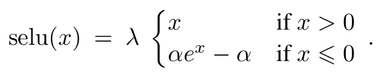
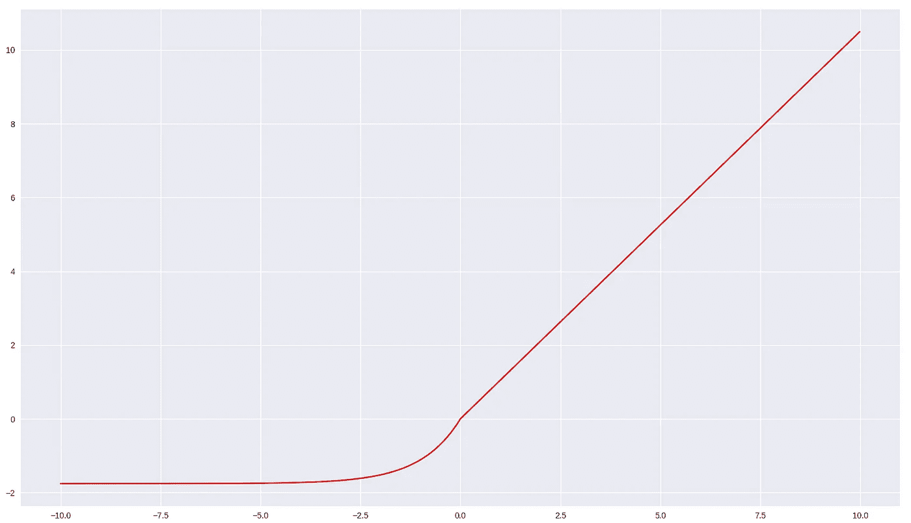
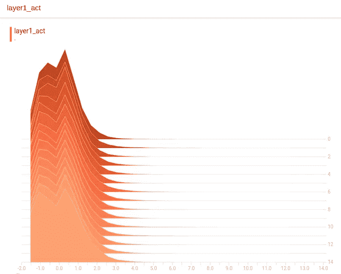
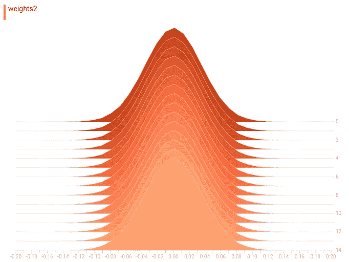
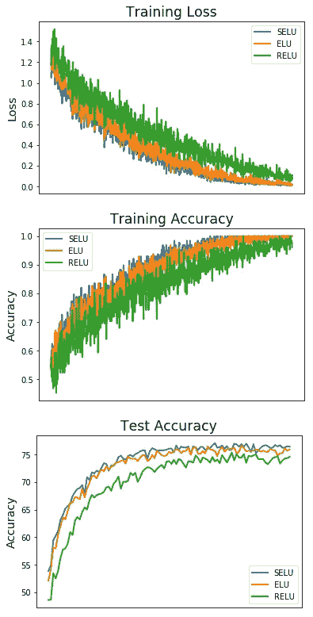

# SELU——让 FNNs 再次伟大(SNN)

> 原文：<https://towardsdatascience.com/selu-make-fnns-great-again-snn-8d61526802a9?source=collection_archive---------1----------------------->

上个月，我看到了一篇最近的文章(发表于 2017 年 6 月 22 日),文章提出了一个新概念，叫做自归一化网络(SNN)。在这篇文章中，我将回顾它们的不同之处，并展示一些对比。
文章链接——[Klambauer 等人](https://arxiv.org/pdf/1706.02515.pdf)
本帖代码摘自[bio info-jku 的 github](https://github.com/bioinf-jku/SNNs) 。

# 这个想法

在我们进入什么是 SNN 之前，让我们谈谈创建它们的动机。作者在文章的摘要中提到了一个很好的观点；虽然神经网络在许多领域获得了成功，但似乎主要阶段属于卷积网络和递归网络(LSTM，GRU)，而前馈神经网络(FNNs)被留在初学者教程部分。
还要注意的是，在 Kaggle 取得胜利结果的 FNN 最多只有 4 层。

当使用非常深的架构时，网络变得容易出现梯度问题，这正是批量归一化成为标准的原因——这是作者将 FNNs 的薄弱环节放在训练中对归一化的敏感性上的地方。
snn 是一种替代使用外部标准化技术(如 batch norm)的方法，标准化发生在激活函数内的**。
为了清楚起见，激活函数建议(SELU-比例指数线性单位)输出归一化值，而不是归一化激活函数的输出。
为了使 SNNs 工作，它们需要两样东西，一个定制的权重初始化方法和 SELU 激活函数。**

# 认识 SELU

在我们解释它之前，让我们看一下它是关于什么的。



Figure 1 The scaled exponential linear unit, taken from the article

SELU 是某种 ELU，但有一点扭曲。
α和λ是两个固定的参数，这意味着我们不会通过它们进行反向传播，它们也不是需要做出决策的超参数。
α和λ是从输入中得到的——我不会深入讨论这个，但是你可以在文章中看到你自己的数学计算(有 93 页附录:O，数学计算)。
对于标准比例输入(平均值为 0，标准偏差为 1)，值为α=1.6732~，λ=1.0507~。
让我们绘制图表，看看这些值是什么样子。



Figure 2 SELU plotted for α=1.6732~, λ=1.0507~

看起来很像 leaky ReLU，但等着看它的魔力吧。

# 重量初始化

SELU 不能让它单独工作，所以一个定制的权重初始化技术正在使用。
SNNs 用零均值初始化权重，并使用 1/(输入大小)的平方根的标准偏差。
代码如下所示(摘自开篇提到的 github)

```
# Standard layer
tf.Variable(tf.random_normal([n_input, n_hidden_1], stddev=np.sqrt(
1 / n_input))# Convolution layer
tf.Variable(tf.random_normal([5, 5, 1, 32], stddev=np.sqrt(1/25)))
```

现在我们已经了解了初始化和激活方法，让我们开始工作吧。

# 表演

让我们看看 SNNs 如何使用指定的初始化和 SELU 激活函数在 MNIST 和 CIFAR-10 数据集上运行。
首先，让我们看看在 2 层 SNN(两个隐藏层都是 784 个节点，MNIST)上使用 TensorBoard 是否真的保持了输出的标准化。
绘制第 1 层的激活函数输出和第 2 层的权重。
github 代码中没有`layer1_act`的绘图，我是为了这个直方图才添加的。



Figure 3 SELU’s output after the first layer in the MLP from the github



Figure 4 Second layer’s weights on the second layer.

不出所料，第一层的激活和第二层产生的权重几乎都是完美的零均值(我在运行中得到 0.000201)。
相信我，直方图在第一层权重上几乎是一样的。



更重要的是，snn 似乎能够表现得更好，正如你从提到的 github 的图中看到的那样，比较了 3 个具有相同架构的卷积网络，只是它们的激活功能和初始化不同。
SELU vs ELU vs 雷鲁。

似乎 SELU 收敛得更好，在测试集上得到更好的精度。

请注意，使用 SELU +上述初始化，我们在 CNN 网络上获得了更高的精度和更快的收敛速度，因此不要犹豫，在非纯 FNN 的架构上尝试它，因为它似乎也能够提高其他架构的性能。

# 结论和进一步阅读

看起来 snn 确实可以在神经网络的世界中找到自己的位置，也许可以在更短的时间内提高一点额外的准确性——但我们必须等待，看看它们自己会产生什么结果，更重要的是整合到联合架构中(就像上面的 conv-snn)。也许我们会在竞赛获奖的建筑中遇到他们，谁知道呢。

有些东西我没有在这里讨论，但在这篇文章中提到了，比如提议的“alpha dropout ”,这是一种符合 SNNs 概念的 dropout 技术，也在提到的 github 中实现，所以非常欢迎您深入研究。

SNNs 是不是一个东西，我真的不知道，但他们是另一个工具添加到您的工具包。希望你喜欢这篇文章并学到一些新东西:)