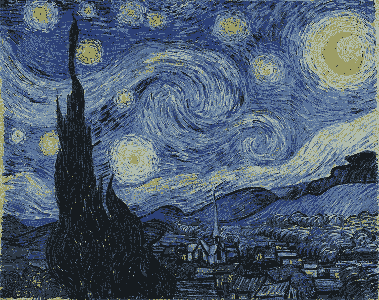
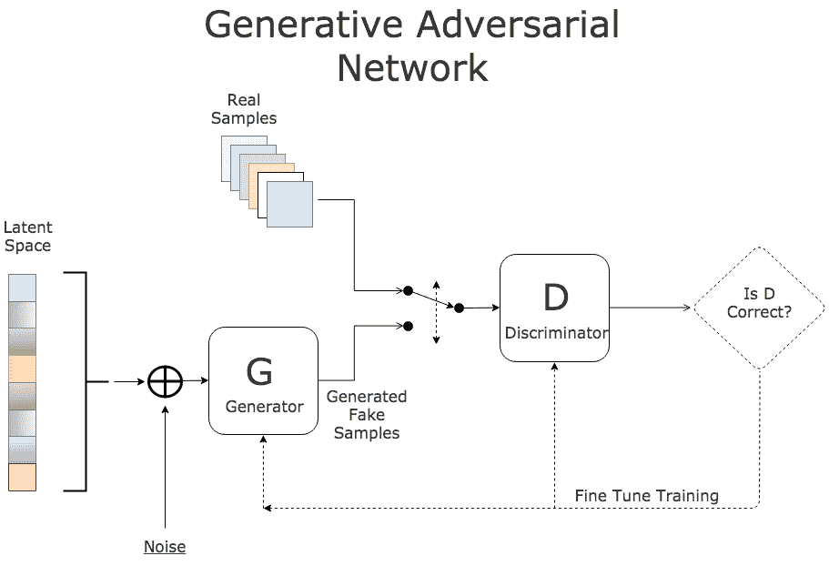
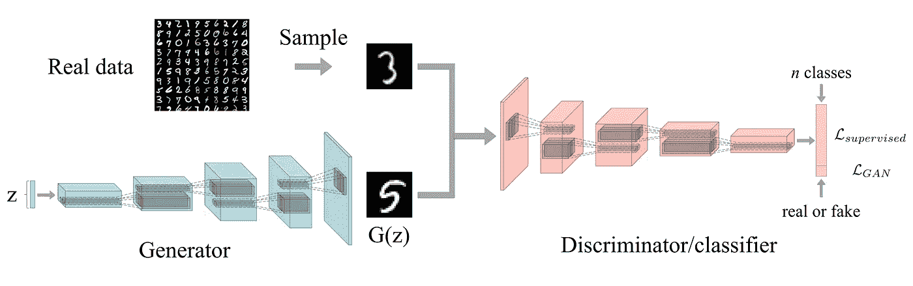
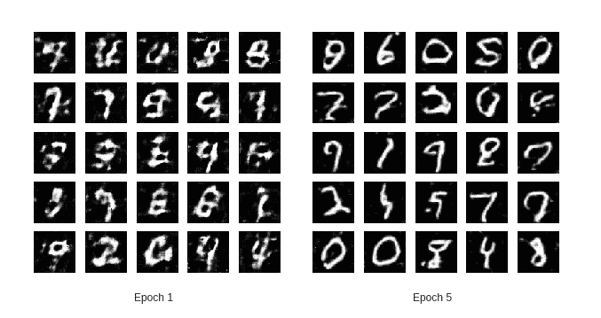

# 半监督学习和 GANs

> 原文：<https://towardsdatascience.com/semi-supervised-learning-and-gans-f23bbf4ac683?source=collection_archive---------3----------------------->

文森特·梵高在 1889 年画了这幅美丽的艺术作品:“星夜”，今天我的甘模型(我喜欢称之为甘·高:P)画了一些 MNIST 数字，只有 20%的标记数据！！它是如何实现这一非凡壮举的？…让我们来看看

# **简介**

***什么是半监督学习*** *？*

大多数深度学习分类器需要大量的标记样本才能很好地泛化，但获得这样的数据是一个昂贵而困难的过程。为了处理这种限制*提出了半监督学习*，这是一类利用少量已标记数据和大量未标记数据的技术。许多机器学习研究人员发现，未标记数据在与少量标记数据结合使用时，可以大大提高学习精度。GANs 在*半监督学习*中表现出了很大的潜力，其中分类器可以用很少的标记数据获得良好的性能。

***甘斯背景***

gan 是深度生成模型的成员。它们特别有趣，因为它们没有明确表示数据所在空间的概率分布。相反，它们通过从概率分布中抽取样本，提供了一些与概率分布不太直接交互的方式。

Architecture of a Vanilla GAN

甘的基本想法是在两个玩家之间建立一个**游戏**:

*   A ***发生器 G*** :以随机噪声 ***z*** 为输入，输出一幅图像 ***x*** 。它的参数被调整，以便在它生成的假图像上从鉴别器得到高分。
*   A ***鉴别器 D*** :取图像 ***x*** 作为输入，输出反映其为真实图像的置信度的分数。它的参数被调整为当由真实图像馈送时具有高分，当由生成器馈送假图像时具有低分。

我建议您浏览一下[这个](/overview-of-gans-generative-adversarial-networks-part-i-ac78ec775e31)和[这个](http://blog.aylien.com/introduction-generative-adversarial-networks-code-tensorflow/)，了解更多关于他们工作和优化目标的细节。现在，让我们稍微转动一下轮子，谈谈 GANs 最突出的应用之一，半监督学习。

# **直觉**

鉴别器的标准结构只有一个输出神经元用于分类 R/F 概率。我们同时训练两个网络，并在训练后丢弃鉴别器，因为它仅用于改进生成器。

对于半监督任务，除了 R/F 神经元之外，鉴别器现在将有 10 个以上的神经元用于 MNIST 数字的分类。此外，这一次它们的角色发生了变化，我们可以在训练后丢弃生成器，它的唯一目标是生成未标记的数据以提高鉴别器的性能。

## 现在，鉴别器变成了 11 类分类器，其中 1 个神经元(R/F 神经元)代表假数据输出，另外 10 个神经元代表具有类的真实数据。必须谨记以下几点:

*   当来自数据集的真实无监督数据被馈送时，断言 R/F 神经元输出标签= 0
*   当来自生成器的假的无监督数据被馈送时，断言 R/F 神经元输出标签= 1
*   当输入实际监控数据时，置位 R/F 输出标签= 0，相应标签输出= 1

不同数据源的这种组合将有助于鉴别器比仅提供一部分标记数据更准确地分类。

# 体系结构

现在是时候用一些代码:D 弄脏我们的手了

***甄别器***

接下来的架构类似于 DCGAN [论文](https://arxiv.org/pdf/1511.06434.pdf)中提出的架构。我们使用步长卷积来降低特征向量的维度，而不是任何池层，并对所有层应用一系列 leaky_relu、dropout 和 BN 来稳定学习。对于输入层和最后一层，BN 被丢弃(为了特征匹配)。最后，我们执行全局平均池，以在特征向量的空间维度上取平均值。这将张量维数压缩为一个值。拼合要素后，将添加 11 个类别的密集图层，并激活 softmax 以实现多类别输出。

***发电机***

发生器结构被设计成反映鉴频器的空间输出。分数步长卷积用于增加表示的空间维度。噪声 z 的 4-D 张量的输入被馈送，其经历一系列转置卷积、relu、BN(除了在输出层)和丢失操作。最后，tanh 激活映射范围(-1，1)内的输出图像。

# 模型损失

我们首先通过将实际标签附加为零来为整批准备一个扩展标签。这样做是为了在输入标记数据时将 R/F 神经元输出置为 0。通过将假图像的 R/F 神经元输出置为 1，将真实图像置为 0，可以将未标记数据的鉴别器损失视为二进制 sigmoid 损失。

生成器损失是假图像损失和特征匹配损失的组合，假图像损失错误地将 R/F 神经元输出断言为 0，特征匹配损失惩罚训练数据上的某组特征的平均值和生成样本上的该组特征的平均值之间的平均绝对误差*。*

# 培养

训练图像的大小从[batch_size，28，28，1]调整到[batch_size，64，64，1]以适应生成器/鉴别器架构。计算损耗、精度和生成的样本，并观察其在每个时期的改进。

# 结论

由于 GPU 访问受限，训练进行了 5 个时期和 20%的标记率。为了获得更好的结果，建议使用具有更低标记率的更多训练时段。完整的代码笔记本可以在[这里](https://github.com/raghav64/SemiSuper_GAN/blob/master/SSGAN.py)找到。

Training Results

无监督学习被认为是 AGI 领域的一个空白。为了弥补这一差距，GANs 被认为是学习低标记数据复杂任务的潜在解决方案。随着半监督学习领域新方法的出现，我们可以预期这种差距将会缩小。

如果我不提及我从这个美丽的[博客](/semi-supervised-learning-with-gans-9f3cb128c5e)，这个[实现](https://github.com/nejlag/Semi-Supervised-Learning-GAN/blob/master/SSL_GAN.ipynb)以及我在类似项目中工作的同事的帮助中获得的灵感，那将是我的失职。

**下次见！！Kz**