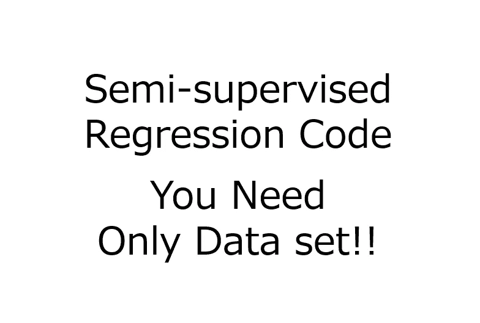
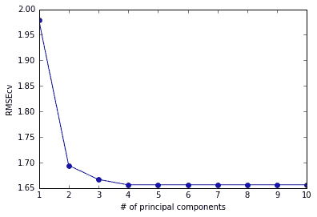
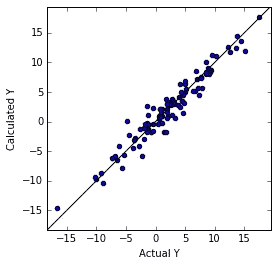
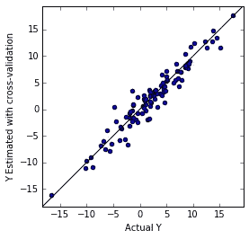
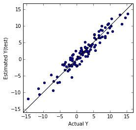
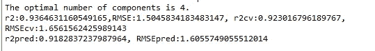
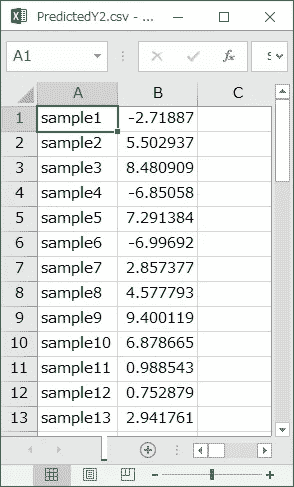

# 基于 PCA 和 PLS 的半监督回归:MATLAB、R 和 Python 代码——你所要做的只是准备数据集(非常简单、容易和实用)

> 原文：<https://towardsdatascience.com/semi-supervised-regression-based-on-pca-and-pls-matlab-r-and-python-codes-all-you-have-to-do-is-1814be979dd5?source=collection_archive---------3----------------------->

我发布了基于主成分分析和偏最小二乘法的半监督回归的 MATLAB、R 和 Python 代码。它们非常容易使用。你准备数据集，然后运行代码！然后，可以获得新样本的 PCAPLS 和预测结果。非常简单容易！

你可以从下面的网址购买每一个代码。

## 矩阵实验室

[https://gum.co/PnRna](https://gum.co/PnRna)
请从下面的 URL 下载补充 zip 文件(这是免费的)来运行 PCAPLS 代码。
[http://univproblog . html . xdomain . jp/code/MATLAB _ scripts _ functions . zip](http://univprofblog.html.xdomain.jp/code/MATLAB_scripts_functions.zip)

## 稀有

[https://gum.co/PXJsf](https://gum.co/PXJsf)
请从下面的 URL 下载补充 zip 文件(这是免费的)来运行 PCAPLS 代码。
[http://univproblog . html . xdomain . jp/code/R _ scripts _ functions . zip](http://univprofblog.html.xdomain.jp/code/R_scripts_functions.zip)

## 计算机编程语言

[https://gum.co/XwnQl](https://gum.co/XwnQl)
[http://univprovblog . html . xdomain . jp/code/supporting functions . zip](http://univprofblog.html.xdomain.jp/code/supportingfunctions.zip)

# MATLAB 中的 PCAPLS 程序，R 和 Python 代码

为了执行适当的 PCAPLS，加载数据集后，MATLAB、R 和 Python 代码遵循以下程序。

**1。决定 PCA 的累积贡献率的阈值**
主成分数(PCs)在检查累积贡献率时确定。例如，如果给定数据集中包含 5%的噪声，则应使用累积贡献率为 95%的 PCs。其他 PC 可以作为噪声去除。

**2。将带有目标变量(Y)的数据集和不带有目标变量(Y)的数据集合并(样本被合并)**

**3。组合数据集**
的自动缩放解释变量(X)自动缩放意味着居中和缩放。通过从居中的变量中减去每个变量的平均值，每个变量的平均值变为零。通过将每个变量的标准偏差除以换算中的变量，每个变量的标准偏差变为 1。
缩放是任意的(但是推荐)，但是需要居中，因为 PCA 是基于轴的旋转。

**4。运行 PCA，并获得每台 PC 的得分和加载向量**

**5。根据 1 中的阈值决定电脑的数量。**

**6。仅提取 Y 样本的分数**

**7。自动缩放分数和 Y**
缩放是任意的(但推荐)。需要对中。

**8。用交叉验证(CV)估计 Y，把分量数从 1 改成 m**
留一 CV 很有名，但是在训练样本数很高的时候会造成过拟合。所以，5 折或 2 折 CV 比较好。首先，将训练样本分成 5 或 2 组。第二，一组作为测试样本处理，另一组建立模型。重复 5 或 2 次，直到每组都作为测试样品处理。然后，可以得到不是计算的 Y 而是估计的 Y。
m 必须小于 X 变量的数量，但 m=30 最大值就足够了。

**9。计算每个组件数量的实际 Y 和估计 Y 之间的均方根误差(RMSE)**

**10。用最小 RMSE 值**
决定最佳元件数，用第一个局部最大 RMSE 值决定最佳元件数即可

**11。用最佳组分数构建 PLS 模型，得到标准回归系数**

12。计算实际 Y 和计算 Y 之间的行列式系数和 RMSE(r2C 和 RMSEC)以及实际 Y 和估计 Y 之间的行列式系数和 RMSE(r2CV 和 RMSECV)
r2C 是指 PLS 模型能够解释的 Y 信息的比值。
RMSE 表示 PLS 模型中 Y 误差的平均值。
r2CV 表示 PLS 模型对新样本可以估计的 Y 信息的可能比率。
RMSECV 表示新样本 Y 误差的可能平均值。
较好的 PLS 模型具有较高的 r2CV 值和较低的 RMSECV 值。
r2C 和 r2CV 之间以及 RMSEC 和 RMSECV 之间的巨大差异意味着 PLS 模型对训练样本的过拟合。

*小心！r2CV 和 RMSECV 不能代表 PLS 模型的真实可预测性，因为它是 CV 而不是外部验证。

13。检查实际 Y 和计算 Y 之间以及实际 Y 和估计 Y 之间的图
可以检查计算值和估计值的异常值。

**14。在预测中，用 1 减去 X 的自动调用中的平均值。然后，用 X 变量除以 X 在 1 中自动调用的标准偏差。，用于新样品**

15。使用 4 中的加载向量计算新样本的分数。

16。减去 7 中分数自动调用的平均值。从新分数开始，然后用新分数除以 7 中分数自动调用的标准偏差。

**17。根据 11 中的标准回归系数估计 Y。**

**18。将 Y 的自动调用中的标准差乘以 1。通过估计的 Y，然后，在 1 中添加 Y 的自动调用中的平均值。到估计 Y**

# 执行 PCAPLS 的方法

## 1.购买代码并解压文件

MATLAB:[https://gum.co/PnRna](https://gum.co/PnRna)的

****R**:https://gum.co/PXJsf**

****Python**:[https://gum.co/XwnQl](https://gum.co/XwnQl)**

## **2.下载并解压缩补充 zip 文件(这是免费的)**

****MATLAB**:[http://univprovblog . html . xdomain . jp/code/MATLAB _ scripts _ functions . zip](http://univprofblog.html.xdomain.jp/code/MATLAB_scripts_functions.zip)**

****R**:[http://univprovblog . html . xdomain . jp/code/R _ scripts _ functions . zip](http://univprofblog.html.xdomain.jp/code/R_scripts_functions.zip)**

****Python**:[http://univproblog . html . xdomain . jp/code/supporting functions . zip](http://univprofblog.html.xdomain.jp/code/supportingfunctions.zip)**

## **3.将补充文件放在与 PCAPLS 代码相同的目录或文件夹中。**

## **4.准备数据集。有关数据格式，请参见下面的文章。**

**[https://medium . com/@ univprovblog 1/data-format-for-MATLAB-r-and-python-codes-of-data-analysis-and-sample-data-set-9 b0f 845 b 565 a # . 3 ibr PHS 4h](https://medium.com/@univprofblog1/data-format-for-matlab-r-and-python-codes-of-data-analysis-and-sample-data-set-9b0f845b565a#.3ibrphs4h)**

**data.csv、data_prediction1.csv 和 data_prediction2.csv 的样本在 PCA 之前合并。**

## **5.运行代码！**

**“data_prediction2.csv”的 Y 估计值保存在“PredictedY2.csv”中。**

# **必需的设置**

**请看下面的文章。
[https://medium . com/@ uniprofblog1/settings-for-running-my-MATLAB-r-and-python-codes-136 B9 e 5637 a 1 #、paer8scqy](https://medium.com/@univprofblog1/settings-for-running-my-matlab-r-and-python-codes-136b9e5637a1#.paer8scqy)**

# **执行结果的示例**

************************