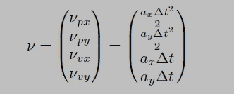
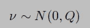
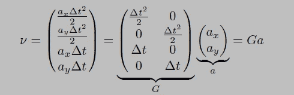
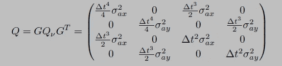

# 传感器融合第 2 部分:卡尔曼滤波器代码

> 原文：<https://towardsdatascience.com/sensor-fusion-part-2-kalman-filter-code-78b82c63dcd?source=collection_archive---------3----------------------->


在第一部分中，我们在推导了卡尔曼滤波算法的基本方程后离开。为便于参考，在此再次陈述。

A.预测:
A . X = A * X+B * u
B . P = A * P * AT * Q
B .测量
A . Y = Z—H * X
B . K =(P * HT)/((H * P * HT)+R
c .更新
a. X = X + K * Y
b. P = ( I — K * H ) * P

在这篇文章中，我们将使用 Udacity 的 github handle 上免费提供的文本文件中的传感器读数，对上述等式进行编码。该文本文件(*obj _ pose-Laser-Radar-synthetic-input . txt*)包含来自激光和雷达的传感器读数，以及读数的时间戳和地面真实值。到目前为止，我们只介绍了基本的卡尔曼滤波算法，因此在这个编码练习中，我们将只使用上述输入文件中的激光读数。一旦我们在以后的文章中谈到“扩展卡尔曼滤波”，我们也将开始使用雷达读数。但是以我们目前对卡尔曼滤波方程的理解，仅仅使用激光读数就可以作为一个完美的例子，在编码的帮助下巩固我们的概念。

输入文本文件中捕获的传感器读数格式如下。

对于包含雷达数据的行，列有:sensor_type (R)、rho_measured、phi_measured、rhodot_measured、timestamp、x_groundtruth、y_groundtruth、vx_groundtruth、vy_groundtruth、yaw_groundtruth、yawrate_groundtruth。

对于包含激光雷达数据的行，列包括:传感器类型(L)、x 测量值、y 测量值、时间戳、x 地面真实值、y 地面真实值、vx 地面真实值、vy 地面真实值、yaw 地面真实值、yawrate 地面真实值。

有了这些信息，让我们开始编码吧，不要再拖延了。与任何 Python 文件一样，让我们首先导入所有需要的库

```
#**************Importing Required Libraries*************
import numpy as np
import pandas as pd
from numpy.linalg import inv
```

接下来，读取包含传感器读数的输入文本文件。

```
#*************Declare Variables**************************
#Read Input File
measurements = pd.read_csv('obj_pose-laser-radar-synthetic-input.txt', header=None, delim_whitespace = True, skiprows=1)
```

我将“skiprows”参数设为 1，因为当我们开始实施 KF 算法时，我们没有任何关于车辆状态的先验知识。在这种情况下，我们通常将状态默认为传感器输出的第一个读数。这正是我们将要做的。在下面显示的代码中，我们将通过从输入文件的第一行读取来初始化我们的状态 ***X*** 。由于这个读数已经被使用，我们在读取输入文件时简单地跳过它。除了状态向量 ***X*** 的初始值，我们还将使用输入文件中的第一个*时间戳*作为我们的 ***先前时间*** *。*正如上一篇文章所解释的，我们需要当前和以前的时间戳来计算 ***delta_t*** *。提供的时间戳以微秒为单位，我们将除以 10⁶.这有两个原因，第一，较小的数量更容易维护。第二，速度地面实况读数(以及我们代码中的速度值)是以*秒为单位的。**

```
# Manualy copy initial readings from first row of input file.
prv_time = 1477010443000000/1000000.0
x = np.array([
        [0.312242],
        [0.5803398],
        [0],
        [0]
        ])
```

接下来，我们初始化变量来存储地面真相和 RMSE 值。RMSE(均方根误差)用于相对于地面真实值来判断我们的算法的性能。

```
#Initialize variables to store ground truth and RMSE values
ground_truth = np.zeros([4, 1])
rmse = np.zeros([4, 1])
```

我们初始化矩阵 ***P*** 和 ***A*** 。关于 ***P*** 和 ***A*** 矩阵的详细结构，请参考[第 1 部分](/sensor-fusion-part-1-kalman-filter-basics-4692a653a74c)中更深入的解释。基本上，矩阵 ***A*** 用于实现距离、速度和时间的运动学方程，矩阵 ***P*** 是状态协方差矩阵，具有作为其对角元素的 *x、y、vx* 和 *vy* 的方差。这个初始 ***P*** 值的意思是，我们对我们的位置值具有高置信度(这是有意义的，因为我们已经从实际传感器读数中得到它)，由相对低的方差值表示，而对速度值具有低置信度(这也是有意义的，因为我们不知道速度)，由相对大的方差值表示。

```
#Initialize matrices P and A
P = np.array([
        [1, 0, 0, 0],
        [0, 1, 0, 0],
        [0, 0, 1000, 0],
        [0, 0, 0, 1000]
        ])
A = np.array([
        [1.0, 0, 1.0, 0],
        [0, 1.0, 0, 1.0],
        [0, 0, 1.0, 0],
        [0, 0, 0, 1.0]
        ])
```

接下来我们定义 ***H*** 和 ***I*** 矩阵，正如我在上一篇文章中解释的，它们将分别是 4 x 2 和 4 x 4 矩阵。我们定义矢量 ***Z*** ，由于我们的激光雷达读数将由 2 个位置读数(x 和 y)组成，因此它将是一个 2 x 1 矢量。

```
H = np.array([
        [1.0, 0, 0, 0],
        [0, 1.0, 0, 0]
        ])
I = np.identity(4)
z_lidar = np.zeros([2, 1])
```

我们定义测量协方差矩阵 ***R*** ，根据上一篇文章，它也将是一个 2×2 的矩阵。我们将在以后的文章中详细讨论如何获取 ***R*** 矩阵和 ***noise_ax*** 和 ***noise_ay*** 的值。

```
R = np.array([
        [0.0225, 0],
        [0, 0.0225]
        ])
```

接下来我们定义 ***noise_ax*** ， ***noise_ay*** 和 matrix ***Q*** 。

```
noise_ax = 5
noise_ay = 5
Q = np.zeros([4, 4])
```

让我们花点时间来理解它们。如果我们重温本系列第一部分中定义的运动学方程，你可以看到在位置和速度项中有一个加速度因子。为了方便起见，在这里对它们进行了重写。

1.  Px(t+1)= Px+δ_ t * VX+0.5 * ax *δ_ t
2.  Py(t+1)= Py+δ_ t * vy+0.5 * ay *δ_ t
3.  Vx(t+1) = Vx + ax * delta_t
4.  Vy(t+1) = Vy + ay * delta_t



由于加速度未知，我们可以将其添加到噪声成分中，这种随机噪声可以解析地表示为上面推导的等式中的最后一项。因此，我们有一个随机加速度向量 *v* ，它由一个零均值和一个协方差矩阵 ***Q.*** 描述



向量 ***v*** 可以分解成两个分量:不包含随机变量的 4 乘 2 矩阵 G 和包含随机加速度分量的 2 乘 1 矩阵 *a* :



在卡尔曼滤波器的每次迭代中计算 delta_t，并且由于我们没有任何加速度数据，我们将加速度**定义为具有零均值和标准差 noise_ax 和 noise_ay 的随机向量。基于我们的噪声向量，我们现在可以定义新的协方差矩阵 q。协方差矩阵被定义为噪声向量 *v* 乘以噪声向量 *v* 转置的期望值。所以让我们把这个写下来:**

****

**要了解更多关于“期望值”的信息，请观看汗学院的[视频。由于 G 不包含随机变量，我们可以把它放在期望计算之外](https://youtu.be/j__Kredt7vY)**

****

**ax 和 ay 被假定为不相关的噪声过程。这意味着 Q 中的协方差 sigma_axy 为零。**

****

**因此，在将所有内容合并到一个矩阵中后，我们获得了 4x 4 Q 矩阵:**

****

**在卡尔曼滤波器的每次迭代中，我们将按照上面的公式计算矩阵 Q。定义好所有变量后，让我们开始遍历传感器数据，并对它们应用卡尔曼滤波器。运行 for 循环直到测量长度，读取测量线，检查是否是激光雷达(‘L’)读数。**

```
**#**********************Iterate through main loop********************
#Begin iterating through sensor data
for i in range (len(measurements)):
    new_measurement = measurements.iloc[i, :].values
    if new_measurement[0] == 'L':**
```

**从当前读数中获取时间戳，通过与先前时间戳进行比较来计算时间变化，然后在下一次迭代中将当前时间戳替换为先前时间戳。**

```
 **#Calculate Timestamp and its power variables
        cur_time = new_measurement[3]/1000000.0
        dt = cur_time - prv_time
        prv_time = cur_time**
```

**计算 delta_t 的平方、立方和 delta_t 的四次方(代码中的“dt ”),这是计算 Q 矩阵所需的。**

```
 **dt_2 = dt * dt
        dt_3 = dt_2 * dt
        dt_4 = dt_3 * dt**
```

**用 delta_t 值更新矩阵 A。Delta_t 将乘以速度以得出位置值。**

```
 **#Updating matrix A with dt value
        A[0][2] = dt
        A[1][3] = dt**
```

**更新 Q 矩阵。如果你回头看看上面导出的 Q 矩阵方程，你可以很容易地找到下面提供的代码行。**

```
 **#Updating Q matrix
        Q[0][0] = dt_4/4*noise_ax
        Q[0][2] = dt_3/2*noise_ax
        Q[1][1] = dt_4/4*noise_ay
        Q[1][3] = dt_3/2*noise_ay
        Q[2][0] = dt_3/2*noise_ax
        Q[2][2] = dt_2*noise_ax
        Q[3][1] = dt_3/2*noise_ay
        Q[3][3] = dt_2*noise_ay #Updating sensor readings
        z_lidar[0][0] = new_measurement[1]
        z_lidar[1][0] = new_measurement[2] #Collecting ground truths
        ground_truth[0] = new_measurement[4]
        ground_truth[1] = new_measurement[5]
        ground_truth[2] = new_measurement[6]
        ground_truth[3] = new_measurement[7]**
```

**最后调用预测和更新函数。**

```
 **predict()
        update(z_lidar)**
```

**现在让我们看看我们的 predict()函数，它与我们在本系列中使用的以下预测方程非常相似。在代码部分没有太多要解释的，它实际上只是派生公式的直接复制。
A .预测
a. X = A * X + B * u
b. P = A * P * AT * Q**

```
**#**********************Define Functions*****************************
def predict():
    # Predict Step
    global x, P, Q
    x = np.matmul(A, x)
    At = np.transpose(A)
    P = np.add(np.matmul(A, np.matmul(P, At)), Q)**
```

**继续定义 update()函数。我们将在该功能中实施“测量”和“更新”步骤。
B .测量
a . Y = Z—H * X
b . K =(P * HT)/((H * P * HT)+R
c .更新
a. X = X + K * Y
b. P = ( I — K * H ) * P**

```
**def update(z):
    global x, P    
    # Measurement update step
    Y = np.subtract(z_lidar, np.matmul(H, x))
    Ht = np.transpose(H)
    S = np.add(np.matmul(H, np.matmul(P, Ht)), R)
    K = np.matmul(P, Ht)
    Si = inv(S)
    K = np.matmul(K, Si)

    # New state
    x = np.add(x, np.matmul(K, Y))
    P = np.matmul(np.subtract(I ,np.matmul(K, H)), P)**
```

**…至此，您已经完成了卡尔曼滤波算法的完整代码。尽管这看起来像是一小步，但它是传感器融合技术的许多高级版本的基础算法。如前所述，卡尔曼滤波器的所有变体都由我们在本系列中定义的相同预测、测量和更新状态组成。在更高级的版本中，唯一的区别是它们使用不同的运动学和传感器方程。在本系列中，我们也将一步一步地介绍它们。但此时此刻，让我们击掌庆祝完成经典卡尔曼滤波算法的基础步骤。你可以在我的 github repo [这里](https://github.com/PercyJaiswal/Kalman_Filter)找到完整的代码和输入文件。**

**像往常一样，如果你喜欢我的文章，用喜欢和评论来表达你的欣赏。你也可以在 [twitter](https://twitter.com/percyjaiswal) 找到我和我的其他文章**

**下次再见，干杯！！**