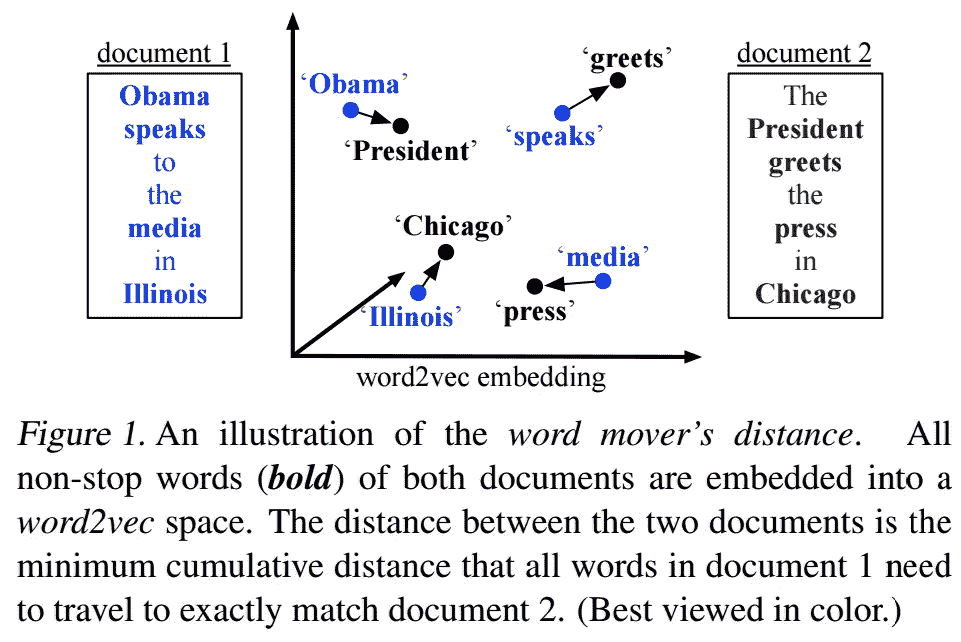

# 句子嵌入

> 原文：<https://towardsdatascience.com/sentence-embedding-3053db22ea77?source=collection_archive---------0----------------------->

**文献综述:**

首先，让我们从单词嵌入开始，这些是单词在 n 维向量空间中的表示，以便语义相似(例如“船”-船只)或语义相关(例如“船”-水)的单词根据训练方法变得更接近。培训方法大致分为两部分:

1.  使用文档作为上下文。( [LSA](https://en.wikipedia.org/wiki/Latent_semantic_analysis) ，话题模特)。他们捕捉语义关联。
2.  使用单词作为上下文。(神经语言模型，分布式语义模型)。他们捕捉语义的相似性。

在平行线上，我们希望开发一些东西，可以捕捉句子之间的语义相似性或相关性，然后是段落，然后是文档。

现在暂时假设我们有单词向量。

获得句子表示的一种方法是将句子中包含的所有单词向量的表示相加，这被称为单词质心。并且两个句子之间的相似度可以通过 c **熵距离**来计算。同样的事情可以扩展到段落和文档。但是这种方法忽略了很多信息，比如序列，并且可能给出错误的结果。比如:

1.  你要去那里教书，而不是玩。
2.  你要去那里玩而不是教书

这些将有相同的最终表现，但你可以看到，意义是完全不同的。

然后，通过引入编辑距离方法对其进行了一点微调，这被称为**字移动器的距离**。它来自于发表在 em NLP’14 上的论文“[从单词嵌入到文档距离](http://jmlr.org/proceedings/papers/v37/kusnerb15.pdf)”。这里我们取句子 1 到句子 2 中每个单词的最小距离，并将它们相加。比如:

1.  奥巴马在伊利诺伊州对媒体讲话
2.  总统在芝加哥迎接媒体

Image taken from original paper

*   奥巴马匹配总统
*   向问候者说话
*   媒体报道
*   伊利诺伊到芝加哥

这种方法正在产生令人鼓舞的结果。论文[在问答](http://nlp.cs.aueb.gr/pubs/BioNLP_2016_BioIR.pdf)中使用单词嵌入的质心和单词移动器的距离进行生物医学文献检索，使用质心距离进行初始剪枝，然后使用 WMD 得到更好的结果。(注意 WMD 慢。是`O(n*m)`，其中`n`是`sentence1`的长度，`m`是`sentence2`的长度

但是我们看到，在这两种方法中，我们没有使用来自序列的信息。所以在这个领域也有很多研究。

论文中， [**卷积神经网络用于句子分类**](https://arxiv.org/abs/1408.5882)**其中曾提出 CNN 用于同样的事情。它在句子中使用了填充，使它们具有相同的维度- >使用单词嵌入来映射这些填充句子中的单词- >应用 CNN - >使用最大超时池- >馈送到全连接层- >获取表示。他们写道，使用 word2vec 初始化单词嵌入，然后通过反向传播进行微调，得到了比“不调整”和“随机初始化”更好的结果。**

**然后是微软研究院 2015 年发表的关于**深度语义相似度模型**的论文，本文使用不同类型的词向量，这里是基于 n-grams。例:对于 hello 这个词，他们会加上起始和结束标记，并分解成 n 个字母组，即 hello - > #hello# - > {#he，hel，ell，llo，lo#}。并以向量形式表示它，向量的大小为(27*26*27(如果不使用哈希))(请注意，它与词汇大小**无关，并概括了看不见的单词，对拼写错误具有鲁棒性)。他们将这些向量的序列(用于表示句子)放入他们的模型，该模型给他们一个语义向量，并且基于**已知的**这些句子的相似性或不相似性，他们被训练(弱监督)。在该模型中，他们使用了具有最大池的 CNN。**CNN 提取局部特征，max pooling 层从中生成全局特征。**我已经在 short science[这里](http://www.shortscience.org/paper?bibtexKey=conf/www/ShenHGDM14#nishnik)写了一篇关于这篇论文的小总结。****

**因此，在训练期间，句子与具有相似性(肯定)和不相似性(否定)的句子一起提供。该模型可以被训练用于最大化(文件，阳性的余弦相似性)-文件，阴性的余弦相似性)。他们使用了随机梯度下降法。**

**但是我们不能在这里使用 rnn 吗？在这里，它们将拥有所有文档的内存，并在查询时返回所需的文档。根据 MetaMind 的这篇论文，[**用于视觉和文本问题回答的动态记忆网络**](https://arxiv.org/abs/1603.01417) ，其中他们使用 GRU 将数据编码为事实，并将问题编码为向量，然后使用问题向量并循环事实以生成上下文向量并更新记忆。基于记忆，它能够回答。我们可以用同样的方法来寻找文档的相似性。我已经在 short science 这里[写了一篇关于这篇论文的小总结。](http://www.shortscience.org/paper?bibtexKey=journals/corr/1603.01417#nishnik)**

**本文中提出的进一步的观点是:使用**双向** GRUs(在本文中有更好的解释， **"** [**具有再次读取和复制机制的有效摘要**](https://arxiv.org/abs/1611.03382) ")，以及使用句子嵌入而不是单词嵌入。**

**然后还有一篇论文在这个领域有很强的基础， [**句子和文档的分布式表示** s](https://arxiv.org/abs/1405.4053) ，它来自谷歌，发表于 2014 年。它提出以与单词向量相同的方式学习段落向量，并将其用于无数任务，包括情感分析和信息检索。**

**如有任何疑问，请发邮件至 nishantiam@gmail.com[给我。](mailto:nishantiam@gmail.com)**