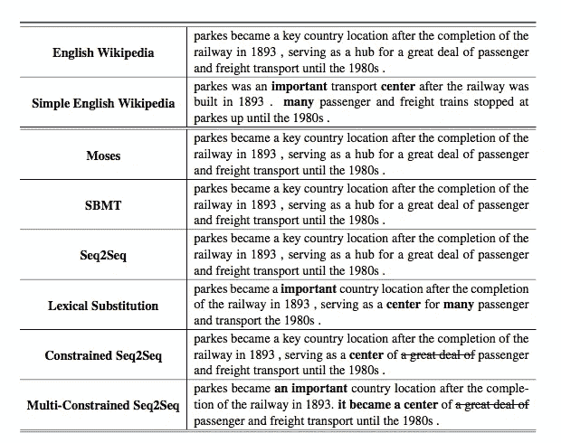

# 用 Seq2Seq 简化句子

> 原文：<https://towardsdatascience.com/sentence-simplification-with-seq2seq-1b20d05a4663?source=collection_archive---------5----------------------->

作为一名机器学习的学生，我喜欢阅读最近发表的 Arxiv 论文，并试图理解它们。在这里，我将尝试解释一篇给我留下深刻印象的论文，它使用一种新颖的序列到序列(Seq2Seq)模型来简化句子。

 [## [1704.02312v1]用于句子简化的受限序列到序列神经模型

### 摘要:句子简化降低了语义复杂性，有利于有语言障碍的人。上一个…

arxiv.org](https://arxiv.org/abs/1704.02312v1) 

在这篇论文中，中国北京大学的研究人员利用 seq2seq RNN 模型和注意方法来简化句子。他们将此与单词级替换相结合，产生了最先进的简化结果。

顺便问一下，你喜欢阅读最近的 ML 研究论文的简短摘要吗？查看[**arxiv . email**](http://www.arxiv.email)**，那可是个 tl 的每周简讯；本周最佳出版研究博士。**

句子简化的任务对于提高可读性很重要。这有利于非母语人士、儿童以及患有自闭症和阅读障碍等语言障碍的个人。我的许多团队都接触过这个任务，大多数团队都使用基于规则的系统来尝试简化任务。有的用词级替换，简单的把复杂的词换成简单的词。本文试图利用神经机器翻译的最新发展来简化句子。

“序列到序列”递归神经网络(RNN)模型是最近提出的，并证明了神经机器翻译(NMT)的优秀结果。这个模型接受一个输入序列(一种语言的句子)，并训练一个模型生成一个不同语言的输出序列。事实证明，这种模式比 NMT 大学以前的方法更有效，显然现在谷歌翻译也在使用这种模式。

研究人员使用了从维基百科上搜集的句子匹配数据集。这是由 David Kauchek 创建的，包括来自英语维基百科和简单英语维基百科的 [137，000 对匹配句子。](http://www.cs.pomona.edu/~dkauchak/simplification/)

建模过程通常可总结如下:

1.  用一个复杂的单词代替原句中的一个简单的单词。
2.  把句子分成两部分，从“简单”替换词处开始。例如:
3.  就拿“他成为了一个有名的作文老师，有很多有名的学生”这句话来说。
4.  用**作曲**代替**音乐**。它变成了“…一个著名的音乐老师…”。
5.  将替换词处的句子分成两部分。第一部分颠倒了。
6.  第一部分成为“众所周知的一个成了他”
7.  第二部分是“老师，有很多有名的学生”

然后，将每个单独的句子片段通过以下步骤:

1.  取原句子部分，预处理成整数向量。他们使用一本 60000 字的词典。每个单词代表字典中的一个数字。未知单词由通用的“UNK”单词代替。
2.  将输入句子的每个单词通过编码层:
3.  将矢量化的单词通过单词嵌入层。
4.  将嵌入层通过具有门控循环单位(GRU)细胞的双向 RNN (BiRNN)。

最后，将 BiRNN 的最终输出作为编码层的输出。

1.  通过解码层传递最终的解码器状态，这是一个具有注意机制的 GRU RNN。
2.  对于解码层中的每一步，通过 softmax 层传递 RNN 输出，以获得预测的最终字。
3.  将两个生成的句子片段与替换单词组合，以创建最终生成的句子。

上述过程只是用一个复杂的单词代替一个更简单的单词。如果有多个需要替换的复杂单词，研究人员将对每个单词替换进行一次上述过程。所以如果有三个复杂的单词，他们会经历上述过程三次。他们会用第一个单词做一次，然后在替换了一个不同的单词后，获取输出并再次做整个过程。

Examples of outputs for different sentence simplification models. This paper’s approach is at the bottom.

上图显示了他们的最终模型(多约束 Seq2Seq)以及其他类似模型的输出。你可以看到许多模型根本没有简化句子，即使是一个简单的 Seq2Seq 模型。词汇模型只是用复杂的词代替简单的词，而不改变句子结构。词汇模型也只能将“一个键”变成“一个重要的”，而它应该是“一个重要的”。他们最终的模型不仅可以替换多个单词，而且可以重新排列句子，删除不必要的片段，语法正确，仍然保留原句的意思。

感谢阅读！最后一个不要脸的塞:c**heck out**[**arxiv . email**](http://www.arxiv.email)**，那可是个 tl 的周刊快讯；本周最佳出版研究博士。**