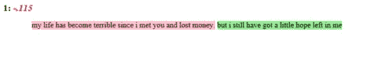

# R——好与不好——处理否定中的情感分析

> 原文：<https://towardsdatascience.com/sentiment-analysis-in-r-good-vs-not-good-handling-negations-2404ec9ff2ae?source=collection_archive---------7----------------------->


Image credit: [https://pixabay.com/en/eggs-colors-easter-holiday-spring-3398664/](https://pixabay.com/en/eggs-colors-easter-holiday-spring-3398664/)

情感分析是拥有未标记文本数据(没有分数或评级)的数据分析师最终试图从中提取一些见解的最明显的事情之一，同样的情感分析也是任何自然语言处理(NLP)爱好者的潜在研究领域之一。

对于分析师来说，同样的情感分析是一件痛苦的事情，因为大多数处理情感分析的原始包/库执行简单的字典查找，并根据正面和负面单词的出现次数计算最终的综合得分。但这往往会导致许多假阳性，一个非常明显的例子是“好”对“不好”——否定，通常是**价移**。

考虑一下这句话:'**我不太好**'。任何原始的情感分析算法只会将这句话标记为肯定的，因为单词“good”显然会出现在肯定词典中。但是读这句话我们知道这不是一个肯定句。

虽然我们可以构建自己的方式来处理这些否定，但有几个新的 R-package 可以轻松做到这一点。泰勒·林克[开发的](https://github.com/trinker)`[sentimentr](https://github.com/trinker/sentimentr)`就是这样一个软件包。

# 视频教程

# 安装软件包

sentimentr 可以从 [CRAN](https://cran.r-project.org/web/packages/sentimentr/index.html) 安装，也可以从 github 安装开发版。

```
install.packages('sentimentr')
#or
library(devtools)
install_github('trinker/sentimentr')
```

# 为什么是 sentimentr？

这个包的作者自己解释了`sentimentr`做了什么而其他包没有做，为什么这很重要？

sentimentr 试图在保持速度的同时考虑变价词(即否定词、增强词、去增强词和转折连词)。简单地说，sentimentr 是一个扩充的字典查找。接下来的问题是为什么它很重要。”

# 情感评分:

sentimentr 提供了两个情感分析功能:1 .`sentiment_by()` 2。`sentiment()`

使用`sentiment_by`的给定文本的聚合(平均)情感分数

```
sentiment_by('I am not very good', by = NULL)element_id sentence_id word_count   sentiment
1:          1           1          5 -0.06708204
```

但是当我们有多个不同极性的句子时，这可能没有多大帮助，因此用`sentiment`进行句子级评分会有所帮助。

```
sentiment('I am not very good. He is very good')element_id sentence_id word_count   sentiment
1:          1           1          5 -0.06708204
2:          1           2          4  0.67500000
```

这两个函数都返回一个包含四列的数据帧:

1.`element_id` –给定文本的 ID /序列号
2。`sentence_id`–句子的 ID /序列号，在`sentiment_by`
3 的情况下等于 element_id。`word_count`–给定句子的字数
4。`sentiment`–给定句子的情感得分

# 提取情感关键词

`extract_sentiment_terms()`功能帮助我们提取关键词——正面的和负面的，这是情感得分计算的一部分。sentimentr 还支持管道操作符`%>%`，这使得编写多行代码变得更容易，赋值更少，代码也更简洁。

```
'My life has become terrible since I met you and lost money' %>% extract_sentiment_terms()
   element_id sentence_id      negative positive
1:          1           1 terrible,lost    money
```

# 情绪突出:

最后，`highight()`函数与`sentiment_by()`相结合，给出一个 html 输出，其中部分句子用绿色和红色突出显示，以显示其极性。相信我，这可能看起来微不足道，但它确实有助于在做演示时分享结果，讨论假阳性，并确定准确性方面的改进空间。

```
'My life has become terrible since I met you and lost money. But I still have got a little hope left in me' %>% 
  sentiment_by(by = NULL) %>%
  highlight()
```

输出截图:



Sentiment Highlight

尝试将`sentimentr`用于您的情感分析和文本分析项目，并在评论中分享您的反馈。此处使用的完整代码可在 [my github](https://github.com/amrrs/blogpost_codes/blob/master/sentimentr_basics.R) 上获得。欲了解更多信息，请查看本[数据营课程——R 中的情绪分析——整洁的方式](https://www.datacamp.com/courses/sentiment-analysis-in-r-the-tidy-way?tap_a=5644-dce66f&tap_s=210728-e54afe)