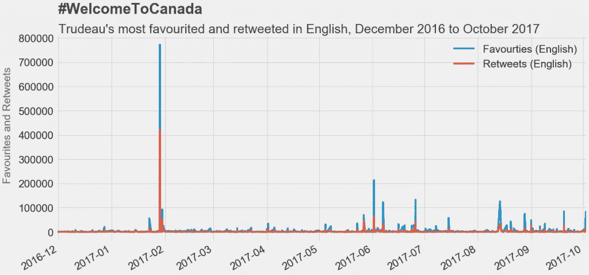
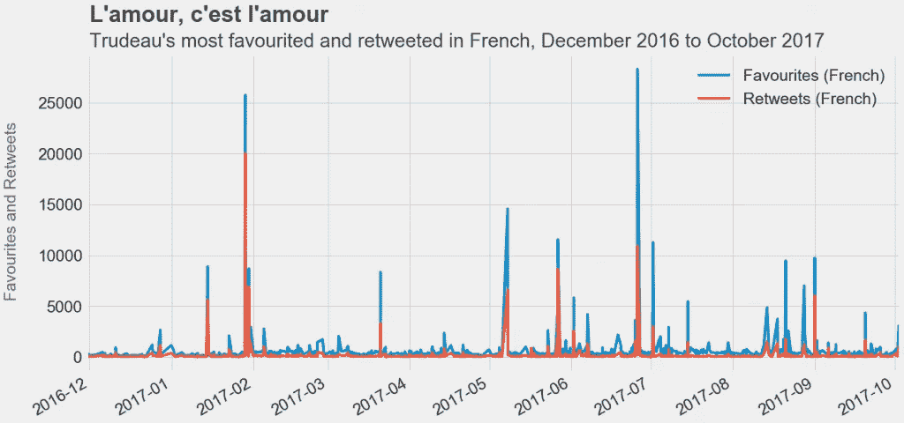
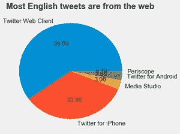
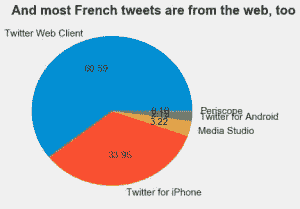
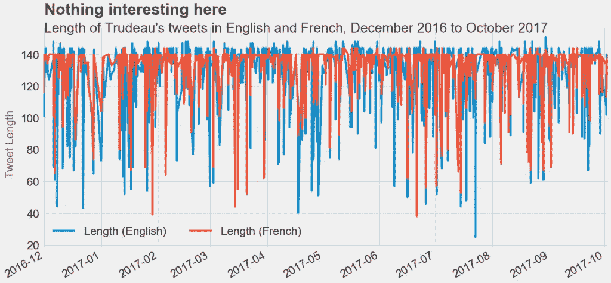
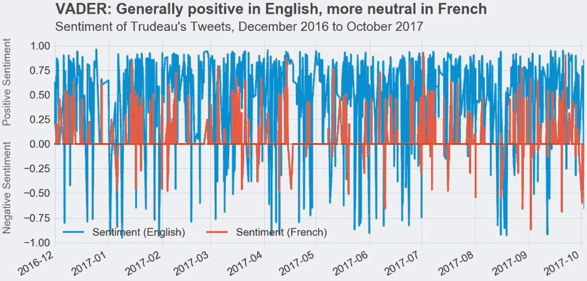
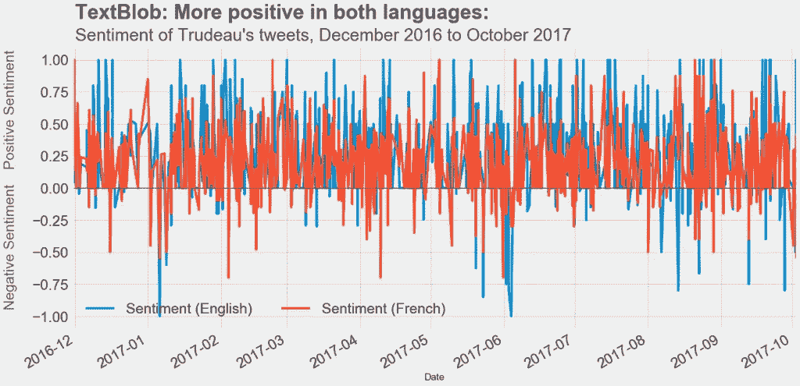
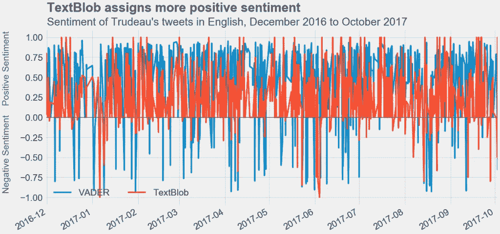
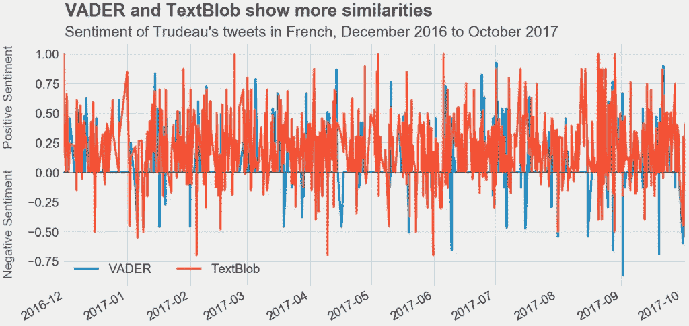
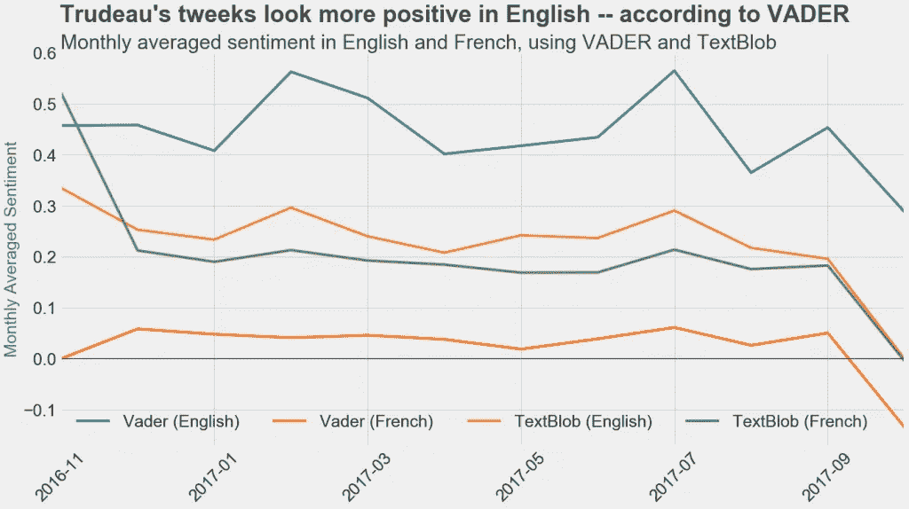

# 情绪分析:贾斯廷·特鲁多的推文

> 原文：<https://towardsdatascience.com/sentiment-analysis-justin-trudeaus-tweets-e76bfc622b04?source=collection_archive---------9----------------------->

我在网上到处看到对特朗普推文的情绪分析。这是有道理的——没有一位总统、政治人物或任何人真正像特朗普那样使用 Twitter。阅读这些对特朗普推文的分析，他的情绪到处都是。但是你不需要一个文本处理工具来使用它，你只要听听他的演讲或者读读新闻就能明白。然而，这让我想到，我的总理贾斯廷·特鲁多的推特看起来像什么？他的推文在情绪上更平衡吗？他用英语发的微博和用法语发的微博有区别吗？我们来看看吧！

为了这个分析，我会看看一些基本的推文特征:来源，“转发”和“收藏”计数，以及英语和法语推文的总体情绪。虽然推文的来源和观点让我们深入了解特鲁多，但转发和最受欢迎的计数代表加拿大人说话。通过这一分析，我们将对我们的总理有更多的了解，对我们自己也有更多的了解。

**加拿大不一样**

我们先来看看加拿大人在 2016 年 12 月至 2017 年 10 月期间对特鲁多推文的反应。这当然考虑了所有以转发或收藏的形式与@JustinTrudeau 互动的 Twitter 用户，但我现在假设这些用户中的大多数是加拿大人。

这是一个非常有趣的结果。到目前为止，转发和收藏最多的英文推文是:

毫无疑问，这条推文获得了大量关注。这可能有很多原因。首先，加拿大可能是不同的。我们欢迎，加拿大人喜欢我们的总理宣传这一点。第二，响应可能来自非加拿大公民(这将使我上面的假设无效)，也许来自难民自己。第三，这种反应可能主要是由美国人组成的。随着(当时)唐纳德·特朗普(Donald Trump)成为新的@POTUS，美国人可能会转发并喜欢这条推文，以此表示“看看加拿大有多不同。”

同样的法语推文获得了最多的转发，但另一条推文获得了最多的收藏。

最受欢迎的推文是:

事实上，这条推特比英文版获得了更多的转发。似乎法裔加拿大人，或者说法语的人，热衷于支持 LGBTQ 群体，并且喜欢从总理那里听到这些。这个帖子的收藏数量和转发数量之间的差距很奇怪——也许法裔加拿大人不喜欢转发这种事情？

**来源和长度**

接下来，我们来看看特鲁多的推文来源，以及它们的长度。

因此，特鲁多似乎使用 iPhone，但更喜欢在电脑上发推文。这与特朗普截然不同，他似乎更喜欢在手机上发推文。

现在，对于特鲁多的推文长度。

**情感分析**

完成基本的探索后，让我们继续进行情感分析。在这个分析中，我使用了 VADER 和 TextBlob，因为 VADER 针对社交媒体进行了优化，但是 TextBlob 针对法语进行了优化。我不仅想比较英文和法文的感悟，也想比较这两个包。

让我们先来看看使用 VADER 和 TextBlob 的结果。

这里的一个主要区别是，TextBlob 认为这两种语言的推文更加中性，而 VADER 认为特鲁多的英语推文更加积极。让我们将分析分为英语和法语，并再次比较 VADER 和 TextBlob，以便更加清晰。

在英语中，看起来 TextBlob 更经常分配正面的推文，但当推文对 VADER 是正面的时，它们是非常正面的。在法语中，这两个软件包产生了更多相似的结果。

最后我们来看看特鲁多推文的情绪，逐月来看。

有趣的是，与法语推文相比，使用 VADER 和 TextBlob 的英语推文给人的感觉更积极。法语是一门很美的语言，但英语只是更热情吗？或者这只是特鲁多倾向于发推特的方式，或者这可以归因于他对每种语言的掌握以及他更习惯的东西？很高兴看到这种情绪在两种语言和两种文本处理工具中都遵循相似的模式。看到 10 月份情绪的下降也很有趣——考虑到过去两天在埃德蒙顿和拉斯维加斯发生的可怕事件，这是有道理的。我们必须等着看这种下降趋势是否会继续。但如果是这样，这可能说明两件事:这可能是世界事件的反映，或者这可能意味着特鲁多作为总理感到疲惫。

感谢阅读！

*这个分析的代码可以在* [*my github*](https://github.com/serenamm/Projects/blob/master/WebScraping/Trudeau%20Twitter%20Sentiment%20Analysis%20Oct%202017.ipynb) *上的一个 Jupyter 笔记本里找到。*

*原发布于* [*我的个人网站*](http://serena.mcdonnell.ca) *。*