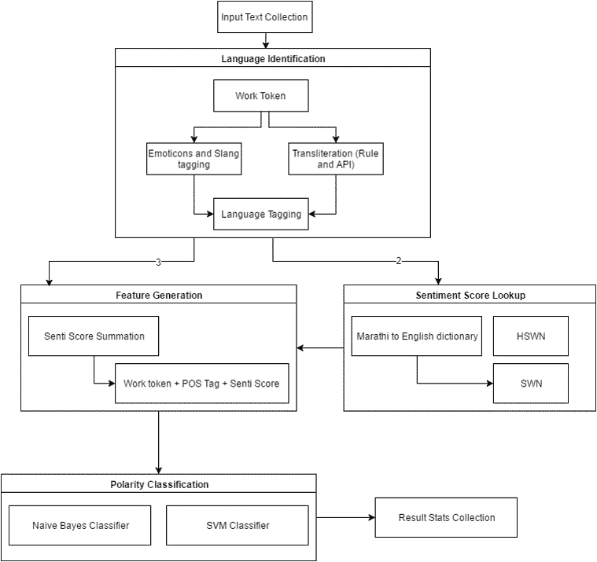
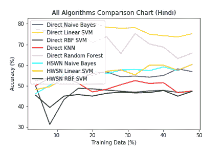
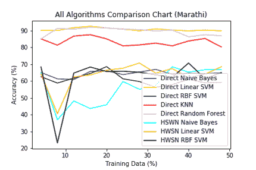

# 印地语和马拉地语音译文本的情感分析

> 原文：<https://towardsdatascience.com/sentiment-analysis-of-transliterated-texts-in-hindi-and-marathi-languages-c29eab19fae2?source=collection_archive---------0----------------------->

这个博客是关于我在自然语言处理领域的论文的陈述。情感分析对英语来说很容易。对于其他语言，如印地语或马拉地语来说，这有点困难，但不是很难。当用于其他语言的文字是罗马文字时，这就变得困难了。最困难的是当音译文本是多种语言的混合时。在我们的例子中，我们考虑英语-印地语和英语-马拉地语的两种组合。这种语言的混合被称为语码混合。通常其中一种语言(通常是罗马文字)用于文本表示。如何分析这种情况下的情绪？

# 普通情感分析

通常分析中涉及的步骤如下:

1.  规范化单词标记
2.  执行词性标签分析，以获取被标记为名词、形容词、副词和动词的单词。
3.  使用 wordnet 获取标识符，使用 senti-wordnet 获取与这些单词相关的情感，以及我们在 POS 标签分析中找到的相应标签
4.  将中的单词转换为特征:
5.  删除停用词
6.  去掉不重要的词，如除了形容词和副词之外的一切，因为它们在情感方面是最重要的
7.  创建一个 ngram 特性，将单词与其上下文联系起来
8.  将其输入分类器进行训练，然后对主题进行测试以计算准确度
9.  交叉验证用于不过度训练
10.  找到一个阈值来平衡过度训练和分析看不见的数据的一般性

# 混合代码通用方法的问题

虽然这些步骤比较复杂，我也错过了一些，但是一般的方法已经包含在上面的步骤中了。音译混合代码的唯一问题是它不能与上述步骤一起工作。为什么？因为音译的文字没有固定的语法，单词拼写也不正确。句子结构不遵循单一语言的特定规则。如果把每种语言的语块都拿出来，那么很多情况下；他们没有形成各自语言的正确语法。最后一部分由于语言规则的混合而发生。一个很好的例子是:缅因州 tujhe *祝你好运*因为 tumse na hoga。在前面的陈述中，英语的用法遵循印地语的上下文语法，因此在这种情况下，它们的词性标注及其相关的情感是非常不明确的。由此得出结论，混合代码脚本需要一种不同的方法来实现这一目的，而这正是我的论文所要讨论的。

# 提议的方法

因为数字说明了千言万语，所以我让下面的数字来说明我为了进行情感分析而采取的方法。

上图给出了这种方法所需的所有重要步骤，下面再次列出，供那些对花时间在图上不感兴趣的人参考。

*   看看单词 tokens 是一个表情符号还是一个众所周知的俚语，比如 lol 等等，然后用合适的语言作品来替换它们，比如😊会变成微笑，lol 会变成放声大笑。
*   音译北印度语/马拉地语脚本(梵文)中的剩余单词，并在北印度语/马拉地语词典中查找其存在。检查拼写变化。如果找到了，就贴上标签。
*   在英语词典中查找所有单词，并标记它们。如果与另一种语言存在平局，那么使用词频概率来打破平局。
*   根据每种语言(印地语/英语)的语言标签，从 sentiwordnet 中循环得出每种语言的情感分数。除了马拉地语，目前还没有 sentiwordnet，在这种情况下，使用双语词典从印地语和英语中获取马拉地语单词的含义，然后按照这些语言的过程合并分数。
*   最后，使用 ngrams 将单词转换为具有相应情感得分的特征，并对训练和测试数据进行交叉验证，以查看结果的准确性。

这些步骤实现起来要复杂得多，在使用 python Scikit-learn 实现这些步骤后，我能够得到如下图所示的结果。

最糟糕的是，即使是这些也不如针对单一语言的情感分析有效。对于印地语和英语，我最多能做到 50%以上的准确率，对于马拉地语和英语的组合，我能做到 80%的准确率。现在 80%看起来不错，但有一个警告。马拉地语/英语组合的问题是，固定单词的存在通常会扭曲数据。我使用的数据来自 youtube 评论，在积极和消极的群体中都有一些词，这往往是情绪极性的绝对指标。这使得系统工作，但事实上它真的不工作。我对结果并不感到自豪，但我很高兴我从中学到了很多。下次见。

*原载于 2017 年 8 月 3 日*[*【www.3371aspectz.co】*](http://www.3371aspectz.co/sentiment-analysis-of-transliterated-texts-in-hindi-and-marathi-languages/)*。*