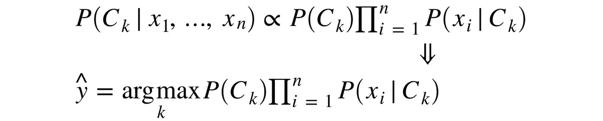

# 基于多项式朴素贝叶斯的微博情感分析

> 原文：<https://towardsdatascience.com/sentiment-analysis-of-tweets-using-multinomial-naive-bayes-1009ed24276b?source=collection_archive---------3----------------------->


Based on illustration from [http://eppsnet.com/2018/05/reflecting-on-mathematical-techniques/](http://eppsnet.com/2018/05/reflecting-on-mathematical-techniques/).

Web 2.0 的普及显著增加了在线交流。因此，它引发了自然语言处理领域，特别是情感分析领域的快速发展研究。信息过载以及评论和消息数量的增长促进了对高性能自动处理方法的需求。

本文致力于使用具有多项式分布的朴素贝叶斯分类器进行二元情感分析。我们简要概述了从概率模型构建分类器，然后进入数据预处理、训练和超参数优化阶段。我们将使用 Jupyter Notebook 用 Python 编写我们的脚本。

# 它是如何工作的

**多项式朴素贝叶斯**分类算法趋向于**情感分析任务的一个基线解**。朴素贝叶斯技术的基本思想是通过使用词和类别的联合概率来找到分配给文本的类别的概率。让我们简单看一下数学。


Bayes’ theorem spelt out in blue neon at the offices of Autonomy in Cambridge.

给定从属特征向量 ***(x₁，…，xn)*** 和类 ***Ck*** 。贝叶斯定理在数学上表述为以下关系:


根据“天真”的条件独立性假设，对于给定的类 ***Ck*** 矢量***xi*** 的每个特征都是有条件独立于其他每个特征***XJ***for***I≠j***..


因此，该关系可以简化为


由于***【p(x₁，…，xn)*** 是常数，如果特征变量的值是已知的，可以使用下面的分类规则:



为了避免下溢，可以使用对数概率。


各种朴素贝叶斯分类器之间的主要区别在于它们对 ***P(xi|Ck)*** 的分布所做的假设，而 ***P(Ck)*** 通常被定义为训练数据集中类 ***Ck*** 的相对频率。

多项式分布由针对每个类别***【Ck】***的向量 ***θk=(θk1，…，θkn)*** 来参数化，其中 ***n*** 是特征的数量(即，词汇的大小)，并且 ***θki*** 是特征 ***的概率 ***P(xi|Ck)******

参数 ***θk*** 通过最大似然的平滑版本，即相对频率计数来估计:


其中 ***Nki*** 是特征 ***i*** 出现在训练集 ***T*** 中类 ***k*** 的样本中的次数，而 ***Ny*** 是类 ***Ck*** 的所有特征的总数。平滑先验 ***α≥0*** 考虑了学习样本中不存在的特征，并防止了进一步计算中的零概率。设置 ***α=1*** 称为拉普拉斯平滑，而 ***α < 1*** 称为李德斯通平滑。

因此，最终决策规则定义如下:


# 加载情感数据

俄语推文的情感数据集[1]可在[http://study.mokoron.com/](http://study.mokoron.com/)获得。文件 positive.csv 和 negative.csv 分别包含带正标签和带负标签的推文。

```
import pandas as pd
import numpy as np# Read the data from CSV files
n = ['id', 'date','name','text','typr','rep','rtw','faw','stcount','foll','frien','listcount']
data_positive = pd.read_csv('positive.csv', sep=';',error_bad_lines=False, names=n, usecols=['text'])
data_negative = pd.read_csv('negative.csv', sep=';',error_bad_lines=False, names=n, usecols=['text'])# Create balanced dataset
sample_size = min(data_positive.shape[0], data_negative.shape[0])
raw_data = np.concatenate((data_positive['text'].values[:sample_size], 
                           data_negative['text'].values[:sample_size]), axis=0) 
labels = [1]*sample_size + [0]*sample_size
```

# 预处理数据

社交媒体网站中由人类生成的文本包含大量噪声，这些噪声会显著影响情感分类过程的结果。此外，根据特征生成方法的不同，每个新术语似乎都给特征空间增加了至少一个新的维度。这使得特征空间更加稀疏和高维。因此，分类器的任务变得更加复杂。

为了准备消息，在该程序中使用了文本预处理技术，如用关键字替换 URL 和用户名、删除标点符号以及转换成小写字母。

```
import redef preprocess_text(text):
    text = re.sub('((www\.[^\s]+)|(https?://[^\s]+))','URL', text)
    text = re.sub('@[^\s]+','USER', text)
    text = text.lower().replace("ё", "е")
    text = re.sub('[^a-zA-Zа-яА-Я1-9]+', ' ', text)
    text = re.sub(' +',' ', text)
    return text.strip()data = [preprocess_text(t) for t in raw_data]cc
```

# 训练多项式朴素贝叶斯

管道类用于使矢量器= >转换器= >分类器更容易使用。诸如 n-grams 范围、IDF 使用、TF-IDF 规范化类型和朴素贝叶斯 alpha 之类的超参数使用网格搜索来调整。所选超参数的性能是在模型训练步骤中未使用的测试集上测量的。

```
from sklearn.pipeline import Pipeline
from sklearn.naive_bayes import MultinomialNB
from sklearn.feature_extraction.text import CountVectorizer, TfidfTransformer
from sklearn.model_selection import train_test_split, GridSearchCVtext_clf = Pipeline([('vect', CountVectorizer()),
                     ('tfidf', TfidfTransformer()),
                     ('clf', MultinomialNB())])tuned_parameters = {
    'vect__ngram_range': [(1, 1), (1, 2), (2, 2)],
    'tfidf__use_idf': (True, False),
    'tfidf__norm': ('l1', 'l2'),
    'clf__alpha': [1, 1e-1, 1e-2]
}
```

数据集被分成训练和测试子集。

```
x_train, x_test, y_train, y_test = train_test_split(data, labels, test_size=0.33, random_state=42)
```

最后启动了 10 重交叉验证的网格搜索。

```
from sklearn.metrics import classification_reportclf = GridSearchCV(text_clf, tuned_parameters, cv=10, scoring=score)
clf.fit(x_train, y_train)

print(classification_report(y_test, clf.predict(x_test), digits=4))
```

测试数据集的分类报告如下所示。

```
precision    recall  f1-score   support

          0     0.7397    0.7941    0.7659     37078
          1     0.7759    0.7183    0.7460     36792

avg / total     0.7577    0.7564    0.7560     73870
```

根据网格搜索结果，在开发集上找到的最佳参数集如下:`clf__alpha=1`、`tfidf__norm=l2`、`tfidf__use_idf=True`、`vect__ngram_range=(1, 2)`。

# 结果

在开发集上训练的模型在评估集上展示了 ***F₁=0.765*** 。通过使用词干化、规范化、句法和语义特征等技术，分类度量可能会得到更大的提高。

Github 提供了源代码。

[](https://github.com/sismetanin/sentiment-analysis-of-tweets-in-russian/blob/master/Sentiment%20Analysis%20of%20Tweets%20in%20Russian%20using%20Multinomial%20Naive%20Bayes.ipynb) [## 俄语推文情感分析

### 使用嵌入 Word2Vec 的卷积神经网络(CNN)对俄语推文进行情感分析。…

github.com](https://github.com/sismetanin/sentiment-analysis-of-tweets-in-russian/blob/master/Sentiment%20Analysis%20of%20Tweets%20in%20Russian%20using%20Multinomial%20Naive%20Bayes.ipynb) 

# 参考

1.  Y.Rubtsova，“为情感分类训练构建语料库”，《软件与系统》，第 109 卷，第 1 期，第 72–78 页，2015 年。
2.  《朴素贝叶斯》，scikit-learn.org，2018 年。【在线】。可用:[http://scikit-learn.org/stable/modules/naive_bayes.html](http://scikit-learn.org/stable/modules/naive_bayes.html)。[访问日期:2018 年 8 月 26 日]。
3.  “使用文本数据”，scikit-learn.org，2018 年。【在线】。可用:[http://sci kit-learn . org/stable/tutorial/text _ analytics/working _ with _ text _ data . html](http://scikit-learn.org/stable/tutorial/text_analytics/working_with_text_data.html)。[访问日期:2018 年 8 月 26 日]。