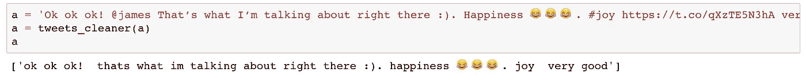
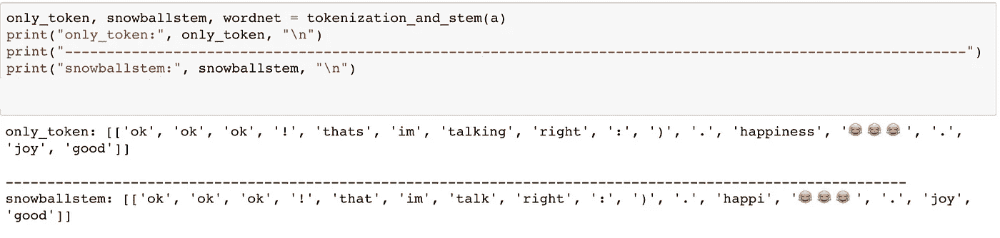
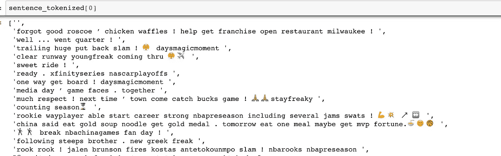

# NBA 顶级球员推特账户的情感分析——第二部分推特数据清理

> 原文：<https://towardsdatascience.com/sentiment-analysis-on-nba-top-players-twitter-account-part2-tweets-data-cleaning-aa2cf99519b3?source=collection_archive---------9----------------------->

*<本文其他部分的快速链接>*

[*Part1 数据采集*](/do-tweets-from-nba-leading-players-have-correlations-with-their-performance-7358c79aa216)

*Part2 Tweets 数据清理*

[*Part3 情感分析&聚类*](/sentiment-analysis-on-nba-top-players-twitter-account-part3-sentiment-analysis-clustering-5e5dcd4d690f)

[*Part4 绩效之间的相关性测试&情绪*](/sentiment-analysis-on-nba-top-players-twitter-account-part4-correlation-tests-between-f9bdbe224779)

# 摘要

## 深入研究社交网络上的文本处理

在这一部分，我们将清理推文，因为它们包含不必要的文本，我们也将处理特殊情况。

由于人们经常使用特殊的字符、标点符号或表情符号来表达他们的感受，因此删除除字母以外的所有内容并不是处理推文的最佳方式。例如:

*“在中国，据说‘吃了金汤面，便得了金牌’！！明天，如果我一顿饭吃 9 个，也许我能拿到那份财富里的 MVP:)。🍜😋🏀”*

上面的句子显然是一个强烈的积极反应，不仅仅是因为词汇，还因为像“！!"、“:)”和😋。如果抹去这些符号，整个表达可能会变得比以前弱得多，或者在最坏的情况下变成完全相反的意思。此外，许多推文只包含特殊字符，因为它们使用起来很方便。简单地把它们拿出来会导致一个巨大的问题。

# 第 2 部分的先决条件

# 文本处理

因此，我们只删除一些看起来确实不必要的单词。@ '提及:删除“[@ username](http://twitter.com/username)”(Twitter 中的网名)无论是来自转推还是原创推文。我们知道标记某人是分享强烈情感的一种方式，但我们不在这里讨论。
2。URL:删除所有可能的 URL 链接，因为我们不打算深入链接
3。停用词:去掉没有太大意义的常用词。标点符号:删除标点符号仍然很重要，但我们必须确保我们首先保留了重要的单词或符号，否则它们会被无意识地删除。

此外，我们将以下内容保留在原始格式中，因为我们相信它们需要纳入分析中。表情符号:😋,😢…等等
2。特殊字符:“:(”、“><”…等
3。标签的标签:(#) behappy…etc
4。一些标点:“！!"、“~”、“…”…等等

接下来，我们将开始处理我们的文本分为两部分，第一部分只是标记和删除不必要的单词。第二个是应用两种词干方法，这样我们可以减少实际上具有相同含义的独特单词。这是我做的清理函数:

如果 **tweets_cleaner()** 的输出是这样的。这里我们只是删除了@ '提及、URL 和一些很少有特殊意义的标点符号。注意，停用词处理在下一个函数中，因为我们需要在移除停用词之前对其进行标记。

如果 **tokenization_and_stem()** 的输出如下所示。您可以看到每种标记化和词干化方法之间的区别。现在我们可能会看到一些标记看起来毫无意义，例如“:)”变成了“:”和“)”。但是请记住，我们将再次把这个放回句子结构中！

## 现在，把记号列表放回句子结构中

最后，我们得到了干净的句子！back_to_clean_sent()只是将单词连接成一个句子。

*   sentence_tokenized:删除了停用词的已处理句子。
*   sentence_snowstemmeed:用 **SnowballStemmer** 方法处理去掉停用词的句子和词干处理。

这是第一个播放器的输出，去掉了一些停用词、标点符号和最有可能没有意义的特殊符号。请注意，在 NLP 中很难获得准确的干净句子，尤其是当我们不针对特定主题或领域时。

以上是对 tweets 的数据清理，第三章我们将实现情感分析和数据聚类。