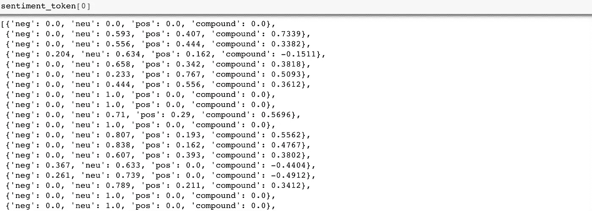
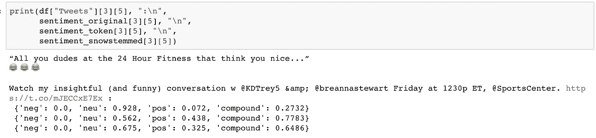
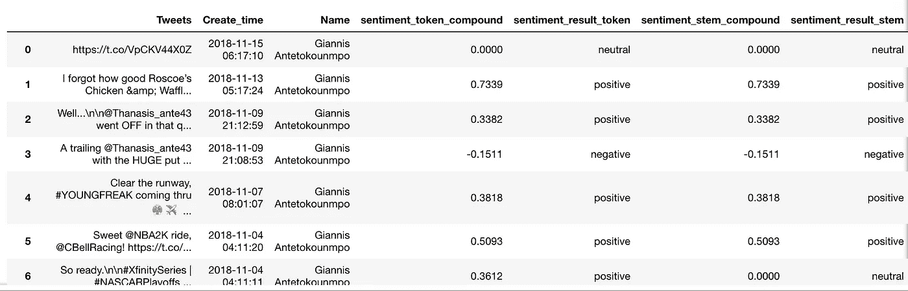
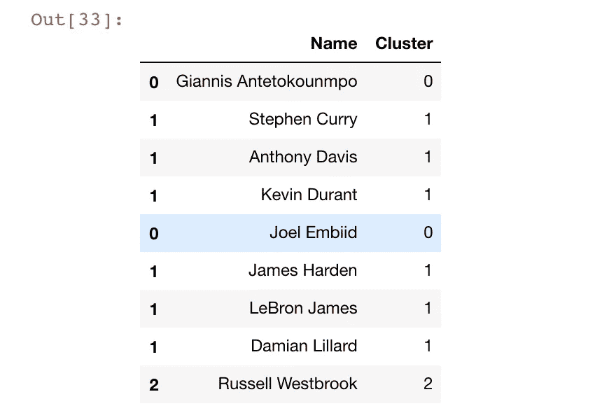
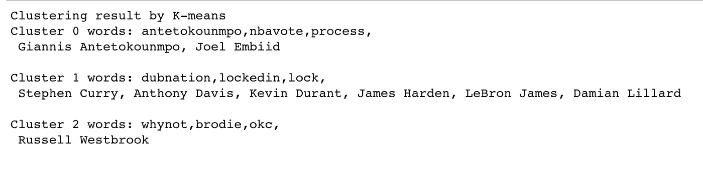
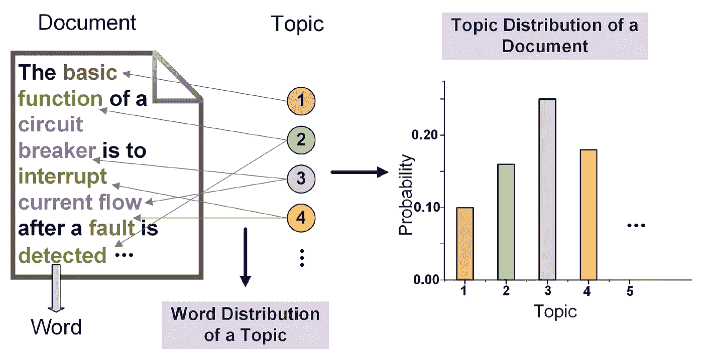
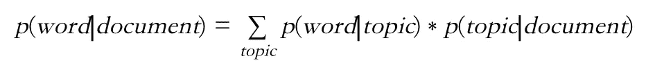
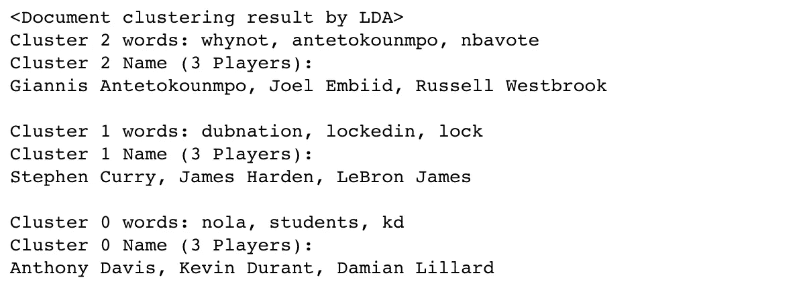

# NBA 顶级球员推特账户的情感分析(三)

> 原文：<https://towardsdatascience.com/sentiment-analysis-on-nba-top-players-twitter-account-part3-sentiment-analysis-clustering-5e5dcd4d690f?source=collection_archive---------8----------------------->

## 情感分析和聚类

*<本文其他部分的快速链接>*

[*Part1 数据采集*](/do-tweets-from-nba-leading-players-have-correlations-with-their-performance-7358c79aa216)

[*Part2 推文数据清理*](/sentiment-analysis-on-nba-top-players-twitter-account-part2-tweets-data-cleaning-aa2cf99519b3)

*Part3 情感分析&聚类*

[*Part4 绩效之间的相关性测试&情绪*](/sentiment-analysis-on-nba-top-players-twitter-account-part4-correlation-tests-between-f9bdbe224779)

# 摘要

终于到了主菜的时间了。让我们回顾一下上一部分的一些结果:

*   sentence_tokenized:处理去掉停用词的句子。
*   sentence_snowstemmeed:使用 [SnowballStemmer](https://snowballstem.org/) 方法处理去掉停用词的句子和词干处理。

我们将**对原始 tweets、sentence _ tokenized 和 sentence _ snowstemmeed 实施情感分析**,以观察这些方法之间的差异并检查它们的效果。当谈到情感分析时，我们使用三种常见的类型，本章将选择基于规则的方法，因为它更容易应用，并且不需要实际的训练集来训练数据。

*   **基于规则的**:基于一套预定义的规则和情感评分进行情感分析。
*   **自动**:利用机器学习技术从数据中学习。
*   混合的:结合基于规则和自动的方法。

稍后，我们尝试对玩家进行聚类，以查看每组玩家在 **K-means** 和**潜在狄利克雷分配**中是否有相似的词语使用行为。

# 第 3 部分的先决条件

我们使用一个名为**Vader perspectivity**的包，这是一个基于词汇和规则的情绪分析工具，专门用于社交媒体中的情绪分析，因为它在特殊字符上工作得很好，如表情符号和一些标点符号的组合。我们可以认为 lexicon approach 只是一个情感词典，我们只是根据每个单词搜索相应的情感得分，并且还考虑得分应该基于句子的每个长度和特征有多大的权重。

现在，你可能会想，每个人的情绪可能会非常不同。人们对同一个词有不同的表达。为了解决这个问题，软件包的创建者收集了大量的样本，并对每个单词的评分进行平均。

# 情感分析

然后，我们创建一个**情感分析()**，这只是一个使我们能够分析大量句子的方法:

以下是第一位玩家基于简单的标记化方法对每条推文的情感评分结果:

这里的复合得分是通过将词典中每个词的化合价得分相加，根据规则进行调整，然后归一化到-1(负得分的最大值)和+1(正得分的最大值)之间来计算的。按照惯例，复合得分≥ 0.05 视为积极情绪；≤ -0.05 是负面情绪；介于-0.05 和 0.05 之间的分数被视为中性。

现在让我们仔细看看原始推文、标记推文和词干推文的情感得分。下图显示了原始推文以及基于不同方法的评分。看出什么不同了吗？被处理过的句子现在往往有更强烈的情绪！

现在，我们根据前面的定义将复合得分转换为“**正**”、“**中性**”、“**负**”，并放入数据框中。

# 使聚集

在开始聚类之前，我们必须首先创建 TF-IDF 矩阵和模型。TF-IDF 指的是词频-逆文档频率，它是两个统计量的乘积，这两个统计量反映了一个词对集合或语料库中的文档有多重要:

*   词频:[出现在文档中的词的权重与词频成正比。](https://en.wikipedia.org/wiki/Tf%E2%80%93idf)
*   逆文档频率:[术语的特异性可以量化为它出现的文档数量的反函数。](https://en.wikipedia.org/wiki/Tf%E2%80%93idf)

为了简单起见，*这里我们只使用带词干的句子*并生成 TF-IDF 矩阵。 **Tweets_mix** 只是一个收集所有词干句子的列表，只有这样我们才能生成 TF-IDF 矩阵。

## k 均值聚类

首先，我们实现了聚类的 K-means，在本文中我们选择了 3 个聚类:

接下来，输出玩家及其对应的集群:

请记住，我们试图将玩家分组，看看每组玩家在选择词汇时是否有相似的行为。换句话说，我们需要知道每个聚类的单词集。然而，根据前面的过程，我们使用词干化的单词来生成 TF-IDF 矩阵，这意味着每个聚类的单词集也是词干化的单词。

例如，如果聚类 1 显示“famli”和“happi”是他们最常用的词，我们知道“famli”等于“家庭”,“happi”等于“快乐”;虽然对我们来说并不总是那么简单。

为了解决这个问题，我们必须翻译回我们非常熟悉的单词。为此，我们创建了一个字典，比如{"happi" : "happy"}，这样当我们计算频繁出现的词干时，就可以立即追溯到原来的单词。 **docs_tokenized** 和 **docs_snowstemmed** 是包含根据每个玩家的标记化和词干化的单词的列表，我们将使用它们进行我们的原始单词翻译。

然后，我们输出每个玩家对应的聚类和他们经常使用的单词:

在输出中，我们可以看到像斯蒂芬·库里或安东尼·戴维斯这样的球员倾向于在推特上多次使用相同的特定词语。另一方面，像拉塞尔·维斯特布鲁克这样的球员通常会标记他所属的州。

请注意，当每个集群中的集群数量分布不均匀时，您可能会得到一个坏的集群。此外，这里的集群似乎没有太多的信息，但我们所说的只是为了证明我们也可以在 NLP 上实现集群。

## 潜在的狄利克雷分配(主题建模)

**潜在狄利克雷分配** ( **LDA** )是一种生成模型，它使样本集由未观察到的组来解释，并显示为什么数据的某些部分彼此相似。在 LDA 中，每个文档可以被视为各种主题的混合，其中每个文档被认为具有通过 LDA 分配给它的一组主题。

假设观察值是 LDA 文档中的单词，那么我们说该文档是各种小主题的混合，每个单词的创建可归因于文档的一个主题，如下图所示:

source: Failure Prognosis of High Voltage Circuit Breakers with Temporal Latent Dirichlet Allocation

从数学的角度来看，基本的直觉是这样的:

在本文中，我们设置了 3 个组件，因为我们在 K-means 方法中也有 3 个聚类。 **n_stop_words** 表示我们希望看到每个主题中的前 3 个常用词。数字设置为 4 是因为索引问题，所以我们必须为 3 的结果加上 1。LDA 方法如下:

同样，下面是每个玩家对应集群的输出以及他们经常使用的单词:

[***对情感的分析和聚类就是这样。第四章我们要去检验选手的成绩之间是否存在相关性，在相关性测试之前做一些 EDA。***](/sentiment-analysis-on-nba-top-players-twitter-account-part4-correlation-tests-between-f9bdbe224779)