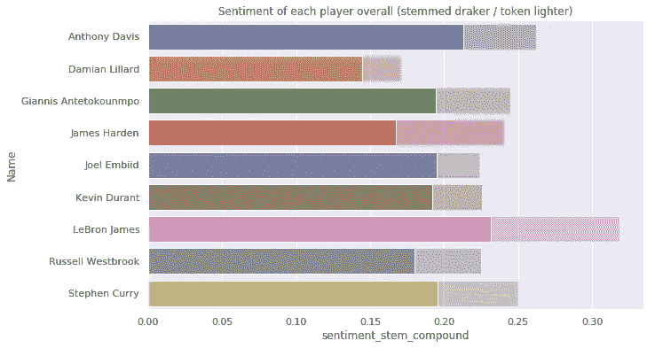
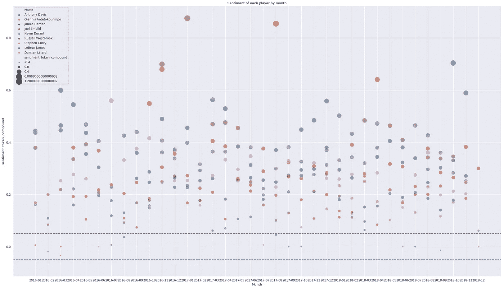
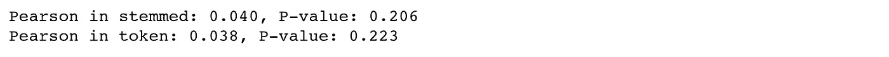

# NBA 顶级球员推特账户的情感分析——第四部分

> 原文：<https://towardsdatascience.com/sentiment-analysis-on-nba-top-players-twitter-account-part4-correlation-tests-between-f9bdbe224779?source=collection_archive---------19----------------------->

## 绩效和情绪之间的相关性测试

*<本文其他部分的快速链接>*

[*Part1 数据采集*](/do-tweets-from-nba-leading-players-have-correlations-with-their-performance-7358c79aa216)

[*Part2 推文数据清理*](/sentiment-analysis-on-nba-top-players-twitter-account-part2-tweets-data-cleaning-aa2cf99519b3)

[*Part3 情感分析&聚类*](/sentiment-analysis-on-nba-top-players-twitter-account-part3-sentiment-analysis-clustering-5e5dcd4d690f)

*Part4 绩效之间的相关性测试&情绪*

# 摘要

经过漫长的过程，我们终于要看到球员在球场上的表现与他们的推特之间是否有任何统计相关性。现在让我们看看会发生什么！

# 第 2 部分的先决条件

在我们开始之前，可视化和相关性测试需要这些包:

# 数据可视化

在这里，我们将绘制一些图表，以便对每个玩家的情绪得分有一个简单的了解。可惜由于数据本身的限制，只有两个图看起来有点用。

首先，我们来看看 2016-2018 年选手的平均情绪得分。很明显，所有的玩家通常都发布积极的推文，这在现实中是很符合逻辑的，对吗？这里，我们在标记化方法和词干化方法中实现情感评分。

来自标记化方法的情感分数越浅，来自词干化方法的情感分数越深。词干法中的分数都较低，但不会对结果产生太大影响。

此外，我们绘制出每个玩家的每月情绪得分。下面的图有两条蓝色水平线，表示积极、中性和消极情绪。在-0.05 和 0.05 线之间为中性；以上为正；下方是负数。

# 绩效和情绪之间的相关性测试

最后，还记得我们的终极目标吗？**我们很好奇球员赛前的情绪会不会和他们的表现有什么关联。**

**可悲的是，我们的文章指出在皮尔逊相关性检验下它们之间没有相关性。**至少我们知道 NBA 球员在场上的时候都很专业。他们能够忘记除了游戏之外的一切！

这就是本文的全部任务。谢谢，喜欢就鼓掌！！