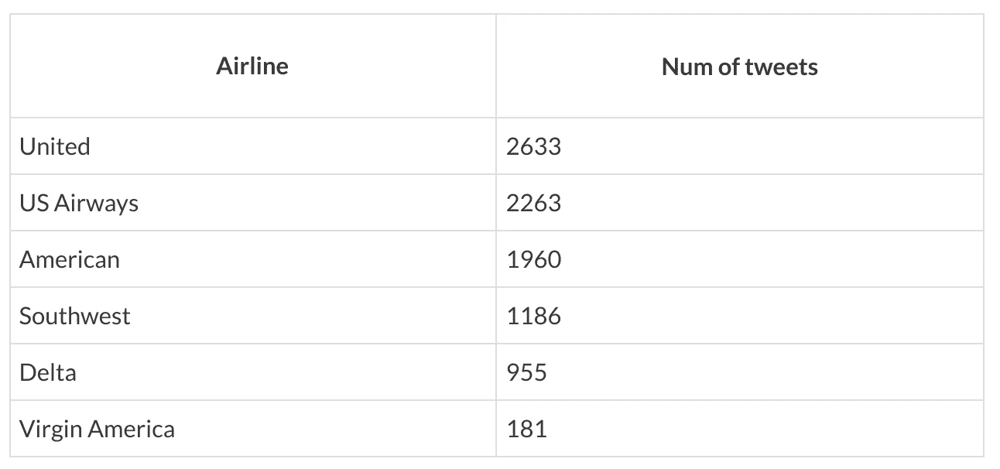
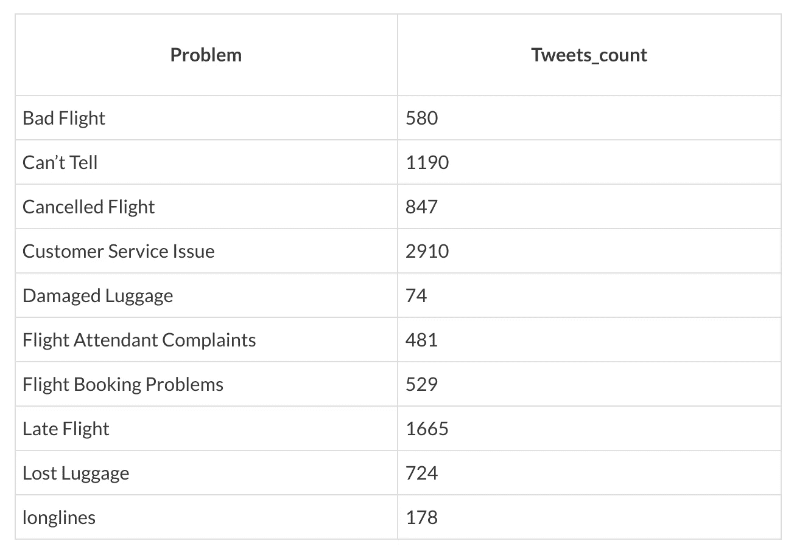

# 美国 Twitter 航空公司数据集上的情感分析—第 1 页，共 2 页

> 原文：<https://towardsdatascience.com/sentiment-analysis-on-us-twitter-airline-dataset-1-of-2-2417f204b971?source=collection_archive---------3----------------------->

我想探索一些情感分析的概念，并尝试一些可以在数据分析和情感分析方面提供帮助的库。使用的数据集是“ *Twitter 美国航空公司情绪”*在 ka ggle:[https://www . ka ggle . com/crowd flower/Twitter-Airline-sensation](https://www.kaggle.com/crowdflower/twitter-airline-sentiment)上很容易找到

这个数据集非常好，包含了 2015 年 2 月美国航空公司的推文，分为正面、负面和中性推文。负面推文也根据负面原因进行分类。
本帖分为两部分:

*   第一部分:对数据集进行数据分析，找出最好和最差的航空公司，并了解在糟糕的航班情况下最常见的问题是什么
*   第二部分:训练两个朴素贝叶斯分类器:首先将推文分类为正面和负面，第二个分类器根据原因将负面推文分类。这样就有可能用新的推文来更新第一点的统计数据。

这项工作有助于航空公司了解需要解决的问题。

对于这项工作的 Python 与:熊猫，jupyter 笔记本和 NLTK 将被使用。

Pandas 是一个开源库，为 Python 提供了高性能、易于使用的数据结构和分析工具。我将使用这个库来加载数据集并进行一些分析。

Jupyter notebook 对数据科学家非常有用，因为它是一个 web 应用程序，允许创建和共享包含实时代码、等式、可视化和说明性文本的文档。这样，共享工作就很容易了。

NLTK 是一个平台，用于构建使用人类语言的程序。用这个库来训练计算语言学的分类器是很简单的。

# 数据分析

好了，先从数据分析开始。观察数据集，我们可以发现许多列，但最重要的是:

*   航空公司
*   航空公司 _ 情绪
*   消极原因

这个数据集不需要任何清理操作，但是对于我要回答的问题，一些转换是必要的。首先，有必要将推文分为三组:正面、负面和中性。然后我想找到 2015 年 2 月最好和最差的航空公司。之后，我想找出导致糟糕飞行的常见问题。为此，只考虑负面推文(显然！).

最差航空公司的结果如下:

最好的结果是:

从数据集中，不良飞行问题的等级是:

# 结论

所以糟糕的飞行的最重要的原因是由于客户服务…对公司来说不是很好…

在下一篇文章中，我将训练贝叶斯分类器来分析新的推文。

*原载于 2017 年 9 月 28 日*[*【devklaus.wordpress.com】*](https://devklaus.wordpress.com/2017/09/28/sentiment-analysis-to-find-problems/)*。*