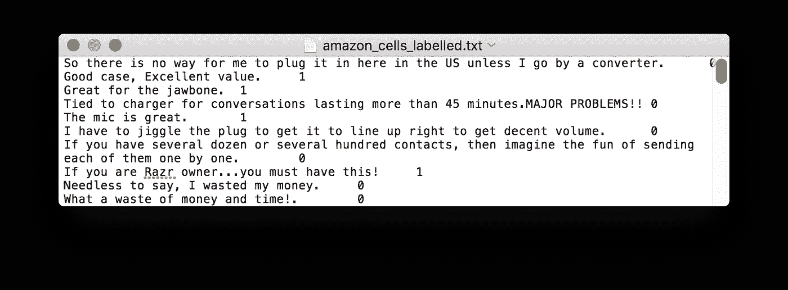
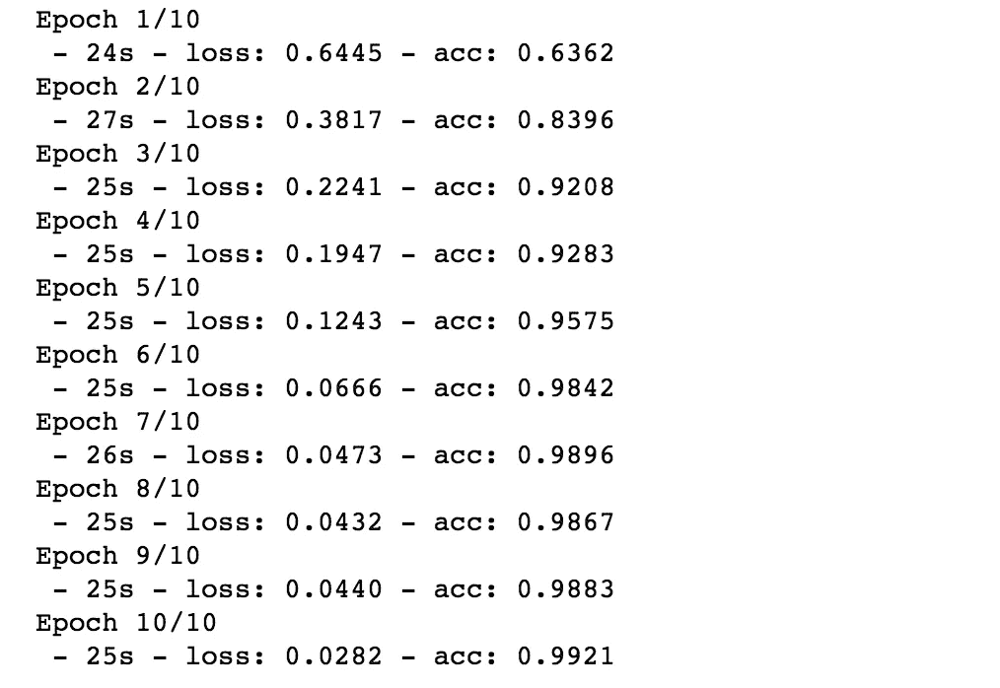
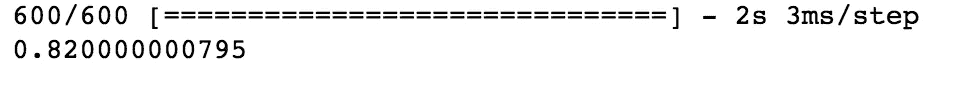

# 通过 LSTMs 进行情感分析

> 原文：<https://towardsdatascience.com/sentiment-analysis-through-lstms-3d6f9506805c?source=collection_archive---------4----------------------->

## 用不到 50 行代码构建您自己的模型


## 自然语言处理简介

语言将人类联系在一起。语言是我们向另一个人传达思想和感情的工具，在这个工具的帮助下，我们也能够理解他们的思想和感情。我们大多数人从 18 个月大到 2 岁左右开始说话。人们还没有完全理解人脑是如何在如此幼小的年龄掌握如此大量的知识的。但是，已经发现大多数语言处理功能发生在大脑的大脑皮层内。

## 情感分析背后的动机

人类自己无法理解我们的大脑到底是如何处理语言的。那么，我们有没有可能教会机器学习我们的语言呢？？是的，通过广泛的研究，已经开发了许多方法来帮助机器理解我们的语言。NLP 或自然语言处理是关注人类语言和计算机之间交互的研究领域。自然语言处理的一个子问题是情感分析，即将一个陈述分类为正面或负面。将一个陈述分为正面或负面有什么用？？我们以亚马逊网站为例。在亚马逊上，它的用户可以对产品发表评论，说明它是好是坏，甚至可以是中性的。现在，使用人工阅读所有的评论并获得客户对产品的总体反馈将是昂贵且耗时的。进入我们的机器学习模型。机器学习模型可以在大量数据中搅动，做出推论并对评论进行分类。使用这种 ML 模型，亚马逊可以通过客户评论来改进产品，从而为公司带来更多收入。

情感分析并不像看起来那么简单。如果你认为包含“好”、“棒极了”等词语的评论可以被归类为正面评论，而包含“糟糕”、“悲惨”等词语的评论可以被归类为负面评论，请再想想。E.x:“完全缺乏良好的品味”和“对快餐很好，但没什么特别的”分别代表负面和中性的反馈，即使它们含有“好”这个词。因此，正如我提到的，这项任务可能不像看起来那么容易。让我们继续我们将要处理的数据。

## 资料组

我们将查看来自亚马逊产品评论、IMDB 电影评论和 Yelp 评论的评论，以建立我们的情感分析模型。可以从这个[链接](https://www.kaggle.com/marklvl/sentiment-labelled-sentences-data-set/data)下载数据。所有数据都已经标注，0 代表负反馈，1 代表正反馈。几行亚马逊数据看起来与下图相似。



## 密码

我们写点代码吧！

数据存在于不同的文本文件中。我们打开每个文件，阅读所有文本行，包括每个文本的标签。然后，我们将它们存储在一个名为“lines”的列表中。

在数据集中的每一行，我们有文本和后面的四个字符空间，我们有该文本的标签(0 或 1)。因此，我们取包含文本的第一部分，并将其添加到我们的特征(x)中，然后我们取标签，其末尾有' \n '。因此，它被删除，然后添加到我们的标签列表(y)。

Keras 有一个内置的 API，使得为计算准备文本变得更加容易。Tokenizer 类有 4 个属性，可用于准备要素。看一下下面的例子来理解 tokenizer 实际上做了什么。

```
## CODE
tokenizer = Tokenizer()texts = ["The sun is shining in June!","September is grey.","Life is beautiful in August.","I like it","This and other things?"]tokenizer.fit_on_texts(texts)print(tokenizer.word_index)tokenizer.texts_to_sequences(["June is beautiful and I like it!"])## OUPUT{'sun': 3, 'september': 4, 'june': 5, 'other': 6, 'the': 7, 'and': 8, 'like': 9, 'in': 2, 'beautiful': 11, 'grey': 12, 'life': 17, 'it': 16, 'i': 14, 'is': 1, 'august': 15, 'things': 10, 'shining': 13, 'this': 18}[[5, 1, 11, 8, 14, 9, 16]]
```

Tokenizer 为句子中的每个单词分配索引值，并且可以使用该索引值来表示新的句子。由于我们使用的文本语料库包含大量不同的单词，我们设置了一个上限，只使用最经常出现的 2500 个单词。

我们现在将文本转换成如上所示的数字序列，并填充数字序列。由于句子可以有不同的长度，它们的序列长度也会不同。因此，pad_sequences 查找最长的句子，并用 0 填充所有其他语句以匹配该长度。

```
## Pad Sequences Example
pad_sequences([[1, 2, 3], [3, 4, 5, 6], [7, 8]])
array([[0, 1, 2, 3],
       [3, 4, 5, 6],
       [0, 0, 7, 8]], dtype=int32)
```

我们将标签转换成一个热编码。这有助于 LSTM 网络预测文本的标签。现在，我们已经准备好了文本数据，我们可以将它分成训练样本和测试样本。80%的数据用于训练，20%的数据用于测试模型。

我们现在建立模型，编译它，训练它，测试它。该模型具有嵌入层。输入序列是文本的稀疏表示，因为词汇表将是巨大的，并且给定的单词将由大的向量来表示。如果我们能够建立一些序列的密集表示，网络就更容易预测。2500 个单词的单词嵌入/密集表示是通过嵌入层训练模型而得到的。然后，我们添加 LSTM 和密集层的模型。LSTM 细胞负责进行上下文推理，并帮助预测一个句子是否是肯定句。密集层输出每个类别的概率。我没有给出太多关于 LSTMs 的细节。想了解更多，请参考这个[博客](http://colah.github.io/posts/2015-08-Understanding-LSTMs/)。

## 输出



Training



Testing

您刚刚用 50 行代码构建了一个情感分类器。