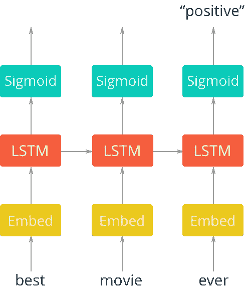

# 使用 RNNs 的情感分析(LSTM)

> 原文：<https://towardsdatascience.com/sentiment-analysis-using-rnns-lstm-60871fa6aeba?source=collection_archive---------0----------------------->

这里，我们使用评论的例子来预测情绪(尽管它可以更普遍地应用于其他领域，例如对推文、评论、客户反馈等的情绪分析)。这里的整体思想是，电影评论是由单词序列和单词顺序组成的，这些单词编码了许多对预测情感有用的信息。第一步是将单词映射到单词嵌入(参见帖子 [1](https://medium.com/towards-data-science/word2vec-skip-gram-model-part-1-intuition-78614e4d6e0b) 和 [2](https://medium.com/towards-data-science/word2vec-skip-gram-model-part-2-implementation-in-tf-7efdf6f58a27) 了解更多关于单词嵌入的上下文)。步骤 2 是 RNN，它接收向量序列作为输入，并考虑向量的顺序来生成预测。

该网络的架构如下所示。



> 这里，我们将把单词传递给一个嵌入层。您实际上可以用 word2vec 训练一个嵌入，并在这里使用它。但是只要有一个嵌入层并让网络自己学习嵌入表就足够了。

从嵌入层，新的表现将被传递到 LSTM 细胞。这将增加网络的循环连接，这样我们就可以在数据中包含单词序列的信息。最后，LSTM 细胞将进入一个 sigmoid 输出层。我们使用 sigmoid 是因为我们试图预测这篇文章是否有积极或消极的情绪。输出层将只是一个具有 s 形激活函数的单一单元。

除了最后一个，我们不关心 sigmoid 输出，其他的可以忽略。我们将根据上一步的输出和训练标签来计算成本。

# 架构摘要:

将固定长度的评论编码为整数，然后转换为嵌入向量，以循环方式传递给 LSTM 层，并挑选最后的预测作为输出情感。

# 陷阱:

在我的实验中，我无法解释的一件事是，当我将单词编码为整数时，如果我随机为单词分配唯一的整数，我得到的最佳准确度是 50–55%(基本上，该模型并不比随机猜测好多少)。但是，如果对单词进行编码，使得最高频率的单词得到最低的数字，那么在 3-5 个时期内，模型精度为 80%。我的猜测是，这对于训练嵌入层是必要的，但是在任何地方都找不到原因的解释。

# 代码:

[https://github . com/mchablani/deep-learning/blob/master/情操-rnn/情操 _RNN.ipynb](https://github.com/mchablani/deep-learning/blob/master/sentiment-rnn/Sentiment_RNN.ipynb)

## 数据预处理:

将评论中的所有单词用整数编码。现在每个评论都是一个有序的整数数组。让每个评论固定大小(比如 200)，这样较短的评论前面会填充 0，而较长的评论会被截断到 200。因为我们用 0 填充，所以单词到 int 的映射从 1 开始。标签被编码为“1”和“0”，分别代表“正”和“负”。

## 构建图表

```
lstm_size = 256
lstm_layers = 2
batch_size = 500
learning_rate = 0.001
embed_size = 300n_words = len(vocab_to_int) + 1 # Add 1 for 0 added to vocab# Create the graph object
tf.reset_default_graph()
with tf.name_scope('inputs'):
    inputs_ = tf.placeholder(tf.int32, [None, None], name="inputs")
    labels_ = tf.placeholder(tf.int32, [None, None], name="labels")
    keep_prob = tf.placeholder(tf.float32, name="keep_prob")# Sizeof embedding vectors (number of units in the embedding layer)
with tf.name_scope("Embeddings"):
    embedding = tf.Variable(tf.random_uniform((n_words, embed_size), -1, 1))
    embed = tf.nn.embedding_lookup(embedding, inputs_)def lstm_cell():
    # Your basic LSTM cell
    lstm = tf.contrib.rnn.BasicLSTMCell(lstm_size, reuse=tf.get_variable_scope().reuse)
    # Add dropout to the cell
    return tf.contrib.rnn.DropoutWrapper(lstm, output_keep_prob=keep_prob)with tf.name_scope("RNN_layers"):
    # Stack up multiple LSTM layers, for deep learning
    cell = tf.contrib.rnn.MultiRNNCell([lstm_cell() for _ in range(lstm_layers)])

    # Getting an initial state of all zeros
    initial_state = cell.zero_state(batch_size, tf.float32)with tf.name_scope("RNN_forward"):
    outputs, final_state = tf.nn.dynamic_rnn(cell, embed, initial_state=initial_state)with tf.name_scope('predictions'):
    predictions = tf.contrib.layers.fully_connected(outputs[:, -1], 1, activation_fn=tf.sigmoid)
    tf.summary.histogram('predictions', predictions)
with tf.name_scope('cost'):
    cost = tf.losses.mean_squared_error(labels_, predictions)
    tf.summary.scalar('cost', cost)with tf.name_scope('train'):
    optimizer = tf.train.AdamOptimizer(learning_rate).minimize(cost)
```

## 配料和培训

```
def get_batches(x, y, batch_size=100):

    n_batches = len(x)//batch_size
    x, y = x[:n_batches*batch_size], y[:n_batches*batch_size]
    for ii in range(0, len(x), batch_size):
        yield x[ii:ii+batch_size], y[ii:ii+batch_size]epochs = 10# with graph.as_default():
saver = tf.train.Saver()with tf.Session() as sess:
    sess.run(tf.global_variables_initializer())
    train_writer = tf.summary.FileWriter('./logs/tb/train', sess.graph)
    test_writer = tf.summary.FileWriter('./logs/tb/test', sess.graph)
    iteration = 1
    for e in range(epochs):
        state = sess.run(initial_state)

        for ii, (x, y) in enumerate(get_batches(train_x, train_y, batch_size), 1):
            feed = {inputs_: x,
                    labels_: y[:, None],
                    keep_prob: 0.5,
                    initial_state: state}
            summary, loss, state, _ = sess.run([merged, cost, final_state, optimizer], feed_dict=feed)
#             loss, state, _ = sess.run([cost, final_state, optimizer], feed_dict=feed)train_writer.add_summary(summary, iteration)

            if iteration%5==0:
                print("Epoch: {}/{}".format(e, epochs),
                      "Iteration: {}".format(iteration),
                      "Train loss: {:.3f}".format(loss))if iteration%25==0:
                val_acc = []
                val_state = sess.run(cell.zero_state(batch_size, tf.float32))
                for x, y in get_batches(val_x, val_y, batch_size):
                    feed = {inputs_: x,
                            labels_: y[:, None],
                            keep_prob: 1,
                            initial_state: val_state}
#                     batch_acc, val_state = sess.run([accuracy, final_state], feed_dict=feed)
                    summary, batch_acc, val_state = sess.run([merged, accuracy, final_state], feed_dict=feed)
                    val_acc.append(batch_acc)
                print("Val acc: {:.3f}".format(np.mean(val_acc)))
            iteration +=1
            test_writer.add_summary(summary, iteration)
            saver.save(sess, "checkpoints/sentiment_manish.ckpt")
    saver.save(sess, "checkpoints/sentiment_manish.ckpt")
```

学分:来自课堂讲稿:[https://classroom.udacity.com/nanodegrees/nd101/syllabus](https://classroom.udacity.com/nanodegrees/nd101/syllabus)