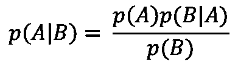
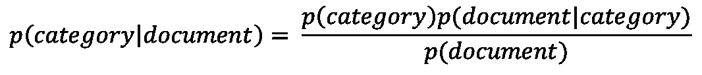
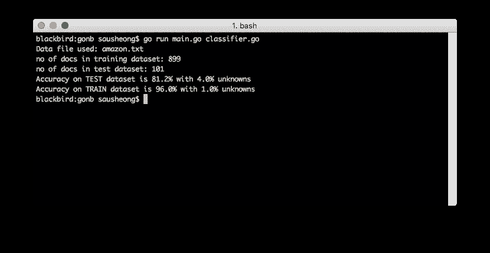

# 围棋中基于简单朴素贝叶斯分类器的情感分析

> 原文：<https://towardsdatascience.com/sentiment-analysis-with-a-simple-naive-bayes-classifier-in-go-6c18a0134a1c?source=collection_archive---------12----------------------->

## 使用 Go 通过情感分析对文本进行分类


(credits: Chang Sau Sheong)

我最近在读 Pedro Domingos 的[大师算法](https://www.amazon.com/Master-Algorithm-Ultimate-Learning-Machine/dp/1501299387)。这是一本引人入胜的读物，有一些有趣的想法。在书中，多明戈斯提出，机器学习算法可以归入 5 个部落之一——符号主义者、连接主义者、进化论者、贝叶斯主义者和类比主义者。每个部落都有自己的算法。符号主义者是逆向演绎(决策树)，连接主义者是反向传播(神经网络)，进化者是遗传编程(遗传算法)，贝叶斯主义者是贝叶斯定理，类比主义者是支持向量机(SVM)。

当我在读关于贝叶斯人的那一章时，我记得大约 10 年前我在我的旧博客中写过一篇关于朴素贝叶斯分类器的[博文。所以我把它挖了出来(我的旧博客现在处于休眠状态，已经很多年没碰过了)，掸去灰尘，决定刷新和重温这个话题。](https://blog.saush.com/2009/02/11/naive-bayesian-classifiers-and-ruby/)

我想做一些事情。首先，我将在 Go 中重写它。Ruby 代码工作得非常好，但是重温旧代码并看看如何改进它总是感觉很好。第二，我将把它用于一个非常流行的目的——情感分析(稍后我会谈到这一点)。最后，我将使用适当的训练和测试数据集对其进行训练和测试(我之前的博客文章中没有这一项)。

# 贝叶斯定理

在我们开始学习贝叶斯定理之前，让我们回到基础知识，谈谈概率。概率是某件事情发生的可能性，在数学中我们将其表示为 0 到 1 之间的一个数字，其中 0 表示它永远不会发生，1 表示它永远会发生。

*条件概率*是一种特殊的概率，它受某些条件或某些背景信息的影响。例如，你可能会也可能不会和你的朋友出去(一种可能性)，但这受天气影响——如果雨下得很大，你可能不想出去。所以你出去的概率是一个条件概率，基于天气。


Going out in the rain with your friends (credits: [https://commons.wikimedia.org/wiki/File:Singin%27_in_the_Rain_trailer.jpg](https://commons.wikimedia.org/wiki/File:Singin%27_in_the_Rain_trailer.jpg))

为了用数学来表示，我们假设不管发生什么，你出门的概率是`A`，坏天气的概率是`B`，你出门的条件概率，取决于天气是`p(A|B)`，或者大声读出是“给定 B，A 的概率”。

一个*联合概率*是两个事件都实现的概率。在我们上面的例子中，你在恶劣天气下外出的概率是`p(A and B)`。你可能已经学过(或者从中学数学中有一些模糊的回忆)如果两个概率彼此独立，那么`p(A and B) = p(A)p(B)`，即`A`的概率和`B`是`A`的独立概率和`B`的独立概率的倍数。

然而我们刚刚了解到`A`实际上并不独立于`B`，所以`p(A)`实际上是`p(A|B)`的一个特例。如果下雨，会减少你外出的可能性。换句话说，更一般的数学描述是:

`p(A and B) = p(A|B)p(B)`

由于`A`和`B`可以是一般化的任何事件，因此`A`和`B`的合取概率是可交换的:

`p(A and B) = p(B and A)`

如果我们代入方程:

`p(A|B)p(B) = p(B|A)p(A)`

然后得到`p(A|B)`的条件概率:



Bayes’ Theorem

这就是所谓的[贝叶斯定理](https://en.wikipedia.org/wiki/Bayes%27_theorem)(或贝叶斯定律或贝叶斯法则)。

# 情感分析

现在让我们看看我们想要解决的问题，然后再回头看看贝叶斯定理是如何被用来解决它的。情感分析是一种根据说话者或作者所说或写下的内容来判断其心理状态的技术。它通常用于挖掘社交媒体(推文、评论、评论等)对品牌、产品或服务的情感，因为手动挖掘太困难、太昂贵或太慢。情感分析也被用于政治，在竞选活动中衡量公众对某些话题的看法。

这是一个相当复杂的问题，有许多不同类型的算法可以使用，其中一些可能非常复杂。在我们的例子中，我们希望分析来自亚马逊、IMDB 和 Yelp 的不同文本评论，并了解情绪是积极的还是消极的。换句话说，这是一个分类问题，我们将基于贝叶斯定理构建一个分类器。

# 基于贝叶斯定理的文档分类

分类器就是对其他事物进行分类的东西。分类器是一个函数，它接收一组数据，并告诉我们数据属于哪个类别或分类。要对一个文本文档进行分类，我们要问——给定一个特定的文档，它属于这个类别的概率是多少？当我们找到给定文档在所有类别中的概率时，分类器挑选概率最高的类别，并宣布它为获胜者，也就是说，该文档最有可能属于该类别。

让我们将前面的数学公式转换成一个可用于文档分类的公式:



Bayes Theorem for document classification

在上面的公式中，`p(category|document)`就是我们要找的东西——给定一个文档，它属于这个类别的概率是多少？

类似地，`p(document|category)`是该文档存在于该类别中的概率，`p(category)`是该类别与任何文档无关的概率，`p(document)`是该文档与任何类别无关的概率。

我们真正需要的只是`p(document|category)`和`p(category)`。我们可以去掉`p(document)`，因为它对每个类别都是一样的。

那么我们如何找到`p(document|category)`？文档是由一串单词组成的，因此文档的概率是文档中所有单词的联合概率。给定一个类别的文档的概率是该文档中所有单词在一个类别中的联合概率。

一个词出现在一个类别中的概率很简单，那只是这个词在类别中出现的次数。连接部分非常棘手，因为单词不会随机出现在文档中，单词的顺序和外观取决于文档中的其他单词。那么我们如何解决这个问题呢？这就是*朴素贝叶斯分类器*的*朴素*部分的用武之地。我们简单地忽略单词的条件概率，并假设每个单词都是相互独立的。换句话说(双关语)，我们假设单词*随机出现在文档中。做出这样的假设似乎非常愚蠢，但是让我们看看它是如何实现的。*

概率`p(category)`相对容易，它只是一个类别中文档的数量除以所有类别中文档的总数。

这很简单。让我们来看看代码。

# 围棋中的朴素贝叶斯分类器

# 创建分类器

我们将开始在一个名为`classifier.go`的文件中创建一个通用的朴素贝叶斯文本分类器。

首先，我们创建了`Classifier`结构。

```
// Classifier is what we use to classify documents
type Classifier struct {
	words               map[string]map[string]int
	totalWords          int
	categoriesDocuments map[string]int
	totalDocuments      int
	categoriesWords     map[string]int
	threshold           float64
}

// create and initialize the classifier
func createClassifier(categories []string, threshold float64) (c Classifier) {
	c = Classifier{
		words:               make(map[string]map[string]int),
		totalWords:          0,
		categoriesDocuments: make(map[string]int),
		totalDocuments:      0,
		categoriesWords:     make(map[string]int),
		threshold:           threshold,
	}

	for _, category := range categories {
		c.words[category] = make(map[string]int)
		c.categoriesDocuments[category] = 0
		c.categoriesWords[category] = 0
	}
	return
}
```

在该结构中，`words`是表示已经由分类器训练的单词的映射图。大概是这样的(不完全是):

```
{
    "1": {
        "good": 10,
        "wonderful": 5,
        "amazing": 7,
    },
    "0": {
        "awful": 6,
        "loud": 4,
    }
}
```

`totalWords`字段是分类器中单词的总数，而`totalDocuments`是分类器中文档的总数。

`categoriesDocuments`字段是给出每个类别中文档数量的图:

```
{
    "1": 13,
    "0": 16,
}
```

`categoriesWords`字段是给出每个类别中单词数量的图:

```
{
    "1": 35,
    "0": 44,
}
```

稍后我会描述`threshold`。

# 计数单词

分类器的核心实际上是对单词进行计数，所以接下来让我们来看看。我们有一个函数`countWords`可以做到这一点，它传入一个文档，并返回每个单词出现次数的地图。

```
var cleaner = regexp.MustCompile(`[^\w\s]`)
// truncated list
var stopWords = map[string]bool{"a": true, "able": true, "about": true, ..., "you've": true, "z": true, "zero": true}

// clean up and split words in document, then stem each word and count the occurrence
func countWords(document string) (wordCount map[string]int) {
	cleaned := cleaner.ReplaceAllString(document, "")
	words := strings.Split(cleaned, " ")
	wordCount = make(map[string]int)
	for _, word := range words {
		if !stopWords[word] {
			key := stem(strings.ToLower(word))
			wordCount[key]++
		}
	}
	return
}

// stem a word using the Snowball algorithm
func stem(word string) string {
	stemmed, err := snowball.Stem(word, "english", true)
	if err == nil {
		return stemmed
	}
	fmt.Println("Cannot stem word:", word)
	return word
}
```

首先，我们使用正则表达式清理文档，删除所有不是单词的内容(包括标点符号等)。然后我们将文档拆分成单词。

我们不需要文档中的所有单词，我们只需要关键词，所以我们删除了文档中任何常见的单词，例如，我们将忽略冠词，如 *a* 、 *the* ，代词，如 *he* 、 *she* 等等。所以我们用一个停用词列表，过滤掉那些常用词。其余的将被放入小写，使关键一致。

很多词都有不同的变体，比如名词可以是复数(*猫*和*猫*要一起算)，动词可以有时态(*吃*，*吃*和*吃*要一起算)等等。为了不重复计算单词变化，我们使用一种叫做[词干](https://en.wikipedia.org/wiki/Stemming)的技术。在我们的分类器中，我使用了一个词干分析器库，基于[雪球算法](http://snowballstem.org/)的[雪球](https://github.com/kljensen/snowball)。

最后，将单词计数相加并返回。

# 训练分类器

训练分类器实际上就是对训练数据集文档中的单词进行计数，繁重的工作由`countWords`函数完成。分类器中的`Train`方法简单地使用了`countWords`函数，并根据类别分配计数。

```
// Train the classifier
func (c *Classifier) Train(category string, document string) {
	for word, count := range countWords(document) {
		c.words[category][word] += count
		c.categoriesWords[category] += count
		c.totalWords += count
	}
	c.categoriesDocuments[category]++
	c.totalDocuments++
}
```

# 文档分类

这是实际行动开始的地方。在进入`Classify`方法之前，让我们再看一下等式:

`p(category|document) = p(document|category)p(category)`

我们将创建一个方法来计算每个概率。先说`p(category)`。

```
// p (category)
func (c *Classifier) pCategory(category string) float64 {
	return float64(c.categoriesDocuments[category]) / float64(c.totalDocuments)
}
```

这是不言自明的——我们将类别中的文档数除以文档总数，得到该类别的概率。

接下来我们来看`p(document|category)`。

```
// p (document | category)
func (c *Classifier) pDocumentCategory(category string, document string) (p float64) {
	p = 1.0
	for word := range countWords(document) {
		p = p * c.pWordCategory(category, word)
	}
	return p
}

func (c *Classifier) pWordCategory(category string, word string) float64 {
	return float64(c.words[category][stem(word)]+1) / float64(c.categoriesWords[category])
}
```

首先，我们使用`countWords`给出文档中的字数。这里我们实际上并不关心字数，我们只是想要文档中的关键词列表。对于每一个关键词，我们在类别中找到它的概率。这就是该关键字在类别中出现的次数除以类别中的总字数。例如，在训练分类器之后，假设对于类别`1`(它是肯定的)，我们有 10 个单词“good”。而我们在类别`1`中总共有 100 个单词。这意味着该词在类别中的概率是`0.1`。

我们对文档中的每个关键词都这样做，然后将所有这些概率相乘，这将是`p(document|category)`。

最后，我们找到了`p(category|document)`，这是相当琐碎的。

```
// p (category | document)
func (c *Classifier) pCategoryDocument(category string, document string) float64 {
	return c.pDocumentCategory(category, document) * c.pCategory(category)
}
```

现在我们有了每个类别的条件概率，我们把它们放在一个单一的地图中。

```
// Probabilities of each category
func (c *Classifier) Probabilities(document string) (p map[string]float64) {
	p = make(map[string]float64)
	for category := range c.words {
		p[category] = c.pCategoryDocument(category, document)
	}
	return
}
```

这将由我们的`Classify`方法使用。

```
// Classify a document
func (c *Classifier) Classify(document string) (category string) {
	// get all the probabilities of each category
	prob := c.Probabilities(document)

	// sort the categories according to probabilities
	var sp []sorted
	for c, p := range prob {
		sp = append(sp, sorted{c, p})
	}
	sort.Slice(sp, func(i, j int) bool {
		return sp[i].probability > sp[j].probability
	})

	// if the highest probability is above threshold select that
	if sp[0].probability/sp[1].probability > c.threshold {
		category = sp[0].category
	} else {
		category = "unknown"
	}

	return
}
```

我们的`Classify`方法根据概率对类别进行排序，并找出最重要的类别。但这还不是结束。顶级和二级之间的差别可能非常小。例如，让我们以将电子邮件分类为垃圾邮件和非垃圾邮件为例，假设概率是这样的-垃圾邮件是 51%，非垃圾邮件是 49%。该文档是否应归类为垃圾邮件？这取决于你希望分类器有多严格。

这就是`threshold`字段的原因，它是用于分离类别的阈值比率。例如，如果`threshold`是`1.5`，这意味着具有最高概率的类别需要比第二高的概率高 1.5 倍。如果顶级类别没有达到阈值，我们将把它归类为`unknown`。

我们已经完成了分类器，接下来让我们看看如何使用它。

# 使用朴素贝叶斯分类器的情感分析

在这篇博文中，我使用了 Dimitrios Kotzias 等人为论文“使用深度特征从群体到个体标签”创建的[情感标签句子数据集](https://archive.ics.uci.edu/ml/datasets/Sentiment+Labelled+Sentences)。艾尔。KDD 2015。该数据集包含来自亚马逊、IMDB 和 Yelp 网站的 1000 条评论，标签为正面的`1`或负面的`0`。这些评论分别摘自产品、电影和餐馆的评论。

首先，让我们看看数据是如何设置的。

# 设置数据

我将每个数据集分为训练数据集和测试数据集，并使用训练数据集来训练分类器，使用测试数据集来验证分类器。这是通过`setupData`功能完成的。

```
// datasets
type document struct {
	sentiment string
	text      string
}

var train []document
var test []document

// set up data for training and testing
func setupData(file string) {
	rand.Seed(time.Now().UTC().UnixNano())
	data, err := readLines(file)
	if err != nil {
		fmt.Println("Cannot read file", err)
		os.Exit(1)
	}
	for _, line := range data {
		s := strings.Split(line, "|")
		doc, sentiment := s[0], s[1]

		if rand.Float64() > testPercentage {
			train = append(train, document{sentiment, doc})
		} else {
			test = append(test, document{sentiment, doc})
		}
	}
}

// read the file line by line
func readLines(path string) ([]string, error) {
	file, err := os.Open(path)
	if err != nil {
		return nil, err
	}
	defer file.Close()

	var lines []string
	scanner := bufio.NewScanner(file)
	for scanner.Scan() {
		lines = append(lines, scanner.Text())
	}
	return lines, scanner.Err()
}
```

我使用变量`testPercentage`来获取整个数据集作为测试数据集的百分比。这又被用来随机选择测试数据集中的一些记录。

# 创建文档分类器

一旦我们建立了数据集，我们开始用我们的参数创建分类器。

```
// parameters
var (
	testPercentage = 0.1
	datafile       = "amazon.txt"
	threshold      = 1.1
)

var categories = []string{"1", "0"}

func main() {
	setupData(datafile)
	fmt.Println("Data file used:", datafile)
	fmt.Println("no of docs in TRAIN dataset:", len(train))
	fmt.Println("no of docs in TEST dataset:", len(test))

	c := createClassifier(categories, threshold)

...
```

# 用训练数据集训练分类器

给定分类器，我们开始使用训练数据集来训练它。

```
...
	// train on train dataset
	for _, doc := range train {
		c.Train(doc.sentiment, doc.text)
    }
...
```

# 测试数据集上的测试分类器

在训练分类器之后，我们使用它在测试数据集上进行测试。

```
...
	// validate on test dataset
	count, accurates, unknowns := 0, 0, 0
	for _, doc := range test {
		count++
		sentiment := c.Classify(doc.text)
		if sentiment == doc.sentiment {
			accurates++
		}
		if sentiment == "unknown" {
			unknowns++
		}
	}
	fmt.Printf("Accuracy on TEST dataset is %2.1f%% with %2.1f%% unknowns", float64(accurates)*100/float64(count), float64(unknowns)*100/float64(count))
...
```

我们计算精确分类的数量，以及未知分类的数量。

# 在训练数据集上测试分类器

我们还对一些训练数据集进行了测试，以进行健全性检查。

```
..
	// validate on the first 100 docs in the train dataset
	count, accurates, unknowns = 0, 0, 0
	for _, doc := range train[0:100] {
		count++
		sentiment := c.Classify(doc.text)
		if sentiment == doc.sentiment {
			accurates++
		}
		if sentiment == "unknown" {
			unknowns++
		}
	}
	fmt.Printf("\nAccuracy on TRAIN dataset is %2.1f%% with %2.1f%% unknowns", float64(accurates)*100/float64(count), float64(unknowns)*100/float64(count))
...
```

我们来看看结果。



成绩还不算太差！你可能会意识到，如果你运行多次，你会得到不同的结果，这是因为在培训中使用的顺序和文件实际上很重要。您也可以尝试调整不同的参数，以查看分类器的行为。

# 结论

你可能会很惊讶(如果你还不知道的话)这样一个简单的算法实际上是如何表现得相对较好的。然而，这种特殊的做法有一个警告。首先，对使用的数据集进行清洗，选择明确的阳性或阴性。在现实世界中，情感分析充满了许多其他问题，真的不是一个简单的问题。然而，这一点只是为了表明贝叶斯定理可以成为你的工具箱中一个非常强大的工具。

# 源代码

你可以在 https://github.com/sausheong/gonb 的 Github 中找到这段代码

# 参考

1.  我最初的博文大量引用了托比·塞格兰的《T2 编程集体智慧》一书
2.  佩德罗·多明戈斯引人入胜的[大师算法](https://www.amazon.com/Master-Algorithm-Ultimate-Learning-Machine/dp/1501299387)一书引发了这篇文章，值得再次提及
3.  艾伦·唐尼的书[认为贝叶斯](http://greenteapress.com/wp/think-bayes/)很好地描述了贝叶斯定律，我在这篇博客文章中描述它时从书中得到了一些启示
4.  我使用了 Kotzias 等人的论文“使用深度特征从组到个体标签”中的数据集。艾尔。KDD 2015