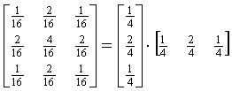
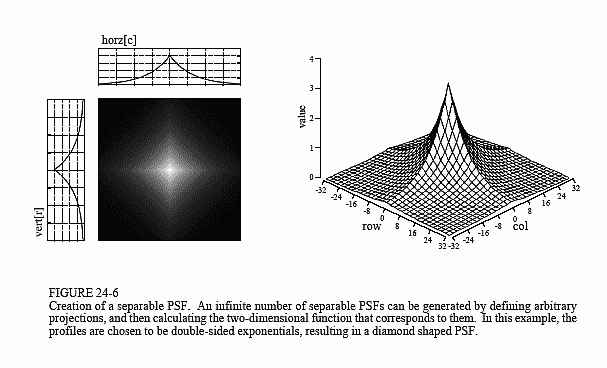
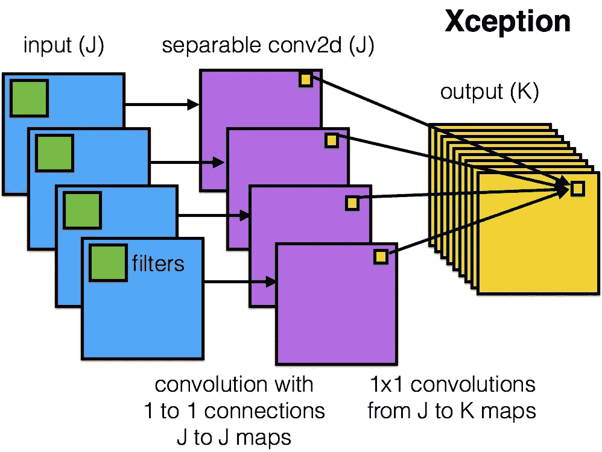

# 可分离卷积——用很小的精度换取巨大的计算增益

> 原文：<https://towardsdatascience.com/separable-convolutions-trading-little-accuracy-for-huge-computational-gains-77650add059?source=collection_archive---------25----------------------->

通常在卷积中，我们使用 2D 或 3D 内核滤波器，我们希望每个滤波器通过分别在所有 2 维或 3 维中卷积来提取某种特征。特别是在 2D 的情况下，我们试图在初始层提取简单的特征，在后面的层提取更复杂的特征。然而，如果我们愿意，我们可以将一个 2D 核分解成两个 1D 核，如下所示。

Separability Example

现在，我们可以把这两个 1D 核一个接一个地应用在一个图像上，而不是应用原始的 2D 核。通过这样做，我们实际上减少了用于卷积的参数数量，现在可以训练的参数更少了。此外，我们使用这些可分离的内核过滤器的顺序通常并不重要。客观地说，一个 5x5 内核过滤器有 25 个参数，而两个内核，一个 1x5 内核和一个 5x1 内核只有 10 个参数。

当然，参数的减少意味着我们可能不得不在我们学习的特征的复杂性上妥协。但是，如果你看下面的图片，你可以看到两个 1D 内核可以很容易地学习简单的功能，一个 2D 内核试图学习。并且，如果你试着想象这两个 1D 内核(如下所示)，你可以看到它们应该能够以相当的准确度学习任何接近复杂的特征。在该图中，我们在左侧可视化了 1D 核“horz[c]”和“vert[r]”的权重，而右侧的图像显示了一个接一个地应用两个 1D 核所获得的最终权重的 3d 图。

Visualizing Separable Filters

这些可分离的卷积层通常可以非常有效和毫不费力地学习图像中简单到接近复杂的特征。因此，从直觉上来说，与尝试捕获复杂得多的要素的最终图层相比，在尝试捕获简单要素的初始图层中更多地使用这些可分离图层是有意义的。

我们也可以把这看作是调整我们网络的一种方式，其中我们试图只保留网络中真正独立的参数。通过这种方式，我们可以利用在每一层学习到的强大特征集来提高模型的计算效率。此外，通过尝试卷积和学习每个维度中的特征，可分离卷积尝试学习每个维度中的更多抽象特征。在某种程度上，它更侧重于在独立的个体维度中找到好的特征，然后最终将它们组合在一起，以最少的参数提取复杂的特征。

深度方向卷积是可分卷积的特例。在深度方向卷积中，我们首先使用 2D 滤波器(具有第三维的大小= 1)在 X 和 Y 维度上进行空间卷积，然后使用 1×1 滤波器在 Z 维度上进行信道方向卷积。下图显示了深度方向卷积在异常网络中的应用。

Xception Network

你可以在标题为“[可分卷积基础介绍](/a-basic-introduction-to-separable-convolutions-b99ec3102728)”的文章中读到更多关于可分卷积的内容。如果你想要更多关于可分卷积的形式证明，你也可以参考[这里的](http://www.songho.ca/dsp/convolution/convolution2d_separable.html)更多关于 2D 可分卷积的数学证明，并有例子支持。