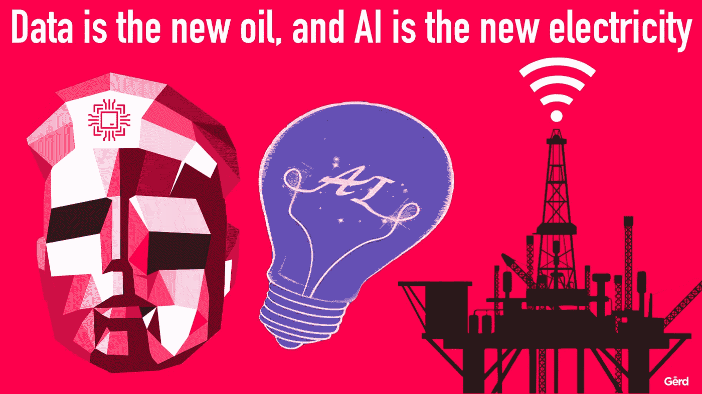
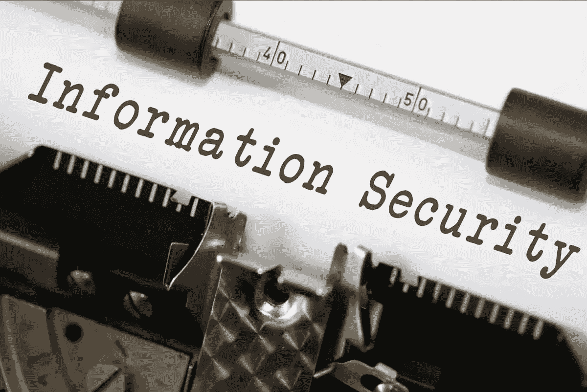
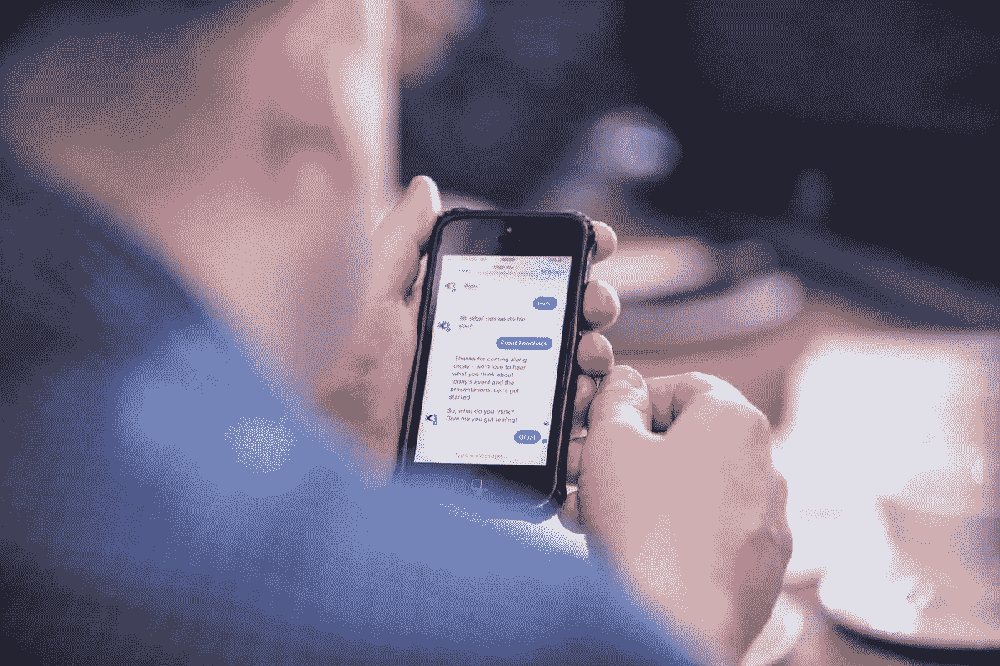
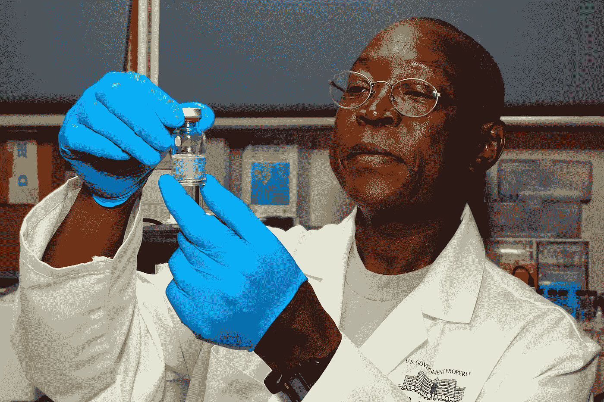

# 区分牛排和咝咝声——在人工智能/人工智能领域，什么是“真实”的，什么是炒作

> 原文：<https://towardsdatascience.com/separating-the-steak-from-the-sizzle-whats-real-and-what-s-hype-in-ai-ml-edd4acd0d287?source=collection_archive---------12----------------------->

人工智能(AI)和机器学习(ML)的世界近年来蓬勃发展，为寻求改善消费者体验的公司拓展了商业解决方案。随着深度神经网络和情感识别的进步，行业正在改善我们交流、创建内容和分析数据的方式。WorkFusion 已经在行业中取得了长足的进步，[提高了人工智能在商业世界中的极限](https://blog.workfusion.com/you-asked-we-answered-5-top-questions-about-the-future-of-enterprise-ai-1e5dfa93b4ff)。

然而，人工智能和人工智能的其他领域最近受到了大量的炒作，尽管它们仍处于早期阶段。虽然使用生成性对抗网络(GAN)改善网络安全的前景已经显示出一些希望，但该技术仍需数年才能开花结果。

这里有两个人工智能领域被夸大了，还有两个领域是真正的问题。

**1)甘在信息安全**

信息安全专家一直在探索 GAN 如何提高我们的在线安全，并取得了一些令人鼓舞的成果。新泽西斯蒂文斯理工学院和纽约理工学院[的研究人员已经开发出使用 GANs 猜测密码](https://www.darkreading.com/analytics/passgan-password-cracking-using-machine-learning/d/d-id/1329964)的方法。

该小组开发了一个实验，通过其名为“PassGan”的密码猜测技术来查看泄露密码的数据，并发现该软件能够从这些帐户中猜出 47%的密码，这一比例高于 HashCat 和 John the Ripper 等竞争算法。这一发现是 GANs 的核心，GANs 本质上是一种神经网络，可以模拟任何数据分布，并提供与数据对应的输出。

来自纽约理工学院的 Paolo Gasti 将这项技术比作素描艺术家和试图揭开嫌疑人身份的目击者。从本质上来说，GANs 可以通过目击者的反馈不断完善嫌疑人的形象，理论上输出一个几乎相同的嫌疑人形象。

然而，[康奈尔大学的一项研究](https://arxiv.org/abs/1711.10337)发现，这些“机器人艺术家”仍然需要大量的微调，才能在图像、音乐、语音和散文的开发和分析中得到更广泛的应用。该小组发现，在开发这些算法的过程中缺乏系统和客观的评估指标，需要做更多的工作，以便以可承受的价格提供一致的数据输出。

**2。更好地理解自然语言的细微差别**

当[谈到自动语音系统](https://www.inc.com/james-paine/5-ai-trends-to-know-in-2018.html)和其他接受语音命令的计算机程序时，这些软件的设计仍然存在一个缺陷，使得这些算法很难准确理解这个人在说什么。尽管如此，开发人员已经在这一领域取得了一些进展，深度学习神经网络可以更准确地区分不同的语音和口音。

在未来的一年里，更多的企业将扩展他们的客户服务聊天机器人和其他理解自然语言命令的商业应用程序。这些机器人在理解人类语言方面也变得更加细致入微，并以更加连贯和全面的方式回应他们的查询，减少了消费者与这些机器人互动的时间和精力。

这一举措进一步代表了机器人流程自动化(RPA)在人工智能中的越来越多的使用及其推动行业前进的能力，正如 WorkFusion 必须提供的服务[的情况一样。](https://blog.workfusion.com/you-asked-we-answered-top-5-questions-on-combining-rpa-and-ai-fc54ad651d6c)

**3。药物发现中的人工智能**

阿斯利康的研究人员写了一篇论文，讨论了通过使用递归神经网络和强化学习，使用人工智能来生成新分子。虽然该论文通过使用直方图、小提琴图和 t-SNE 图包含了数量惊人的可视化数据，但在其报告中有一个明显的遗漏。

该公司的所有测量都是通过比较人工智能生成的分子和自然分子来进行的，但他们未能测量人工智能生成的分子之间的距离。哈佛大学的一项研究也存在同样的缺乏辨别能力的问题，因为人工智能生成的分子并不相互比较。

这一遗漏意味着 AI 在生成新颖分子方面的作用还有很长的路要走。

**4。解决精神健康问题的聊天机器人**

虽然这个想法看起来有些牵强，但你可能很快就会有一个机器人顾问。人工智能在开发聊天机器人方面取得了一些进展，这些机器人可以识别一个人何时变得激动、沮丧或愤怒，并做出相应的调整。这项技术可以帮助提高客户服务能力和其他商业解决方案。

它还可能对改变精神健康治疗有很大帮助，因为这些顾问机器人不会有情绪偏见，同时还能回忆起你与他们互动的每个细节。一个名为 Karim 的心理治疗聊天机器人已经开始发挥作用，治疗患有 PTSD 和其他疾病的患者。这项技术也降低了精神健康治疗的成本。

**底线…**

人工智能和人工智能技术在过去几年里取得了长足的进步，将传统的商业实践转变为能够简化工作流程、提高公司投资回报率和节省管理费用的先进解决方案。尽管像信息安全(infosec)的甘(GAN)这样的技术已经显示出作为机器人艺术家的前景，但它们仍有很长的路要走。

在药物发现中使用人工智能是同一条船上的，产生了一些令人鼓舞的结果，但距离在医疗保健行业广泛采用还有几年时间。与此同时，聊天机器人和语音助手在区分语音命令的声音细微差别方面变得越来越有能力，同时还可以为客户和精神健康患者提供虚拟援助。

这是一个激动人心的时刻，因为这个行业正在不断重新定义我们的工作方式、沟通方式以及为各种规模的公司开发智能商业解决方案。