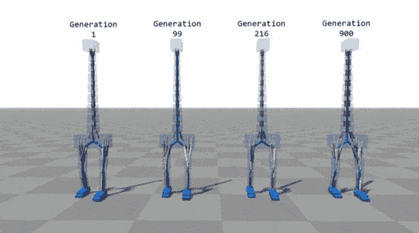

# 伯克利 RISECamp:大规模部署深度分布式人工智能

> 原文：<https://towardsdatascience.com/september-7-and-8-2017-marked-the-first-ever-risecamp-at-uc-berkeley-499df29267af?source=collection_archive---------5----------------------->

2017 年 9 月 7 日和 8 日标志着加州大学伯克利分校有史以来第一次 RISECamp。RISECamp 是一个为期两天的训练营，重点是分享来自 RISELab 的工作。缩写 RISE 在实验室的[网站上有解释](https://rise.cs.berkeley.edu/) :
**安全执行的实时智能**

RISELab 和著名的 amp lab(Apache Spark 的诞生地)之间的一个巨大差异是，重点从批处理转移到大规模实时决策。这种转变标志着学术界和工业界如何接近最先进的机器学习系统的趋势。虽然批处理适用于各种各样的问题，但实时决策系统能够在新的观察结果流入系统时进行即时学习。这些类型的系统也向真正的人工智能系统迈进了一步，而不是应用根据新观察结果离线训练的模型。

除了专注于构建能够做出实时决策的系统(利用强化学习)，该营地还解决了许多试图大规模集成高级人工智能系统的组织所面临的其他挑战。这些挑战包括跨机器集群轻松分发代码、管理数据沿袭和治理、提供大规模预测，以及在构建依赖于敏感数据的高级系统时所需的固有安全性。

营地分为五个主要部分，分别应对这些挑战。在这篇文章中，我将总结这些章节的内容，并解释在夏令营期间在 RISELab 中构建的工具。

# 涵盖的主题

1.强化学习
2。预测发球:按比例计分
3。易开发性:让 ML 对非 CS 来说变得容易
4。在上下文中使用数据
5。安全:物联网授权——安全

## RISECamp 堆栈

如果你做过任何类型的机器学习工作，那么这些话题应该会引起你的共鸣。来自学术界和工业界的一些最大的开源项目正在解决这些问题。虽然许多现有技术试图解决这些问题，但 RISELab 开发了一系列技术，可以一起使用来创建部署人工智能系统的端到端解决方案。

RISECamp 堆栈:

*   [Ray](https://rise.cs.berkeley.edu/projects/ray/) :用现有代码扩展 RL 和 ML 算法进行分发
*   [削波器](https://rise.cs.berkeley.edu/projects/clipper/):预测发球；支持多种框架。水平可伸缩。实时决策的在线评分。
*   [PyWren](https://rise.cs.berkeley.edu/projects/pywren/) :无服务器架构；python api 无需管理集群
*   [地面](https://rise.cs.berkeley.edu/projects/ground/):数据上下文服务
*   [浪潮](https://rise.cs.berkeley.edu/projects/wave/):使用区块链的去中心化授权，聚焦物联网设备

## 强化学习

在更详细地讨论这些组件之前，我将提供一个关于强化学习的简短背景，以及它与更多监督和非监督学习方法的比较。

**监督学习**

这可以说是最流行的机器学习形式，因此它提供了一个很好的比较基础。监督学习用于解决现有数据中已知一些基本事实的问题。用于这类问题的数据将具有某种可被识别为“目标”的属性。对于一个老生常谈的经典例子，为了让监督学习系统预测贷款申请人是否应该获得贷款，历史数据需要一个字段来指示借款人是否偿还了贷款或违约。我们可以将此转化为一个二元分类问题，根据历史数据和“目标”标签，我们预测新的申请人是否会偿还贷款或违约。监督学习通常分为两大类——“分类”和“回归”。分类是当预测的目标是离散值(如偿还贷款或违约)时使用的术语。另一方面，回归问题试图预测一个连续值的目标(例如，预测房屋的价格)。

**无监督学习**

与监督学习相比，非监督学习没有基础事实。这意味着对于所有的历史数据，没有与手头问题相关的可用标签。无监督学习的一个主要例子是一种叫做聚类的技术。聚类的工作原理是获取数据并将数据分组/聚类/分段成组，这些组通过适合数据集的聚类算法计算为相似的组。这方面的一个具体例子是获取企业客户的所有历史数据，并根据他们行为的某些方面将他们分组。

**强化学习**

虽然强化学习(RL)是机器学习中一种独特的第三种方法，但它更接近于有监督的学习，而不是无监督的学习。尽管可能相似，但 RL 侧重于顺序决策，不像传统的监督学习那样针对单个时间点做出决策。一个常见的 RL 应用是机器人，其中代理与其环境进行交互，并需要实时做出决策。许多用于重复任务(例如在制造过程中)的机器人不需要强化学习，因为它们可以被显式编程来处理它们的任务，因为它们工作的环境极其有限。当机器人(在 RL 术语中:` agent `)具有变化的环境或需要在没有明确编程的情况下对任务做出决策时，强化学习在机器人学中大放异彩。为了将这种类型的用例更正式地构建为强化学习问题，我们需要定义一些核心概念。

*   代理人:要么是一个模拟的演员，比如电子游戏中的对手，要么是一个物理设备，比如机器人或自动驾驶汽车
*   **状态**:对代理在任意时间点所处环境的描述。这种描述取决于系统中提供给代理的输入。
*   **动作**:在评估状态后，动作就是代理决定要做的事情。基于代理能够控制的内容来定义操作的范围。在自动驾驶汽车的例子中，这可以是加速度的量和车轮应该转动的程度
*   奖励:RL 问题的这个组成部分是它与监督学习更紧密联系的部分。然后，根据代理采取的行动将奖励输入系统。回到自动驾驶汽车，奖励可以基于安全、平稳驾驶，或者在合理的时间内到达目的地(我们希望三者都达到)。
*   环境:这是代理运行的世界。对于视频游戏中的模拟代理，这由游戏中强加的约束组成，这些约束规定哪些动作是可能的。在自动驾驶汽车的例子中，这是真实的世界，其中环境是汽车将要行驶的街道。



RL in action

有人可能会说，既然奖励是已知的，我们就有了基础事实，强化学习问题可以用监督学习技术来处理。虽然监督学习可以取得一些成功，但它在用新的训练数据实时更新模型方面存在不足。

持续学习是机器学习的另一个子集，它在观察值被错误分类时更新模型；它会随着时间的推移更新模型以提高性能。持续学习在决策方面也有不足之处，因为有时在做出许多其他决策之前，一个分数不能被理解为成功或失败。这方面的一个例子是一个代理人在玩国际象棋(或围棋)游戏，在知道最终标签(比赛的输赢)之前必须做出许多决定。解决符合这一模型的问题的最佳方法是强化学习，因为它调整所有决策的概率，而不是单个决策的概率。

## 光线

Ray 使得在一个机器集群上分发 Python 函数变得非常容易。这是通过使用 Ray Python 包来修饰函数或类，允许它们使用非常简单的语法并行执行来实现的。

来自 [Ray 教程](https://github.com/ucbrise/risecamp/tree/master/ray/tutorial)的一个例子展示了如何将一个现有的 Python 函数转换成一个在集群上并行运行的函数:

```
 # A regular Python function.def regular_function():
 return 1# A Ray remote function.
[@ray](http://twitter.com/ray).remote
def remote_function():
 return 1 
```

“remote_function()”前的“ [@ray](http://twitter.com/ray) .remote”装饰符使其能够以允许并行处理的特殊方式被调用。调用此函数以并行方式运行使用以下语法:

```
 for _ in range(4):
 remote_function.remote()
```

就是这样！通过在函数名后调用`. remote()'，函数将由范围(或列表)中的每一项并行执行，而不是顺序执行。这是一个没有参数的非常简单的函数，但是如果需要任何参数，它们会在“remote()”中传递，就像在不使用 Ray 的情况下调用“remote_function()”一样。

这涵盖了如何在集群中的核心或节点之间分配函数，使用 Ray 也可以很容易地从这个函数中获得返回值。以下代码片段也来自 Ray 教程，显示了传统函数返回和 Ray 远程函数返回的比较:

```
 >>> regular_function()
1>>> remote_function.remote()
ObjectID(1c80d6937802cd7786ad25e50caf2f023c95e350)>>> ray.get(remote_function.remote())
1 
```

这个简单的例子展示了一个远程函数返回一个对象(Python 的未来)。为了将其转换为实际值，对返回的对象使用简单的“ray.get()”调用来获得实际值。

这只是触及了 Ray 提供的东西的表面；但是它应该会引发一些关于这个库可以处理的潜在用例的想法。在 RISECamp 的上下文中，Ray 被用作工具，以并行方式处理任意数量的代理上的模拟强化学习策略，以加速模拟。许多其他用例，如超参数优化，也可以很容易地从使用像 Ray 这样的分布式处理系统中受益。

## 快速帆船

所以你用 Ray 模拟了一个给定 RL 问题的很多策略，找到了最优策略；现在怎么办？这是机器学习的一个古老问题，其中模型是由数据科学家建立的，需要找到一种进入生产环境的方法，以便为系统/应用程序/组织带来真正的价值。这是一个即使是先进的数据科学团队也会因为许多原因而陷入困境的领域。Clipper 提供了一个部署模型的框架，该框架由任何流行的开源机器学习库创建，可以以低延迟提供预测。查看 [Clipper](https://github.com/ucbrise/clipper) 的资源库，获取快速入门指南。

Clipper 的发展有点早，但是它有一个非常强大的方法来应对模型服务的挑战。IBM 开发了一款名为沃森机器学习的产品来应对这一挑战。Watson Machine Learning 提供了一个统一的界面，可以通过代码或 UI 驱动该界面来部署来自多个框架(SPSS、SparkML、Scikit-Learn 等)的模型。).通过使用单一工具来部署任何类型的模型，数据科学家可以灵活地使用他们想要的任何机器学习库，应用程序开发人员可以轻松地选择这些模型，以便轻松地嵌入到系统和应用程序中，进行实时决策。

## 鹩哥

就像我们在 Ray 中看到的那样，有许多用例，数据科学家需要将他们的过程分布在许多机器上。PyWren 是来自 RISELab 的另一个 Python 包，它专注于这个问题，考虑了不同的方法和目标。与 Ray 不同的是，PyWren 选择了无服务器架构，将 Python 函数推送到 AWS Lambda 上执行。PyWren 提供了一个用于 Lambda 的通用容器，它拥有最流行的数据科学 Python 库，无需额外定制。与 Ray 类似，PyWren 以一种非常简洁的方式实现了这一点，可以很容易地集成到现有的 Python 代码库中。

要查看它的运行情况，请看来自 [PyWren 教程](https://github.com/ucbrise/risecamp/tree/master/pywren)的代码片段:

```
 import pywrendef square(param):
 return param * paramparam_list = [0, 1, 2, 3, 4, 5, 6, 7, 8, 9]pwex = pywren.default_executor()
futures = pwex.map(square, param_list)
results_with_pywren_map = [f.result() for f in futures]
```

如果您在 Python 中使用过' map()'，那么这个语法应该非常熟悉。传统“映射”和鹪鹩“映射”的区别在于，鹪鹩将函数映射到任意数量的 Lambdas 上。这为可以并行运行的分布式操作提供了一个经济高效且可水平扩展的解决方案。

因为这个代码示例很简单，所以我将更详细地介绍一个具体的用例。如今，许多数据团队利用云对象存储或亚马逊 S3 等块存储来存储数据集。团队可以将这些对象存储服务用于不同的目的，但是一个常见的模式是将容器/桶视为一个接收器，新的数据集作为一些数据管道的一部分写入其中。随着这些文件数量的增加，对每个文件应用一个函数可能是一个缓慢的过程。特别是如果使用类似循环的东西来迭代所有文件，从而线性地应用该函数。PyWren 通过利用 AWS Lambda 将函数清晰地映射到给定容器/桶中的所有文件，在这个用例中大放异彩。PyWren 使用非常简单的语法触发 Lambda 为每个文件应用普通的 python 函数。

## 地面

到目前为止，我已经介绍了机器学习的许多方面，但是还没有描述如何处理最核心的部分:数据。这就是[地](https://github.com/ucbrise/risecamp/tree/master/ground)在 RISELab 中发挥作用的地方。背景的介绍性解释提供了数据背景的基础知识:

**地面数据上下文基础知识**

-[A]应用上下文:描述如何解释原始位以供使用。
-【B】行为背景:关于真实的人或系统如何创建和使用数据的信息。
-【C】change Over Time:另外两种形式的数据上下文的版本历史。

通过考虑对数据管理很重要的不同上下文，Ground 提供了管理大型数据目录所需的完整视图。

## 波浪

最后但同样重要的是，RISELab 堆栈的组件解决了处理物联网设备的安全性和授权的挑战:Wave。

Wave 是最超出我专业范围的组件，但也是我认为最令人印象深刻的组件。我假设有相关性:-)。Wave 提供了一种新的方法，为基于名称空间、公钥和区块链的设备控制提供授权。如果你没有从这个博客中获得任何其他东西，请接受这个时髦的总结:我们正在使用云来训练区块链授权的深度强化学习人工智能系统。从 RISECamp 这里看一下[波练习](https://github.com/ucbrise/risecamp/tree/master/wave)。

总之，RISECamp 是一次令人惊叹的经历，与会者很幸运地看到了来自加州大学伯克利分校的下一代开源项目。RISELab 能够以模块化和互补的方式针对机器学习工程师面临的一些最常见的挑战，这给我留下了非常深刻的印象。我非常期待跟踪这里描述的每个项目，我鼓励你也这样做。