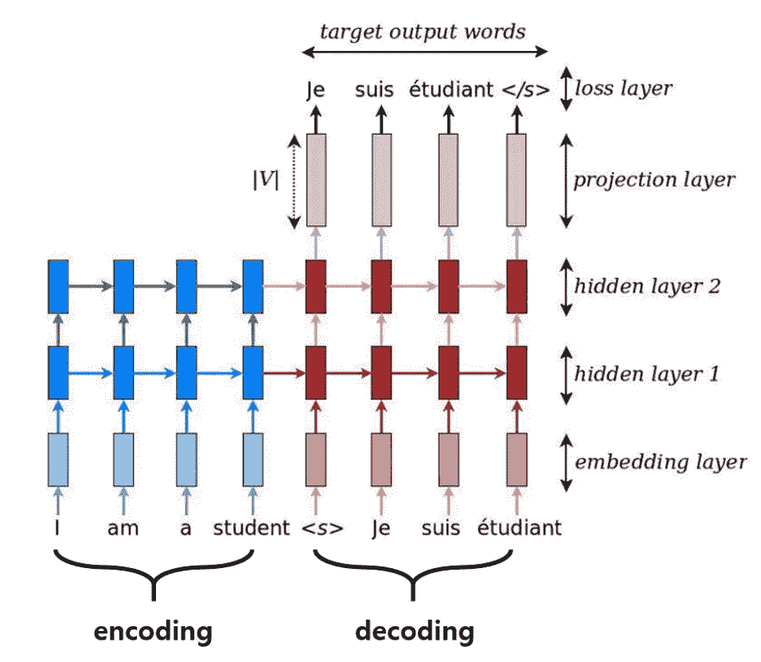
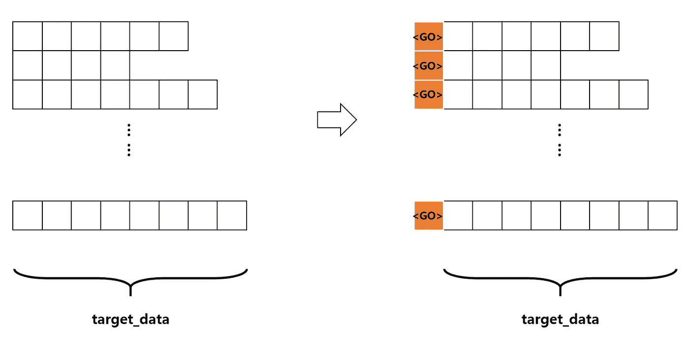
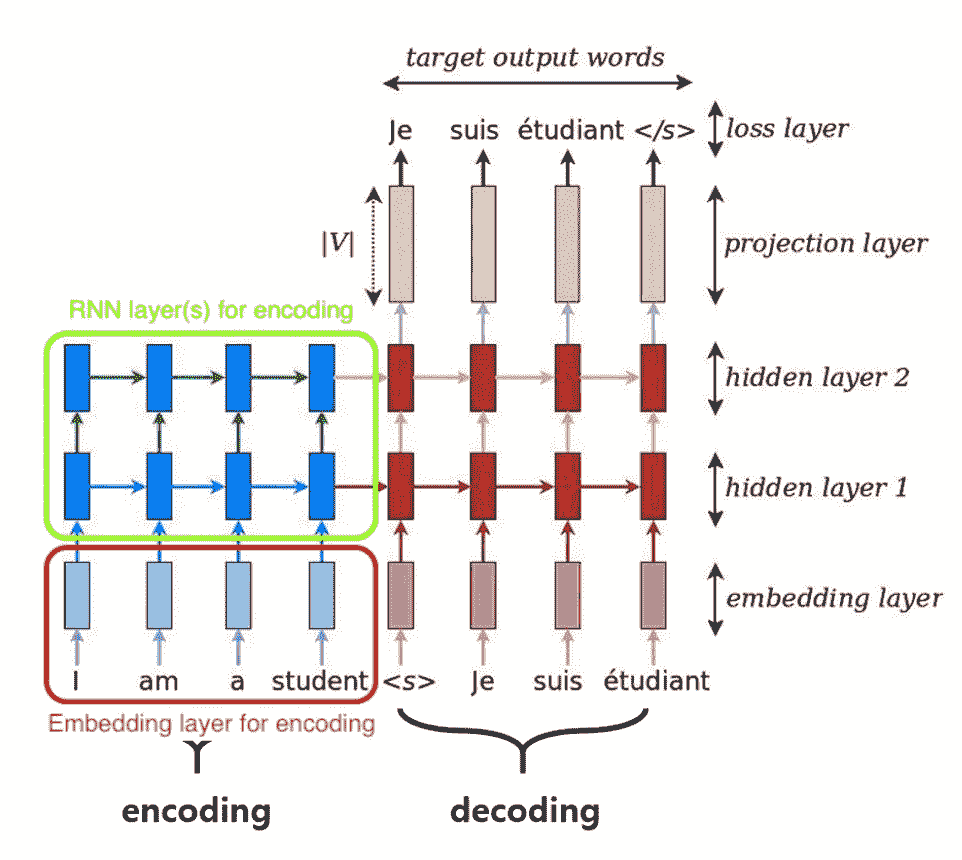
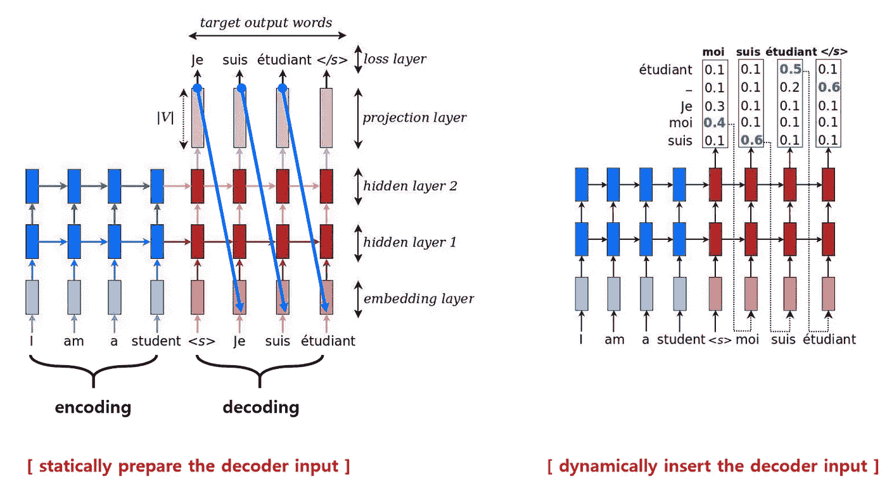
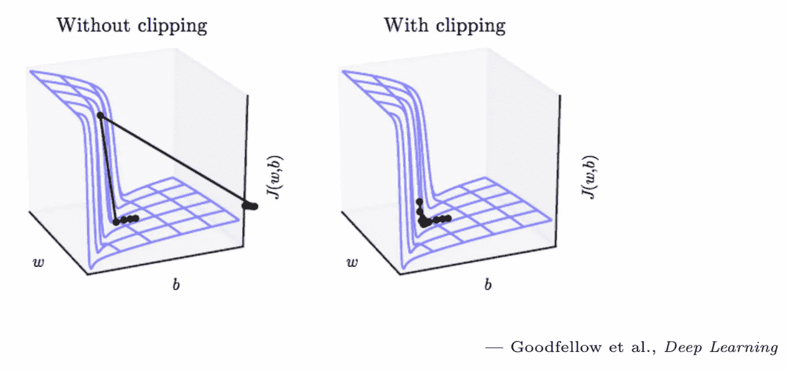

# 张量流中的 Seq2Seq 模型

> 原文：<https://towardsdatascience.com/seq2seq-model-in-tensorflow-ec0c557e560f?source=collection_archive---------1----------------------->

Photo by [Marcus dePaula](https://unsplash.com/@marcusdepaula?utm_source=medium&utm_medium=referral) on [Unsplash](https://unsplash.com?utm_source=medium&utm_medium=referral)

在这个项目中，我将在 TensorFlow 中建立一个名为`**seq2seq model or encoder-decoder model**`的语言翻译模型。该模型的目标是将英语句子翻译成法语句子。我将展示详细的步骤，他们将回答像`how to define encoder model`、`how to define decoder model`、`how to build the entire seq2seq model`、`how to calculate the loss and clip gradients`这样的问题。

请访问 [**Github repo**](https://github.com/deep-diver/EN-FR-MLT-tensorflow) 了解 Jupyter 笔记本中更详细的信息和实际代码。它将涵盖更多的主题，如`how to preprocess the dataset`、`how to define inputs`和`how to train and get prediction`。

这是 Udacity 深度学习纳米学位的一部分。一些代码/功能(保存、加载、测量精度等)由 Udacity 提供。然而，大部分是我自己实现的，每一节都有更丰富的解释和参考。此外，基础数字(关于模型)借用自 [Luong (2016)](https://github.com/lmthang/thesis) 。

# 构建 Seq2Seq 模型的步骤

您可以将整个模型分成两个小的子模型。第一个子模型称为**【E】*****编码器*** ，第二个子模型称为**【D】*****解码器*** 。就像任何其他 RNN 架构一样，接受原始输入文本数据。最后，**【E】**输出一个神经表示。这是一个非常典型的工作，但是你需要注意这个输出到底是什么。**【E】**的输出将成为**【D】**的输入数据。

这就是为什么我们称**【E】**为*编码器*，称**【D】**为*解码器*。**【E】**做出一个以神经表征形式编码的输出，我们不知道它到底是什么。它被加密了。**【D】**具有查看**【E】**输出内部的能力，它将创建一个完全不同的输出数据(在本例中翻译成法语)。

为了建立这样一个模型，总共有 6 个步骤。我注意到要实现的功能与每个步骤相关。

**(1)定义编码器模型的输入参数**

*   `enc_dec_model_inputs`

**(2)建立编码器模型**

*   `encoding_layer`

**(3)定义解码器模型的输入参数**

*   `enc_dec_model_inputs`、`process_decoder_input`、`decoding_layer`

**(4)为训练建立解码器模型**

*   `decoding_layer_train`

**(5)建立用于推理的解码器模型**

*   `decoding_layer_infer`

**(6)将(4)和(5)放在一起**

*   `decoding_layer`

**(7)连接编码器和解码器型号**

*   `seq2seq_model`

**(8)定义损失函数、优化器，并应用梯度剪切**

**Fig 1\. Neural Machine Translation / Training Phase**

# 编码器输入(1)、(3)

`enc_dec_model_inputs`函数创建并返回与建筑模型相关的参数(TF 占位符)。

输入占位符将输入英文句子数据，其形状为`[None, None]`。第一个`None`表示批量大小，批量大小未知，因为用户可以设置。第二个`None`表示句子的长度。setence 的最大长度因批次而异，因此无法用确切的数字进行设置。

*   一种选择是将每批中所有句子的长度设置为最大长度。无论您选择哪种方法，您都需要在空位置添加特殊字符`<PAD>`。然而，对于后一种选择，可能会有不必要的更多`<PAD>`字符。

targets 占位符类似于 inputs 占位符，只是它将输入法语句子数据。

target_sequence_length 占位符表示每个句子的长度，所以形状是`None`，一个列张量，与批量大小相同。这个特定的值需要作为 TrainerHelper 的参数，以建立用于训练的解码器模型。我们将在(4)中看到。

max_target_len 获取所有目标句子(序列)长度的最大值。如你所知，我们在 target_sequence_length 参数中有所有句子的长度。从中获取最大值的方法是使用 [tf.reduce_max](https://www.tensorflow.org/api_docs/python/tf/reduce_max) 。

# 过程解码器输入(3)

在解码器端，我们需要两种不同的输入，分别用于训练和推理。在训练阶段，输入作为目标标签被提供，但是它们仍然需要被嵌入。然而，在推理阶段，每个时间步的输出将是下一个时间步的输入。它们也需要被嵌入，并且嵌入向量应该在两个不同的相位之间共享。

**Fig 2\.** `**<GO>**` **insertion**

在本节中，我将为训练阶段预处理目标标签数据。这不是什么特别的任务。你所需要做的就是在所有目标数据前面加上`<GO>`特殊标记。`<GO>` token 是一种引导性的 token，比如说“这是翻译的开始”。对于这个过程，你需要知道 TensorFlow 的三个库。

[**TF _ slide**](https://www.tensorflow.org/api_docs/python/tf/strided_slice)

*   提取张量的步长切片(广义 python 数组索引)。
*   可以认为是分裂成多个张量与跨度窗口大小从开始到结束
*   参数:TF 张量，开始，结束，步幅

[**TF 填充**](https://www.tensorflow.org/api_docs/python/tf/concat)

*   创建一个用标量值填充的张量。
*   参数:TF 张量(必须是 int32/int64)，要填充的值

[**TF concat**](https://www.tensorflow.org/api_docs/python/tf/fill)

*   沿一维连接张量。
*   参数:一个 TF 张量列表(本例中为 tf.fill 和 after_slice)，axis=1

对目标标签数据进行预处理后，我们会在后面实现 decoding_layer 函数时嵌入。

# 编码(2)

**Fig 3\. Encoding model highlighted — Embedding/RNN layers**

如图 3 所示，编码模型由两个不同的部分组成。第一部分是嵌入层。一个句子中的每个单词将由指定为`encoding_embedding_size`的特征数量来表示。这一层赋予了单词[有用解释](https://stackoverflow.com/questions/40784656/tf-contrib-layers-embed-sequence-is-for-what/44280918#44280918)更丰富的代表力。第二部分是 RNN 层。你可以利用任何种类的 RNN 相关技术或算法。例如，在这个项目中，多个 LSTM 单元在漏失技术应用后堆叠在一起。你可以使用不同种类的 RNN 细胞，如 GRU

**嵌入层**

*   [TF contrib . layers . embed _ sequence](https://www.tensorflow.org/api_docs/python/tf/contrib/layers/embed_sequence)

**RNN 层层**

*   [TF contrib . rnn . lstmcell](https://www.tensorflow.org/api_docs/python/tf/contrib/rnn/LSTMCell)
    :简单指定它有多少个内部单元
*   [TF contrib . rnn . drop out wrapper](https://www.tensorflow.org/api_docs/python/tf/contrib/rnn/DropoutWrapper)
    :用 keep 概率值包装单元格
*   [TF contrib . rnn . multirnncell](https://www.tensorflow.org/api_docs/python/tf/contrib/rnn/MultiRNNCell)
    :堆叠多个 rnn(类型)单元格
    : [这个 API 是如何使用的？](https://github.com/tensorflow/tensorflow/blob/6947f65a374ebf29e74bb71e36fd82760056d82c/tensorflow/docs_src/tutorials/recurrent.md#stacking-multiple-lstms)

**编码模式**

*   [TF nn.dynamic_rnn](https://www.tensorflow.org/api_docs/python/tf/nn/dynamic_rnn)
    :将嵌入图层和 rnn 图层放在一起

# 解码—训练过程(4)

解码模型可以被认为是两个独立的过程，训练和推理。这不是因为它们具有不同的架构，而是因为它们共享相同的架构及其参数。这是因为他们有不同的策略来支持共享模型。对于这个(训练)和下一个(推断)部分，图 4 清楚地显示了它们是什么。

**Fig 4\. Decoder shifted inputs**

当编码器使用[TF contrib . layers . embed _ sequence](https://www.tensorflow.org/api_docs/python/tf/contrib/layers/embed_sequence)时，它不适用于解码器，即使它可能要求其输入嵌入。这是因为相同的嵌入向量应该通过训练和推断阶段共享。[TF contrib . layers . embed _ sequence](https://www.tensorflow.org/api_docs/python/tf/contrib/layers/embed_sequence)运行前只能嵌入准备好的数据集。推理过程需要的是动态嵌入能力。在运行模型之前，不可能嵌入推理过程的输出，因为当前时间步的输出将是下一个时间步的输入。

我们如何嵌入？我们很快就会看到。然而，现在，你需要记住的是训练和推理过程共享相同的嵌入参数。对于训练部分，应该交付嵌入的输入。在推理部分，应该只传送训练部分中使用的嵌入参数。

先看训练部分。

*   `[**tf.contrib.seq2seq.TrainingHelper**](https://www.tensorflow.org/api_docs/python/tf/contrib/seq2seq/TrainingHelper)`:training helper 是我们传递嵌入输入的地方。顾名思义，这只是一个助手实例。这个实例应该交付给 BasicDecoder，这是构建解码器模型的实际过程。
*   `[**tf.contrib.seq2seq.BasicDecoder**](https://www.tensorflow.org/api_docs/python/tf/contrib/seq2seq/BasicDecoder)`:basic decoder 构建解码器模型。这意味着它连接解码器端的 RNN 层和由 TrainingHelper 准备的输入。
*   `[**tf.contrib.seq2seq.dynamic_decode**](https://www.tensorflow.org/api_docs/python/tf/contrib/seq2seq/dynamic_decode)`:dynamic _ decode 展开解码器模型，以便 BasicDecoder 可以检索每个时间步长的实际预测。

# 解码——推理过程(5)

*   `[**tf.contrib.seq2seq.GreedyEmbeddingHelper**](https://www.tensorflow.org/api_docs/python/tf/contrib/seq2seq/GreedyEmbeddingHelper)`:greedyembedinghelper 动态获取当前步骤的输出，并将其交给下一个时间步骤的输入。为了动态地嵌入每个输入结果，应该提供嵌入参数(只是一串权重值)。与此同时，GreedyEmbeddingHelper 要求提供与批量和`end_of_sequence_id`相同数量的`start_of_sequence_id`。
*   `[**tf.contrib.seq2seq.BasicDecoder**](https://www.tensorflow.org/api_docs/python/tf/contrib/seq2seq/BasicDecoder)`:同培训流程一节所述
*   `[**tf.contrib.seq2seq.dynamic_decode**](https://www.tensorflow.org/api_docs/python/tf/contrib/seq2seq/dynamic_decode)` **:** 同培训流程一节所述

# 构建解码层(3)、(6)

**嵌入目标序列**

*   [TF contrib . layers . embed _ sequence](https://www.tensorflow.org/api_docs/python/tf/contrib/layers/embed_sequence)创建了嵌入参数的内部表示，因此我们无法查看或检索它。相反，你需要通过 [TF 变量](https://www.tensorflow.org/api_docs/python/tf/Variable)手动创建一个嵌入参数。
*   手动创建的嵌入参数用于训练阶段，以在训练运行前通过 [TF nn.embedding_lookup](https://www.tensorflow.org/api_docs/python/tf/nn/embedding_lookup) 转换提供的目标数据(句子序列)。[手动创建嵌入参数的 TF nn.embedding_lookup](https://www.tensorflow.org/api_docs/python/tf/nn/embedding_lookup) 返回与[TF contrib . layers . embed _ sequence](https://www.tensorflow.org/api_docs/python/tf/contrib/layers/embed_sequence)类似的结果。对于推理过程，每当解码器计算当前时间步的输出时，它将被共享的嵌入参数嵌入，并成为下一个时间步的输入。你只需要提供嵌入参数给 GreedyEmbeddingHelper，那么它会帮助这个过程。
*   [embedding _ lookup 如何工作？](https://stackoverflow.com/questions/34870614/what-does-tf-nn-embedding-lookup-function-do)
    :简而言之，选择指定的行
*   注意:请小心设置变量范围。如前所述，参数/变量在训练和推理过程之间共享。共享可以通过 [tf.variable_scope](https://www.tensorflow.org/api_docs/python/tf/variable_scope) 指定。

**构建解码器 RNN 层**

*   如图 3 和图 4 所示，解码器模型中的 RNN 层数必须等于编码器模型中的 RNN 层数。

创建一个输出层，将解码器的输出映射到我们的词汇表中的元素

*   这只是一个完全连接的层，以获得每个单词在最后出现的概率。

# 构建 Seq2Seq 模型(7)

在本节中，将之前定义的函数、`encoding_layer`、`process_decoder_input`和`decoding_layer`放在一起，构建一个完整的序列到序列模型。

# 构建图形+定义损失，优化器，带梯度剪裁

`seq2seq_model`功能创建模型。它定义了前馈和反向传播应该如何流动。该模型可训练的最后一步是决定和应用使用什么优化算法。在本节中，[TF contrib . seq 2 seq . sequence _ loss](https://www.tensorflow.org/api_docs/python/tf/contrib/seq2seq/sequence_loss)用于计算损失，然后 [TF train。AdamOptimizer](https://www.tensorflow.org/api_docs/python/tf/train/AdamOptimizer) 用于计算损耗的梯度下降。让我们在下面的代码单元中检查每个步骤。

**从检查点加载数据**

*   (source_int_text，target_int_text)是输入数据，而(source_vocab_to_int，target_vocab_to_int)是用于查找每个单词的索引号的词典。
*   max_target_sentence_length 是源输入数据中最长句子的长度。在解码器模式下构建推理过程时，这将用于 GreedyEmbeddingHelper。

**创建输入**

*   enc_dec_model_inputs 函数的输入(输入数据、目标、目标序列长度、最大目标序列长度)
*   超参数输入函数的输入(lr，keep_prob)

**构建 seq2seq 模型**

*   通过 seq2seq_model 函数建立模型。它将返回 train _ logits(计算损失的 logit)和 inference _ logits(来自预测的 logit)。

**成本函数**

*   [使用 TF contrib . seq 2 seq . sequence _ loss](https://www.tensorflow.org/api_docs/python/tf/contrib/seq2seq/sequence_loss)。这个损失函数只是一个加权的 softmax 交叉熵损失函数，但它是特别设计用于时间序列模型(RNN)。权重应该作为一个参数明确提供，它可以由 [TF sequence_mask](https://www.tensorflow.org/api_docs/python/tf/sequence_mask) 创建。在这个项目中， [TF sequence_mask](https://www.tensorflow.org/api_docs/python/tf/sequence_mask) 创建[batch_size，max_target_sequence_length]大小的变量，然后马克斯只将第一个 target_sequence_length 元素的个数设为 1。这意味着零件的重量会比其他零件轻。

**优化器**

*   [TF 列车。使用 AdamOptimizer](https://www.tensorflow.org/api_docs/python/tf/train/AdamOptimizer) ，这是应该指定学习率的地方。你也可以选择其他算法，这只是一个选择。

**渐变裁剪**

**Fig 5\. Gradient Clipping**

*   由于递归神经网络是臭名昭著的消失/爆炸梯度，梯度裁剪技术被认为是改善这一问题。
*   这个概念真的很简单。您决定阈值以保持梯度在某个边界内。在这个项目中，阈值的范围在-1 和 1 之间。
*   现在，您需要将这些概念性知识应用到张量流代码中。幸运的是，有这个 [TF 渐变裁剪的官方指南 How？](https://www.tensorflow.org/api_guides/python/train#Gradient_Clipping)。在 breif 中，您通过调用 [compute_gradients](https://www.tensorflow.org/api_docs/python/tf/train/Optimizer#compute_gradients) 从优化器手动获取梯度值，然后使用 [clip_by_value](https://www.tensorflow.org/api_docs/python/tf/clip_by_value) 操作梯度值。最后，您需要通过调用 [apply_gradients](https://www.tensorflow.org/api_docs/python/tf/train/Optimizer#apply_gradients) 将修改后的梯度放回到优化器中

# 关于我自己

我的深度学习背景是[uda city { Deep Learning N](https://www.udacity.com/course/deep-learning-nanodegree--nd101)D&[AI-nd](https://www.udacity.com/course/ai-artificial-intelligence-nanodegree--nd898)with contentrations([CV](https://www.udacity.com/course/computer-vision-nanodegree--nd891)， [NLP](https://www.udacity.com/course/natural-language-processing-nanodegree--nd892) ，VUI)}，[Coursera Deep Learning . AI Specialization](https://www.coursera.org/specializations/deep-learning)(AI-ND 被拆分成 4 个不同的部分，我是和之前版本的 ND 一起完成的)。还有，我目前正在服用 [Udacity 数据分析师 ND](https://www.udacity.com/course/data-analyst-nanodegree--nd002) ，目前已经完成 80%。