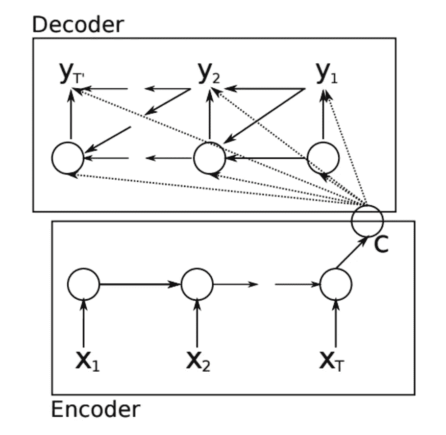

# 序列对序列学习

> 原文：<https://towardsdatascience.com/sequence-to-sequence-learning-e0709eb9482d?source=collection_archive---------4----------------------->

在**序列到序列学习**中，RNN 被训练将**输入序列映射到不一定长度相同的输出序列**。

**应用**是语音识别、机器翻译、图像字幕和问答。

# **架构**

Encoder — Decoder Architecture

**编码器 RNN** 读取输入序列并生成**固定大小的上下文向量**，该向量代表输入序列的语义摘要。

**固定大小的上下文向量**作为解码器 RNN 的输入。

**固定大小上下文**可以作为解码器 RNN 的**初始状态提供，或者可以在每个时间步长**连接到**隐藏单元。这两种方式也可以结合使用。**

**编码器和解码器中的时间步长数**不需要相等。

# 限制

这种体系结构的一个限制是很难用一个小维度的上下文向量来概括一个长序列。

## **如何解决？**

可以使用**可变长度的上下文向量**代替**固定大小的向量**。

**注意机制**可用于从输入序列的每个时间步长从编码器 RNN **产生矢量**序列。**解码器**学习有选择地关注矢量**，以在每个时间步长产生输出。**