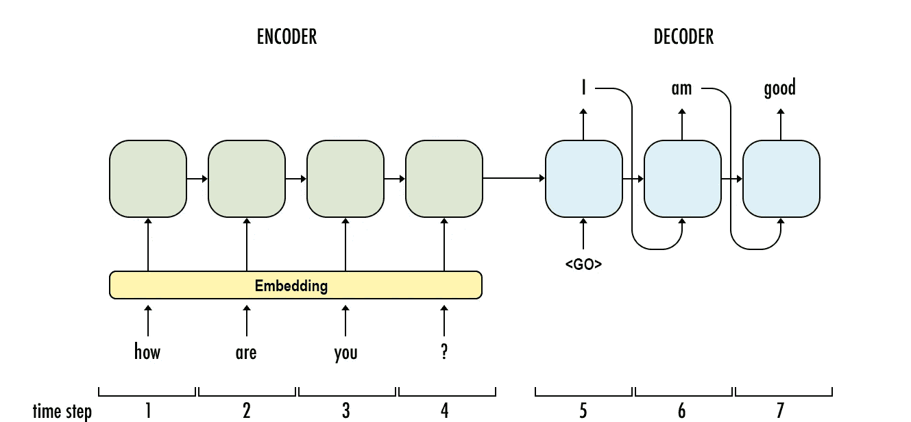

# 序列对序列模型:简介和概念

> 原文：<https://towardsdatascience.com/sequence-to-sequence-model-introduction-and-concepts-44d9b41cd42d?source=collection_archive---------1----------------------->

如果我们从高层次来看，seq2seq 模型的主要组件包括编码器、解码器和中间步骤:

我们使用嵌入，所以我们必须首先编译一个“词汇表”列表，包含我们希望我们的模型能够使用或读取的所有单词。模型输入必须是包含序列中单词 id 的张量。

然而，有四个符号需要我们的词汇来包含。Seq2seq 词汇表通常为这些元素保留前四个位置:

*   **< PAD >** :在训练过程中，我们需要将我们的例子批量地反馈给网络。这些批次中的输入都需要具有相同的宽度，以便网络进行计算。然而，我们的例子长度不同。这就是为什么我们需要填充较短的输入，使它们与批处理的宽度相同
*   **< EOS >** :这也是批处理的另一个必要性，但更多是在解码器端。它允许我们告诉解码器一个句子在哪里结束，也允许解码器在输出中指出同样的事情。
*   **<>**:如果你在真实数据上训练你的模型，你会发现你可以通过忽略那些在你的词汇表中出现频率不够高、不值得考虑的单词来极大地提高你的模型的资源效率。我们用< UNK >代替那些。
*   **< GO >** :这是解码器第一个时间步长的输入，让解码器知道什么时候开始产生输出。

注意:可以使用其他标签来表示这些功能。例如，我见过用~~和~~代替<go>和<eos>。因此，通过预处理和模型训练/推理，确保您使用的任何东西都是一致的。</eos></go>

为训练图准备输入稍微复杂一些，原因有两个:

> 1.如果我们向解码器提供我们的目标序列，而不管它的时间步长在训练运行中实际输出什么，这些模型会工作得更好。因此，与图中不同的是，我们不会在下一个时间步中将解码器的输出反馈给自身。

2.定量

最初的序列对序列论文之一 [Sutskever 等人 2014](https://arxiv.org/abs/1409.3215) 报告称，如果输入相反，模型性能会更好。所以你也可以选择颠倒单词在输入序列中的顺序。

在预处理过程中，我们执行以下操作:

*   我们建立自己的独特词汇库(并计算出现的次数)
*   我们用<unk>替换频率低的词</unk>
*   创建一个对话的副本，用 id 替换单词
*   我们可以选择现在将<go>和<eos>单词 id 添加到目标数据集，或者在训练时进行添加</eos></go>

学分:来自课堂讲稿:[https://classroom.udacity.com/nanodegrees/nd101/syllabus](https://classroom.udacity.com/nanodegrees/nd101/syllabus)

资源:

https://github.com/ematvey/tensorflow-seq2seq-tutorials