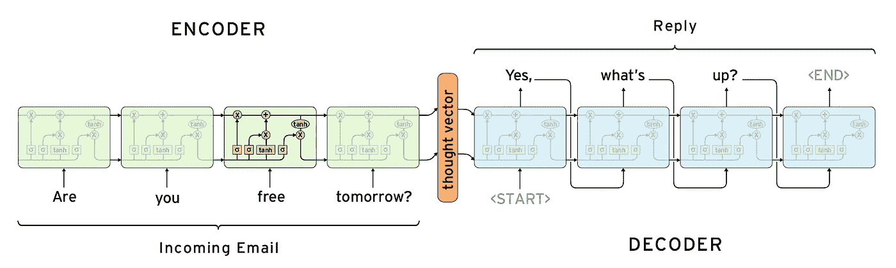

# 序列到序列教程

> 原文：<https://towardsdatascience.com/sequence-to-sequence-tutorial-4fde3ee798d8?source=collection_archive---------3----------------------->

这是深度学习中最强大的概念之一，它始于翻译，但后来转移到了问答系统(Siri、Cortana 等)。)、音频转录等。顾名思义，它对从一个序列转换到另一个序列很有用。

背后的主要思想是，它包含一个编码器 RNN (LSTM)和一个解码器 RNN。一个用来“理解”输入序列，解码器用来“解码”“思想向量”并构建输出序列。



Seq2Seq LSTMs

思想载体真正强大的地方在于，你可以插入输出解码器，将其转换成任何语言。也就是说，你不需要在英语到法语的数据集上训练来从英语转换到西班牙语。你可以简单地插入一个解码器，这个解码器是从一个不同的设备(比如葡萄牙语到西班牙语)预先训练好的。至少这是背后的理论。可能取决于你训练它的时间，你的数据量等等。

我发现 tensorflow 中缺少 seq2seq 模型背后的文档，所以我编写了自己的模型，如下所示。我在 Tensorflow 文档中找到的最接近的是`embedding_rnn_seq2seq`,然而，它在实现这个函数方面并不明显。因此，我写了自己的`seq2seq`模型如下:

```
*# Tensor where we will feed the data into graph*
inputs = tf.placeholder(tf.int32, (**None**, x_seq_length), 'inputs')
outputs = tf.placeholder(tf.int32, (**None**, **None**), 'output')
targets = tf.placeholder(tf.int32, (**None**, **None**), 'targets')

*# Embedding layers*
input_embedding = tf.Variable(tf.random_uniform((len(char2numX), embed_size), -1.0, 1.0), name='enc_embedding')
output_embedding = tf.Variable(tf.random_uniform((len(char2numY), embed_size), -1.0, 1.0), name='dec_embedding')
date_input_embed = tf.nn.embedding_lookup(input_embedding, inputs)
date_output_embed = tf.nn.embedding_lookup(output_embedding, outputs)

**with** tf.variable_scope("encoding") **as** encoding_scope:
    lstm_enc = tf.contrib.rnn.BasicLSTMCell(nodes)
    _, last_state = tf.nn.dynamic_rnn(lstm_enc, inputs=date_input_embed, dtype=tf.float32)

**with** tf.variable_scope("decoding") **as** decoding_scope:
    lstm_dec = tf.contrib.rnn.BasicLSTMCell(nodes)
    dec_outputs, _ = tf.nn.dynamic_rnn(lstm_dec, inputs=date_output_embed, initial_state=last_state)
*#connect outputs to* 
logits = tf.contrib.layers.fully_connected(dec_outputs, num_outputs=len(char2numY), activation_fn=**None**) 
**with** tf.name_scope("optimization"):
    *# Loss function*
    loss = tf.contrib.seq2seq.sequence_loss(logits, targets, tf.ones([batch_size, y_seq_length]))
    *# Optimizer*
    optimizer = tf.train.RMSPropOptimizer(1e-3).minimize(loss)
```

完整的教程可以在这个视频(和[代码](https://github.com/sachinruk/deepschool.io/tree/master/DL-Keras_Tensorflow)(第 19 课)如果你想跳过视频):

看这里是我的关于机器学习和深度学习的[课程](https://www.udemy.com/course/machine-learning-and-data-science-2021/?referralCode=E79228C7436D74315787)(使用代码 DEEPSCHOOL-MARCH 到 85 折)。