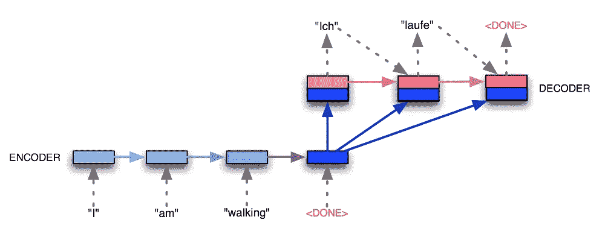
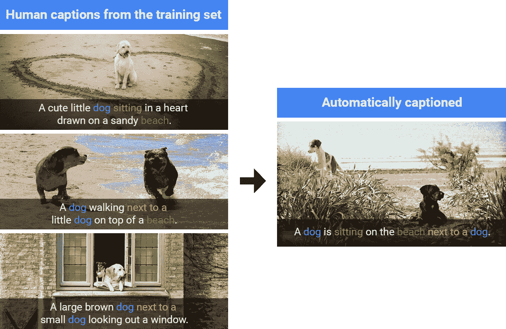

# 深度学习中序列对序列模型的熟悉

> 原文：<https://towardsdatascience.com/sequence-to-sequence-using-encoder-decoder-15e579c10a94?source=collection_archive---------9----------------------->

**序列到序列模型**是接受序列输入并输出序列的模型。

# **建筑**

Sequence to Sequence

**编码器** r 是一个 RNN，接收输入并将其编码成一个向量。

编码器的**最后隐藏状态**给出编码向量。

编码向量重复 n 次，其中**n =输出的时间步长数。**

**解码器**，也是 RNN，将**编码矢量**和**先前** **状态**作为输入，并给出输出。

## 编码器和解码器中的时间步长数不需要相等。

# **为什么是 Seq2seq？**

当你想在看到整个输入句子后生成输出时，可以使用 seq2seq 模型。

例如，在机器翻译中，翻译句子中的第一个单词可能取决于输入句子中的最后一个单词。

# **图像字幕**

在图像字幕中，生成图像的文本描述。

## **训练数据由带有相应标题的图像组成。**

编码器现在被卷积神经网络所取代。来自最后一个隐藏状态的输出被提供给解码器 RNN。