# 使用 Dask、Amazon ECS 和 Python 的分布式数据预处理(上)

> 原文：<https://towardsdatascience.com/serverless-distributed-data-pre-processing-using-dask-amazon-ecs-and-python-part-1-a6108c728cc4?source=collection_archive---------9----------------------->


Source: unsplash.com

机器学习模型的质量和准确性取决于许多因素。最关键的因素之一是在将数据集输入到从数据中学习的机器学习算法之前对数据集进行预处理。因此，为他们提供您想要解决的问题的正确数据是至关重要的。例如，一些算法不支持空值，应该在训练之前进行转换和处理。您还应该了解为什么会有缺失值，这些值是否有特定的模式，以及它们的影响是什么。

数据工程师和数据科学家经常使用来自 python 生态系统的工具，如 **Numpy** 和 **Pandas** 来分析、转换和可视化他们的数据，这些数据被设计为高性能、直观和高效的库。以快速和可伸缩的方式在小数据集上执行这样的操作并不困难，只要数据集能够适合单台机器的内存。然而，如果数据集太大，无法放入单台机器，数据工程师可能会被迫将他们的代码重写为更具可扩展性的工具，如 Spark 和 SparkML，这些工具可以由大型 EMR 集群提供计算支持。

为了克服这个问题，我使用了 [**Dask**](https://github.com/dask/dask) **。Dask** 利用了人们对像 **Pandas** 这样的著名库的熟悉，你可以用它来开发代码，以可伸缩、并行和分布式的方式处理数据。

在本文中，我将讨论如何创建一个无服务器集群，以分布式和并行的方式预处理数据。我还使用了 [**Dask 分布式**](https://github.com/dask/distributed) 集群，为分析和数据处理提供了高级并行性。为了实现大规模性能，同时优化成本并保持解决方案的灵活性，我将使用 [AWS Fargate](https://aws.amazon.com/fargate/) 构建一个无服务器集群，它不提供集群管理开销，只提供一个 API 调用来扩展和缩小集群，然后将集群与 Amazon SageMaker Jupyter 笔记本集成。(或任何其他首选 IDE)

# Dask 分布式是什么？

***dask . distributed****:*是一个轻量级的开源库，用于 Python 中的分布式计算。它还是一个集中管理的、分布式的、动态的任务调度器。Dask 有三个主要组成部分:

***dask-scheduler 进程:*** 协调几个工人的动作。调度器是异步的和事件驱动的，同时响应来自多个客户端的计算请求并跟踪多个工作进程。

***dask-worker 进程:*** 跨多台机器和多个客户端的并发请求。

***dask-客户端进程:*** 它是 dask.distributed 用户的主要入口点

# 解决方案图表:

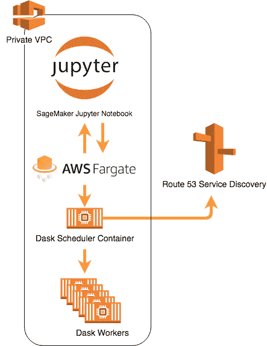

Solution Diagram and Architecture

我需要在 Juypter 笔记本和 Fargate 集群之间保持低延迟通信和简单的网络配置。因此，我在同一个虚拟私有云(VPC)中创建了笔记本和 Dask 分布式集群。

**预部署步骤:**

首先，作为先决条件，我需要创建一个弹性容器注册(ECR)存储库。为此，我转到 **AWS 控制台- >弹性容器服务(ECS) - >选择存储库，然后“创建存储库”。**

**(您也可以跳过这一步，创建一个 github 资源库)**

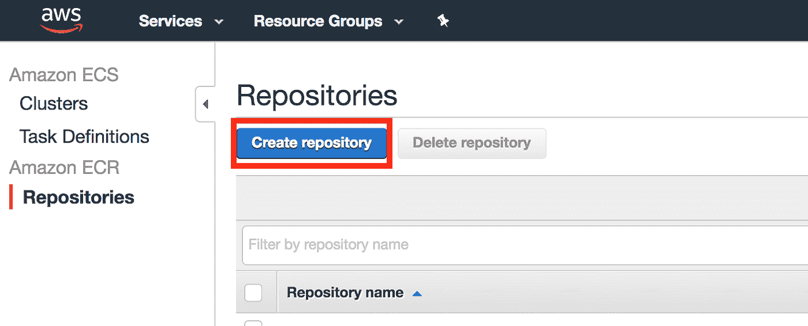

我们需要给它起一个名字——“**dask**，然后点击“**下一步**”:

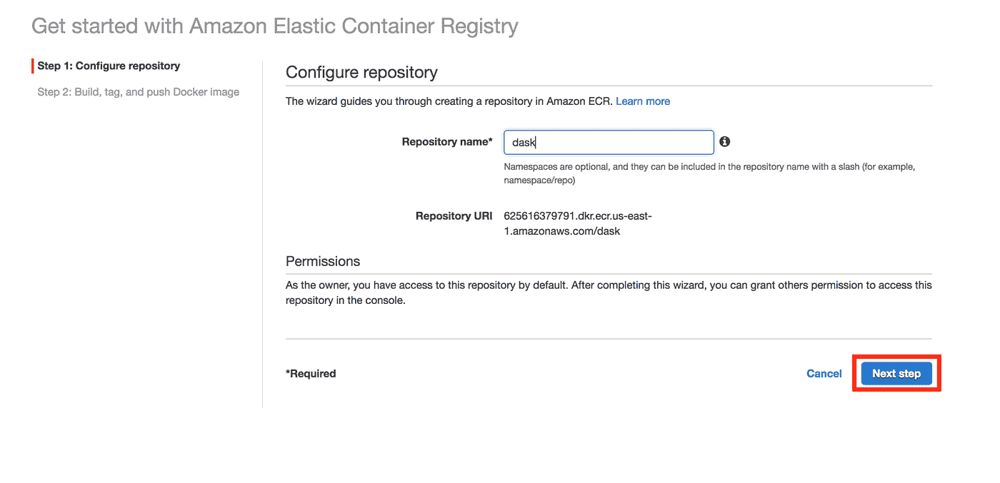

然后，我们转到“**入门**”页面，在这里我们可以找到创建和推送容器映像的初始命令。

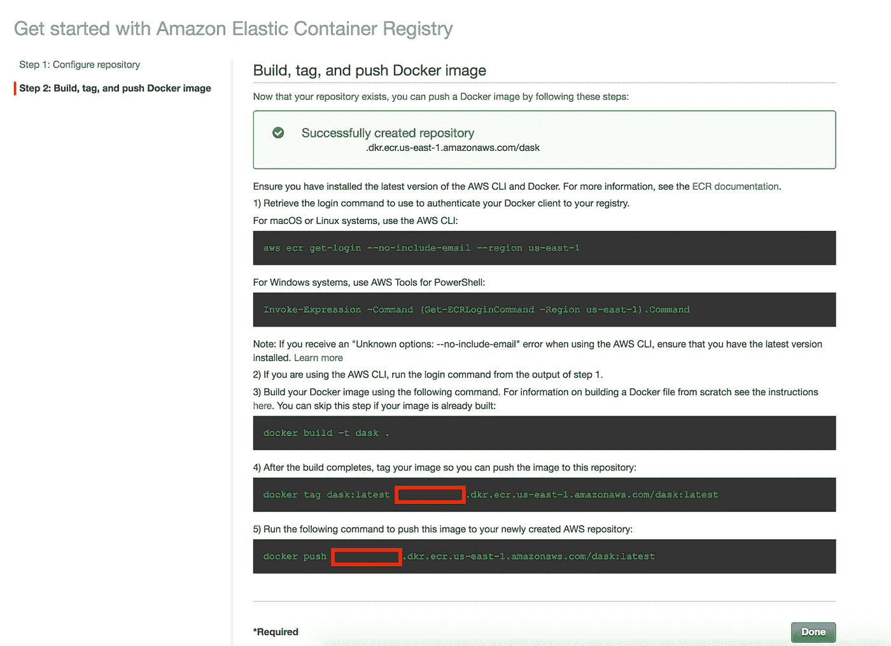

既然存储库已经准备好了，我将切换到一个 shell“终端”来下载、构建和标记容器映像，然后将其推送到 ECR。为此，我运行以下 shell 命令:

```
bash# git clone [https://github.com/wmlba/ECS-Dask.git](https://github.com/wmlba/ECS-Dask.git)bash# cd ECS-Dask; tar -xzf base-image.tar.gz; cd base-imagebash# `aws ecr get-login --no-include-email --region us-east-1`bash# docker build -t dask .bash# docker tag dask:latest <AWS Account ID>.dkr.ecr.us-east-1.amazonaws.com/dask:latestbash# docker push <AWS Account ID>.dkr.ecr.us-east-1.amazonaws.com/dask:latest
```

> **注意**:为了运行上述命令，您需要在运行命令的机器上本地安装 Docker，并配置 AWS 凭证。

我使用的 docker 图片是从 dask [库](https://github.com/dask/dask)上发布的图片稍微修改的

构建映像需要几分钟时间，然后将其推送到在前面的步骤中创建的 ECR 存储库。您可以通过在 ECS 控制台中单击存储库名称来验证这一点。

# 部署解决方案

现在我已经准备好了映像，我需要按照以下步骤使用 CloudFormation 模板部署解决方案:

1.  在你的账户中启动这个[云信息模板](https://github.com/wmlba/ECS-Dask/blob/master/dask-cluster.template)。完成云形成堆栈大约需要 3-5 分钟

CloudFormation 堆栈将为 Dask worker 和 Scheduler 创建资源，例如:Fargate 集群、任务定义、服务和任务。它还将创建一个 IAM 执行角色和策略，以允许访问 Elastic Container Registry (ECR)存储库和 CloudWatch 日志组的日志。默认情况下，所有资源都将在 **us-east-1** 区域创建。

2.在“指定详细信息”页面上，我为集群指定了一个带有 NAT 网关的专用子网。Dask 调度程序和工作程序将通过专用网络进行通信，ECS 服务只需要 **NAT 网关**就可以从存储库中提取 ECR 映像。然后，选择**下一步:**

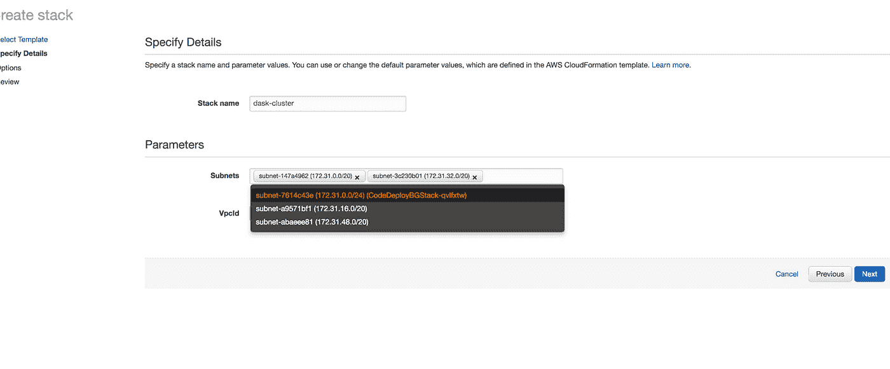

3.在**选项**页面上，选择下一步。

4.在**查看**页面上，查看并确认设置。确保选中该框，确认模板将创建具有自定义名称的 AWS 身份和访问管理(IAM)资源。要部署堆栈，选择**创建**。几分钟后，堆栈创建应该完成。

创建堆栈后，您还可以确认 ECS Dask 集群已部署并正在运行。您可以通过切换到 ECS 控制台->单击**群集** - >单击 **Fargate-Dask-Cluster** 来验证这一点，在 tasks 选项卡上，应该有两个正在运行的任务:

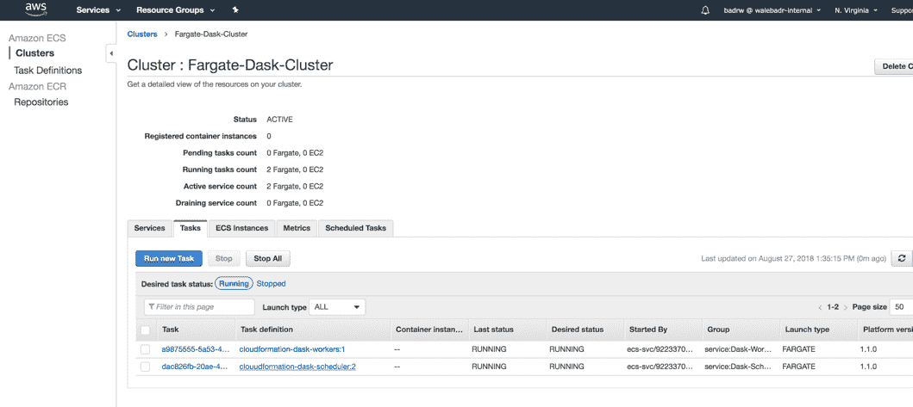

现在 Dask 集群已经准备好了，我将创建 SageMaker Notebook，这样我就可以开始使用集群了。为此，我切换到 SageMaker 控制台->笔记本实例->创建笔记本实例**。**

然后，我将选择之前在 CloudFormation 模板中选择的相同 VPC 和子网:

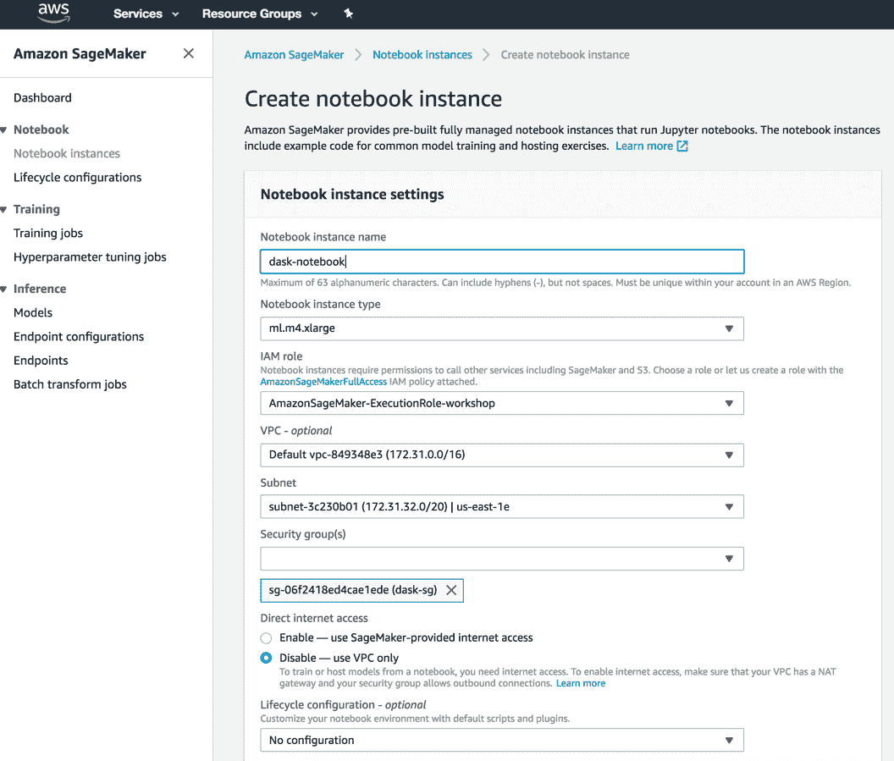

> **注意**:您可以选择任何其他子网和安全组，只要您启用 SageMaker 笔记本和 Dask 集群之间的访问。

然后，我通过点击**新建**->-conda _ python3 创建一个新的 python 3 笔记本。Dask 软件包默认安装在 SageMaker 笔记本上，但确保软件包更新到最新版本很重要。为了验证这一点，我将在笔记本上运行 conda update 命令:

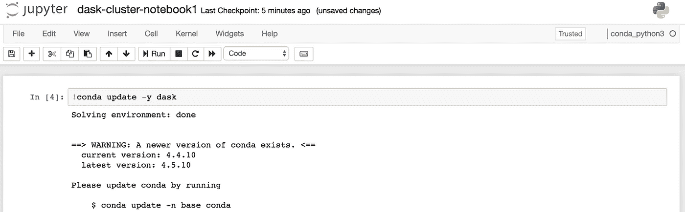

> **注意**:如果客户端版本低于调度器和工作器版本，您在启动客户端时会遇到错误。

下一步是创建客户端，并通过运行以下代码连接到 dask 集群:

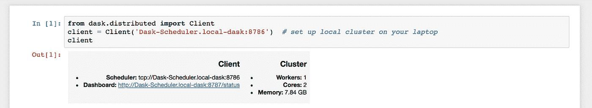

请注意，我使用了使用 [ECS 服务发现功能](https://docs.aws.amazon.com/AmazonECS/latest/developerguide/service-discovery.html)自动分配的**调度程序**的 DNS 名称，该功能使用 Route 53 自动命名 API 操作来管理 Route 53 DNS 条目

现在，让我们使用集群对数据执行一些操作，但在此之前，我会将集群中的工作线程数量增加到 7 个。为此，我在笔记本中运行如下命令:


几秒钟后，Fargate 控制台中的工作任务状态将为“正在运行”。我将重新启动 Dask 客户端，以确保我们利用了集群的并行性。

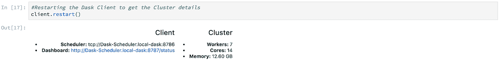

现在，我们有一个由 14 个 CPU 内核和 12 GB 内存组成的集群(7 个工作线程各有 2 个 CPU 内核和 2 GB 内存)。让我们做一些计算和内存密集型操作，并产生一些见解。我正在用数据加载 dask dataframe，计算行程距离，并根据乘客数量进行分组。

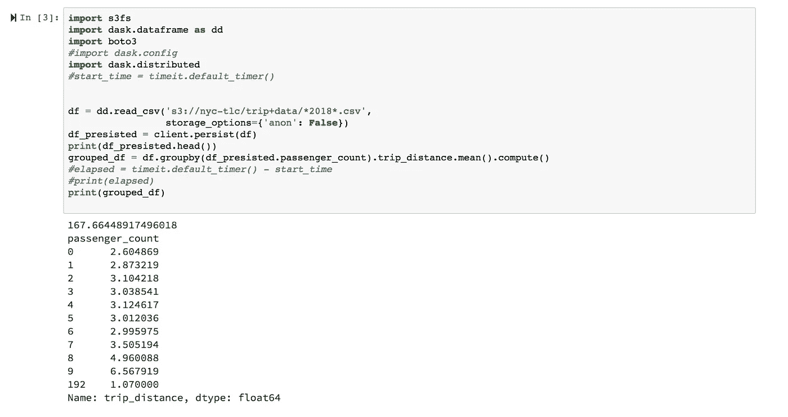

在 7 个不同的工作人员之间并行化任务并并行加载超过 10 GB 的数据后，大约 2.5 分钟后，结果开始显现。

**可视化:**

来自 Bokeh 服务器的调度器任务的屏幕截图，显示了在工人之间线程化的操作。可以在浏览器中从调度程序 IP 地址和端口 8787 访问仪表板:

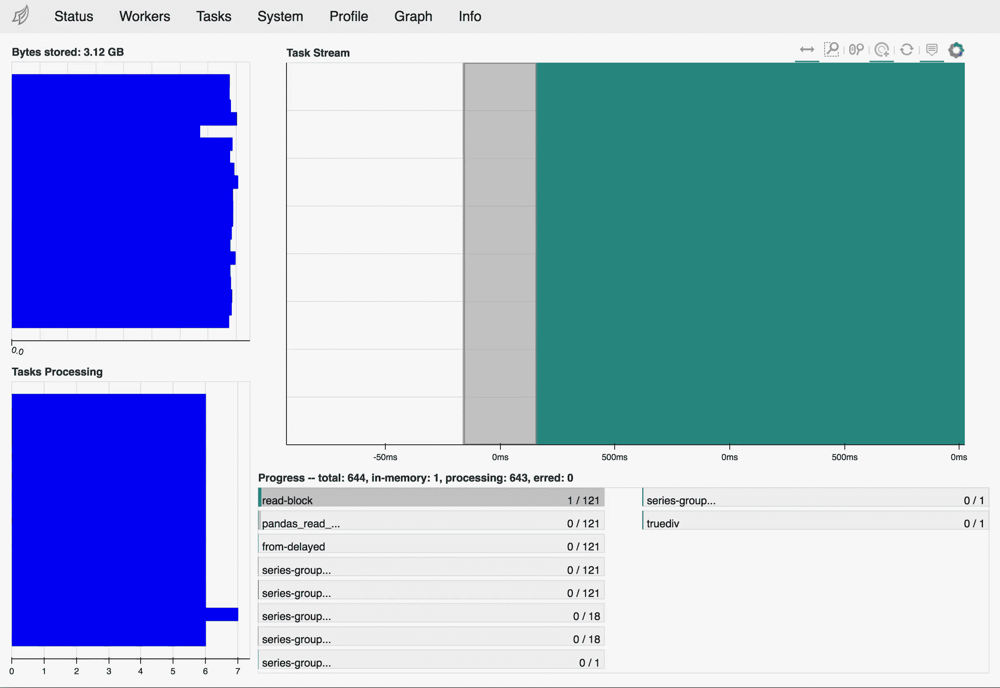

以下屏幕截图显示了每个工作人员的资源(CPU 和内存)利用率:

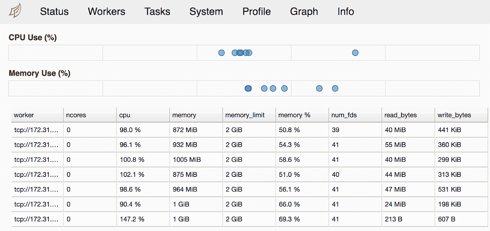

现在你应该准备好做一些预处理魔术！

[在第 2 部分](https://medium.com/@will.badr/serverless-distributed-data-pre-processing-using-dask-amazon-ecs-and-python-part-2-af14a1ac1b25)，我将展示一些使用我们创建的 Dask 集群运行分析和预处理/特征工程和机器学习的代码。

> 感谢您阅读帖子。反馈和建设性的批评总是受欢迎的。我会阅读你所有的评论。
> 
> 威尔