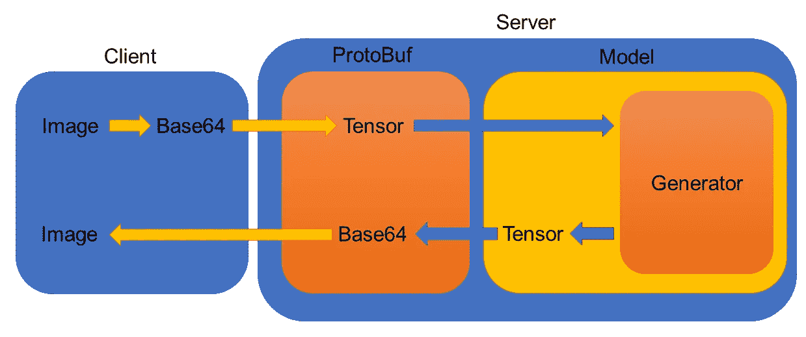
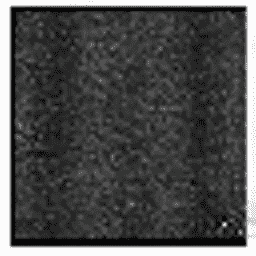

# 使用 TensorFlow-Serving 的 RESTful API 服务基于图像的深度学习模型

> 原文：<https://towardsdatascience.com/serving-image-based-deep-learning-models-with-tensorflow-servings-restful-api-d365c16a7dc4?source=collection_archive---------1----------------------->

## 如何在网络中提供端到端的 Tensorflow 模型？

TensorFlow-Serving 是一个有用的工具，由于它的新近性和相当小众的用例，它没有太多的在线教程。在这里，我将展示一个解决方案，演示 TensorFlow 的端到端实现——在基于图像的模型上提供服务，涵盖从将图像转换为 Base64 到将 TensorFlow 模型服务器与深度神经网络集成的所有内容。

在本教程中，提供了一个最小的工作示例——这个实现可以很容易地扩展到包括 Docker 容器、Bazel 构建、批量推理和模型解耦。这里的主要焦点是理解使用 TensorFlow-Serving 的一般要求，独立于任何可选的附加功能。使用 TensorFlow-Serving 的 RESTful 版本，与 gRPC 版本相反，我们实现了 predict 函数，但是也可以使用 classify 和 regression。

如果你想在 Jupyter 笔记本上查看这个教程，请[点击这里](https://github.com/tmlabonte/tendies/blob/master/minimum_working_example/tendies-basic-tutorial.ipynb)。

# 概观

在最基本的层面上，TensorFlow-Serving 允许开发人员将客户端请求和数据与独立于客户端系统的深度学习模型相集成。这样做的好处包括客户端能够对数据进行推断，而不必实际安装 TensorFlow，甚至不必与实际模型有任何联系，并且能够用一个模型实例为多个客户端提供服务。

我们的管道将是这样的:



特别要注意的是，图像必须作为一个 [Base64 编码的字符串](https://i.imgflip.com/2eot7o.jpg)从客户端传递到服务器。这是因为 JSON 没有其他方法来表示图像(除了张量的数组表示，这很快就会失控)。图像也必须作为张量从原型传递到生成器。这是可以修改的，但是最好保持任何预处理和后处理与模型本身分离。

# 计算机网络服务器

导出用于服务的 TensorFlow 模型可能是该过程中最令人困惑的部分，因为这涉及到几个步骤。

1.  将图形导出为 ProtoBuf 格式。这将保存 GraphDef 和变量，并表示训练好的模型。为了导出基于图像的模型，我们必须在图形的开头和结尾注入位串转换层，因为我们要求我们的推理函数只处理张量。
2.  将 ProtoBuf 包装在 SavedModel 中。这一步是必要的，因为 TensorFlow-Serving 的 RESTful API 是通过 SavedModelBuilder 实现的。我们将导入我们的 GraphDef，然后提取输入和输出的 TensorInfo 来定义我们的预测签名定义。

我们将使用 [CycleGAN](https://github.com/tmlabonte/CycleGAN-TensorFlow) 作为使用示例。首先，导入一些有用的库:

```
import tensorflow as tf
import argparse
import sys
sys.path.insert(0, “../CycleGAN-TensorFlow”)
import model
```

在这里，我们实例化一个 CycleGAN 并注入我们的第一层。

```
graph = tf.Graph()

**with** graph.as_default():
    *# Instantiate a CycleGAN*
    cycle_gan = model.CycleGAN(ngf=64, norm="instance", image_size=64)

    *# Create placeholder for image bitstring*
    *# This is the injection of the input bitstring layer*
    input_bytes = tf.placeholder(tf.string, shape=[], name="input_bytes")
```

接下来，我们将位串预处理为一个浮点张量批，以便它可以在模型中使用。

```
**with** graph.as_default(): 
    input_bytes = tf.reshape(input_bytes, [])

    *# Transform bitstring to uint8 tensor*
    input_tensor = tf.image.decode_png(input_bytes, channels=3)

    *# Convert to float32 tensor*
    input_tensor = tf.image.convert_image_dtype(input_tensor,  dtype=tf.float32)

    *# Ensure tensor has correct shape*
    input_tensor = tf.reshape(input_tensor, [64, 64, 3])

    *# CycleGAN's inference function accepts a batch of images*
    *# So expand the single tensor into a batch of 1*
    input_tensor = tf.expand_dims(input_tensor, 0)
```

然后，我们将张量输入模型并保存其输出。

```
**with** graph.as_default():
    *# Get style transferred tensor*
    output_tensor = cycle_gan.G.sample(input_tensor)
```

后推理，我们将浮点张量转换回一个位串。这是输出层的注入:

```
**with** graph.as_default():    
    *# Convert to uint8 tensor*
    output_tensor = tf.image.convert_image_dtype(output_tensor, tf.uint8)

    *# Remove the batch dimension*
    output_tensor = tf.squeeze(output_tensor, [0])

    *# Transform uint8 tensor to bitstring*
    output_bytes = tf.image.encode_png(output_tensor)
    output_bytes = tf.identity(output_bytes, name="output_bytes")

    *# Instantiate a Saver*
    saver = tf.train.Saver()
```

既然我们已经将位串层注入到我们的模型中，我们将加载我们的火车检查点并将图保存为 ProtoBuf。在对该服务器进行编码之前，我对 CycleGAN 进行了 10，000 步的训练，并将检查点文件保存在我的本地机器上，我将在该会话中访问该文件。

```
*# Start a TensorFlow session*
**with** tf.Session(graph=graph) **as** sess:
        sess.run(tf.global_variables_initializer())

        *# Access variables and weights from last checkpoint*
        latest_ckpt = tf.train.latest_checkpoint("../CycleGAN-TensorFlow/checkpoints/20180628-1208")
        saver.restore(sess, latest_ckpt)

        *# Export graph to ProtoBuf*
        output_graph_def = tf.graph_util.convert_variables_to_constants(sess, graph.as_graph_def(), [output_bytes.op.name])
        tf.train.write_graph(output_graph_def, "../CycleGAN-TensorFlow/protobufs", "model_v1", as_text=**False**)
```

至此，我们完成了第一步！在第二步中，我们将把 ProtoBuf 包装在一个 SavedModel 中，以使用 RESTful API。

```
*# Instantiate a SavedModelBuilder*
*# Note that the serve directory is REQUIRED to have a model version subdirectory*
builder = tf.saved_model.builder.SavedModelBuilder("serve/1")

*# Read in ProtoBuf file*
**with** tf.gfile.GFile("../CycleGAN-TensorFlow/protobufs/model_v1", "rb") **as** protobuf_file:
    graph_def = tf.GraphDef()
    graph_def.ParseFromString(protobuf_file.read())

*# Get input and output tensors from GraphDef*
*# These are our injected bitstring layers*
[inp, out] = tf.import_graph_def(graph_def, name="", return_elements=["input_bytes:0", "output_bytes:0"])
```

接下来，我们定义我们的签名定义，它期望模型的输入和输出的张量信息。当我们保存模型时，我们会得到一个“No assets”消息，但是这没关系，因为我们的图和变量已经保存在 ProtoBuf 中了。

```
*# Start a TensorFlow session with our saved graph*
**with** tf.Session(graph=out.graph) **as** sess:
        *# Signature_definition expects a batch*
        *# So we'll turn the output bitstring into a batch of 1 element*
        out = tf.expand_dims(out, 0)

        *# Build prototypes of input and output bitstrings*
        input_bytes = tf.saved_model.utils.build_tensor_info(inp)
        output_bytes = tf.saved_model.utils.build_tensor_info(out)

        *# Create signature for prediction*
        signature_definition = tf.saved_model.signature_def_utils.build_signature_def(
            inputs={"input_bytes": input_bytes},
            outputs={"output_bytes": output_bytes},
            method_name=tf.saved_model.signature_constants.PREDICT_METHOD_NAME)

        *# Add meta-information*
        builder.add_meta_graph_and_variables(
            sess, [tf.saved_model.tag_constants.SERVING],
            signature_def_map={
                tf.saved_model.signature_constants.
                DEFAULT_SERVING_SIGNATURE_DEF_KEY: signature_definition
            })

*# Create the SavedModel*
builder.save()
```

就是这样！命令行返回的是 SavedModel 的路径，它用于构建 TensorFlow 模型服务器。serve/1 中的“variables”文件夹将是空的，但这没关系，因为我们的变量已经保存在 ProtoBuf 中了。

截至 2018 年 7 月，Python 3 不支持 TensorFlow 服务，但[有人提出了解决方案](https://github.com/tensorflow/serving/issues/700)。安装 Python 3 TensorFlow 服务 API，包括:

```
pip install tensorflow-serving-api-python3
```

现在，我们可以用下面的命令从 bash 运行这个 TensorFlow 模型服务器:

```
tensorflow_model_server --rest_api_port=8501 --model_name=saved_model --model_base_path=$(path)
```

其中$(path)是服务器目录的路径。我的例子是/mnt/c/Users/Tyler/Desktop/tendies/minimum _ working _ example/serve。

# 客户

客户端的工作是接受图像作为输入，将其转换为 Base64，使用 JSON 将其传递给服务器，并解码响应。首先，导入一些有用的库:

```
**import** **base64**
**import** **requests**
**import** **json**
**import** **argparse**
```

我们将执行从高斯噪声图像到正弦噪声图像的风格转换。这是高斯图像:


首先，我们将打开图像并将其转换为 Base64。

```
*# Open and read image as bitstring*
input_image = open("images/gaussian.png", "rb").read()
print("Raw bitstring: " + str(input_image[:10]) + " ... " + str(input_image[-10:]))

*# Encode image in b64*
encoded_input_string = base64.b64encode(input_image)
input_string = encoded_input_string.decode("utf-8")
print("Base64 encoded string: " + input_string[:10] + " ... " + input_string[-10:])
```

发送到 TensorFlow 模型服务器的 JSON 数据必须以一种非常特殊的方式构建。这种方法将[略有不同](https://www.tensorflow.org/serving/api_rest)用于分类和回归。对于图像预测调用，我们的 JSON 主体必须如下所示:

```
{
  "instances": [
                  {"b64": "iVBORw"},
                  {"b64": "pT4rmN"},
                  {"b64": "w0KGg2"}
                 ]
}
```

因为我们只向服务器发送一张图片，所以这很简单。我们可以像这样创建 JSON 数据:

```
*# Wrap bitstring in JSON*
instance = [{"b64": input_string}]
data = json.dumps({"instances": instance})
print(data[:30] + " ... " + data[-10:])
```

这就是我们向 TensorFlow 模型服务器发送 POST 请求所需的全部内容。这是一个同步调用，所以客户端将暂停，直到它收到来自服务器的响应(当您想知道为什么您的代码在发布一个非常大的图像后停止时，这很有用)。

```
json_response = requests.post("http://localhost:8501/v1/models/saved_model:predict", data=data)
```

为了解释响应，我们以相反的顺序执行上述步骤。为了从 JSON 响应中获取 base64 编码的图像，我们必须访问:

1.  对应于响应字典中“预测”的值。
2.  结果数组中的第一个条目。
3.  结果字典中对应于“b64”的值。

然后，我们将把这个值解码成一个原始的位串。

```
*# Extract text from JSON*
response = json.loads(json_response.text)

*# Interpret bitstring output*
response_string = response["predictions"][0]["b64"]
print("Base64 encoded string: " + response_string[:10] + " ... " + response_string[-10:])

*# Decode bitstring*
encoded_response_string = response_string.encode("utf-8")
response_image = base64.b64decode(encoded_response_string)
print("Raw bitstring: " + str(response_image[:10]) + " ... " + str(response_image[-10:]))

*# Save inferred image*
**with** open("images/sinusoidal.png", "wb") **as** output_file:
    output_file.write(response_image)
```

成功！这是合成图像，它在我们的原始图像上添加了正弦噪声模式。



# 结论

感谢跟随本教程；希望对你有帮助！这款笔记本基于我的 TensorFlow 分布式图像服务库的最小工作示例，您可以在这里下载。如果您有兴趣将这个库与 TensorFlow 对象检测 API 甚至您自己的模型集成在一起，请查看本文的[续集。更多关于我的博文和信息，请访问我的](https://medium.com/@tmlabonte/integrating-tensorflow-distributed-image-serving-with-the-tensorflow-object-detection-api-5f62d80bce4c)[网站](https://tmlabonte.github.io)。