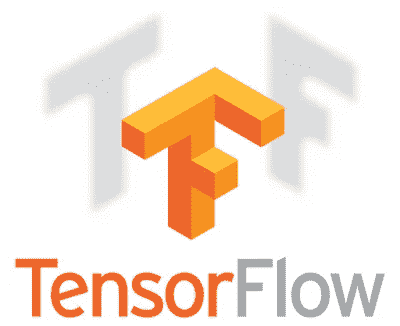
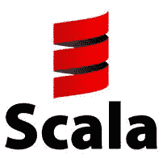

# Scala 中的服务张量流模型

> 原文：<https://towardsdatascience.com/serving-tensorflow-model-in-scala-6caeadbb2d55?source=collection_archive---------0----------------------->

Taken from [here](http://blog.kubernetes.io/2016/03/scaling-neural-network-image-classification-using-Kubernetes-with-TensorFlow-Serving.html)

Taken from [here](https://eng.trueaccord.com/2014/02/24/why-we-chose-scala/)

## 问题

训练机器学习模型的过程只是将其投入生产的第一步。在一天结束时，数据科学团队签署模型，数据工程团队必须找出如何在生产环境中部署、使用、更新和维护模型。关于如何做到这一点，有两种可能的方法:

*   通过 RPC/REST API 公开一个模型。在这种情况下，优势在于用于构建模型的语言/基础设施也可以用于服务 RPC/REST API。缺点是对模型的每个请求都是单独的 RPC 或 HTTP 调用，有自己的延迟。延迟对查询模型所用的平均时间设置了上限。
*   在生产环境中已经可用的数据工程管道中直接使用该模型。在这种情况下，不存在额外延迟的问题，但是，最好的数据处理引擎/框架似乎不支持用于模型训练的同一组语言。例如，典型的场景是当数据科学团队使用 Python/TensorFlow 构建模型时，数据工程团队必须将其集成到 Spark/Scala/Java 堆栈中。

我将关注第二个选项，并描述如何在 Scala 中使用预先训练好的 TensorFlow 模型构建一个库。TensorFlow 已经提供了 [Java API](https://www.tensorflow.org/api_docs/java/reference/org/tensorflow/package-summary) ，可以在 Scala 中直接引用和使用，但是非常低级和繁琐。

> 在[tfmodelserving 4s GitHub repo](https://github.com/stormy-ua/tfModelServing4s)中可以找到包含这里描述的示例的结果库。

## API 代数

无标签的最终方法是用来建立图书馆。更多细节可以在[这里](https://blog.scalac.io/exploring-tagless-final.html)和[这里](https://pchiusano.github.io/2014-05-20/scala-gadts.html)找到。这个想法是创建一个代数，它抽象了一个具体实现/解释器中使用的效果和类型。这个特征定义了 API 公开的一组操作:

F[_]是高级类型，表示具体实现使用的效果。这可能是未来的 Scalaz 任务，甚至是简单的尝试。trait 还定义了两种类型 TModel 和 TTensor。前者是一个模型类型，表示一个加载到内存中的模型，后者是一个张量类型。两种类型都必须由解释器来定义。此外，trait 定义了使用模型的几个基本操作:

*   load 用于从某个源(例如，从文件系统)加载模型。模型源是定义模型源的联产品类型:

*   元数据从加载的模型中查询模型元数据。它返回 ModelMetadata，依次枚举此图可用的签名列表。签名的概念是从 TensorFlow 借用的，它定义了一个由模型公开的函数。例如，预测模型可能会公开由其输入和输出张量定义的签名。当给定一个输入张量时，该函数产生一个输出张量，该输出张量根据输入属于特定类别的概率。如果一个图支持多个任务，它可能会公开多个签名。以下是 ModelMetadata、SignatureMetadata 和 TensorMetadata 事例类的定义:

*   张量函数从兼容的数据结构(如数组或列表)创建一个张量对象。如果为数据结构定义了隐式 TensorEncoder 类型类，则该数据结构是兼容的:

以下是 TensorEncoder 将二维数组转换为 TensorFlow API 张量对象的示例:

*   eval 是实际执行图形计算的函数。它需要一个模型对象、一个输出元数据和一个映射，输入张量元数据作为键，输入张量本身作为值。它返回包装成效果 F[_]的结果张量对象。该函数还需要 TensorDecoder 和 Tensor type 的 Closeable 类型类。TensorDecoder 将一个张量对象转换成数组、列表等数据结构形式的表示。：

需要可关闭的类型类来释放非托管对象。例如，TensorFlow API 对非托管对象 tensors 进行操作，当不再需要它们时，必须显式关闭它们，否则，它们将留在内存中，这可能会导致应用程序中的内存泄漏:

就是这样。API 已定义。下一步是为 TensorFlow 实现一个“解释器”。

## 张量流解释程序

TensorFlow 的解释器必须实现模型服务特性。我选择了 [scala.util.Try](http://www.scala-lang.org/api/2.9.3/scala/util/Try.html) 作为一个效果，这样所有的 API 函数都将返回打包到 Try 中的结果，并且为了便于理解，可以使用 scala 来编写 API 操作。下面是解释器的实现。它完成了与 TensorFlow Java API 交互的所有脏活:

此外，我们必须定义 TensorEncoder、TensorDecoder 和 Closeable 类型类:

只有一个字符串、一维和二维数组才有编码器和解码器。这是我执行几个示例并查看它是否有效所需的基本最小值。这可以扩展到任何其他兼容的数据类型。

## 使用示例#1

是时候用一个简单的例子来试试这个库了。首先，必须准备一个 TensorFlow 保存模型。对于这个例子，我使用了一个计算图，它简单地将一个矩阵乘以单位矩阵。根据单位矩阵的性质，输出矩阵应该等于输入矩阵。以下是构建图表并将其保存为 TensorFlow SavedModel 格式的 Python 代码:

它用单输入(' x ')和单输出(' y ')定义签名。生成的模型目录包含序列化图形以及变量快照:

Scala 代码将输入矩阵输入到模型中并获得结果矩阵:

下面是上面的应用程序产生的输出:

## 使用示例#2

第二个使用示例基于我在这里描述的如何构建[的狗品种分类模型](https://medium.com/towards-data-science/dog-breed-classification-hands-on-approach-b5e4f88c333e)。它拍摄了一张狗的图像，并产生了前 5 个品种的概率:

为样本狗图像生成的输出:

## 结论

构建了一个合理的 Scala 库来处理 TensorFlow 模型。它可以用于在任何 Scala/Java 应用程序(例如 Apache Spark)中使用预训练的张量流模型来执行分类、预测等。