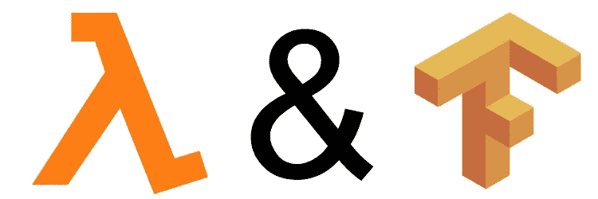
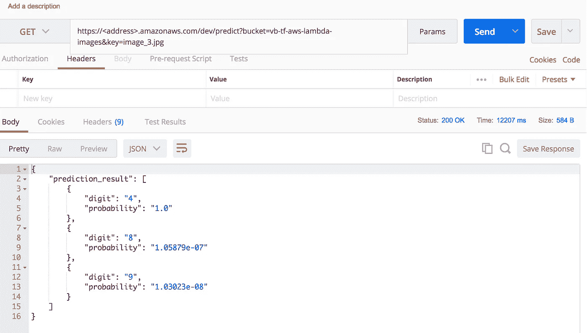

# 服务 TensorFlow 模型。无服务器

> 原文：<https://towardsdatascience.com/serving-tensorflow-models-serverless-6a39614094ff?source=collection_archive---------0----------------------->



之前我写过，[如何用 TensorFlow 服务模型](/how-to-deploy-machine-learning-models-with-tensorflow-part-1-make-your-model-ready-for-serving-776a14ec3198)或[用 Flask](https://becominghuman.ai/creating-restful-api-to-tensorflow-models-c5c57b692c10) 包装它以提供 REST API。也可以用 Flask 直接托管模型，这在许多用例中也是非常可行的。所有这些技术都有一个共性——你需要将应用程序放在一个容器中，由你的云提供商运行它，维护一个服务器，并负责扩展。我们有 Docker 和 Kubernetes 这样的工具让我们的生活变得更轻松，但最终，你会有一个耗费金钱和时间的基础设施。

几年前，AWS 引入了无服务器应用程序的新概念，你不需要服务器来托管你的应用程序，你只需要编写一个代码，它会被调用来响应一些事件——T4。目前，它支持 Node.js、Java、Python 和 C#作为编程语言。我们也有替代方案，比如[微软功能](https://azure.microsoft.com/en-us/services/functions/)和[谷歌云功能](https://cloud.google.com/functions/)，但微软只做 Python 的实验性支持，谷歌功能仍处于测试阶段。

# 无服务器，是什么？

我强烈推荐马丁·福勒的这篇关于无服务器架构的文章。我不能解释得更好了。简而言之，您完全依赖提供者服务来管理服务器逻辑和状态。当然，您编写一个后端代码，但是，与传统方法不同，您在无状态容器中运行它，并将它们的管理外包出去。

拥有无服务器应用程序的想法听起来很棒——您只需创建一个后端逻辑，AWS Lambda 将调用它来响应事件。例如，一个事件可以是 REST API 调用或在 S3 桶中写一些东西。然后使用提供的 Web UI 或 AWS CLI 将代码部署到 AWS Lambda，就这样。不用担心容器、扩展和其他基础设施相关的东西；亚马逊负责所有这些。

不幸的是，它并不适用于所有用例。它非常适合[微服务](https://en.wikipedia.org/wiki/Microservices)架构和无状态 API。这意味着，如果您需要在 REST 请求之间保存任何东西，或者拥有某些东西的全局实例(例如，已初始化并准备好进行预测的机器学习模型)，那么无服务器架构可能不是最佳选择。

# 服务 TensorFlow 模型无服务器？

无服务器方法对 TensorFlow 模型的服务有意义并带来优势吗？在我看来，如果你开发机器学习产品或服务，而不想在 Docker、Kubernetes 和所有这些东西上浪费时间，这是有意义的。

另一个要考虑的方面是成本。与 AWS EC2 实例不同，您是根据请求的数量和代码执行的时间来收费的。此外，如果您的代码利用其他 AWS 服务或传输数据(例如，从 S3 桶)，您也将为此付费。详细信息可以在[这里](https://aws.amazon.com/lambda/pricing/)找到。我想在很多情况下，AWS Lambda 会是一个更便宜的选择。

# 考虑

如果您决定尝试 TensorFlow 模型的无服务器服务，请考虑以下因素。

## 加载模型

通常，您训练模型，保存它，并在 web 应用程序启动时加载。在无服务器的情况下，您只提供一个处理请求的函数，因此，理论上，您需要在每次函数调用时加载模型。幸运的是，根据[的最佳实践](http://docs.aws.amazon.com/lambda/latest/dg/best-practices.html)，你可以解决这个问题，在 lambda 函数被调用之前全局加载模型。

## 功能生命周期

此外，如果您在第一次函数调用之前加载您的模型，则不能保证同一个函数实例保持活动状态并处理后续调用。这意味着 AWS 可以实例化您的函数，并在每次事件发生时加载模型。然而，我的测试表明，如果后续调用之间的时间差很小(几秒钟)，实例会被重用，模型会保留在内存中。如果您预计工作量很大，那么重新加载模型将不是问题。否则，每个请求可能需要几秒钟才能得到响应。

## 限制

AWS Lambda 在大小和超时方面有一定的限制。请仔细检查。特别是在 TensorFlow 的情况下，您必须应用一些技巧来部署函数、加载模型和传输数据。我在下面提供细节。

# 履行

我创建了一个[项目](https://github.com/Vetal1977/tf_aws_lambda),演示如何使用 AWS Lambda 为 TensorFlow 模型提供服务。请随意复制、修改和用于商业和非商业目的，但我不提供任何担保和支持。在这里，我给出了一个简短的概述，并描述了模型部署的步骤和工具。

## 你需要什么

我假设一个知识，什么是 AWS 和如何使用它的管理控制台。开始之前，请确保您已经:

*   AWS 帐户
*   EC2 实例，自由层，Ubuntu 16.04
*   S3 桶容纳模型和数据。

我测试了以下配置和库:

*   Python 2.7
*   用于机器学习模型的 TensorFlow 1.4.0
*   Boto3 1.4.7，用于从自动气象站 S3 桶传输数据
*   [邮递员](https://www.getpostman.com/)进行测试
*   [Node.js](https://nodejs.org/en/) 框架和 [npm](https://www.npmjs.com/)
*   [用于在 AWS Lambda 中部署的无服务器](https://serverless.com/)工具包。

## 准备

为了方便起见，我使用了 [Anaconda](https://www.anaconda.com/download) ，在这里我为项目创建了 Python 2.7 环境。

*   安装 Python 库——我为 PIP 安装提供了[需求](https://github.com/Vetal1977/tf_aws_lambda/blob/master/requirements.txt)文件
*   下载并安装 Node.js. npm 是安装包的一部分，不需要单独安装
*   安装无服务器工具包，以便在 AWS Lambda 中更容易地部署代码
*   或者，安装 Postman 来发布 REST 请求。

## 项目结构

在[项目存储库](https://github.com/Vetal1977/tf_aws_lambda)中，您可以找到以下文件:

*   *gan_model.py* :表示 gan 模型。它恢复保存到 Protobuf 模型，创建一个会话并初始化计算图。它提供了一种预测的方法
*   *utils.py* :包含帮助函数。最重要的是用于从自动气象站 S3 存储桶传输数据的那些
*   *handler.py* :实现一个被 AWS Lambda 调用的函数。此外，我们在这里导入预编译的依赖项(见下文)并创建模型实例
*   *serverless.yml* :无服务器工具包部署配置
*   *settings.py* :包含在项目范围内使用的常量
*   我只在本地测试中使用它来检查数据传输和模型功能
*   *requirements . txt*:PIP 安装需求文件
*   *env_var.sh* :为本地测试导出环境变量的助手脚本
*   *卖主*:在这里你可以找到一份自述文件。在本地，我们将额外的项目依赖项放入这个目录中进行部署。

## 准备项目相关性

AWS Lambda 为代码执行提供了 Python 环境。这个环境没有提供你可能需要的所有库。在我们的例子中，我们必须提供 TensorFlow、Numpy 等。并将它们与我们的代码一起部署。

问题是 AWSλ[限制](http://docs.aws.amazon.com/lambda/latest/dg/limits.html) —部署包大小不能超过 50 MB。但是 TensorFlow 的重量，也就是 ZIP 的重量，实在太重了。它包含了许多我们不需要的东西(TensorBoard、预编译的 Python 脚本等等)。所以我们必须运用一些技巧来克服这个障碍。我建议采取以下步骤:

*   创建并启动 AWS EC2 实例，自由层，Ubuntu 16.04 64 位
*   从终端连接到实例:

```
ssh <your instance name>.compute.amazonaws.com
```

*   将 ZIP、虚拟环境和 TensorFlow 安装到其中:

```
sudo apt-get update
sudo apt-get install -y zip python-dev python-pip
export LC_ALL=C
pip install --upgrade pip
sudo pip install virtualenv
virtualenv tf_env
source tf_env/bin/activate
pip install tensorflow
```

*   摆脱无用的东西和压缩依赖，我们需要:

```
touch ~/tf_env/lib/python2.7/site-packages/google/__init__.pycd ~/tf_env/lib/python2.7/site-packageszip -r ~/tf_env.zip . --exclude \*.pyc *.DS_Store /external/* /tensorflow/contrib/* /tensorflow/include/unsupported/* /tensorflow/examples/* /tensorboard/* /tensorflow_tensorboard-0.4.0rc3.dist-info/* /pip/* /pip-9.0.1.dist-info/*
```

*   将依赖项复制到本地计算机:

```
scp ubuntu@<your instance name>.compute.amazonaws.com:~/tf_env.zip <somewhere at your local machine>/tf_env.zip
```

*   终止 AWS EC2 实例。

现在我们有了 *tf_env.zip* 和部署到 AWS Lambda 的依赖项。

## 张量流模型准备

我们成功地开发并训练了一个模型，最终将其导出到 Protobuf 中，现在我们希望使用它进行预测。问题是——我们是将其作为部署包的一部分，还是从外部来源加载？

将模型和源代码一起部署的好处是——您将所有的东西都放在一个地方。但是有两个缺点——模型可能太大，无法通过 AWS Lambda 限制，当您更改模型时，您必须重新部署所有内容。

我强烈建议在外部保存您的模型，并从那个地方加载它。我在这个项目中做了什么:

*   当我在 Udacity 学习的时候，我用我的样本模型进行了面部生成，我用生成式对抗网络[进行了训练](/my-experience-with-udacity-deep-learning-foundations-nanodegree-a42a010f7b58)
*   我将模型训练并导出到 Protobuf 中(我在这里描述了流程)并将模型*压缩到 protobuf 文件*和*变量*目录中
*   我创建了 AWS S3 桶，并上传了我的模型 ZIP 文件。重要说明—我的 S3 桶和 Lambda 函数在同一个 AWS 区域。这允许更快的传输和更容易的权限设置。

然后，我可以将我的模型从 S3 桶加载到我的 Lambda 函数中。

## 准备测试图像

Lambda 函数对[街景门牌号](http://ufldl.stanford.edu/housenumbers/)进行预测。我决定把我的测试图像也上传到 S3 桶中，并从那里下载一个特定的图像进行预测。这意味着该函数获取桶名和图像名，下载图像并对其运行预测。

## AWS Lambda 函数解释

主要的挑战是提供被 AWS Lambda 调用的函数和初始化步骤。让我们来看看 *handler.py* :

*   首先，我们导入标准库:

```
import os
import sys
import json
```

*   接下来，我们让 Python 环境知道，在哪里可以找到额外的项目依赖关系:

```
current_location = os.path.dirname(os.path.realpath(__file__))
sys.path.append(os.path.join(current_location, 'vendored'))
```

*   只有现在我们才能导入加载我们的模型。我们从 S3 桶加载保存的模型——详情请查看 *utils.py* ,非常简单。

```
from gan_model import GANModel
import utilsmodel_dir = utils.create_model_dir()
utils.download_model_from_bucket(model_dir)
gan_model = GANModel(model_dir)
```

*   我们提供一个带有特殊签名的 Lambda 函数。*事件*包含 AWS Lambda 提供的数据，我们希望 Python *dict* 在我们的例子中。*上下文*提供运行时信息，但是我们不在函数中使用它。

```
def predict(event, context):
```

*   下面是一个对我们函数的 REST 请求的例子。 *{LambdaURL}* 为无服务器安装返回的 URL， *{stage}* 在部署设置文件 *serverless.yml* 中设置。

```
{LambdaURL}/{stage}/predict?bucket=<your bucket>&key=<image file in bucket>
```

*   该函数从 S3 桶下载图像并对其进行预测:

```
......image = utils.download_image_from_bucket(bucket_name, key)
results = gan_model.predict(image)......
```

*   最后一件事是响应准备——我们提供 3 个最可能的数字，它们的概率为 JSON:

```
......def lambda_gateway_response(code, body):
    return {"statusCode": code,
            "headers": {"Content-Type": "application/json"},
            "body": json.dumps(body)}......results_json = [{'digit': str(res[0]), 'probability': str(res[1])} for res in results]......return lambda_gateway_response(
            200, 
            {'prediction_result': results_json})
```

就是这样。函数本身的创建要简单得多，因为所有的准备步骤都是:-)

## 部署

我们可以在 AWS Lambda 中使用提供的 Web UI 手动部署我们的功能，但是我强烈建议使用无服务器框架。它独立于云提供商，我鼓励您查看官方文档[以了解详细信息。](https://serverless.com/framework/docs/)

首先，安装无服务器工具包:

```
sudo npm install serverless -g
serverless --version
```

您应该会看到工具包的安装版本。配置 AWS 凭证—我使用了 AWS 访问密钥。请查看[官方 AWS 文档](http://docs.aws.amazon.com/general/latest/gr/aws-security-credentials.html)中关于管理凭证和访问密钥的内容。生成 AWS 访问密钥后，保存它们并导出到 shell 环境中:

```
export AWS_ACCESS_KEY_ID=<your-key-here>
export AWS_SECRET_ACCESS_KEY=<your-secret-key-here>
```

接下来，我们在 *serverless.yml.* 中定义部署配置。

*   AWS 作为提供者，Python 2.7 作为执行环境:

```
provider:
  name: aws
  runtime: python2.7
```

*   环境变量:

```
environment:
  TF_AWS_MODEL_ZIP_FILE_NAME: gan_model.zip
  TF_AWS_MODEL_PROTOBUF_FILE_NAME: saved_model.pb
  TF_AWS_S3_MODEL_BUCKET_NAME: <bucket name that holds the model>
```

*   Lambda 函数执行角色的 AWS IAM(身份和访问管理)策略。它必须被添加以允许函数访问 S3 桶，在那里我们保存我们的模型和测试图像。以下是我的设置:

```
iamRoleStatements:
  - Effect: “Allow”
    Action:
      - "s3:GetObject"
    Resource:
      - "arn:aws:s3:::vb-tf-aws-lambda-model"
      - "arn:aws:s3:::vb-tf-aws-lambda-model/*"
      - "arn:aws:s3:::vb-tf-aws-lambda-images"
      - "arn:aws:s3:::vb-tf-aws-lambda-images/*"
```

*   要响应的处理函数和事件—在我们的例子中是 HTTP GET 请求。当 AWS Lambda 收到请求时，它调用我们的函数来获得响应:

```
functions:
  predict:
    handler: handler.predict
    events:
      - http:
          path: /predict
          method: get
```

现在只需从终端执行部署命令…

```
cd <project root>
serverless deploy
```

…然后等到一切都部署完毕。在终端中，您会看到一个部署日志和关于已部署服务的信息。具体来说，您可以看到端点和函数:

```
endpoints:
  GET — [https://<address>.amazonaws.com/dev/predict](https://9cspjk5fg6.execute-api.us-west-1.amazonaws.com/dev/predict)
functions:
  predict: tensorflow-lambda-gan-dev-predict
```

如果要从 AWS 中删除该功能，请执行以下操作:

```
serverless remove
```

## 试验

对于测试，我使用 Postman，但是如果你愿意，你也可以使用你的浏览器。



现在我们得到了与这里的和这里的相同的结果，但是没有创建 Docker 容器，使用 Kubernetes 进行缩放，最终使用 Flask 进行服务。

# 结论

一开始，我相当怀疑预测服务的无服务器部署是否可行和有意义。我首先关心的是 Lambda 函数实例的重用——我们不希望每次收到请求时都重新加载模型。第二个问题是——我们如何克服 Lambda 限制，并使用 TensorFlow 这样复杂而庞大的库。

在做了一些研究并阅读了一篇[非常有帮助的文章](https://medium.com/tooso/serving-tensorflow-predictions-with-python-and-aws-lambda-facb4ab87ddd)之后，我能够解决第二个问题。我的测试表明，在恒定负载下，函数被重用，模型很少被重载。

我的印象是——AWS Lambda 加快了开发周期，因为我们不关心容器化、缩放和应用服务器。一切都由云提供商管理。你可以快速上传一个新版本的模型，如果你使用 S3 桶来存储它。我没有展示这一点，但是对 S3 桶中模型的更新做出反应是可能的——这是一个可以由 Lambda 函数处理的额外事件。

另一方面，当 AWS 删除一个函数实例时，这是不可预测的。如果您的服务没有被广泛使用，那么每个请求需要几秒钟而不是几毫秒，这是事实。如果你能忍受，那很好，否则，你应该建立一个预热机制来模拟负载。

另一个方面——目前，将 TensorFlow 依赖项引入 AWS Lambda 确实很棘手。我个人不喜欢这样的黑客。

由于 TensorFlow 对于无服务器架构的不可预测性和未就绪性，我仍然倾向于在生产环境中使用全服务器方法。

# 更新 2018 年 10 月 26 日

最初，我使用 TensorFlow 1.4.0 作为我的预测函数的依赖项。从那时起，谷歌团队对 TensorFlow 框架进行了重大更新，我们必须稍微改变项目依赖性，为绕过 AWS Lambda 限制做准备。在 *virtualenv* 中安装 TensorFlow 后，我们执行以下命令

```
touch ~/tf_env/lib/python2.7/site-packages/google/__init__.pycd ~/tf_env/lib/python2.7/site-packagesfind . -name "*.so" | xargs stripzip -r ~/tf_env_l.zip . --exclude \*.pyc *.DS_Store /external/* /tensorflow/contrib/* /tensorflow/include/unsupported/* /tensorflow/examples/* /tensorboard*/* /pip*/* /setuptools*/* /wheel*/* easy_install*
```

创建具有所需依赖项的 ZIP 文件。最值得注意的动作是对所有目标文件执行*剥离*。这允许显著减小它们的尺寸。此外，我稍微清理了一下 *zip* 命令的参数。我用 TensorFlow 1.11.0 测试了一下，效果和预期一样。


Source: Google