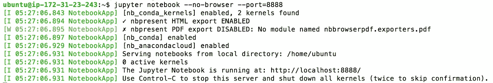
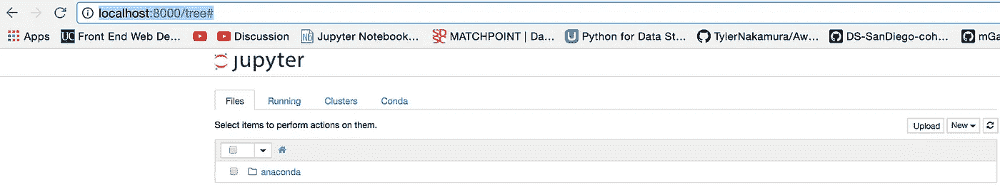

# 在 AWS 上设置和使用 Jupyter (IPython)笔记本电脑

> 原文：<https://towardsdatascience.com/setting-up-and-using-jupyter-notebooks-on-aws-61a9648db6c5?source=collection_archive---------3----------------------->

If you are having trouble following this tutorial or want to use JupyterHub on AWS, I made an updated tutorial ([YouTube](https://youtu.be/h4E4ZvUhYZE), [blog](https://www.kdnuggets.com/2023/01/setup-jupyterhub-tljh-aws-ec2.html?fbclid=IwAR1aswRoPmV4Q-3tviwAq4TedBxj_-HopnguGS3TXRBYjJeWEY8y2u9vuE8)).

前阵子写了一个帖子，“[在 AWS](https://medium.com/@GalarnykMichael/aws-ec2-part-4-starting-a-jupyter-ipython-notebook-server-on-aws-549d87a55ba9) 上启动一个 Jupyter (IPython)笔记本服务器”。虽然这种方法允许多人只需一个密码就能访问服务器，但设置起来很复杂。大多数人只是想使用 Jupyter 笔记本使用他们的 AWS 资源，没有麻烦。有了这个，你就可以这么做了。

**在 AWS 上启动 Jupyter 笔记本**

1.  SSH 到您的 EC2 实例。如果你不知道如何做，或者想要参考，请参见本[教程](https://medium.com/@GalarnykMichael/aws-ec2-part-2-ssh-into-ec2-instance-c7879d47b6b2)。


SSH Command used in the Video

2.确保您已经安装了 Anaconda。如果你还没有安装，你可以使用这个[教程](https://medium.com/@GalarnykMichael/aws-ec2-part-3-installing-anaconda-on-ec2-linux-ubuntu-dbef0835818a)来安装。

3.在终端中键入以下命令:

```
jupyter notebook --no-browser --port=8888
```



Expected Output of running the previous command

我们添加“—无浏览器”的原因是因为如果我们不这样做，您可能会得到类似“Jupyter Notebook 需要 JavaScript”的错误。说了这么多，如果你得到那个错误，你可以通过按`Q`忽略错误，然后按`Y`确认。

**SSH 到你的 Jupyter 笔记本**

4.打开一个新的终端，SSH 到你的 Jupyter 笔记本。您的命令应该类似于下面的命令。如果不知道怎么做，请看[教程](https://medium.com/@GalarnykMichael/aws-ec2-part-2-ssh-into-ec2-instance-c7879d47b6b2)。

```
ssh -i thisIsmyKey.pem -L 8000:localhost:8888 ubuntu@ec2–34–227–222–100.compute-1.amazonaws.com
```

`-i`指定用于公钥认证的备用标识文件。基本上对于本教程，我有我的关键在当前目录。

`-L`指定本地(客户端)主机上的给定端口将被转发到远程端(AWS)上的给定主机和端口。这意味着无论在 AWS 的第二个端口号(即`8888`)上运行什么，都会出现在本地计算机的第一个端口号(即`8000`)上。你应该把`8888`换成 Jupyter 笔记本运行的端口。99.9%的时间 Jupyter 将在端口 8888 上运行。可选地将端口`8000`更改为您选择的一个端口(例如，如果`8000`被另一个进程使用)。

5.打开浏览器，转到 localhost:8000



You should get something similar to this

6.(可选)如果你想使用不同的 conda 环境(包括在 Jupyter 笔记本中同时访问 Python 2 和 Python 3 环境的能力，请参见本[教程](https://medium.com/towards-data-science/environment-management-with-conda-python-2-3-b9961a8a5097))。

如果你有任何问题，请在这里，在 [youtube 视频页面](https://www.youtube.com/watch?v=q1vVedHbkAY)，或者通过 [Twitter](https://twitter.com/GalarnykMichael) 告诉我！