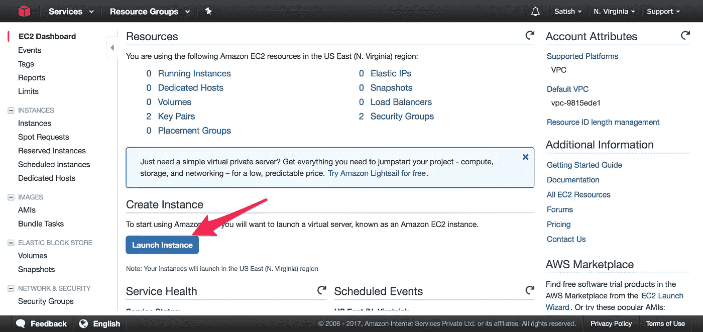
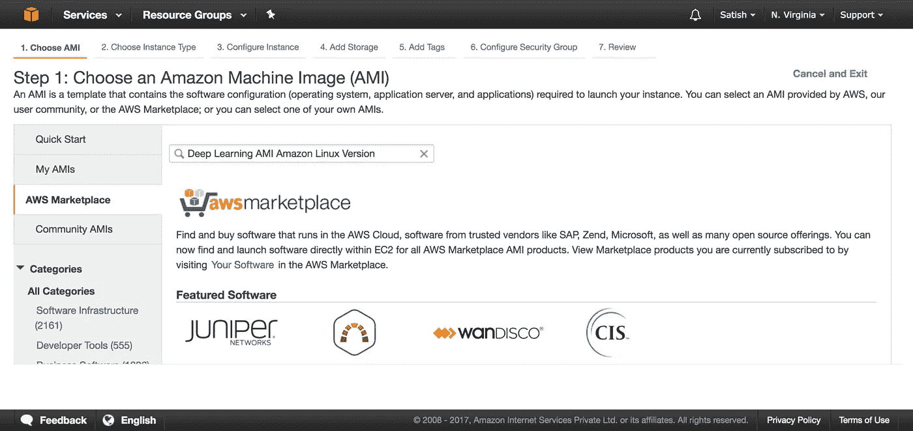
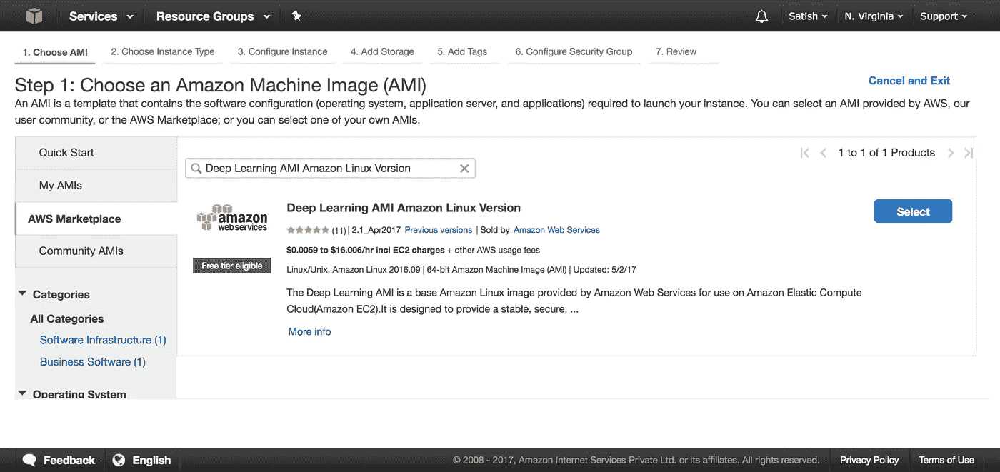
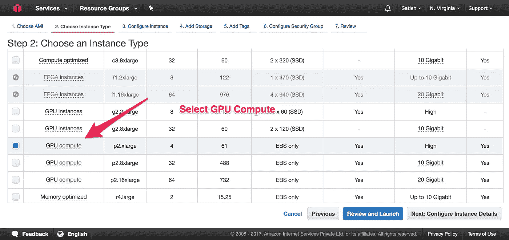
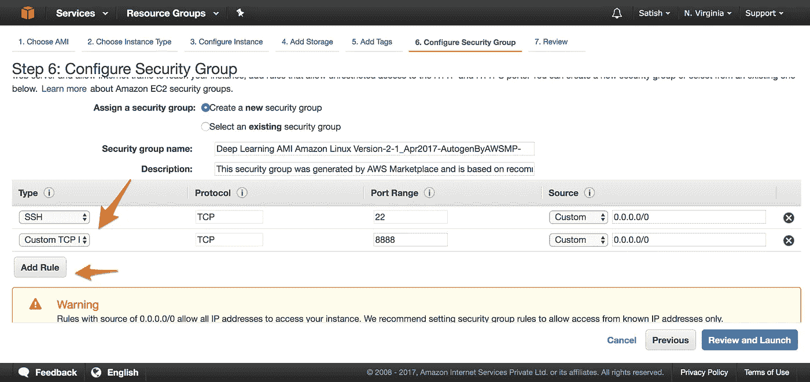
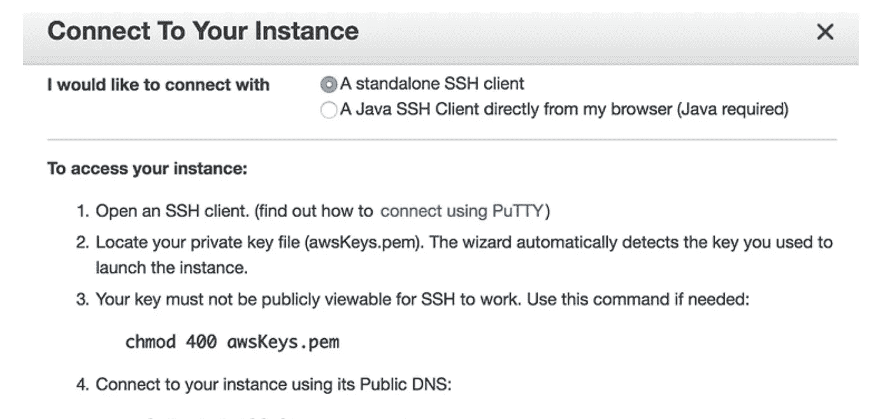
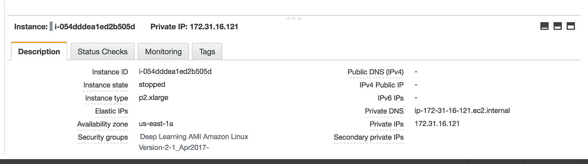
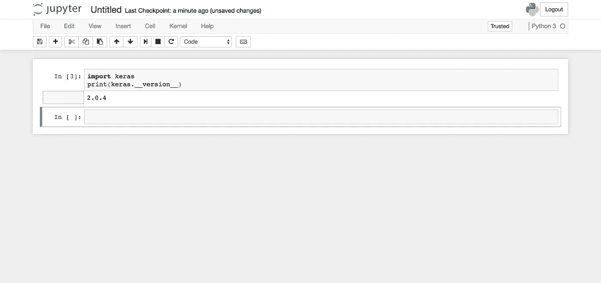

# 在 AWS 中建立深度学习工作站

> 原文：<https://towardsdatascience.com/setting-up-deep-learning-work-station-in-aws-ac99101bf5de?source=collection_archive---------8----------------------->

这是在 AWS 中设置机器的一步一步的指南，该机器可以执行复杂的深度学习任务，如图像分类或面部识别。

# 为什么不是我自己的机器

我也有同样的问题，直到我看到运行一个基本图像分类的算法有多慢。像张量流或 Theano 这样的深度学习框架在 CPU 上工作，但它更适合 GPU 计算。与 CPU 相比，算法在 GPU 中运行更快。

关于 CPU 与 GPU 的更多信息:

 [## TensorFlow 简介— CPU 与 GPU

### 在本教程中，我们将在 TensorFlow 中进行简单的矩阵乘法，并将 GPU 的速度与

medium.com](https://medium.com/@erikhallstrm/hello-world-tensorflow-649b15aed18c) 

有鉴于此，亚马逊提供了一个每小时 0.90 美元的 GPU 系统，它可以用来运行算法和机器来与所有的预配置。这里是一步一步的信息。

登录 Aws 后，从侧面菜单中选择 Ec2

选择启动实例。亚马逊提供所有必要的软件并维护它。我们可以从 Aws MarketPlace 中选择机器映像

## **镜像名称:深度学习 AMI 亚马逊 Linux 版**

这将为您提供以下屏幕

选择图像，然后单击下一步选择 GPU 计算。

这一步将花费你 0.90 美元。但是有一些有趣的方法可以通过改变训练和测试之间的实例来降低成本。稍后会详细介绍。

您可以单击“下一步”,直到配置安全组，然后添加新安全组。

就是这样！！点击查看并启动。可以配置运行深度学习的机器。

有可能你可能会得到错误说，请求限制超过。您可以向 AWS 提出请求来解决这个问题。

要启动实例，请单击“连接”按钮，并按照说明进行操作。

通过最后一步，你就拥有了一台包含深度学习所需所有东西的机器。要使开发人员工具易于使用，还需要几个步骤。我的意思是，你必须配置 Jupyter 笔记本电脑，以便在外面可以方便地访问。

在命令中连接后，执行以下步骤

代码块的最后一行会生成这样的 SHA 键

sha1:806d 23 d9 C1 c8:2 da 90 b 513 b 6 AE 2 a 941 a 4 bdcf 6843 a3 A0 ea 5a 7

复制并保存在记事本中

然后回到终端类型

> ***vi ~/。jupyter/jupyter _ notebook _ config . py***

如果你不是 Vi 人，记住你需要按 I 开始插入内容，当你完成时，你可以点击然后最后退出 Vi esc :wq enter，同时保存你的更改(代表 write-quit)。

将密码更改为您在之前的步骤中复制的生成的 SHA1 密钥。

# **更新 Keras**

Keras 会在 1。x 版本，但是很容易用一个简单的命令升级

> **sudo pip 安装 keras —升级—无 deps**

现在您已经升级了，您可以通过以下方式启动 Jupyter 笔记本

> **Jupyter 笔记本**

这将运行 jupyter 笔记本，可通过公共 IP 在互联网上访问。你可以在下面找到公共 IP

一旦完成，你可以创建一个空的笔记本和类型。

现在这一步已经完成了。你可以创造一个更好的世界。