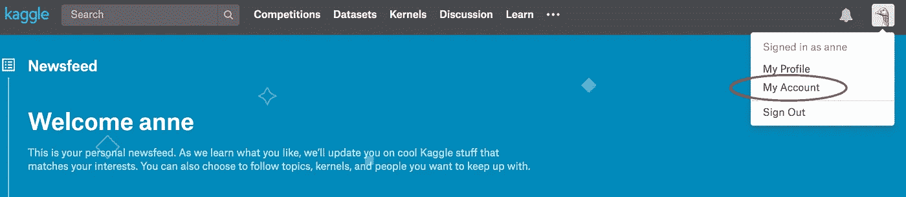
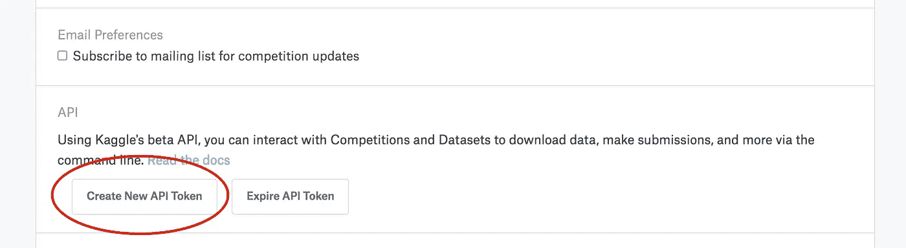
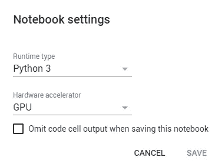
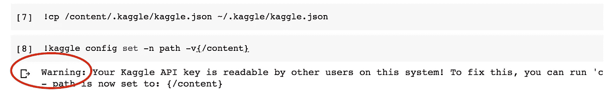
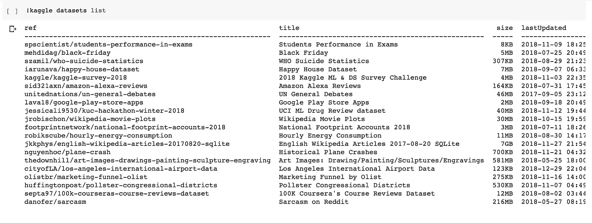
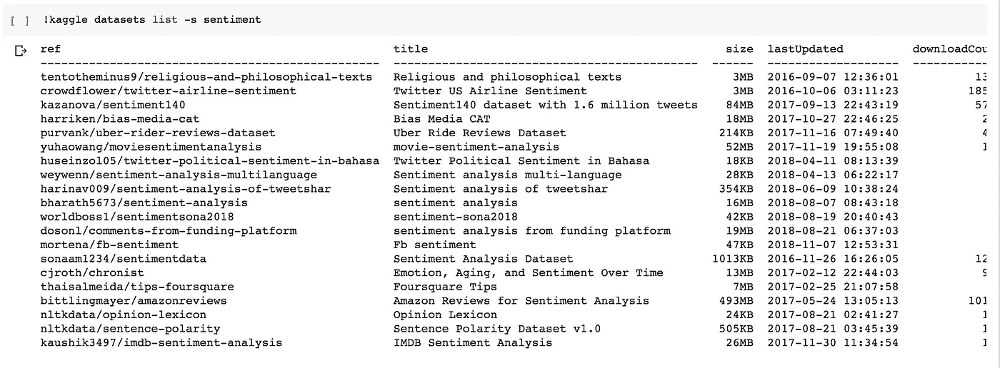
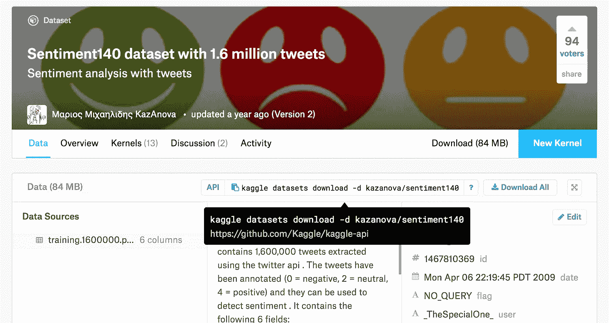

# 在 Google Colab 中设置 Kaggle

> 原文：<https://towardsdatascience.com/setting-up-kaggle-in-google-colab-ebb281b61463?source=collection_archive---------6----------------------->

## 一个简单的新手教程

我要所有的数据，现在就要！


Photo by [Logan Fisher](https://unsplash.com/@loganrfisher?utm_source=medium&utm_medium=referral) on [Unsplash](https://unsplash.com?utm_source=medium&utm_medium=referral)

你知道所有这些数据集在哪里，你也知道你想让它们去哪里，但你如何轻松地将你的数据集从 Kaggle 移动到 Google Colab，而没有很多复杂的疯狂？

让我给你看看！

发现快乐是 [Google Colab](https://colab.research.google.com/) 绝对是我开始深度学习、机器学习和人工智能以来所做的最聪明的事情之一。Google Colab 提供免费 GPU(真的！)卖给几乎所有想要的人。如果你刚刚开始，你需要上 Colab！我写了[另一篇文章](/getting-started-with-google-colab-f2fff97f594c)介绍第一次在 Colab 中设置，但是在 Colab 中设置和运行 Kaggle 真的应该有自己的文章。


Photo by [Oscar Söderlund](https://unsplash.com/@messisorder?utm_source=medium&utm_medium=referral) on [Unsplash](https://unsplash.com?utm_source=medium&utm_medium=referral)

尽管 Colab 非常用户友好，但在设置时，您可能需要一些细节方面的帮助。

事实证明，Kaggle 就是这些细节之一。

卡格尔需要一点技巧。一点爱。然而，如果你在寻找那些可爱的数据集，你会想要得到它！其实真的很简单；你只需要采取几个简单的步骤。如果您只想[查看 GitHub](https://github.com/bonn0062/colab_kaggle_api) 上的代码，然后继续您的一天(这里的事情可能会变得有点…冗长……),欢迎您这样做！

下面是我发现的第一次访问 Kaggle 数据的最简单方法:

## **入门**

(一个小提示:为了能够访问 Kaggle 数据，你需要注册 Kaggle(免费！)并同意您想要参加的竞赛的条款和条件。)

首先，从卡格尔那里拿到你的令牌。

转到您的帐户页面(屏幕右上角的下拉菜单会带您到那里)。



然后向下滚动到 API 并点击“创建新的 API 令牌”



那就要下载一个名为 **kaggle.json** 的文件。确保您知道该文件在哪里！也许把它放在你能找到的地方…

只是一个建议。

打开该文件，您会看到类似如下的内容:

```
{“username”:”YOUR-USER-NAME”,”key”:”SOME-VERY-LONG-STRING”}
```

为将来的复制和粘贴准备好那个东西！

接下来，去 Colab 开始一个新的笔记本。我非常喜欢立即在 GPU 上运行，为此，请进入“运行时”下拉菜单，选择“更改运行时类型”，然后在“硬件加速器”下拉菜单中选择 GPU。然后点击保存。



接下来，您需要安装 Kaggle。这几乎就像把它安装在你的 Jupyter 笔记本上一样，但是 Colab 希望在你的代码开头有一个感叹号。只需运行:

```
!pip install kaggle
```

你可以使用`!ls`来检查你是否已经有一个名为 Kaggle 的文件夹，或者直接运行

```
!mkdir .kaggle
```

去创造一个。

接下来，您需要运行下面的单元格，但是请注意几件事情:

*   这个没有感叹号
*   你肯定想把用户名和密码改成你从下载的 Kaggle 文件中复制粘贴的那个！

```
import jsontoken = {“username”:”YOUR-USER-NAME”,”key”:”SOME-VERY-LONG-STRING”}with open('/content/.kaggle/kaggle.json', 'w') as file:
    json.dump(token, file)
```

我在运行这段代码时进行了复制粘贴，实际上遇到了一点麻烦。我不知道为什么，但我不得不删除并重新键入上面代码中的单引号，以使该单元格正常运行。如果您莫名其妙地弹出一个错误代码，那就试试吧！

接下来，运行

```
!cp /content/.kaggle/kaggle.json ~/.kaggle/kaggle.json
```

然后

```
!kaggle config set -n path -v{/content}
```

您将会得到一个类似如下的警告:



您可以通过运行以下命令轻松解决这个问题:

```
!chmod 600 /root/.kaggle/kaggle.json
```

在那之后，你应该能跑了

```
!kaggle datasets list
```

访问 Kaggle 数据集列表。



如果您正在寻找一个特定的数据集，您可以运行类似

```
!kaggle datasets list -s sentiment
```

以便列出例如标题中包含“情感”的数据集。



现在是时候开始享受真正的乐趣了！

## **下载数据**

去 Kaggle，找到你想要的数据集，在那个页面上，点击 API 按钮(它会自动复制代码)。



您将把代码粘贴到下一个单元格中，但是要确保在单元格的开头添加感叹号，并添加`-p /content`来阐明您的路径。

```
!kaggle datasets download -d kazanova/sentiment140 -p /content
```

要解压缩文件，运行

```
!unzip \*.zip
```

欢迎来到数据镇！！！想看看吗？尝试跑步:

```
import pandas as pdd = pd.read_csv('training.1600000.processed.noemoticon.csv')d.head()
```

(当然，用数据集中的文件名替换上面的文件名。)

现在走出去，创造一些惊人的东西！


Photo by [Fidel Fernando](https://unsplash.com/@fifernando?utm_source=medium&utm_medium=referral) on [Unsplash](https://unsplash.com?utm_source=medium&utm_medium=referral)

如果有人用他们新得到的数据做了一些非常棒的事情，我想听听他们的想法！请在下面的回复中让每个人都知道你创造了什么，或者随时在 LinkedIn [@annebonnerdata](https://www.linkedin.com/in/annebonnerdata/) 上联系！

你可能也想看看我的其他一些文章！

[](/getting-started-with-git-and-github-6fcd0f2d4ac6) [## Git 和 GitHub 入门:完全初学者指南

### Git 和 GitHub 基础知识，供好奇和完全困惑的人使用(加上最简单的方法来为您的第一次公开…

towardsdatascience.com](/getting-started-with-git-and-github-6fcd0f2d4ac6) [](/how-to-create-a-free-github-pages-website-53743d7524e1) [## 如何用 GitHub 毫不费力地免费创建一个网站

### GitHub Pages 入门:创建和发布免费作品集的快速简便指南…

towardsdatascience.com](/how-to-create-a-free-github-pages-website-53743d7524e1) [](/getting-started-with-google-colab-f2fff97f594c) [## Google Colab 入门

### 沮丧和困惑的基本教程

towardsdatascience.com](/getting-started-with-google-colab-f2fff97f594c) [](/intro-to-deep-learning-c025efd92535) [## 深度学习简介

### 新手、新手和新手的神经网络。

towardsdatascience.com](/intro-to-deep-learning-c025efd92535) [](https://medium.freecodecamp.org/how-to-build-the-best-image-classifier-3c72010b3d55) [## 如何构建准确率高于 97%的图像分类器

### 清晰完整的成功蓝图

medium.freecodecamp.org](https://medium.freecodecamp.org/how-to-build-the-best-image-classifier-3c72010b3d55) [](/the-complete-beginners-guide-to-data-cleaning-and-preprocessing-2070b7d4c6d) [## 数据清理和预处理完全初学者指南

### 如何在几分钟内为机器学习模型成功准备数据

towardsdatascience.com](/the-complete-beginners-guide-to-data-cleaning-and-preprocessing-2070b7d4c6d) [](https://heartbeat.fritz.ai/brilliant-beginners-guide-to-model-deployment-133e158f6717) [## 出色的模型部署初学者指南

### 一个清晰简单的路线图，让你的机器学习模型在互联网上，做一些很酷的事情

heartbeat.fritz.ai](https://heartbeat.fritz.ai/brilliant-beginners-guide-to-model-deployment-133e158f6717)