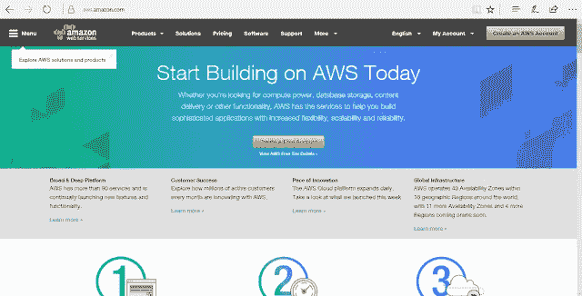
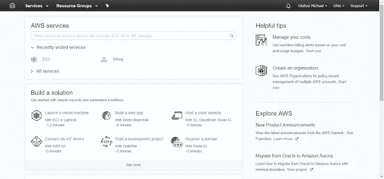
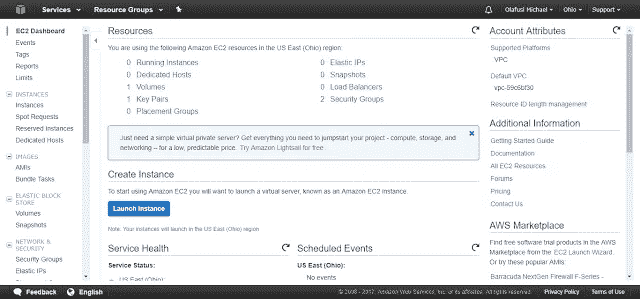
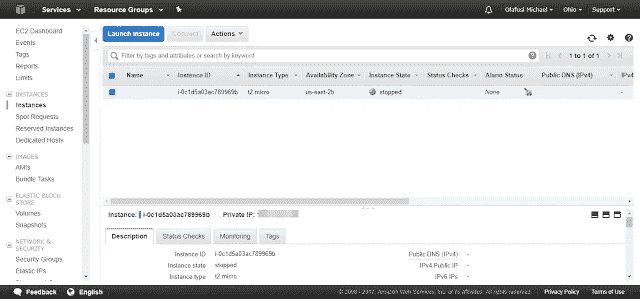
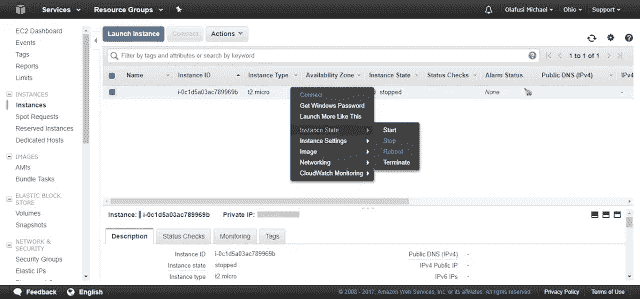
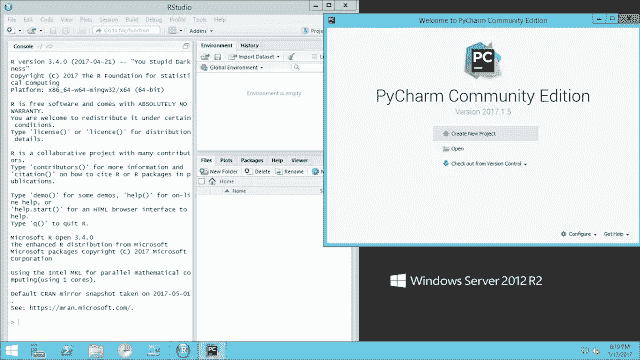

# 为数据分析设置我的第一个 Amazon Web Services (AWS)虚拟服务器

> 原文：<https://towardsdatascience.com/setting-up-my-first-amazon-web-services-aws-virtual-server-for-data-analytics-4e62db34f874?source=collection_archive---------8----------------------->

今天终于加入了 AWS 的列车。作为我正在为一个客户进行的大数据分析项目的一部分，我需要托管一个云服务器来从 Twitter 和 Google 上挖掘数据，每天将它们保存在一个 CSV 文件中。通常，我会使用我的笔记本电脑作为这项任务的服务器，但由于这是一个商业项目，我可以将成本转嫁给客户，我必须使用一个可靠的负担得起的虚拟服务器。然后我去谷歌上搜索。我不想用微软 Azure，因为我的支付系统有问题，而且我听说 Azure 对于一个非常小的企业来说不是最好的口袋友好型选择。我偶然发现了阿里云服务，但不久我就接受了亚马逊网络服务。

设置真的很容易；比我想象的要容易，因为网上普遍认为 AWS 不像 Azure 那样简单易用。现在经历了这两者，我不同意。

我使用了 EC2 服务并创建了一个 t2-micro Windows Server 2012 R2 实例。

在通过远程桌面连接连接到服务器时，我为我的数据分析工作设置了它。我安装了[微软 R Open](https://mran.microsoft.com/open/) 和 [RStudio](https://www.rstudio.com/) 用于我基于 R 的数据分析工作。我为我基于 Python 的分析工作安装了 [Anaconda](https://www.continuum.io/downloads) 和 [PyCharm](https://www.jetbrains.com/pycharm/) 。下面是我的服务器设置的样子。

我甚至把我常用的工具钉在了任务栏上——Powershell、任务调度器、RStudio 和 PyCharm。

剩下的问题是如何估算我每月的花费，以及我是否需要自动启动/关闭服务器以节省计算时间/成本。启动/关闭决定的某些方面将取决于 Twitter 是否批准我不受限制地访问他们的 Tweet 数据库的请求，并且不收取我一些疯狂的费用。我已经提出了请求，他们要求我向他们提供一些信息，他们将使用这些信息来决定是否批准我的请求。我目前绕过每 15 分钟可以抓取多少条推文的限制的方法是每三个小时运行一次报废脚本，但我仍然认为我没有获得足够多的代表性推文，一些推文不断重复显示。

总的来说，我喜欢深入数据分析的新冒险。我会一直让你们知道我的进步，分享我的学习成果。

*最初发表于*[*【www.olafusimichael.com】*](http://www.olafusimichael.com/2017/07/setting-up-my-first-amazon-web-services.html)*。*