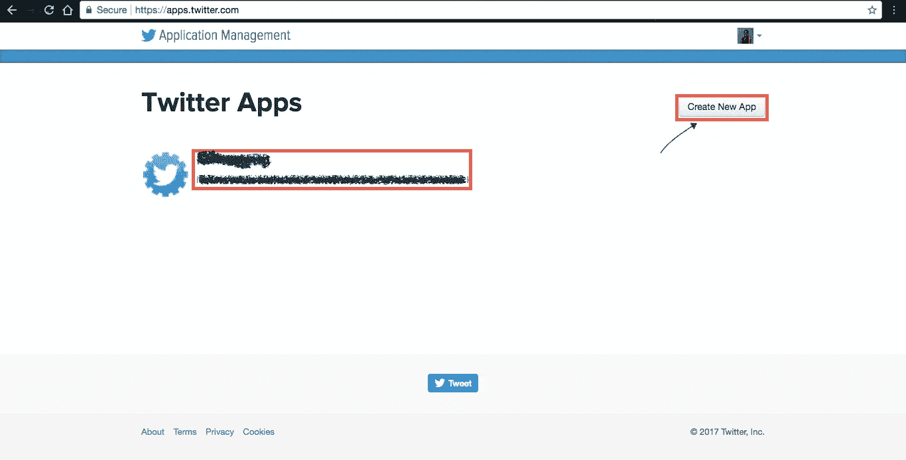
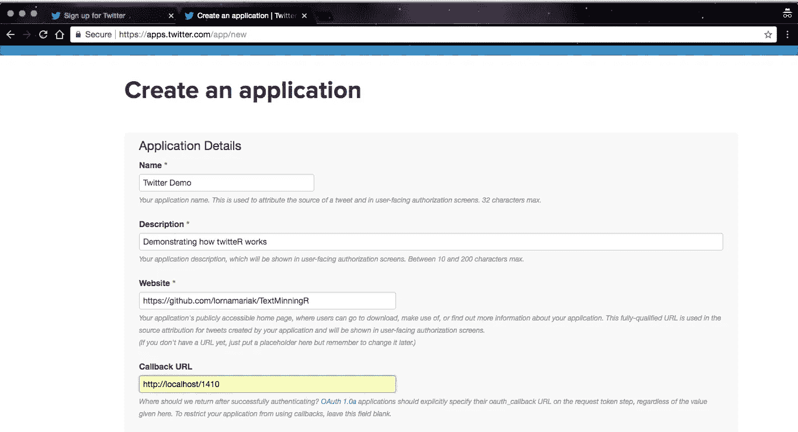
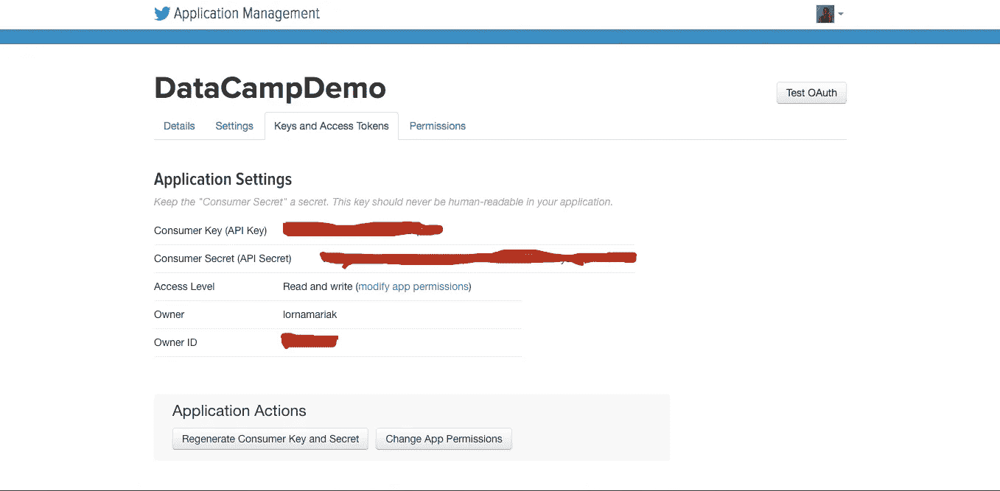
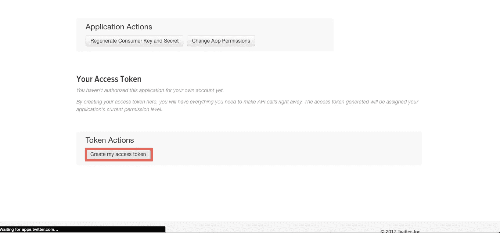
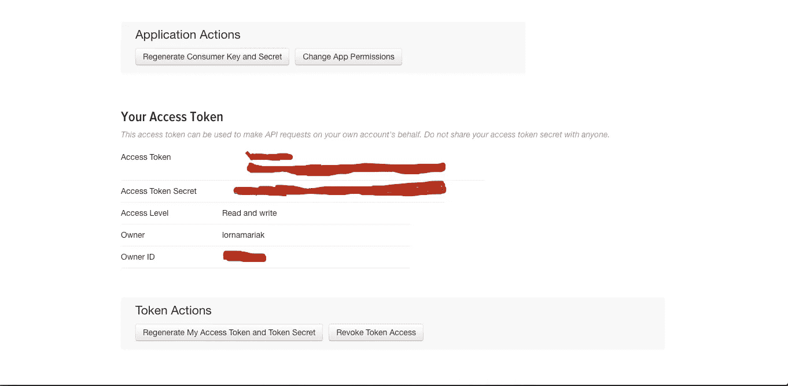
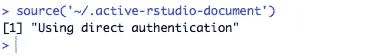

# 在 r 中为文本挖掘设置 Twitter。

> 原文：<https://towardsdatascience.com/setting-up-twitter-for-text-mining-in-r-bcfc5ba910f4?source=collection_archive---------4----------------------->


Photo Credit : [Pixabay](https://pixabay.com/en/twitter-line-power-line-sit-2713571/)

## 介绍

多年来，社交媒体已经成为数据挖掘的热点。每天都有话题趋势、活动进行和人们讨论不同的全球、大陆或国家问题。这是利用数据的一个主要目标。

在这篇文章中，我们把 Twitter 作为全球观点和情感的中心。我们开始从每天发布的数百万条推文中挖掘文本，以便能够理解正在发生的事情，甚至超越我们自己的时间线。

## Twitter API 设置

要使用 twitter API，我们需要有一个 twitter 帐户。
通过[https://twitter.com](https://twitter.com)注册，前往[https://apps.twitter.com/](https://apps.twitter.com/)访问 twitter 开发者选项。



Click create New App

创建新的应用程序



**应用程序名称:**给你的应用程序一个唯一的名称。如果被占用，将通知您进行更改。
**应用程序站点:**如果你的应用程序还没有站点，这可以是一个到你的 Github 存储库的链接，应用程序代码就在那里。(像我一样)
**回调 URL:** 这是一个链接，成功或失败的消息从一个程序中继到另一个程序。它告诉程序在这两种情况下下一步去哪里。您可以将您的应用程序定向到任何可用的端口，我的端口是 1410。

## 应用凭据

这些对于帮助用户登录应用程序非常重要。
此设置中使用了四种主要凭证。
**消费者密钥:**该密钥向应用程序标识客户端。
**消费者密码:**这是用于服务器验证的客户端密码。
**访问令牌:**这是用来定义用户权限的用户标识。
**访问密码:**这是用访问令牌作为密码发送的。</李>
他们就是这样获得的。



App credentials



Generating Tokens



App Tokens

注意:这些证书应该是保密的，这就是为什么我在我的证书上画了阴影。瞧吧！我们设置了一个 API

## r 工作室成立

R 使用了 **twitteR** 库，这是一个基于 R 的 twitteR 客户端，处理与 Twitter API 的通信。让我们花点时间感谢杰夫·金特里把这个图书馆建起来。

现在继续使用下面的代码安装这个库。

```
#from CRAN
install.packages(“twitteR”)#alternatively from the Github
library(devtools)
install_github(“geoffjentry/twitteR”)
```

上述两种方法的区别在于，第一种方法从 CRAN 站点下载包，并接受包名参数，而第二种方法从 GitHub 库安装包，并接受库名参数。点击阅读更多关于软件包和安装的信息[。](https://www.datacamp.com/community/tutorials/r-packages-guide)

## 证明

Twitter 使用开放认证(OAuth)来授权访问信息。开放式身份验证是一种基于令牌的身份验证方法。我们来参考一下我们的四个凭据。

**第一步**

```
#load library
library(twitteR)#load credentials
consumer_key <- “****************”
consumer_secret<- “*******************”
access_token <- “*******************”
access_secret <- “************************” 
```

**第二步**

我们使用 **setup_twitter_oauth** 函数来设置我们的认证。 **setup_twitter_oauth()** 函数接收我们从上面设置的 API 生成的四个 twitter 凭证。

```
 #set up to authenticate
setup_twitter_oauth(consumer_key ,consumer_secret,access_token ,access_secret)
```



请按键盘上的 Y 键授权直接认证。

## 查询 Twitter

质疑就是简单地问一个问题。为了能够访问我们需要的数据，我们必须向 twitter 发送有意义的查询。有了 Twitter，我们可以获得从趋势、活动到账户的大量信息。我们有一系列的问题要问。
让我们在这个标签#rstats 上运行查询

```
#fetch tweets associated with that hashtag , 12 tweets-n in 
#(en)glish-lang since the indicated date yy/mm/ddtweets <- twitteR::searchTwitter(“#rstats”,n =12,lang =”en”,since = ‘2018–01–01’)#strip retweets
strip_retweets(tweets)
```

这段代码以列表的形式返回推文。 **strip_retweets()** 函数删除返回的 tweets 中的任何 retweets。

为了进一步分析这些推文，我们将考虑将返回的推文转换为数据帧，并在本地存储它们。

```
#convert to data frame using the twListtoDF function
df <- twListToDF(tweets)\#extract the data frame save it locally
saveRDS(df, file=”tweets.rds”)
df1 <- readRDS(“mytweets.rds”)
```

## 清理推文

通过查询，我们已经设法将结果存储到计算机上的数据框中。现在让我们检查这些数据，找出谁的转发量最高，并直接从我们的脚本中给他们一个大喊。
我们将使用 **dplyr** 库遍历该数据帧。

```
 library(dplyr)#clean up any duplicate tweets from the data frame using #dplyr::distinctdplyr::distinct(df1)
```

让我们利用 dplyr 动词来选择转发次数最多的 tweet 的 tweet、昵称、id 和转发次数，并将结果存储在一个名为 winner 的数据帧中。

```
winner <-df1 %>% select(text,retweetCount,screenName,id )%>% filter(retweetCount == max(retweetCount))
View(winner)
```

通过此[备忘单](https://www.rstudio.com/wp-content/uploads/2015/02/data-wrangling-cheatsheet.pdf)查看更多关于 **dplyr** 的信息。

## 发送直接信息

为了通知我们的转发竞赛获胜者，我们将通过从获胜者数据帧中选取他们的句柄，从该脚本中向他们发送一条直接消息。
**DM send()**函数接收保存为屏幕名称的消息和用户名。

```
us <- userFactory$new(screenName= winner$screenName)
dmSend(“Thank you for participating in #rstats,Your tweet had the highest retweets” , us$screenName)
```

## 结论

我们刚刚从 twitter 中创建了第一个挖掘数据集，并使用它来找出我们的转发比赛获胜者。嗯，这只是我们能做的一个小例子，然而，有一个专栏包含来自挖掘的推文的文本，可以使用这个[博客](https://medium.com/@lornamariak)上以前文章的技术来分析这些文本。

这种挖掘的数据有更多的可能性，如情感分析和词频可视化。
我建议你通过这个 GitHub [库](https://github.com/lornamariak/TextMinningR)查看一个 twitter 文本挖掘的实例。
关于本文的任何进一步的问题和评论，请通过 twitter 问我 [@lornamariak](http://twitter.com/lornamariak) 。
微博挖掘快乐！