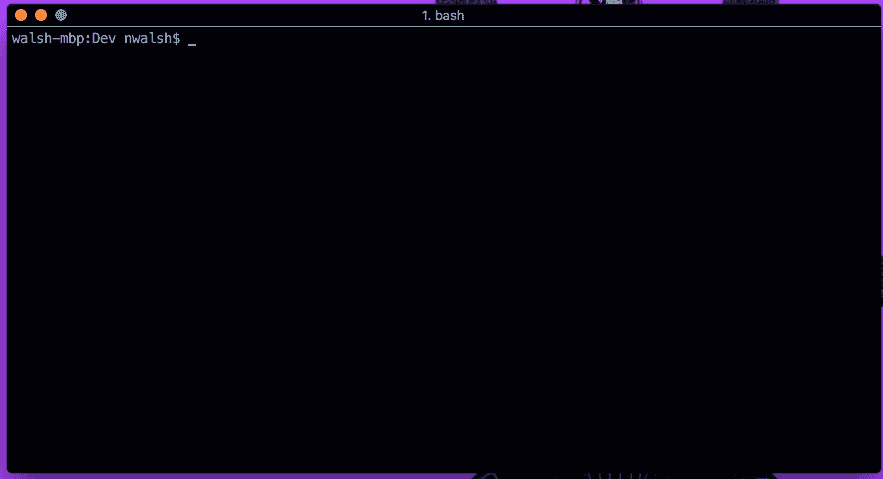

# 在 5 分钟内设置您的数据科学和人工智能开发环境

> 原文：<https://towardsdatascience.com/setting-up-your-data-science-and-ai-dev-environment-in-5-minutes-44804a324713?source=collection_archive---------6----------------------->

> Kaggle、TensorFlow、PyTorch、MxNet 等等，只需几步！

Using datmo to get a new TensorFlow project setup in under a minute

无论您是第一次设置 TensorFlow 的数据科学爱好者新手，还是处理万亿数据的经验丰富的人工智能工程师，安装您的库、包和框架总是一场斗争。

虽然像 [Docker](https://docker.com) 这样的容器化工具真正革新了软件的可复制性，但它们还没有在数据科学和人工智能社区中流行起来，这是有充分理由的！随着机器学习框架和算法的不断发展，很难找到时间来学习另一种开发工具，尤其是与模型构建过程没有直接联系的工具。

在这篇博文中，我将向您展示如何使用一个名为`datmo`的简单 python 包来为任何流行的数据科学和人工智能框架设置环境，只需几个简单的步骤。Datmo 利用 Docker 并简化流程，帮助您快速轻松地运行。

## 0.先决条件

*   安装并启动[和 *Docker* 和](https://docs.docker.com/install/#supported-platforms)
*   (如果使用 GPU)安装 [*CUDA 9.0*](https://developer.nvidia.com/cuda-90-download-archive) (此处提供替代指南)
*   (如果使用 GPU)安装[*NVIDIA-docker*](https://github.com/datmo/datmo/wiki/Datmo-GPU-support-and-setup)*(步骤 3)*

## 1.安装 datmo

就像任何 python 包一样，我们可以使用以下命令从您的终端安装 datmo:

`$ pip install datmo`

## 2.初始化 datmo 项目

在你的终端中，`cd`到你想要开始建立模型的文件夹中。然后，输入以下命令:

`$ datmo init`

然后你会被要求为你的项目取一个名字和描述——你可以随意命名它！

## 3.开始环境设置

在名称和描述之后，datmo 将询问您是否想要设置您的环境——键入`y`并按下`enter`。

## 4.选择系统驱动程序(CPU 或 GPU)

然后，CLI 将询问您的环境需要哪些系统驱动程序。如果你不打算使用 GPU，选择`cpu`。

Select system drivers

## 5.选择一个环境

接下来，您将从众多预打包环境中选择一个。只需在提示中给出您想要使用的环境的编号或 ID。

Select an environment

## 6.选择语言版本(如果适用)

根据您计划使用的语言和版本，上面的许多环境都有不同的版本。

例如，在选择了`keras-tensorflow`环境后，我会看到下面的提示，询问我是想使用`Python 2.7`还是`Python 3.5`。

Select a language version

## 7.启动您的工作区

您已经正确选择了您的环境，现在是时候启动您的工作区了。选择您想要使用的工作区，并在您的终端中输入相应的命令。

Jupyter 笔记本— `$ datmo notebook`

木星实验室— `$ datmo jupyterlab`

RStudio — `$ datmo rstudio`(在 R-base 环境中可用)

终端— `$ datmo terminal`

Opening a Jupyter Notebook and importing TensorFlow

你已经准备好了！第一次为新环境初始化工作空间时，需要花费一些时间来获取所有的资源，但是在连续运行时会明显加快。

一旦您的工作空间启动，您就可以开始导入包含在您选择的环境中的包和框架了！例如，如果用户选择了`keras-tensorflow`环境，那么`import tensorflow`将在您的 Jupyter 笔记本中开箱即用！

如果你正在使用 TensorFlow，你可以试试 datmo 文档中的这个例子[来运行你的第一个 TensorFlow 图。](https://datmo.readthedocs.io/en/latest/quickstart.html#testing-it-out)

感谢您的阅读，我们希望您的软件环境设置变得更加简单！

*我们的使命是最大限度地利用数据科学家从事数据科学的时间。*

## 如果你想帮忙投稿、报告问题或请求功能，你可以[在 GitHub 这里找到我们](https://github.com/datmo/datmo)！