# 为 AI 设置 Visual Studio 代码工具

> 原文：<https://towardsdatascience.com/setting-up-your-visual-studio-code-tools-for-ai-76c89f3d6e3e?source=collection_archive---------3----------------------->

微软刚刚在去年 9 月的微软 Ignite 2017 上推出了一套与人工智能相关的新工具，其中一个工具就是**Visual Studio Code Tools for AI**。

> [Visual Studio Code Tools for AI](https://github.com/Microsoft/vscode-tools-for-ai)是一个构建、测试和部署深度学习/人工智能解决方案的扩展。它与 Azure Machine Learning 无缝集成，提供强大的实验功能，包括但不限于向不同的计算目标透明地提交数据准备和模型训练作业。

对于需要开发人工智能解决方案的开发人员来说，这实际上是一个有用的工具，同时仍然使用他们选择的代码编辑器，在我的例子中是 Visual Studio 代码。

# 入门指南

在我们真正开始用 VS 代码安装和设置扩展之前，我们首先需要创建一个 Azure 机器学习实验帐户和 Azure 机器学习模型管理帐户，这将允许我们稍后在 VS 代码中使用 sample explorer 创建一个项目。

## 登录到 Azure 门户网站

第一步是在 portal.azure.com 的[登录你的 Azure 账户。如果你没有 Azure 账户，你可以点击](https://portal.azure.com)[这里](https://azure.microsoft.com/en-us/free/)获得免费试用。

## 创建一个 Azure 机器学习实验和模型管理帐户

进入 Azure 门户后，请执行以下操作:

1.  点击“+新建”按钮
2.  搜索“机器学习实验”

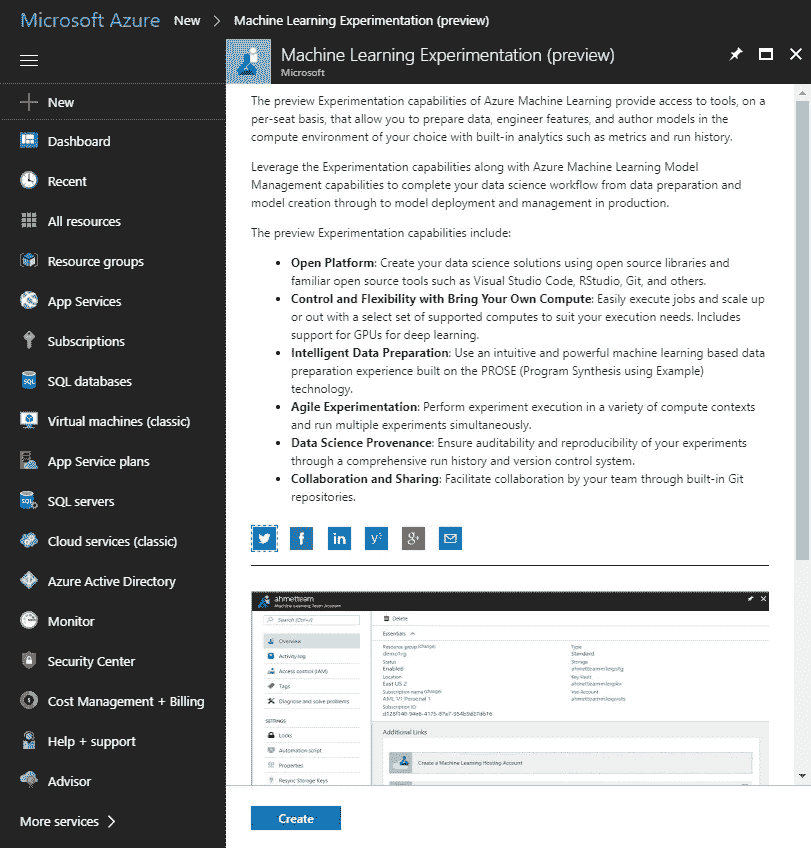

3.点击“创建”

4.填写机器学习实验信息

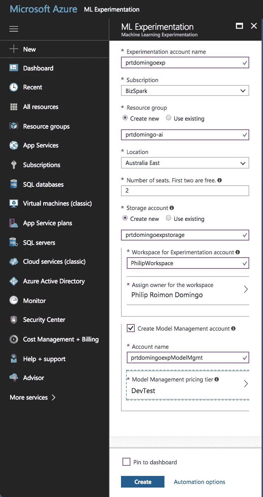

5.单击“Create ”,您应该能够看到服务已成功创建

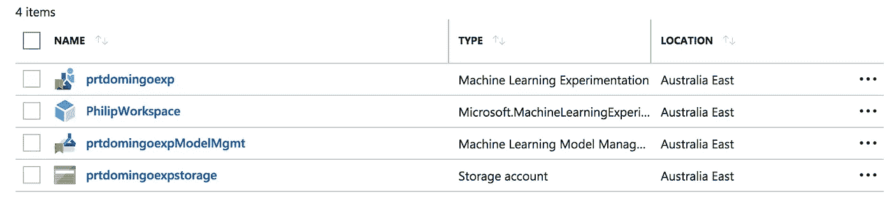

要记住的事情:

1.  如果您还没有“创建模型管理帐户”,请确保选中该帐户。
2.  “座位数”基本上是你可以添加到你的实验账户的 Azure 用户总数。
3.  一个套餐只能有一个“DevTest”定价层的计划。
4.  目前支持的位置是澳大利亚东部、美国东部 2 和美国中西部。

# 安装 Azure 机器学习工作台

一旦我们有了 Azure 机器学习实验和模型管理帐户设置，接下来我们要做的就是安装 Azure 机器学习工作台。

> [Azure Machine Learning work bench](https://docs.microsoft.com/en-us/azure/machine-learning/preview/overview-what-is-azure-ml)是一个桌面应用程序加上命令行工具，在 Windows 和 macOS 上都受支持。它允许您在整个数据科学生命周期中管理机器学习解决方案。

目前，Azure 机器学习工作台桌面应用程序只能安装在以下操作系统上:

*   Windows 10
*   Windows Server 2016
*   macOS Sierra(尚不支持 macOS High Sierra)

注意:Azure Machine Learning Workbench 还将下载并安装其他相关组件，如 Python、Miniconda、Azure CLI 等。

要安装 AML 工作台，您可以单击最近创建的机器学习实验服务，您应该能够看到以下内容:

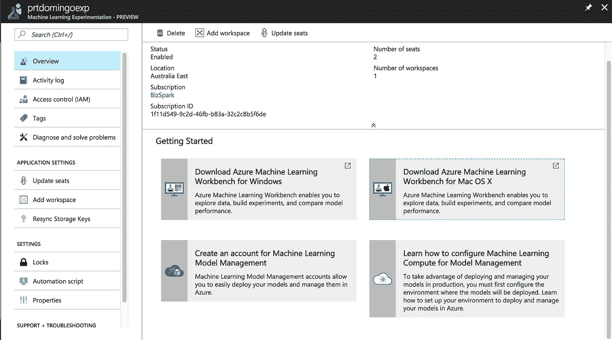

然后，您只需点击您正在使用的特定操作系统，将安装程序下载到您的机器上。

注意:对于 macOS，在安装 AmlWorkbench 安装文件之前，首先需要使用[自制软件](https://brew.sh/)安装`openssl`库。

```
$ brew install openssl
$ mkdir -p /usr/local/lib
$ ln -s /usr/local/opt/openssl/lib/libcrypto.1.0.0.dylib /usr/local/lib/
$ ln -s /usr/local/opt/openssl/lib/libssl.1.0.0.dylib /usr/local/lib/
```

# 在 Visual Studio 代码工具中安装和浏览项目示例

现在我们已经有了 Azure 机器学习帐户和 Azure 机器学习工作台设置，我们现在准备好为 AI 使用 Visual Studio 代码工具了

1.  在这里下载 AI 扩展[的 Visual Studio 代码，或者你可以在 VS 代码中的扩展上搜索它。](https://marketplace.visualstudio.com/items?itemName=ms-toolsai.vscode-ai)
2.  安装完成后，重启 VS 代码
3.  打开命令调板(Windows 中的 CTRL + SHIFT + P 或 macOS 中的 COMMAND-P)
4.  键入" > AI:Azure ML-log in "，这将在终端中显示一条消息，让您打开浏览器并输入提供的代码

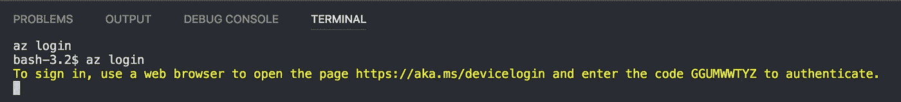

5.一旦你成功登录你的账户，再次打开命令面板，输入" > AI:打开 Azure ML 样本浏览器"

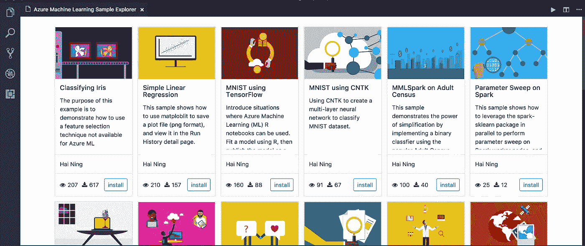

注意:有时当您输入“AI: Open Azure ML Sample Explorer”命令时，VS 代码中没有发生任何事情，当您再次尝试输入该命令时，该命令将不会显示在命令调板中。要修复这个问题，只需重新启动 VS 代码，您应该能够再次看到该命令。

## 在 Azure 机器学习示例资源管理器中创建新项目

现在，我们将尝试使用 sample explorer 创建一个简单的项目，并在本地机器上测试它。

1.  点击"安装"到简单线性回归项目
2.  输入项目名称
3.  进入项目安装文件夹
4.  输入我们刚才使用 Azure 创建的帐户和工作区
5.  成功创建项目后，您将能够看到以下文件:

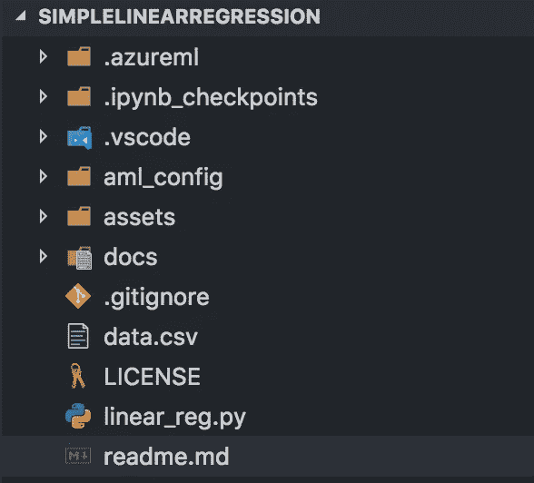

6.您也可以检查`readme.md`文件，以了解正确运行项目所需安装的包。在这种情况下，我们必须安装`matplotlib`。

```
# For macOS
$ pip3 install matplotlib# For Windows
$ conda install matplotlib 
```

## 提交作业并在本地训练模型

一旦我们安装了`matplotlib`包，我们现在将提交一个任务在本地训练模型。

1.  你可以右击`linear_reg.py`文件，点击“AI:提交作业”

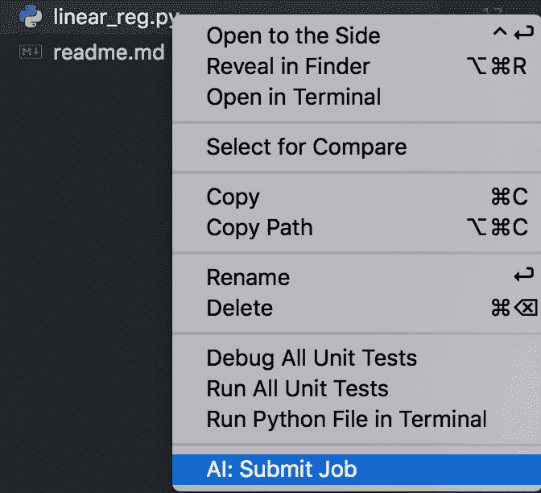

2.或者，你可以再次打开`linear_reg.py`，打开命令面板，输入“AI:提交作业”

3.确保选择“本地”作为您的配置

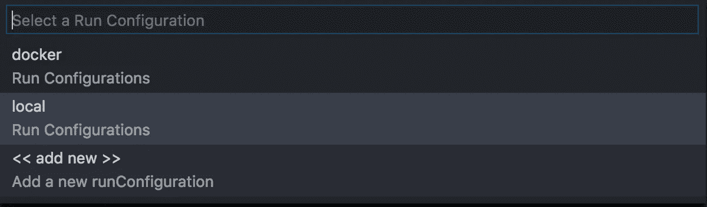

4.提交作业，您应该能够在终端中看到输出

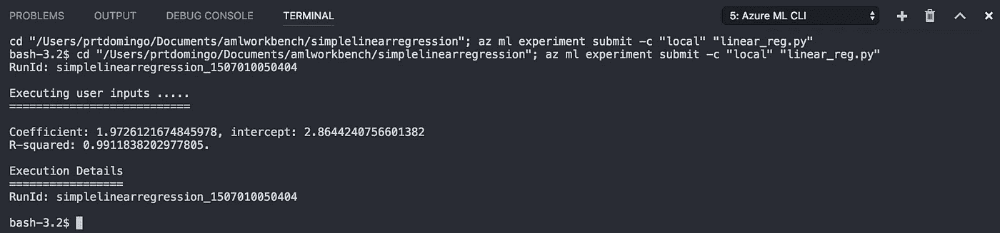

那么你怎么看待 Visual Studio 的 AI 代码工具呢？就个人而言，当提交作业或准备将用于训练模型的数据时，我更喜欢使用 Azure Machine Learning Workbench，因为它对作业发生的事情有更好的可视化。以下是您在 AML Workbench 中运行任务时的情况:

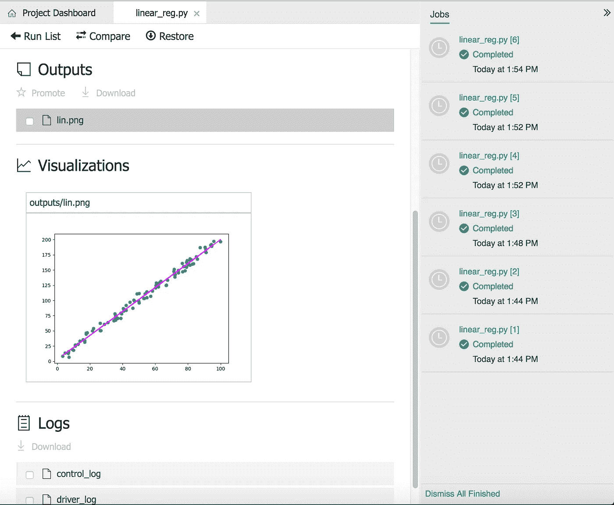

如果你想了解更多关于 Visual Studio Code Tool for AI 的信息，你可以查看他们的 GitHub 库[这里](https://github.com/Microsoft/vscode-tools-for-ai)，如果你也对 AML Workbench 感兴趣，你也可以查看他们的文档[这里](https://github.com/MicrosoftDocs/azure-docs/blob/master/articles/machine-learning/preview/quickstart-installation.md)。