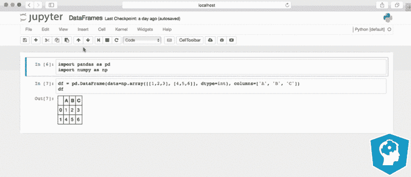
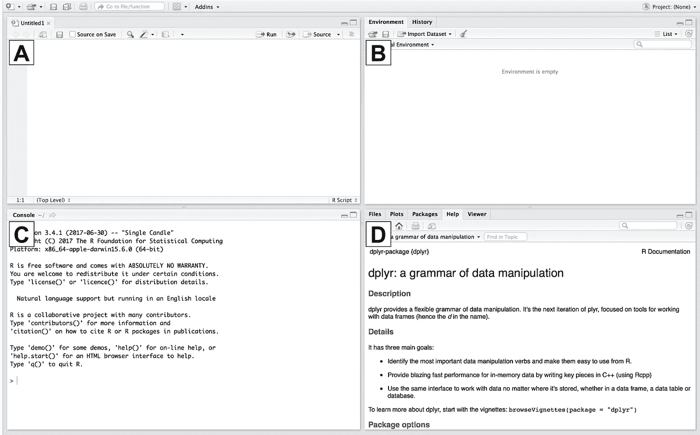
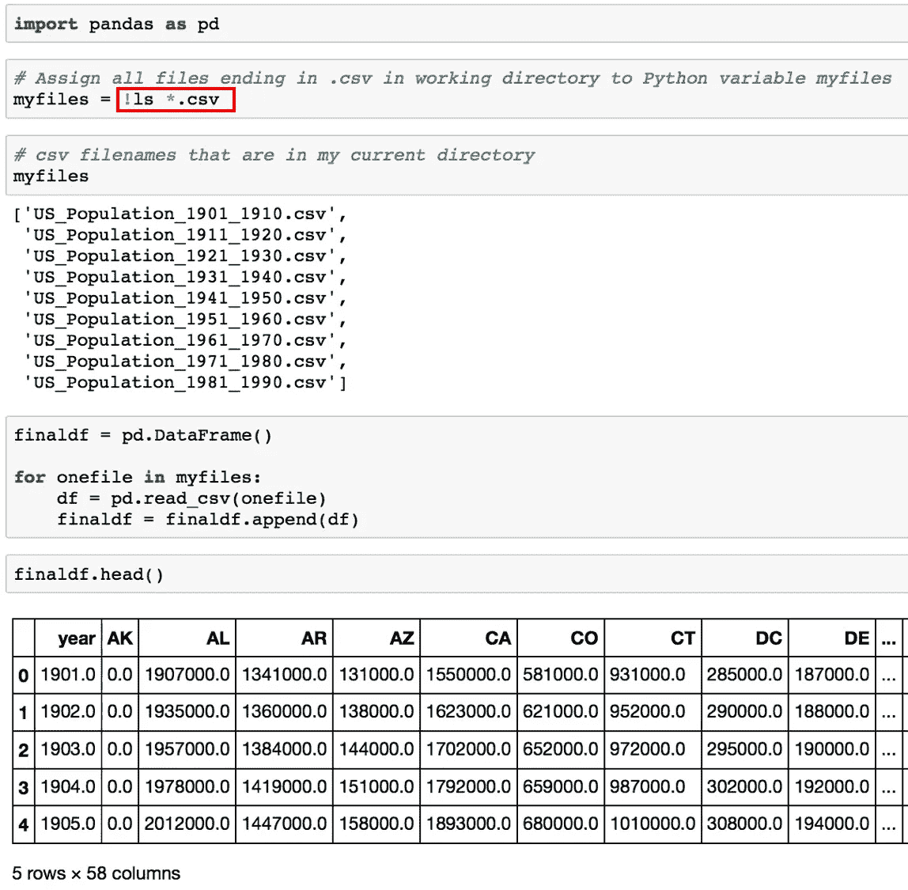

# 在您的个人电脑上设置数据科学环境

> 原文：<https://towardsdatascience.com/setup-a-data-science-environment-on-your-personal-computer-6ce931113914?source=collection_archive---------5----------------------->

## 了解在本地计算机上使用 Python、R、Git 和 Unix Shell 设置数据科学环境的各种选项。

在像 Datacamp 这样的在线交互式培训和教育平台上学习之后，下一步就是利用在 Python、R、Git 或 Unix Shell 中获得的技能，并在本地计算机上使用它。要知道你想要的各种项目需要安装什么并不总是容易的。本教程将让你知道你需要安装什么包，什么软件来开始使用各种技术。本教程将包括:

*   Anaconda Python 发行版的好处以及如何在您的操作系统上安装它。
*   一起使用 R 和 RStudio 的好处以及如何在您的操作系统上安装它们。
*   Unix Shell 的优点以及如何在您的操作系统上使用它。
*   使用 Git 的好处以及如何在您的操作系统上安装它。

就这样，让我们开始吧！

# 计算机编程语言

为了能够在本地计算机上使用 Python，首先需要安装它。有许多不同的 python 发行版，但是对于数据科学来说，Anaconda Python 发行版是最受欢迎的。

## 蟒蛇的好处

Anaconda 是一个包管理器、环境管理器和 Python 发行版，其中包含许多开源包的集合。Anaconda 的安装附带了许多软件包，如预装的 numpy、scikit-learn、scipy 和 pandas，这也是安装 Jupyter 笔记本的推荐方式。下图显示了 Jupyter 笔记本电脑的使用情况。Jupyter 笔记本包含代码和富文本元素，如图形、链接和等式。你可以在这里了解更多关于 Jupyter 笔记本[的信息。](https://www.datacamp.com/community/tutorials/tutorial-jupyter-notebook)



Anaconda 的其他一些好处包括:

*   如果在安装 Anaconda 之后需要额外的包，可以使用 Anaconda 的包管理器 conda 或 pip 来安装这些包。这是非常有利的，因为您不必自己管理多个包之间的依赖关系。Conda 甚至可以轻松地在 Python 2 和 3 之间切换(你可以在这里了解更多[)。](/environment-management-with-conda-python-2-3-b9961a8a5097)
*   Anaconda 附带 Spyder，这是一个 Python 集成开发环境。集成开发环境是一种编码工具，它允许您编写、测试和调试您的代码，因为它们通常提供代码完成、通过突出显示的代码洞察力、资源管理和调试工具以及许多其他功能。还可以将 Anaconda 与其他 Python 集成开发环境(包括 PyCharm 和 Atom)集成在一起。您可以在这里了解更多关于不同 Python 集成开发环境的信息。

## 如何安装 Anaconda (Python)

下面是一些关于如何在您的操作系统上安装 Anaconda 的指南的链接。

[在 Mac 上安装 Anaconda](https://medium.com/@GalarnykMichael/install-python-on-mac-anaconda-ccd9f2014072)

[在 Windows 上安装 Anaconda](https://medium.com/@GalarnykMichael/install-python-on-windows-anaconda-c63c7c3d1444)

# r 编程语言

大多数人一般会将 RStudio 和 R 编程语言一起安装。RStudio 集成开发环境(IDE)通常被认为是使用 R 编程语言的最简单、最好的方式。

## RStudio 的优势

R 编程语言的安装为您提供了一组来自 R 语言的函数和对象，以及一个允许您构建和运行命令的 R 解释器。RStudio 给你一个集成的开发环境，它与 R 解释器一起工作。



当您打开 RStudio 时，会出现如上图所示的屏幕。四个 RStudio 窗格中包含的几个功能是:(A)文本编辑器。(B)工作环境仪表板。(C)口译员。(D)帮助窗口和包管理系统。所有这些特性使得 RStudio 成为你在安装 r。

您可以在 Datacamp 的两个课程系列中了解更多有关 RStudio 的有用功能，使用 RStudio IDE ( [第 1 部分](https://www.datacamp.com/courses/working-with-the-rstudio-ide-part-1)、[第 2 部分](https://www.datacamp.com/courses/working-with-the-rstudio-ide-part-2))。

## 如何安装 R 和 RStudio

以下是一些关于如何在您的操作系统上安装 R 和 RStudio 的指南链接。

[在 Mac 上安装 R 和 R studio](https://medium.com/@GalarnykMichael/install-r-and-rstudio-on-mac-e911606ce4f4)

[在 Windows 上安装 R 和 R studio](https://medium.com/@GalarnykMichael/install-r-and-rstudio-on-windows-5f503f708027)

# Unix Shell

导航目录、复制文件、使用虚拟机等等是数据科学家工作的一部分。您经常会发现 Unix Shell 被用来完成这些任务。

## Unix Shell 的一些用途

1.  许多云计算平台都是基于 Linux 的(利用一种 Unix Shell)。例如，如果你想[在 Google Cloud](https://www.datacamp.com/community/tutorials/google-cloud-data-science) 上建立一个数据科学环境，或者在 Cloud (AWS EC2)中用 Jupyter 笔记本进行[深度学习，这需要一些 Unix Shell 知识。有时候你可能会用到一个](https://www.datacamp.com/community/tutorials/deep-learning-jupyter-aws) [Windows 虚拟机](https://hackernoon.com/aws-ec2-for-beginners-56df2e820d7f)，但这并不常见。
2.  Unix Shell 提供了许多有用的命令，例如:`wc`命令，用于计算文件中的行数或字数；`cat`命令，用于连接/合并文件；**，**，`head`和`tail`命令，用于帮助您选择大文件的子集。您可以在 [8 用于数据科学的有用 Shell 命令](https://www.datacamp.com/community/tutorials/shell-commands-data-scientist)中了解更多信息。
3.  您将经常发现 Unix Shell 与其他技术集成在一起，您将在本文的其余部分看到这一点。

## 与其他技术的集成

您经常会发现 Unix Shell 命令集成在其他技术中。例如，在 Jupyter 笔记本中，经常可以在 Python 代码旁边找到 shell 命令。在 Jupyter Notebook 中，您可以通过使用`!`切换到 shell 来访问 shell 命令。在下面的代码中，shell 命令`ls`(列出当前目录中的所有文件)的结果被分配给 Python 变量 myfiles。

```
myfiles = !ls
```

下图显示了一些集成在工作流中的 Python 代码，用于组合多个数据集。请注意集成在 Jupyter 笔记本中的 Unix Shell 命令(包含在红色矩形中)。



请记住，上图中的代码并不是完成某项任务的独特方式，而只是您可能看到的 Unix 使用情况的一个小例子。如果你想学习如何使用 Unix 进行数据科学，Datacamp 有一门免费的课程[介绍 Shell for Data Science](https://www.datacamp.com/courses/introduction-to-shell-for-data-science) 我推荐。这是一项被许多有抱负的数据科学家遗忘的技能，但在工作场所却是一项非常重要的技能。

## Mac 上的 Unix Shell

Mac 自带 Unix 外壳，所以你通常不需要安装任何东西！重要的一点是，有各种各样的 Unix 系统有不同的命令。有时候你会发现你没有在另一个 Unix 系统上找到的 Unix 命令(比如`wget`)。类似于你如何通过 RStudio 和 Anaconda 拥有包管理器，Mac 可以拥有一个名为 Homebrew 的包管理器，如果你安装的话。下面的链接介绍了如何安装和使用家酿。

[如何安装和使用家酿](https://hackernoon.com/how-to-install-and-use-homebrew-80eeb55f73e9)

## Windows 上的 Unix Shell 命令

Windows 不附带 Unix Shell。请记住，Unix Shell 为您做的是为数据科学提供有用的命令。有许多不同的方法可以在 Windows 上获得这些有用的命令。您可以使用可选的 Unix 工具在 Windows 上安装 Git，这样您就可以在命令提示符下使用 Unix 命令。或者，你可以在 Windows 上安装[Gnu(GOW)](https://github.com/bmatzelle/gow)(10mb)[Cygwin](https://www.cygwin.com)(100 MB)，还有许多其他选项。

# 饭桶

Git 是使用最广泛的版本控制系统。版本控制系统记录一段时间内对一个文件或一组文件的更改，以便您可以在以后调用特定的版本。Git 是一项重要的技术，因为它真的能帮助你与他人合作，而且你会在很多工作场所发现它。学习 Git 的一些好处包括:

*   使用 Git 控制的版本不会丢失，所以您可以随时查看程序的以前版本。
*   当您的工作与他人的工作发生冲突时，Git 会通知您，因此很难(但不是不可能)意外覆盖工作。
*   Git 可以同步不同人在不同机器上完成的工作，因此它可以随着您的团队的发展而扩展。
*   了解 Git 有助于用 R 和 Python 对包进行开源开发。

## 与其他技术的集成

Git 的一个很酷的地方是你经常会发现它与其他技术集成在一起。前面我提到过，RStudio 集成开发环境(IDE)通常被认为是使用 R 编程语言的最佳方式。RStudio 提供版本控制支持，大多数 Python 集成开发环境(IDE)都提供版本控制支持。

如果你想学习如何将 Git 用于数据科学，DataCamp 有一门免费课程[介绍 Git 用于数据科学](https://www.datacamp.com/courses/introduction-to-git-for-data-science)，我强烈推荐。

## 如何安装 Git

这里有一些关于如何在你的操作系统上安装 Git 的链接。

[在 Mac 上安装 Git](https://medium.com/@GalarnykMichael/install-git-on-mac-a884f0c9d32c)

[在 Windows 上安装 Git](https://hackernoon.com/install-git-on-windows-9acf2a1944f0)

# 结论

本教程提供了一种在本地计算机上设置本地数据科学环境的方法。需要强调的重要一点是，这些技术可以而且经常集成在一起。如果你对本教程有任何问题或想法，欢迎在下面的评论中或通过 [Twitter](https://twitter.com/GalarnykMichael) 联系我们。此外，请随意查看我的其他基于安装的教程，它们位于我的 [Github](https://github.com/mGalarnyk/Installations_Mac_Ubuntu_Windows) 或我的[媒体博客](https://medium.com/@GalarnykMichael)上。

*原载于*[](https://www.datacamp.com/community/tutorials/setup-data-science-environment)**。**