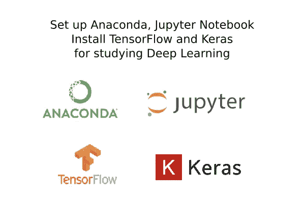
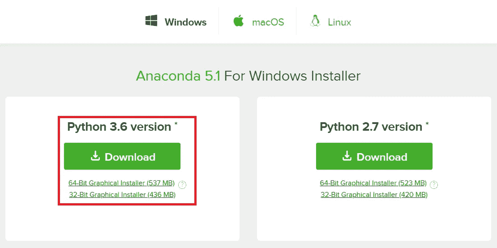
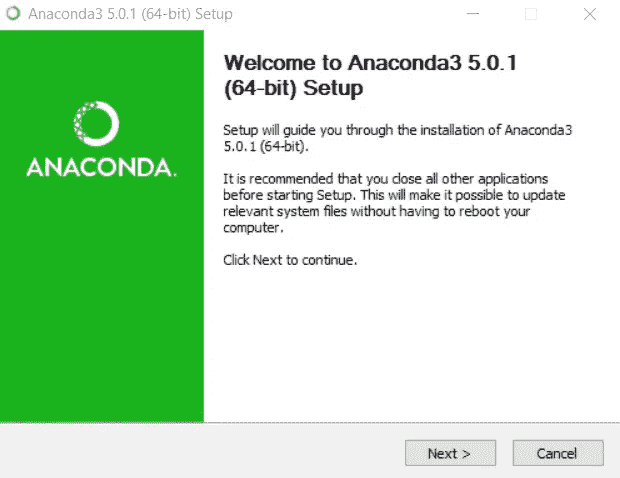
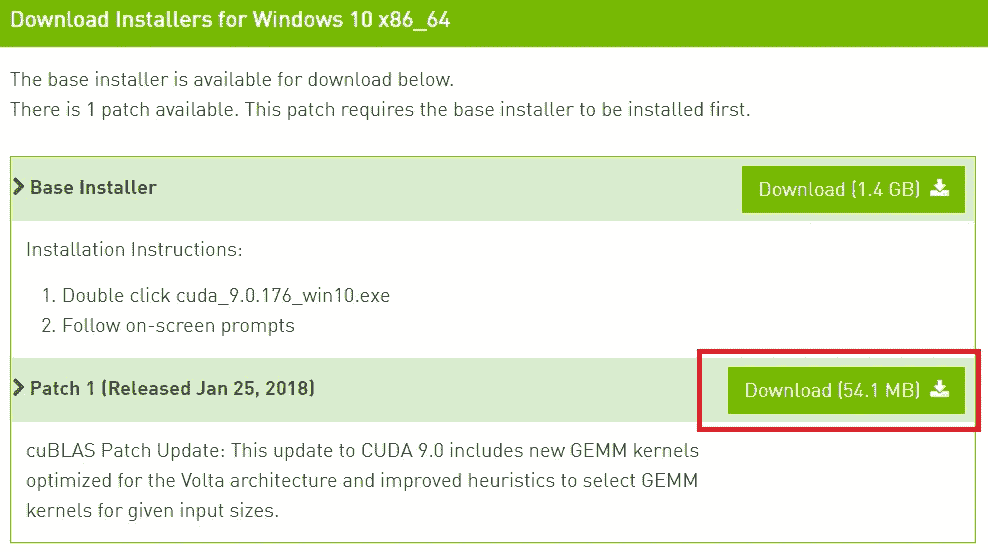
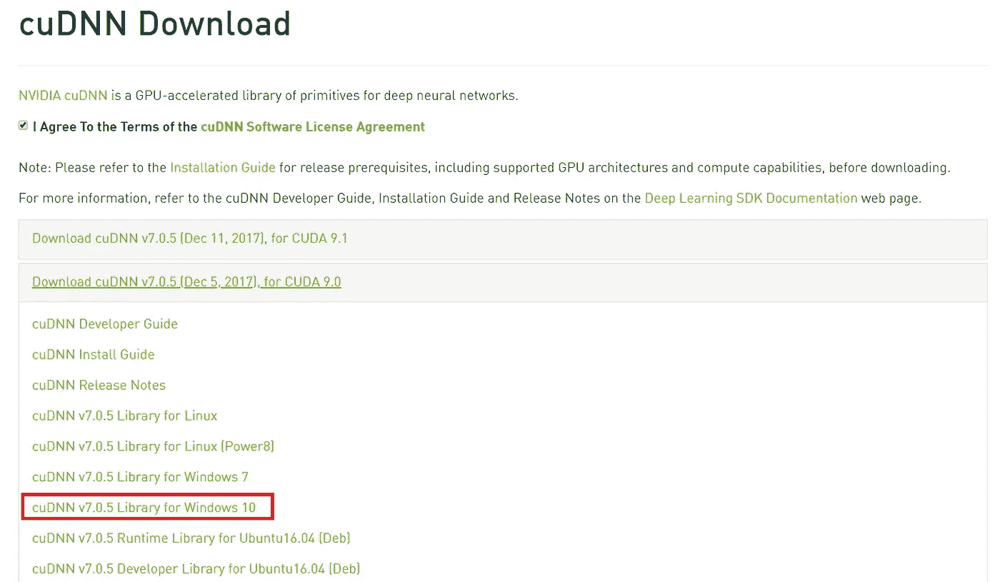

# 为机器学习和深度学习设置 Python 环境

> 原文：<https://towardsdatascience.com/setup-an-environment-for-machine-learning-and-deep-learning-with-anaconda-in-windows-5d7134a3db10?source=collection_archive---------1----------------------->



在过去的十年里，人们对机器学习和深度学习的兴趣激增。你会在计算机科学项目、行业会议和日常生活中的许多应用中看到机器学习。

我假设你已经知道机器学习，因此我不会解释什么和为什么。

因此，我发现许多初学者在安装库和设置环境时面临问题。当我第一次尝试的时候。所以这个指南完全是给新手看的。

在这个故事中，我将告诉您如何在您的系统上轻松设置 python 环境。我用的是 Windows，但是这个指南也适合 Ubuntu 和 Linux 用户。

完成本教程后，你将拥有一个工作的 Python 环境，开始学习和开发机器学习和深度学习软件。

# PC 硬件设置

首先，要在任何数据集上执行机器学习和深度学习，软件/程序需要足够强大的计算机系统来处理必要的计算能力。因此，需要满足以下条件:

1.  **中央处理器(CPU)** —英特尔酷睿 i5 第六代处理器或更高。AMD 同等处理器也是最佳选择。
2.  **RAM** —最低 8 GB，建议 16 GB 以上。
3.  **图形处理器(GPU)** — NVIDIA GeForce GTX 960 或更高。AMD GPUs 无论如何都无法进行深度学习。有关用于深度学习的 NVIDIA GPUs 的更多信息，请访问[https://developer.nvidia.com/cuda-gpus](https://developer.nvidia.com/cuda-gpus)。
4.  **操作系统** — Ubuntu 或者微软 Windows 10。我建议在继续之前将 Windows 10 更新到最新版本。

注:对于笔记本电脑，理想的选择是从任何合适的供应商处购买游戏笔记本电脑，如外星人、华硕、联想军团、宏碁掠夺者等。

让我们直接进入安装过程。我们要撞上岩石了😉

# Nvidia GeForce 体验

该工具旨在更新您的 NVIDIA GPU 驱动程序，这样做要容易得多，如果您有 NVIDIA GPU，强烈建议安装该工具。

[下载 NVIDIA GeForce 体验](https://www.geforce.com/geforce-experience/download)

# 目录

在本教程中，我们将介绍以下步骤:

1.  下载蟒蛇
2.  安装 Anaconda & Python
3.  启动并更新 Anaconda
4.  安装 CUDA 工具包& cuDNN
5.  创建一个 Anaconda 环境
6.  安装深度学习 API(tensor flow 和 Keras)

# 步骤 1:下载 Anaconda

在这一步中，我们将为您的平台下载 Anaconda Python 包。

Anaconda 是科学 Python 的一个免费且易于使用的环境。

*   1.安装 Anaconda (Python 3.6 版本)[下载](https://www.anaconda.com/download/)



我用的是 Windows，你可以根据你的操作系统来选择。

# 步骤 2:安装 Anaconda

在这一步中，我们将在您的系统上安装 Anaconda Python 软件。

下载安装程序后，安装非常简单快捷。打开设置并按照向导说明进行操作。

***#注:*** *它会自动用它安装 Python 和一些基础库。*

根据您的系统，这可能需要 5 到 10 分钟或更长时间。



# 步骤 3:更新 Anaconda

打开 Anaconda 提示符，键入以下命令。不要担心，Anaconda 提示符和 cmd 是一样的。

```
**conda update conda
conda update --all**
```

# 步骤 4:安装 CUDA 工具包& cuDNN

1.  安装 CUDA 工具包 9.0 或 8.0 [下载](https://developer.nvidia.com/cuda-downloads)

根据您的操作系统和 GPU 选择您的版本。

***#版本支持:*** 这里有一个检查你的[版本是否支持](https://docs.nvidia.com/cuda/cuda-toolkit-release-notes/index.html)你的 Nvidia 显卡的指南

要下载其他版本，你可以点击这个链接:[https://developer.nvidia.com/cuda-toolkit-archive](https://developer.nvidia.com/cuda-toolkit-archive)

***#注:*** *由于 TensorFlow 与 CUDA Toolkit 9.1 和 9.2 版本不兼容，建议使用 CUDA 9.0。请根据您的 Nvidia GPU 版本选择 CUDA 版本，以免出错。*



**#注:**9.0 版本的人[下载](https://developer.nvidia.com/cuda-downloads)也可以在进行过程中出现错误的情况下安装给定的补丁。

2.下载 cuDNN [下载](https://developer.nvidia.com/rdp/cudnn-download)

下载 cuDNN 的最新版本。根据您的操作系统和 CUDA 选择您的版本。需要注册会员。别担心，您可以使用您的电子邮件轻松创建一个帐户。



将解压后的文件夹放入 c 盘，如下所示:

```
**C:\cudnn-9.0-windows10-x64-v7**
```

# 步骤 5:将 cuDNN 添加到环境路径中

1.  使用( ***Win + R)*** 打开运行对话框，运行命令 **sysdm.cpl**
2.  在窗口-10 **系统属性**中，请选择**高级**选项卡。
3.  选择环境变量
4.  将以下路径添加到您的环境中。

```
**C:\cudnn-9.0-windows10-x64-v7\cuda\bin**
```

# 步骤 6:创建一个 Anaconda 环境

在这里，我们将为我们的特定用途创建一个新的 anaconda 环境，以便它不会影响 Anaconda 的根。太神奇了！！不是吗？😛

打开 Anaconda 提示符，键入以下命令。

1.  通过调用以下命令，创建一个名为“tensorflow”的 conda 环境(可以更改名称):

```
**conda create -n tensorflow pip python=3.6**
```

2.通过发出以下命令激活 conda 环境:

```
**activate tensorflow**
 (tensorflow)C:>  # Your prompt should change
```

# 第七步:安装深度学习库

在这一步，我们将安装用于深度学习的 Python 库，具体来说:TensorFlow，和 Keras。

1.  [**张量流**](https://www.tensorflow.org/install/)

TensorFlow 是机器学习的工具。虽然 TensorFlow 包含广泛的功能，但它主要是为深度神经网络模型设计的。

= >要安装 TensorFlow，请打开 Anaconda 提示符，键入以下命令。

要安装 TensorFlow 的 GPU 版本:

```
C:\> **pip install tensorflow-gpu**
```

要安装 TensorFlow 的纯 CPU 版本:

```
C:\> **pip install tensorflow**
```

如果您的机器或系统是唯一受支持的 CPU，您可以安装用于基本学习和练习的 CPU 版本。

= >您可以通过在 shell 上运行此程序来测试安装:

```
**>>> import tensorflow as tf
>>> hello = tf.constant('Hello, TensorFlow!')
>>> sess = tf.Session()
>>> print(sess.run(hello))**
```

关于入门和文档，您可以访问[***tensor flow***](https://www.tensorflow.org/get_started/)网站。

2.[](https://keras.io/)

**Keras 是一个高级神经网络 API，用 Python 编写，能够在 [TensorFlow](https://github.com/tensorflow/tensorflow) 、 [CNTK](https://github.com/Microsoft/cntk) 或 [Theano](https://github.com/Theano/Theano) 之上运行。**

**= >要安装 Keras，请打开 Anaconda 提示符，键入以下命令。**

```
**pip install keras**
```

**= >我们运行 [***Mnist_Mlp 试试。Py***](https://github.com/antoniosehk/keras-tensorflow-windows-installation/blob/master/examples/mnist_mlp.py) 在你的提示下。你也可以使用其他[例子](https://github.com/husnainfareed/MNIST-Handwritten-Digit-Recognition)。**

**打开 Anaconda 提示符，键入以下命令。**

```
**activate tensorflow
python mnist_mlp.py**
```

**关于入门和文档，您可以访问[***Keras***](https://keras.io/#keras-the-python-deep-learning-library)网站。**

**下面是我用 Python 实现的数字识别的 [**Keras 标准全连接神经网络**](https://github.com/husnainfareed/MNIST-Handwritten-Digit-Recognition) 。**

**还有其他一些著名的库，如 ***Pytorch、Theano、Caffe2*** 等，你可以根据自己的选择和用途来使用。**

**恭喜你！😉您已经在 Windows 上使用 TensorFlow，Keras(带 Tensorflow 后端)通过 GPU 成功创建了环境！**

## **如果你喜欢这个故事，请点击👏按钮并分享，以帮助其他人找到它。你也可以[给我买杯咖啡](https://www.buymeacoffee.com/hussnainfareed)帮我给你写更多有趣的内容！**