# 用熊猫重塑你的数据的七个简洁步骤或者我如何在 Excel 失败的地方使用 Python

> 原文：<https://towardsdatascience.com/seven-clean-steps-to-reshape-your-data-with-pandas-or-how-i-use-python-where-excel-fails-62061f86ef9c?source=collection_archive---------0----------------------->

# *概念:多级索引、旋转、堆叠、应用、lambda 和列表理解*

# 用熊猫重塑数据是什么样子的…

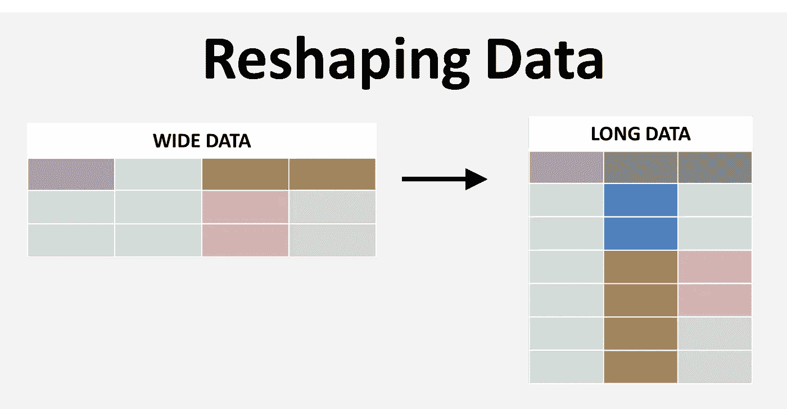

# **用熊猫重塑数据是什么感觉……**

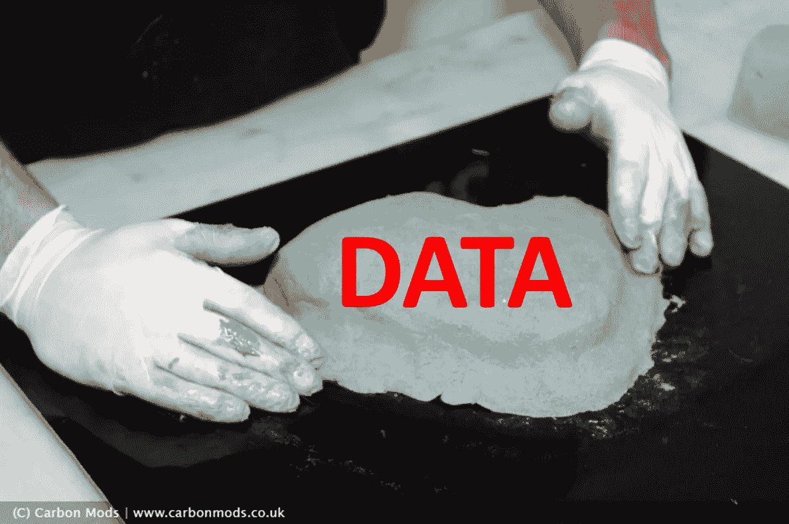

几周前，一位同事发给我一份电子表格，里面有关于公共卫生干预的数据，由许多选项卡组成，每个组织一个选项卡。任务是开发一个灵活的仪表板来研究这些数据。问题是数据是宽格式的，但我们需要长格式。以前，这可能只是另一个复制粘贴的手动任务和其他非常长且重复的任务，但是我决定使用 Python 的 Pandas 库来自动化这项任务，所以我开始开发脚本。不到 30 分钟，我就有了灵活的、可重用的代码，这为我节省了数小时不必要的手工劳动！

我想和你分享我的过程，以防它出现在你自己的工作中。我还将展示一些技巧，并详细解释方法。当然，我已经对数据进行了净化，并为隐私生成了伪数字，但是要处理的格式和概念仍然是相同的。这是我们将如何对待熊猫的**路线图**:

1.  **设置环境并加载数据**
2.  **调查数据**
3.  **解析不同的数据标签**
4.  **标准化现有列并创建新列**
5.  **使用“应用”和“λ”功能清理数据**
6.  **通过旋转多级索引和堆叠将数据从宽到长整形**
7.  **连接并将最终结果保存回 Excel**

我们还将把它包装成一个简洁的函数，可以重用这个函数来自动执行这个任务并节省时间。我已经在我的 [github 账户](https://github.com/tichmangono/python_and_excel)上发布了代码和数据。此外，请查看[https://tichmangono.com/](https://tichmangono.com/)了解更多关于机器学习、Python 和公共卫生的想法。我们开始吧！

# 1.设置环境并加载数据

正如广告所说，我们只需要一个 Python 库来执行这个任务:Pandas！我们的数据是一个带有几个选项卡的 Excel 文件。我喜欢使用 Pandas 的 ExcelFile 对象功能，而不是 read 命令，因为它可以很好地处理多选项卡电子表格。

```
*# Import the relevant libraries...*
*# By the way, I am using Python 3*
**import** **pandas** **as** **pd**
*# Load the raw data using the ExcelFile object*
data = pd.ExcelFile('reshaping_data.xlsx')
```

# 2.调查数据

文件中有四个选项卡，每个选项卡代表一个组织的数据。

```
*# First, see the sheetnames available*
data.sheet_names Output: ['ABC_inc', 'HIJ_inc', 'OPQ_inc', 'XYZ_inc']
```

解析 ABC_inc organization 的第一个选项卡，我们可以看到，在将该格式用作标准数据框之前，还需要做一些工作。该数据包含公共卫生干预的目标。我们可以看到我们的列标题名称从第 6 行开始，并且我们有关于位置的信息(地区、省)；参与的实体(合作伙伴、资金来源)；以及目标年份(2017 年至 2020 年)。还要注意第 7 行是如何在数据中为每年的干预提供目标年龄组的额外信息的。数据主体从第 8 行开始向下。

```
*# Take a peek at the first 10 rows of the first tab*
data.parse(sheetname='ABC_inc', skiprows=0).head(10)
```

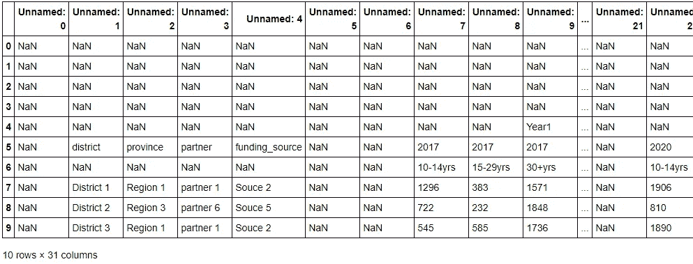

# 3.解析不同的数据选项卡

列出你的目标标签名。在我们的案例中，我们想要所有的。但是，如果您只想对其中的 2 个进行分析，那么您可以很容易地指定一个不同的列表。

```
tabnames = data.sheet_names
```

由于这些选项卡具有相似的格式，因此在本演示中我们将只使用其中的一个。最后，我们将把所有步骤合并成一个单一的、可重用的函数，并使用迭代将该函数应用于所有目标选项卡。然后我们将连接并保存结果。因此，将选项卡解析成数据帧 df，跳过顶部无用的空行。我总是使用“data.head()”来检查我的结果，并确保我的代码如我所愿。

```
i = 0
df = data.parse(sheetname=tabnames[i], skiprows=7)
df.head(2)
```

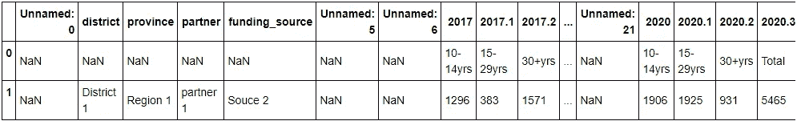

# 4.标准化现有列并创建新列

列出默认的列。我们将丢弃一些，但也会去掉其余的，以获得用于新列名的信息。我们需要保留特定年份、年龄组和组织的信息。

```
*# make a list of the header row and strip up to the 4th letter. This is the location and year information*
cols1 = list(df.columns)
cols1 = [str(x)[:4] **for** x **in** cols1]*# make another list of the first row,this is the age group information*
*# we need to preserve this information in the column name when we reshape the data* 
cols2 = list(df.iloc[0,:])
cols2 = [str(x) **for** x **in** cols2]*# now join the two lists to make a combined column name which preserves our location, year and age-group information*
cols = [x+"_"+y **for** x,y **in** zip(cols1,cols2)]
*# Assign new column names to the dataframe*
df.columns = cols
df.head(1)
```

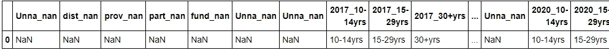

```
*# Drop empty columns, Rename the useful columns*
*# Note when you drop, you should specify axis=1 for columns and axis=0 for rows*
df = df.drop(["Unna_nan"], axis=1).iloc[1:,:].rename(columns=    {'dist_nan':'district',                                              'prov_nan': 'province',                                                   'part_nan':'partner',                                                   'fund_nan':'financing_source'})df.head(2)
```

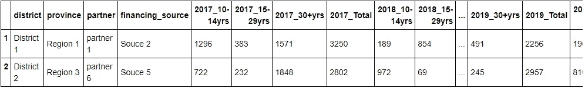

```
*# Engineer a new column for the organization, grab this name from the excel tab name*
*# This should read 'ABC inc' if executed correctly*
df['main_organization'] = tabnames[i].split("_")[0] + " "+ tabnames[i].split("_")[1]
df.main_organization.head(2)**Output:**
1    ABC inc
2    ABC inc
Name: main_organization, dtype: object
```

让我们暂停一下，看看目前为止我们的数据帧的结构。

```
df.info()
```

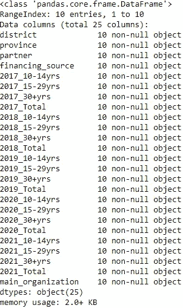

我们看到总共有 29 列。然而，目前，它们都具有“对象”数据类型，我们知道其中一些应该具有数字数据类型。我们还有冗余的“总计”列。请注意，列名仍然保留了多级信息，即特定列中的数据所属的年份和年龄组！这是本练习的一个关键方面，我们将在下一步中看到。在此之前，让我们稍微清理一下…

# 5.使用“应用”和“λ”函数清理数据

让我们删除更多的冗余列，并更改数据类型。

```
*# Make lists of the columns which need attention and use this as reference to execute*
*# You will notice that I use list comprehension every time I generate an iterable like a list or dictionary*
*# This is really amazing python functionality and I never want to go back to the old looping way of doing this!*
to_remove = [c **for** c **in** df.columns **if** "Total" **in** c] *# redundant*
to_change = [c **for** c **in** df.columns **if** "yrs" **in** c] *# numeric**# drop unwanted columns*
*# Notice that you need to specify inplace, otherwise pandas will return the data frame instead of changing it in place*
df.drop(to_remove, axis=1, inplace= **True**) *# Change the target column data types*
**for** c **in** to_change:
    df[c] = df[c].apply(**lambda** x: pd.to_numeric(x))
```

查看变化:

```
df.info()
```

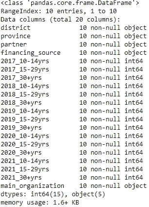

看来成功了！

# 6.通过旋转多级索引和堆叠，从宽到长地重塑数据

现在，我最喜欢的部分——重塑数据！当涉及到数据时，这个功能给了你如此大的力量。鉴于电子表格和调查类型的数据在我的工作中非常流行，我经常使用它来清理和操作数据。对我来说，重塑数据就像是粘土，我正在亲手塑造它:)。因此，我们将在战略索引上使用旋转，然后使用堆叠来实现我们想要的形状。目前，数据是一种宽格式，但我们需要将其更改为长格式，以便我们可以轻松地将其传输到 Excel，长格式可以非常轻松地快速创建数据透视表和仪表板。

```
*# First, select the columns to use for a multi-level index. This depends on your data*
*# Generally, you want all the identifier columns to be included in the multi-index* 
*# For this dataset, this is every non-numeric column*
idx =['district','province','partner','financing_source'
,'main_organization']*# Then pivot the dataset based on this multi-level index* 
multi_indexed_df = df.set_index(idx)
multi_indexed_df.head(2)
```

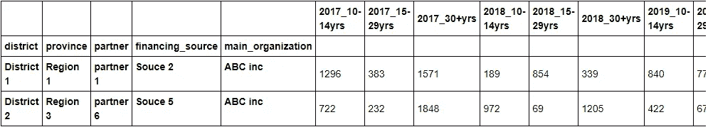

在我们战略性设计的多级索引上旋转数据框后，我们现在将堆叠所有的数字列。这将使我们能够灵活地将数据恢复到我们希望的水平，就像 Excel 数据透视表一样。

```
*# Stack the columns to achieve the baseline long format for the data*
stacked_df = multi_indexed_df.stack(dropna=**False**)
stacked_df.head(25) *# check out the results!*
```

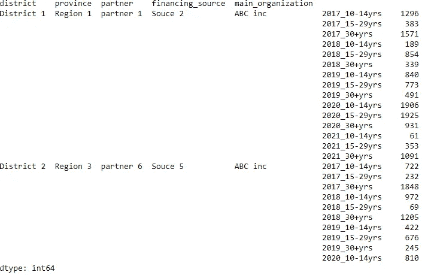

介意。吹了！我第一次看到这个的时候也是这种感觉。

```
*# Now do a reset to disband the multi-level index, we only needed it to pivot our data during the reshape*
long_df = stacked_df.reset_index()
long_df.head(3)
```

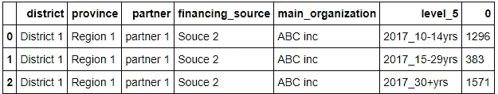

请注意,“level_5”列包含两条信息。这是从一开始就故意做的，以便在删除一些列和行时不会丢失任何信息。现在，让我们使用字符串操作来分离它们，然后删除任何冗余。

```
*# Make series of lists which split year from target age-group*
*# the .str attribute is how you manipulate the data frame objects and columns with strings in them*
col_str = long_df.level_5.str.split("_") 
col_str.head(3)**Output:**
0    [2017, 10-14yrs]
1    [2017, 15-29yrs]
2    [2017, 30+yrs]
Name: level_5, dtype: object*# engineer the columns we want, one columns takes the first item in col_str and another columns takes the second* 
long_df['target_year'] = [x[0] **for** x **in** col_str] 
long_df['target_age'] = [x[1] **for** x **in** col_str]
long_df['target_quantity'] = long_df[0] *# rename this column*
long_df.head(2)
```

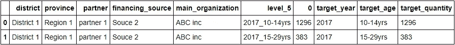

```
*# drop the now redundant columns*
df_final = long_df.drop(['level_5', 0], axis=1)
df_final.head(2)
```

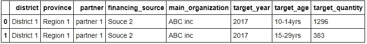

# 7.连接并将最终结果保存回 Excel

现在我们有了所有需要的成分，我们可以定义一个函数来自动调整形状，使用迭代将这个函数应用到我们想要的任意数量的选项卡上，然后最后将它保存到我们选择的电子表格中！请注意，在函数中，我组合了形状并添加了一个断言来检查输入是否正确，但代码基本相同。

```
*# Now define a function for doing the reshape*
**def** ReshapeFunc(excel_obj, i):
    *""" Takes in an excel file object with multiple tabs in a wide format, and a specified index of the tab to be parsed and reshaped. Returns a data frame of the specified tab reshaped to long format"""*

    tabnames = data.sheet_names
    **assert** i < len(tabnames), "Your tab index exceeds the number of available tabs, try a lower number" 

    *# parse and clean columns*
    df = excel_obj.parse(sheetname=tabnames[i], skiprows=7)
    cols1 = [str(x)[:4] **for** x **in** list(df.columns)]
    cols2 = [str(x) **for** x **in** list(df.iloc[0,:])]
    cols = [x+"_"+y **for** x,y **in** zip(cols1,cols2)]
    df.columns = cols
    df = df.drop(["Unna_nan"], axis=1).iloc[1:,:].rename(columns={'dist_nan':'district',                                   'prov_nan': 'province',                                                       'part_nan':'partner',                                                       'fund_nan':'financing_source'}) *# new columns, drop some and change data type*
    df['main_organization'] = tabnames[i].split("_")[0] + " "+ tabnames[i].split("_")[1]
    df.drop([c **for** c **in** df.columns **if** "Total" **in** c], axis=1, inplace= **True**) 

    **for** c **in** [c **for** c **in** df.columns **if** "yrs" **in** c]:
        df[c] = df[c].apply(**lambda** x: pd.to_numeric(x)) *# reshape - indexing, pivoting and stacking*
    idx = ['district','province', 'partner','financing_source'
,'main_organization'] multi_indexed_df = df.set_index(idx)
    stacked_df = multi_indexed_df.stack(dropna=**False**)
    long_df = stacked_df.reset_index()

    *# clean up and finalize*
    col_str = long_df.level_5.str.split("_") 
    long_df['target_year'] = [x[0] **for** x **in** col_str] 
    long_df['target_age'] = [x[1] **for** x **in** col_str]
    long_df['target_quantity'] = long_df[0] *# rename this column*
    df_final = long_df.drop(['level_5', 0], axis=1) **return** df_final
```

运行该功能

```
*# Check that our function works:*
check_df = ReshapeFunc(data, 2)
check_df.head(2)
```

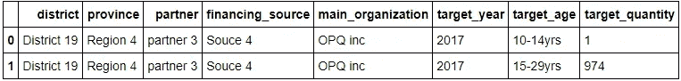

酷！现在使用函数为每个选项卡创建一个数据框，将它们全部放入一个列表中，将它们连接成一个数据框，并将其保存回 Excel。

```
dfs_list = [ReshapeFunc(data, i) **for** i **in** range(4)]
concat_dfs  = pd.concat(dfs_list)
concat_dfs.to_excel("reshaping_result_long_format.xlsx")
```

这种长格式现在可以很容易地用于数据透视表，并通过透视描述性的非数字列的任意组合和聚合数字列来制作仪表板图表和分析。任务完成。

为了和我一起工作，请点击这里查看我的博客:[**【https://tichmangono.com/】**](https://tichmangono.com/)

编码快乐！