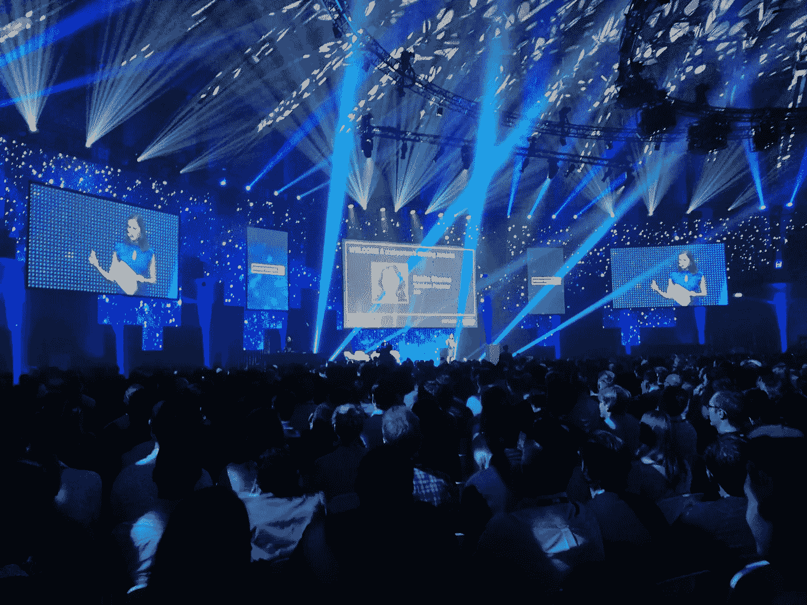
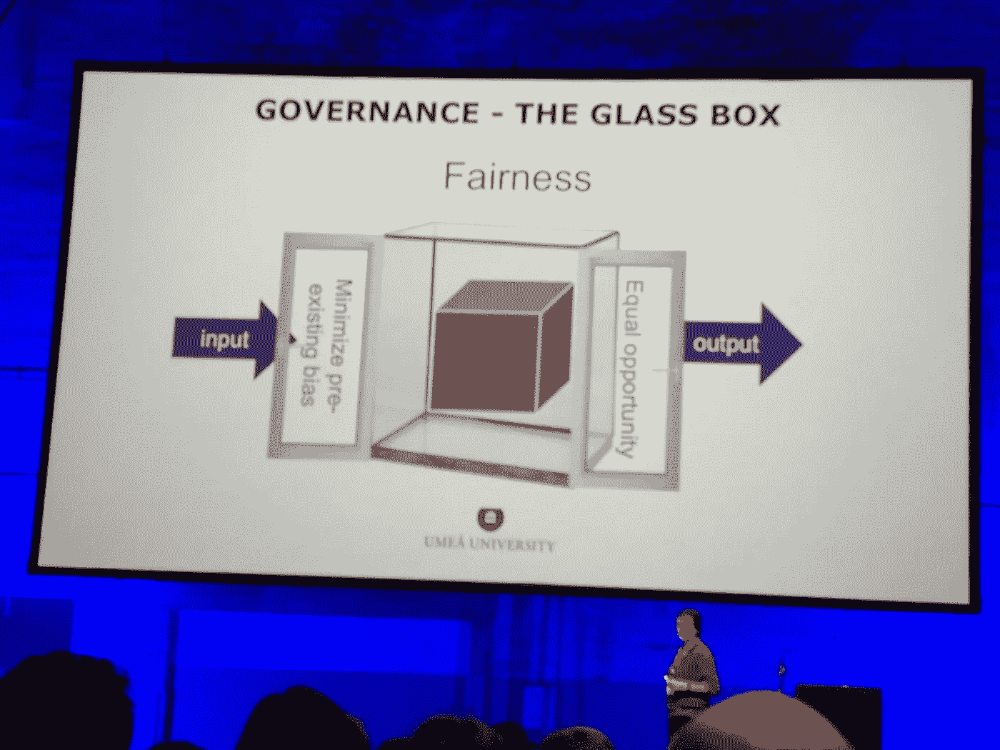
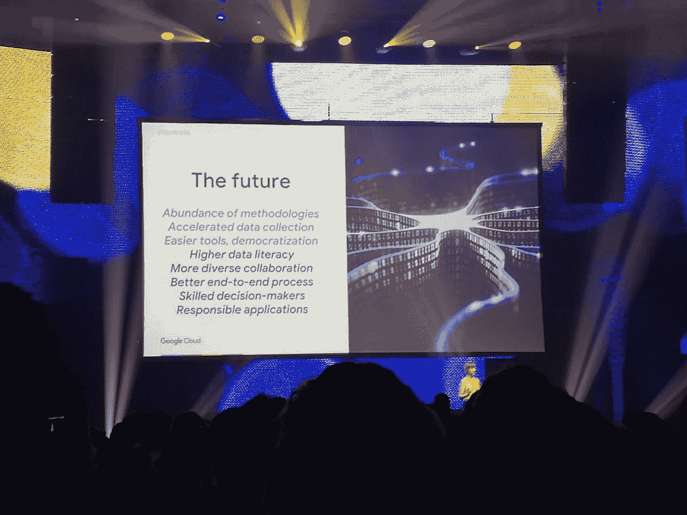
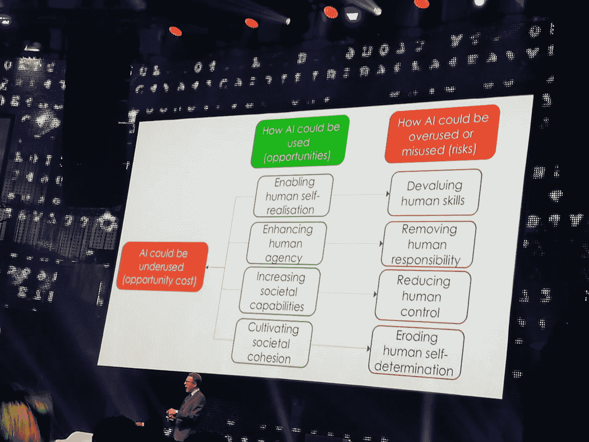

# 人工智能世界峰会的七大趋势

> 原文：<https://towardsdatascience.com/seven-trends-from-world-summit-ai-amsterdam-d642ede4da4c?source=collection_archive---------18----------------------->

上周，阿姆斯特丹举办了世界人工智能峰会。在这两天里，人工智能专家、行业成员、学术界和机构聚集在一起，分享和讨论人工智能方面最热门的新闻和想法。显而易见的是，这个领域比以往任何时候都更令人兴奋，而且仍在以惊人的速度增长。在这里，我提出了讨论过的七个主要话题。

The World Summit AI introduction

*   **公平 AI** :随着机器学习的普及及其在几乎所有行业的应用，确保机器学习算法的公平性变得越来越重要。虽然我们知道在收集的数据中可能存在偏差，无论是由于内在偏差还是由于数据收集和生成，我们的机器学习模型都应该尽可能无偏。这些担忧已经存在很多年了，尤其是在保险和银行等行业，但问题正在各地浮出水面。就在上周[亚马逊宣布将废弃其新的简历筛选引擎](https://www.theguardian.com/technology/2018/oct/10/amazon-hiring-ai-gender-bias-recruiting-engine)，原因是其中存在严重的性别偏见。控制模型偏差的建议解决方案有多种。目前一个很大的焦点是放在模型的可解释性上，我们将在下面的要点中展开。另一个强烈的话题，尤其是来自学术界的，与监管有关。这些法规将特别关注模型的透明度和公平性约束，包括输入数据和输出预测。在实践中，这可以作为一种新的机器学习模型，在有偏见的模型之上，使数据输入和预测输出无偏见。这些技术中的一些目前正在被探索，例如使用[生成对抗网络的特定架构](https://arxiv.org/abs/1805.11202)。

An example of the structure for a fair ML model by Prof. Virginia Dignum

*   **模型可解释性**:能够从机器学习模型中解释决策和预测的重要性是整个事件中反复出现的话题。这个想法是为了让模特感觉不那么像个黑匣子。可解释性的主要原因是模型责任。如果人工智能的公平性是一个问题，直接的后果是模型需要对它们做出的决定负责，需要对为什么做出某种预测做出解释。达到可解释性的两条主要途径是技术性的和规范性的。在技术方面，已经开发了多个框架来解释模型预测，如 [LIME](https://arxiv.org/abs/1602.04938) 和 [ELI5](https://github.com/TeamHG-Memex/eli5) 。许多其他公司，比如 Alpha 和 T7，也在致力于开发新技术，有望带来更加透明的模型。另一条实现模型可解释性的途径是通过监管。这是学术界讨论和研究的一个非常活跃的话题。一些规定已经在计划中，并将很快到位[，作为可解释机器学习 GDPR](https://www.law.ox.ac.uk/business-law-blog/blog/2018/05/rethinking-explainable-machines-next-chapter-gdprs-right-explanation)的一部分。其他方法建议要求模型是开源的，这样它们就可以被检查。然而，这似乎是一个很大的要求，而且，没有用于训练模型代码的数据可能没有多大意义。模型可解释性的另一个原因是模型不仅可以用于预测。例如，在预测性维护的情况下，通过预测来了解系统的状态以及是否需要干预。然而，通过模型解释，我们还可以获得关于需要评审的组件或者处于风险中的特定过程的更详细的信息。因此，如上所述的新技术的发展也将极大地有益于这些类型的应用。
*   从研究到应用:在过去几年里，在谷歌和脸书等巨头的推动下，人工智能的研究飞速发展。强大的新技术或改进的旧技术，加上计算能力的提高，已经允许在图像分类和语音识别等领域取得巨大成果，通常超过人类的准确性。现在，来自世界人工智能峰会的普遍感觉是时候将人工智能的重点从研究转移到应用，让这些新技术得到应用，以获得价值。许多因素都表明了这一点。首先，人工智能的民主化努力，这将在下一点讨论。第二，对实际应用的极大关注，在许多会谈中都得到强调。在金融、自动驾驶无人驾驶机队和人造卫星方面取得了巨大成就。医疗保健行业仍然被认为很少受到人工智能革命的影响，同时也被认为是人工智能应用可以蓬勃发展的最佳行业之一。
*   **AI 民主化**:AI 技能的传播是大会最大的主题之一。来自谷歌的 Cassie Kozyrkov 解释了他们如何训练 17k(！！！)决策智能方面的员工，即应用人工智能解决业务问题。这使得基本上每个团队都有能力在他们的产品中实现机器学习驱动的功能。民主化也可以通过云服务来实现。IBM 和 Google 等云提供商允许通过简单的 API 调用来应用复杂而强大的算法。这为更多的观众提供了快速而廉价地应用新技术的机会，而无需深入的 ML 知识或花费时间来制作和训练深度神经网络。人工智能民主化还伴随着一个新的、更广泛的概念，即规划数据科学项目和组建团队来应用机器学习。
*   **团队的多学科方法**:虽然行业越来越关注应用人工智能和民主化人工智能，但关注如何获得成功结果也很重要，即如何构建团队，使他们能够推动创新。关键的一点是需要多种多样的技能。特别是，机器学习研究人员需要嵌入到由面向业务的专家、软件工程师、数据工程师等组成的团队中。多学科是数据科学项目成功的关键。这是因为最佳 ML 算法的应用和选择只是问题的一部分。数据管道、关注正确的业务问题、产品集成也同样重要，并且需要多种技能才能出现在项目中。

The future of AI, from Cassie Kozyrkov

*   **以人工智能为导向的决策者:**随着人工智能在似乎每个行业和我们生活中越来越多的部分的大规模扩散，我们也需要领导者和决策者以人工智能为导向。首先，这是机器学习项目成功和人工智能成功传播的关键。其次，人工智能提供了从海量数据中分析和获取洞察力的工具，使决策者能够做出更快、更明智的决策。例如，ING 展示了他们的人工智能驱动的投资工具。这个工具可以扫描数百万的资产和投资策略，为投资组合经理提供以前无法想象的大量交易机会的概览。
*   **人工智能带来的好处**:最后，大量的注意力被投入到能够使用人工智能来关注巨大的社会问题的重要性上。Telefonica 成立了一家 moonshot 公司， [Alpha](http://www.alpha.company/) ，专注于解决健康问题，尤其是帮助人们重新获得对日常行为的有意识控制。来自牛津大学的 Luciano Floridi 教授专注于人工智能可能为人类和地球带来的风险，以及人工智能可能为每个人带来的巨大潜力:让我们的生活变得更好，将我们从枯燥乏味甚至危险的工作中解放出来，增强人类的能力，让我们更加亲近。

AI dangers and opportunities, from Luciano Floridi presentation

# **结论**

世界峰会人工智能真的很鼓舞人心。该行业显然处于良好状态，而且似乎只会上升。AI 未来肯定是红火的。尽管如此，在保护个人及其隐私的同时，让每个人都能正确使用这一令人惊叹的技术仍有许多挑战、不确定性和问题需要解决。

鸣谢:我要感谢 booking.com 给我参加这个盛会的机会。