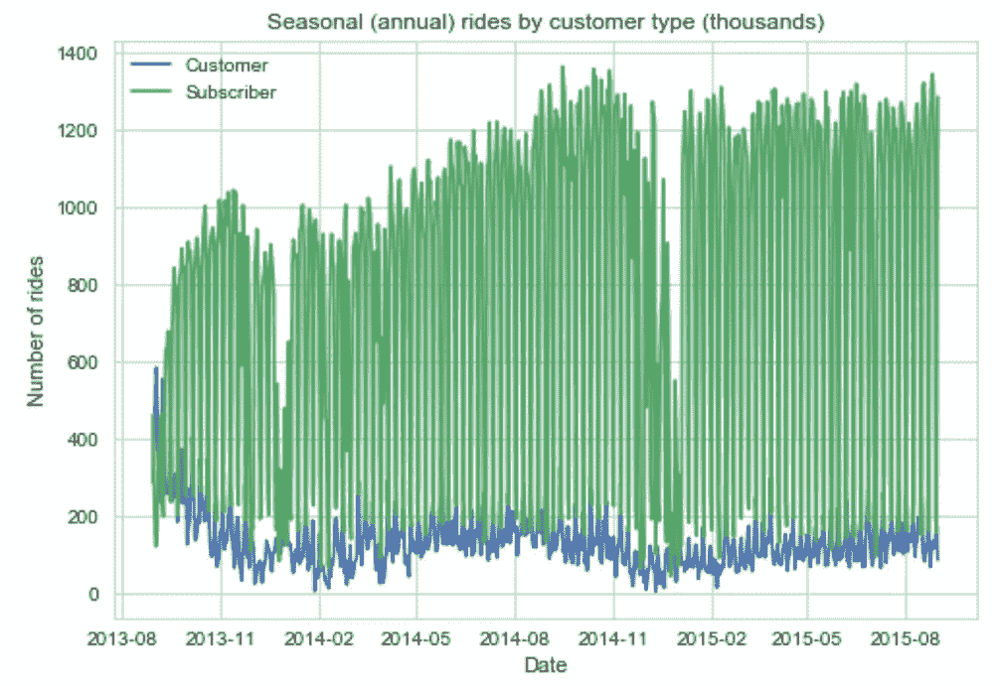
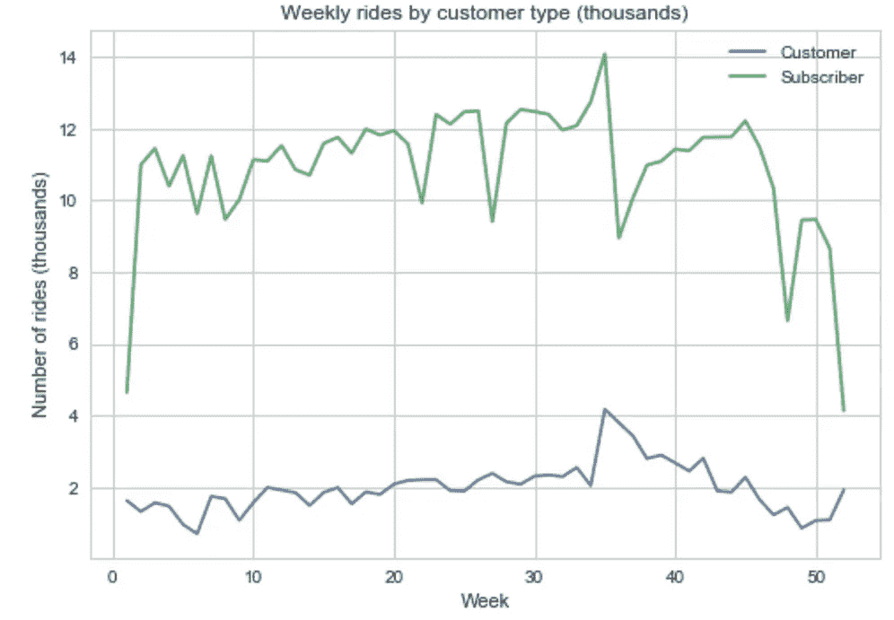
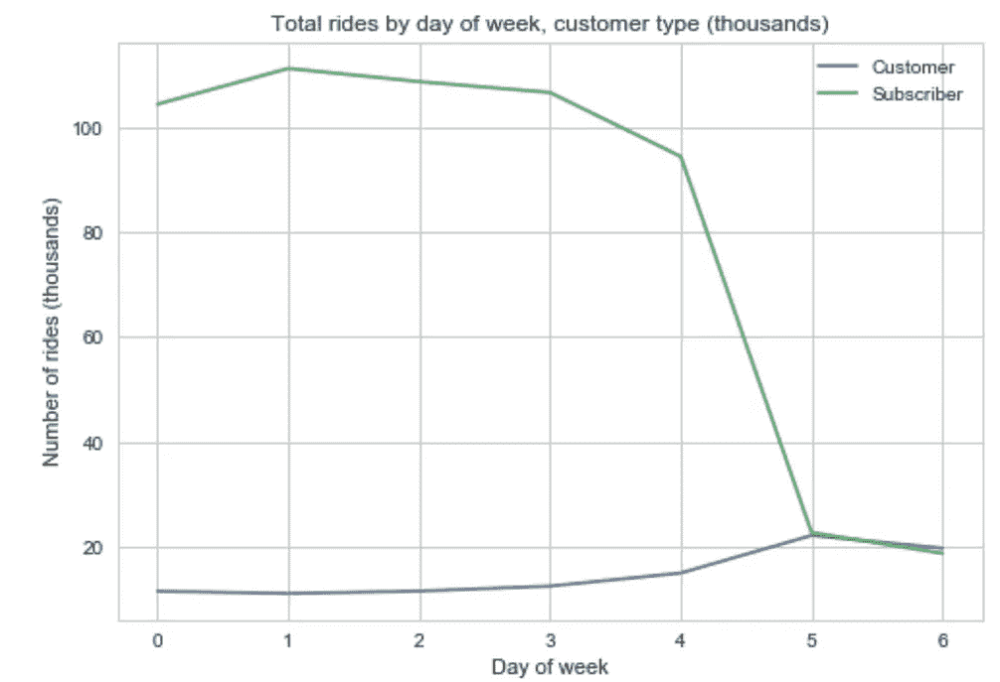
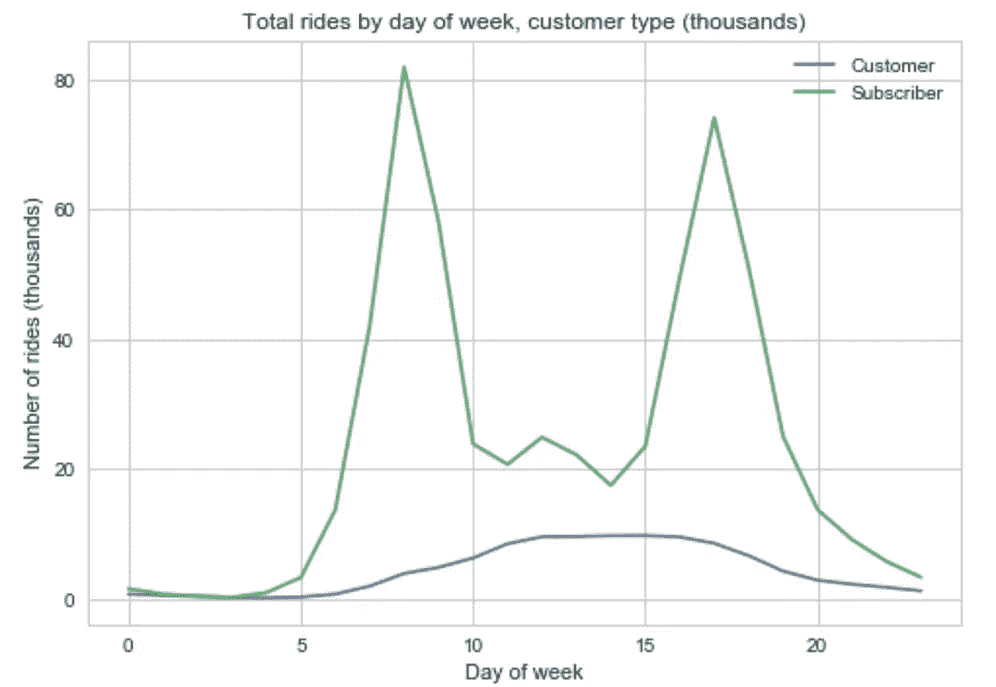
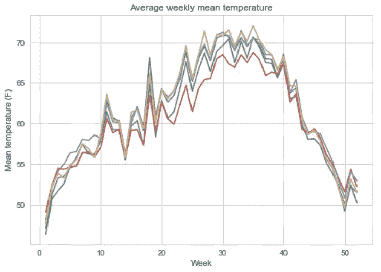
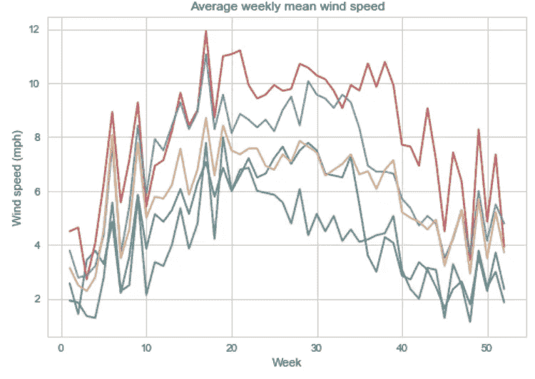
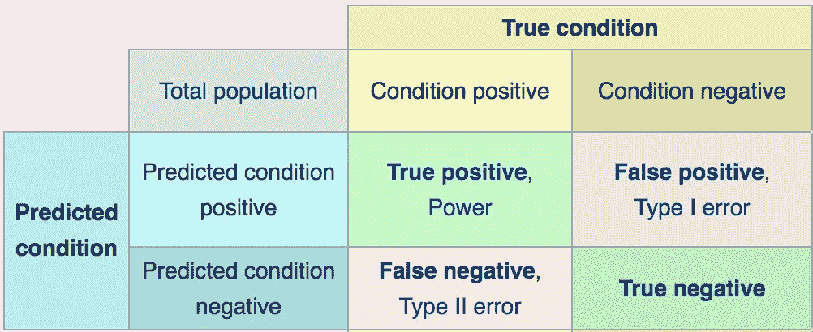
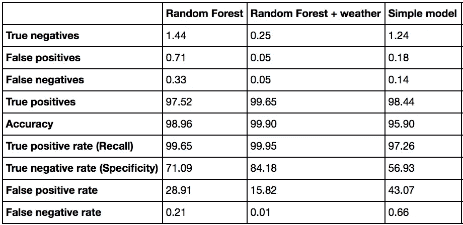

# 骑自行车还是不骑自行车？机器学习对旧金山自行车共享计划的可用性进行建模

> 原文：<https://towardsdatascience.com/sf-bike-share-predictions-e15316ce300f?source=collection_archive---------5----------------------->

自行车共享项目正在世界各地的城市涌现，为专业人士和游客提供了灵活的交通方式。自行车共享系统通常建有“停靠站”，用户可以在那里借出和归还自行车。2013 年，旧金山推出了自行车共享计划，截至 2015 年，该计划在全市共有 70 个站点。


Imagine if cities had communal road bikes like this…!

自行车共享项目对项目所有者(城市)和使用者(骑手)都提出了挑战。例如，城市经常在车站之间手动重新分配自行车，以确保自行车和码头(归还自行车的槽)的可用性。城市也需要使用骑车人的数据来通知未来自行车站应该安装在哪里。对于用户来说，主要问题是:如果我现在离家/上班，到了最近的车站会有自行车吗？给定站点自行车的不确定性具有很强的商业含义，因为不可预测的自行车供应会阻碍骑行和停滞需求。这个项目关注自行车可用性的用户挑战。

该项目评估旧金山自行车共享系统的当前骑行趋势和预测自行车可用性(在请求后 30 分钟内)。这个项目的三个主要部分包括:探索性数据分析、一个简单的确定性模型和两个机器学习模型(一个具有时间和通勤特征，一个添加了天气数据)。在所有功能中，未来自行车可用性的最大预测因素是车站中的当前自行车，其次是周、月和通勤时间。在天气特征中，云层覆盖是最强的预测因素——如果你熟悉旧金山的天气，这并不奇怪！

具有高级特征工程的机器学习模型表现优于其他两个模型模型，误报率为 15%，误报率为 0.01%。

# 数据概述

使用了以下公开可用的数据([来源](https://www.kaggle.com/benhamner/sf-bay-area-bike-share/data)):

*   状态:每分钟更新 70 个站点中每个站点可用的自行车数量和码头数量
*   天气:旧金山湾区的 zip 级每日天气模式
*   电台:每个电台的元数据(n = 70)
*   行程:行程级别记录，包括日期、开始/结束时间、开始/结束站点 ID、开始/结束站点名称、自行车 ID、骑手订阅类型和行程持续时间

## 探索性数据分析

在按订阅类型(订阅者:月会员或年会员，客户:临时现收现付会员)对乘客进行分组后，我探索了季节性、每周和每日的乘客模式。所有的时间框架都强调了订户和顾客的不同模式，支持了订户是通勤者而顾客主要是游客的假设。

乘客量在 8 月/9 月/10 月达到高峰，在冬季假期前后会有一个淡季。这可能是由于旅游趋势或天气影响了休闲通勤者是否骑自行车(秋天是众所周知的旧金山最好的季节，冬天——当我们不在干旱的时候——非常潮湿)。



**Daily (2013–2015)** (left): Daily ridership increased since implementation. Customer ridership shows seasonal patterns, peaking in Aug/Sept/Oct and with a lull around the holidays. **Annual** (right): Subscriber ridership dips around holidays: week 22 (Memorial Day), 27 (July 4th), 36 (Labor day), 46/47 (Thanksgiving), & 51/52 (Christmas & New Years). Excluding holidays, ridership increases slightly in the first half of the year, peaking in summer (week 34/35) in ideal bike weather. Customer ridership also increases slightly with local maximum during holidays and a global max during Labor Day; rides start to drop off in the Fall.



**Weekly** (left): High weekday ridership for Subscribers with a large drop (~1/5) on weekends. Customers have a reverse trend with ~2x rides on weekends vs. the beginning of the week. **Hourly** (right): Subscribers show a distinct bi-modal daily usage pattern, with peaks during AM & PM commute hours, and a small increase during lunch. Customers get a later start (as one does on vacation), with steady usage 11am until the early evening.

## 假设

现在我们已经了解了数据和用户行为的大致趋势，下一步是建立一个简单的确定性模型来预测自行车的可用性。从骑车人的角度来看，自行车可用性是一个二元问题:自行车可用吗？是或否。因此，二元分类器是合适的。注意，从我的经验来看，并不是自行车共享系统中的所有自行车都可以使用。因此，稍微调整分类器，所有模型对在给定时间在一个站点是否有至少 2 辆自行车可用进行分类。

我们可以在上面的图表中看到，不同的站点呈现出不同的模式。例如，在居民区的车站，自行车在早上减少，在晚上增加。相反，靠近办公室的车站则相反。这证明了我们的预测模型的简化假设:我们可以为每个站建立独立的模型，从而明确地选择忽略不同站的行为之间的相关性。

## 数据管道

这三个模型都依赖于预处理步骤，如数据过滤、协调/简化数据类型和特征工程。为了支持更快的处理和更容易从内核崩溃中恢复(原始状态数据文件为 2.5 GB)，实现了预处理 Python 脚本来持久化输出数据。总的来说，这些转换阶段构成了进入模型的数据管道。

1.  将人类可读的时间戳转换为纪元毫秒。
2.  生成一个测试数据集(用于简单模型)，其中的行满足两个条件:(1)一个月中的第几天小于给定的一个月中的第几天(例如，如果 max_day_of_month <5，则返回的测试集包含每个月的第 5 天，约为 13%)。(2)星期几等于 ISO 格式的给定星期几(星期几= 3，因为当前确定性模型是为星期三计算的)。

对于两种机器学习模型(从步骤 1 的输出开始):

1.  添加两个新列(1-适当的模型时间；2-t+30 分钟的真实自行车可用性)，如果该行的时间戳在指定模型时间(在数组中)的 30 分钟内。否则，它将从数据集中删除该行。
2.  将以下离散化日期时间列添加到数据集:ISO 星期几(1–7)；ISO 月(1–12)；通勤标志为 3 个二进制列；非上下班时间(1/0)；AM 通勤(1/0)—7 点到 09:00 之间的状态更新；PM 通勤(1/0)—16:00 到 18:00 之间的状态更新。
3.  在 t+30 分钟内添加一个站点的真实自行车数量。

# 模型结构

## 确定性模型

为了与我们最终建立的机器学习模型进行比较，让我们创建一个确定性模型来计算 30 分钟间隔内每站自行车可用性的变化。自行车可用性的变化使用最小二乘法进行近似计算，最小二乘法拟合一条曲线，使数据集中的因变量(自行车可用性)与线性函数(时间= x)预测的值之间的差的平方和最小化。为了建立模型，我使用上面确定的每日交通模式来定义适当的模型时间。基于高需求，模拟了以下 30 分钟的间隔:早上(7:30，8，8:30，9AM)和晚上(4，4:30，5，5:30，6PM)。为每个站点计算最小二乘拟合线，自行车可用性预测为:当前自行车可用性+(最小二乘线的斜率 x 30)。

```
popt_all_stations = []
row_headers = []

**for** i **in** station_ids:
    s = station_availability(i, n_bikes= n_bikes, dow= dow)       
    popt_single = []
    **for** j **in** start_times:
        start_time = pd.to_datetime(j)
        end_time = start_time + delta
        df = s.between_time(start_time.time(), end_time.time())
        xdata = df.index.minute
        ydata = np.array(df.bikes_available)
        popt, pcov = optimization.curve_fit(func, xdata, ydata)
        popt_single.append(popt[1])
    popt_all_stations.append(popt_single)
    row_headers.append(i)

*# reshape model ouput with time as column headers, station as index*
df = pd.DataFrame(popt_all_stations)
df.columns = start_times
df.index = row_headers

*# Convert model from minute-by-minute change in bike availabilty --> total change during* 
*# model window (e.g. the 16:00 model applies to status updates between 16:00 and 16:29)*model = df*29
model['station_id'] = model.index
model = pd.melt(model, id_vars = ['station_id'])
model.head()
```

下面我将所有型号一起评估。

## 简单机器学习模型

第一个机器学习模型使用简单的功能，根据状态时间戳设计:星期几、月份、通勤时间(非通勤、上午或下午)。预处理在数据管道中执行——主要是因为 Jupyter notebook 无法将未来自行车的可用性映射到状态表中的每一行。如上所述，对于骑车人来说，自行车可用性的问题是二元的；骑车人不在乎有多少辆自行车，而是在乎有没有一辆自行车。在这种情况下，我们将使用一个随机森林分类器，这将有助于稍后使用梳理出我们的功能的相对重要性。

输出是每个站一个模型(70)；下面总结了每个模型特性的重要性。使用。describe()，我们还能够收集关于站点间特征重要性差异的见解。总的来说，当前自行车的可用性是未来自行车可用性的最具预测性的特征。在较小的程度上，月份和星期几是可以预测的。通勤时间并不重要。

```
pd.DataFrame(feature_imp, columns=X_train.columns).describe()
```


## 机器学习模型 2:高级特征工程

现在我们已经看到了一个基本的机器学习模型，下一步是添加更多复杂的功能，希望提高模型的性能。特别是，当通勤者选择他们的交通方式时，天气的各个方面(例如温度、降水)是关键的决定因素。在接下来的模型中，我们将引入大量的日常天气特征。



Could temperature and wind speed help predict bike demand? There are clear seasonal patterns that could feasibly drive bike usage.

与第一个 ML 模型一样，这个模型是特定于站点的。为了快速比较，为单个站点(站点#2)创建了天气增强模型。

随机森林的要素重要性方法显示了天气增强模型中要素的相对重要性(即原始 ML 模型要素以及附加的新天气要素)。我们看到，目前的自行车可用性仍然远远超出了未来自行车可用性的最佳预测。一周中的某一天、AM 通勤时间和非通勤时间也是原始模型中相当重要的特性。在新增的天气特征中，云量是最重要的特征，其次是最大露点、最小露点和最大湿度。在一个天气不可预测、云层覆盖臭名昭著的城市(我正看着你呢，卡尔)，云层覆盖影响自行车骑行率(以及自行车的可用性)并不奇怪。

*如果你不熟悉旧金山，夏天的日常大雾是如此强烈和常见，以至于它被亲切地称为卡尔。

# 那么哪个“更好”呢？

要回答这个问题，我们必须就如何恰当地评估模型达成一致。由于严重的类别不平衡(例如，一个类别在数据中明显占多数)，准确性(一个常见的默认评估指标)在这里不会出现。只有一小部分自行车站点在车型期间没有足够的自行车可用。事实上，96.6%的车站在给定时间段有自行车可用。因此，预测所有车站始终有可用自行车的分类器将有 96%的准确率…但这将是一个可怕的分类器。混淆矩阵提供了更好的评估指标。



Confusion matrix

从骑手的角度来看，最重要的指标之一是假阳性率:假阳性(错误归类为阳性的阴性事件的数量)与实际阴性事件总数的比率。换句话说:如果一个模型说自行车将在 30 分钟内可用，当用户到达时，实际上会有自行车吗？



Comparison of evaluation metrics for all three models (2 machine learned models, and one simple deterministic model).

对于用户最重要的指标——误报率和漏报率——这两个机器学习模型都优于简单的确定性模型。具体来说，天气增强随机森林模型在假阳性率(简单模型的 FPR 的三分之一)和假阴性率(0.01%对简单模型的 0.66%)方面远远优于简单模型。

# 可能的扩展

除了运行额外的机器学习分类器(例如 SVM、逻辑回归)进行比较，该数据集还具有进一步特征工程的巨大潜力，包括:

*   自行车可用性的历史变化率(例如，简单模型中最小二乘方线的斜率)
*   在前一个 x 分钟窗口中在车站开始/结束的乘车次数-提供车站受欢迎程度的洞察，否则会在车站状态更新中丢失(例如，如果一个行程在车站 A 开始，而另一个行程在车站 A 结束，则可用自行车的数量将是静态的)
*   行程开始/结束时间流行度(例如，使用一阶导数找到当地最大和最小行程数)
*   用每个气象站绘制 zip 级别的每日天气数据，而不是海湾地区的平均值。

[](https://github.com/gussie/Springboard_data_science/tree/master/Bike_share_availability_classifier) [## 格西/跳板 _ 数据 _ 科学

### 有关数据和源代码(Jupyter 笔记本)，请查看我的 github。

github.com](https://github.com/gussie/Springboard_data_science/tree/master/Bike_share_availability_classifier)