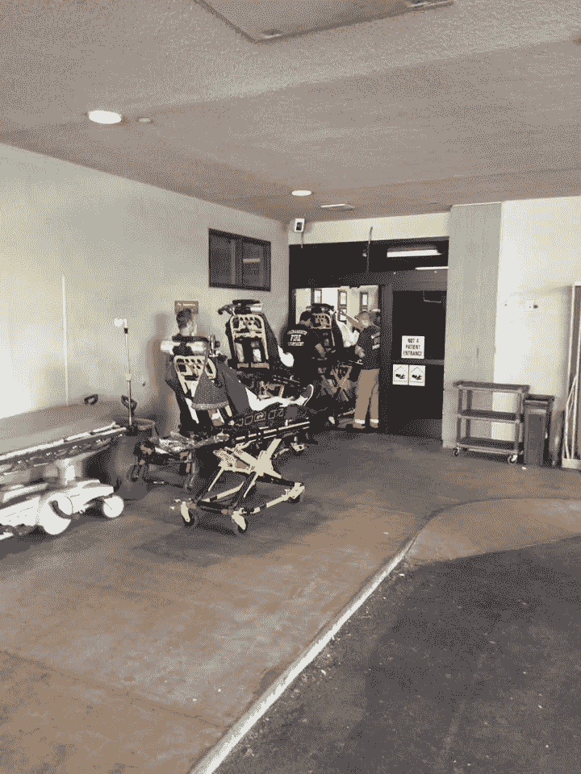
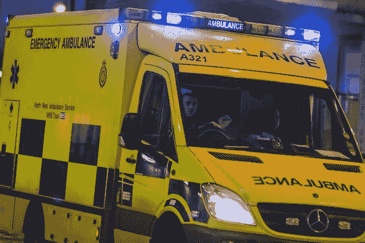

# 英国救护车服务与萨克拉门托市火灾的比较分析

> 原文：<https://towardsdatascience.com/sfd-and-uk-comparative-analysis-of-ambulance-service-ed3581fbb1ec?source=collection_archive---------1----------------------->

“通过从供应方经济学转向需求方经济学找到可持续的解决方案”

## **执行摘要**

1994 年，萨克拉门托市消防局接管了萨克拉门托市的救护车服务，并开始将病人运送到当地的急诊室。该计划取得了巨大的成功，包括缩短了救护车的响应时间，提高了患者护理水平，并通过运输计费为消防部门带来了新的收入来源。然而，在过去的 20 年里，对救护车的需求增加了，而每次呼叫的收入却下降了。需求增加的部分原因是市民对 911 救护车的期望发生了变化，因为 911 救护车可以为任何原因提供到医院的交通服务，包括重新配药。情况变得如此糟糕，以至于有些人经常拨打 911 叫救护车，因为他们有预约，但希望避免汽油和停车的费用。萨克拉门托市消防局(SFD)对救护车日益增长的需求的一贯反应是增加救护车的供应。SFD 从 1994 年的三辆救护车增加到 2016 年的十五辆。然而，增加救护车的成本可能很快超过萨克拉门托维持这一进程的能力。当救护车的供应无法满足需求时，由此产生的工作量会对人员、医院和危重病人造成伤害。
当救护车接到无生命危险的呼叫时，它们无法应对真正的紧急情况。每辆车平均要让一辆救护车停开 2 个小时，而用于救治非危重病人的救护车可能会给其他市民带来危险。继续这种做法对生命的威胁太大了。生命的风险、不断增加的成本和不断减少的收入表明，SFD 应该专注于减少对 911 救护车的需求，而不是增加供应。
我考察了英国的救护车服务，并与我们在萨克拉曼多的政策进行了比较分析。基于英国对优先调度、绩效衡量和高需求的使用，他们的挑战和解决方案与 SFD 的未来息息相关。
英国将绩效评估从“反应时间”转变为“患者结果”，并实施了“听和治疗”、“看和治疗”以及“治疗和运输”政策的解决方案。政策的转变使英国能够将 911 救护车的稀缺资源专用于危重患者，提高了急救护理的有效性和效率。
相对于反应时间，衡量病人的结果看起来像这样；如果一个脚趾疼痛的病人被救护车运送，到达医院时脚趾疼痛，出院时脚趾疼痛，那么就有一个中性的病人结果。反对以下情景；患者因严重气短被救护车运送，到达医院时有轻度气短，出院时无气短，则为阳性患者结果。
英国的演变本质上是从供给侧经济学向需求侧经济学的转变。换句话说，英国不是只关注增加救护车的供应，而是在关注危重病人需求的同时，采取措施减少对救护车的无谓需求。
我知道英国和萨克拉门托的政治环境大相径庭，每个地方都面临着独特的挑战。然而，对英国的一项分析显示，英国是一个非常繁忙的体系，正努力解决与 SFD 类似的问题，并最终通过从供应方经济学转向需求方经济学找到了一个可持续的解决方案。SFD 可以通过探索以下主题来学习英国的行动:
改变优先调度
制定包括每次事故成本、患者结果和投资回报的绩效衡量标准
根据上述绩效衡量标准制定数据驱动的政策决策
通过使用“倾听和治疗”政策来减少响应量
通过“观察和治疗”政策实施护理人员/医生发起的运输拒绝
使用替代形式的运输工具将合适的患者送往诊所。
SFD 勘探之外的任何行动都应包括医疗总监、市律师和工会的集中意见，以讨论该计划的潜在责任、成本和节约。

## **简介**

1994 年，萨克拉门托市消防局接管了萨克拉门托市的救护车服务，并开始将病人运送到当地的急诊室。该计划取得了巨大的成功，包括缩短了救护车的响应时间，提高了患者护理水平，并通过运输计费为消防部门带来了新的收入来源。然而，在过去 20 年中，对救护车服务的需求和对服务的期望增加了，而收入却减少了。对救护车的需求和期望已经从仅用于紧急情况转变为任何需要的到医院的运输。情况变得如此糟糕，以至于人们经常拨打 911 叫救护车，因为他们希望避免油费和停车费。如你所知，病人拨打 911 搭车去医院配药的情况并不少见。
直到 2011 年，英国运营的救护车服务在规模、培训、绩效指标和响应模式方面与 SFD 非常相似。这项研究考察了英国的救护车服务，并与我们在萨克拉门托的政策进行了比较分析。英国经历了非常相似的救护车滥用问题，并在 2011 年颁布了一项名为“转变 NHS 救护车服务”的成功解决方案。
萨克拉门托市消防局(SFD)过去对救护车日益增长的需求的反应是增加救护车的供应。SFD 从 1994 年的三辆救护车增加到 2016 年的十五辆。然而，在过去的 20 年里，增加救护车的费用已经增加。
随着低影响呼叫需求的增加，收取合理费用的能力下降了。大多数 SFD 的救护车使用者都有联邦或州资助的健康保险；医疗或医疗保险。两者都提高了收取救护车运输费的要求，并降低了他们愿意为基本运输支付的金额。
最后，最大的问题是，当救护车致力于无生命危险的呼叫时，它们不能用于真正的紧急情况。每次运输平均需要救护车停运 2 小时。用于不便事件的救护车潜在地将其他公民置于危险之中。继续这种做法对生命的威胁太大了。生命的风险、不断增加的成本和不断减少的收入表明，SFD 应该专注于减少对 911 救护车的需求，而不是增加供应。

## 英国的救护车服务

英国有 6300 万人口，是世界上人口第 22 大国，面积略小于俄勒冈州。根据世界银行的数据，英国的人均 GDP 为 34000 美元，是世界上第 24 富裕的国家(比美国落后 14 位)。每平方英里 679 人，英国是世界上人口最多的 51 个国家(领先美国 131 位)。英国的救护车服务是国民医疗服务体系(NHS)的一部分，这是一个公共资助的医疗保健系统。救护车服务由 11 个地区性救护车服务机构提供，2009-2010 年的费用约为 19 亿英镑。NHS 由一般税收资助，向英国合法居民免费提供医疗服务。
大部分急救医务人员为(NHS)工作。通常，救护车配备有一名护理人员和一名紧急医疗技术人员(EMT)。英国的健康和护理专业委员会管理他们的护理人员和 EMT，其功能与 SFD 的 EMS 提供商非常相似。
2009-2010 年，救护车服务收到的紧急呼叫(英国 999，SFD 911)共计 640 万次，运送 470 万次。自 2007-08 年以来，英国的呼叫量平均每年增长 4%。与英国其他公共机构一样，NHS 的支出也受到国家审计局(NAO)的审查。NAO 独立于政府，向议会报告公共部门的效力和效率，如国民保健服务。
2011 年，NAO 对救护车服务进行了一次审计。其结果是对救护车服务进行了根本性的改革，目标是增加对危重患者的护理，同时每年节省约 7500 万英镑，成本下降约 4%。【2011 年之前，救护车响应分为三类；A-立即危及生命；B-严重但无生命危险；或 C-不会立即严重或危及生命。这些类别决定了响应时间目标，其中类别 A 要求响应时间在 75%的情况下少于 8 分钟。
NAO 2011 年的审计建议改变业务实践，尝试将适当的响应模式与需求相匹配。结果是三层系统；听与待，看与待，看与传达。本质上，审计建议接电话的人使用决策算法对电话进行分类，然后将结果类别与一个新的响应模型配对。例如，C 级呼叫将变成“听到并处理”呼叫。呼叫接听者会听取投诉，并提供除紧急救护车之外的替代解决方案。
此外，英国制定了新的绩效衡量标准，重点关注临床护理质量指标和效率节约目标。临床护理质量指标包括心肌梗死、心脏骤停和中风的结果。效率节约包括每名救护车工作人员的护理费用和每起事故的费用。

## 对比分析

由于英国的优先调度、性能测量以及来自非生命威胁呼叫的呼叫量增加，它与美国的密集城市(如萨克拉门托)非常相似。在 2011 年之前，英国将紧急呼叫的紧急程度分为三组:A 级-立即危及生命，B 级-严重但不立即危及生命，C 级-不立即严重或危及生命。这些类别确定了响应时间的目标，但最终未能确定响应的类型。为了减少总体响应时间，接听电话的人将每个电话作为 A 级开始，在真正审查电话之前假设最坏的情况。即使接电话的人在问了更多的问题后重新对电话进行了分类，救护车的反应已经开始了。换句话说，英国仍然会向 C 级呼叫发送最昂贵的响应模型，他们只是不希望他们那么快到达那里。结果，社区为非紧急电话付出了高昂的代价。
即使 SFD 的分类是相反的，D 级是威胁生命的，而 A 级不是立即的，SFD 使用相同的模型回应。像 2011 年之前的英国一样，每个呼叫都是在询问之前作为威胁生命开始的，每个响应都使救护车停止服务，这是最昂贵的响应模式。相比之下，在 2011 年审计后，英国停止了优先调度，并开始在发送和救护车之前审查呼叫，以更好地满足需求。因此，英国估计每年可节省 1 亿至 2.8 亿英镑，并改善患者的预后。
SFD 继续优先派遣的驱动力与英国相同；业绩计量。英国和 SFD 将每个呼叫视为威胁生命的原因是为了在 it 绩效评估中获得最高分；响应时间。

## 绩效指标

2011 年之前，英国的主要绩效指标是从电话响起到救护车到达现场的反应时间。响应时间驱使调度员通过将每个呼叫归类为威胁生命的呼叫来使救护车尽可能快地移动。意识到这一缺陷后，英国将绩效指标转换为病人结果、服务成本和不包括电话呼叫的响应时间。SFD 也有同样的缺陷，因为它衡量效率的主要指标是包括电话呼叫在内的响应时间。SFD 缺乏任何病人护理或成本效益表现措施，导致 SFD 每次都使用最昂贵的响应模型，而没有跟踪因所有救护车都被调度而错过的威胁生命的呼叫。
需求
与 SFD 类似，英国的救护车系统的呼叫量稳步增长。在 2007-08 年，英国救护车服务的呼叫量上升了 9 %,导致服务成本上升了 19%。结果，每次通话的费用增加了 10%。众所周知，SFD 的通话量和费用也在稳步增长，但是，自 2011 年审计以来，英国已经实施了多项计划来降低需求。
英国通过通话周期中的三个点来管理需求；闻而治，见而治，见而运。
heard and treat 允许调度员通过电话将呼叫转介给该地区的临床医生，而无需救护车。“聆听和治疗”减少了派遣次数，迅速处理了问题，救护车容量得到了更好的利用，救护人员受到的影响更小，并且患者被视为离家更近。最后，为了安全起见，听和治疗干预偏于谨慎，如果对严重性有任何疑问，发送一个响应模型。
SFD 没有切实可行的解决方案兼容听力和治疗。因此，SFD 的呼叫量持续增加，为病人提供的简单解决方案被推迟，救护车越来越少，救护人员超负荷工作，病人经常被运送到城镇的另一边。
观察和治疗使救护人员能够在现场解决事故，而不需要运送到急诊室。观察和治疗减少了救护车的总呼叫时间，有效地利用了人员培训，减少了对急诊室的影响，减少了治疗时间，并使患者离家更近。虽然从技术上讲，如果病人拒绝被运送，SFD 可以在现场“观察和治疗”病人，但这样做有很大的障碍。首先，病人必须坚持“看和治疗”政策，并签署一份法律表格，声明他们拒绝医疗建议，并坚持留在家中。第二，SFD 的非正式政策“你打电话，我们拖走”使这种思维定势制度化，即不管病人是否抱怨，都要把他们送到医院。SFD 的正式和非正式政策减少了对危及生命呼叫的救护车可用性，增加了急诊室的影响，增加了治疗时间，并可能将患者转移到整个城市。
除了英国实施的“倾听和治疗”政策和“观察和治疗”政策确保有更多的救护车可用于有生命危险的呼叫，并配备休息更好的医护人员之外，英国的“观察和运输”基本上与 SFD 相同。此外，英国还开通了一个“111”号码，为那些没有生命危险的来电者提供了另一个选择。“111”号码有助于确保有紧急需求的患者获得帮助，同时保证救护车资源可用于医疗紧急情况。
SFD 在 2010 年实施了类似的系统，名为“311”。然而，“311”只处理城市服务，如供水和街道，没有医疗需求的能力。缺乏“111”类型的系统迫使所有医疗请求通过 911 系统，并最终在最小的医疗问题上派遣救护车。
最后，英国已经建立了合作伙伴关系，以减少特定患者群体的来电。例如，跌倒占英国救护车呼叫的 10%。救护车服务部门和社会服务部门在一些地区建立了跌倒小组，为有重复呼叫风险的人提供建议和预防服务。
SFD 没有真正的合作伙伴来帮助重复拨打 911 的用户，例如该地区的无家可归者。许多无家可归者需要医疗服务，但不是三级救护车和急诊室。与英国等社会服务机构合作，转介高危患者，可以显著降低需求。

## 考虑

**责任**
应量化和审查因“倾听和治疗”政策或“观察和治疗”政策导致的延迟响应的责任。英国的医疗保健系统与美国的不同之处在于，它是一个由公共税收资助的国家医疗保健系统。由于延误治疗或运输的政策，患者遭受额外伤害或死亡的情况下的责任将在全国范围内蔓延，与萨克拉门托相反，诉讼可能会使萨克拉门托市面临巨额责任。应根据呼叫量和患者接触率来估计诉讼的可能性，以比较此类保单的潜在损失和潜在节省。

**公众形象** 改变消防部门的公众形象也是一个问题。目前，如果市民拨打 911，消防部门会不顾需要做出反应。这种一致性在社区和消防部门之间建立了信心和信任。一项新的“倾听和治疗”政策，即消防部门不向小型医疗救助派遣响应单位，可能会对社区支持和资金产生负面影响。

**政治环境——劳工/行政人员** 工会可能会因“倾听和治疗”或“观察和治疗”政策导致的来电量减少而感到威胁。工会的潜在反应可能看起来与直觉相反，因为这将减少其成员的工作量，但也可能减少对员工的需求，从本质上减少工作岗位。respond 模型中的任何政策变化都应提交给劳工，并最终得到劳工的认可。

如果任何新政策被证明在责任、信誉或政治货币方面更昂贵，它们可以很容易地被取消，并被当前的业务形式所取代。此外，新的政策可以分开，单独实施。例如，如果“听取并处理”策略耗费了太多的社区善意，则可以将其删除，并替换为该类别呼叫的“查看并处理”。

**结论**
目前，SFD 的功能与 2011 年前的英国非常相似；通过使用优先调度和依赖响应时间作为性能度量。然而，在 2011 年，英国发展并实施了新的程序，以减少需求，降低成本，并提高病人护理的质量。SFD 应该密切关注英国的救护车转型，并考虑这些政策是否适合我们的环境。

 [## SFD 睡眠研究

### “众所周知，一晚睡眠不足会对表现产生不利影响，并持续降低……

medium.com](https://medium.com/@esaylors/sfd-sleep-study-a494e669af42)  [## 量化负面:消防服务的真正价值

### 我们在公共安全领域面临的最大挑战之一是以可量化的方式阐明我们的价值。这个挑战是…

medium.com](https://medium.com/@esaylors/quantifying-the-negative-the-true-value-of-the-fire-service-f1093e4bcfc2)