# Shab Dev 故事#01:试图通过反向投影找到梯度下降的矩阵形式

> 原文：<https://towardsdatascience.com/shab-dev-story-01-trying-to-find-the-matrix-form-of-gradient-descent-via-backprop-1c2bf7fdf5fe?source=collection_archive---------2----------------------->

如果我用错了一些数学概念，我提前道歉，并请你告诉我是哪些，以便改进这篇我主要为自己写的文章。

如果我们想要实现使用梯度下降训练的神经网络，学习如何执行反向传播是早期步骤之一。然后，如果我们想在游戏中更认真一点，我们将我们的向前传球矢量化/矩阵化，因为这使代码更清晰、更有效。现实很快赶上我们，因为由于矩阵和矩阵乘积，我们向后传递的链式法则不再起作用。因此，我们调用我们的神奇技能，通过重新排序表达式使矩阵的维度匹配来解决整个问题。至少，我是这么做的。

在这篇文章中，我们试图看看我们用矩阵演算得到的矩阵形式的梯度下降的表达式是否与我们使用某种魔法得到的表达式相同。这不是通过反向投影对梯度下降的介绍，我认为它主要面向那些试图理解数学的开发人员(没有数学背景)。

## 有什么问题？

假设我们有一个两层网络(一个隐藏，一个输出),并且我们使用矩阵来表示它的参数(即权重)作为它的输入，并且我们使用矩阵值激活函数:

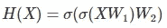

这里，X 是包含小批量输入的矩阵(行是实例，列代表特征)。W1 和 W2 是分别包含属于隐藏层和输出层中所有神经元的所有权重的矩阵(一列代表一个神经元，下面的行是其权重)。较低的 sigma σ是我们的矩阵值激活函数(例如，它基本上将 sigmoid 函数应用于所有输入矩阵元素)。现在，如果我们想计算(小批量)梯度下降步骤的 W1 的更新值，该怎么办呢？

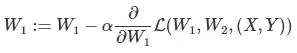

我当时做的是尝试对一些损失函数(例如 MSE)取 w.r.t 到 W1 的导数。我的结局是这样的:

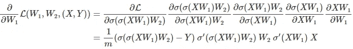

This chain rule is not sound.

这根本行不通，事实上，矩阵产品行不通，因为矩阵没有好的维度，这是我当时不知道的事情，大约一年前😕。我试着反过来表达，试着添加 Hadamard 产品，但这些东西都不起作用。然后，我学习了矩阵转置操作，并开始变魔术般地使矩阵形状和乘积起作用，同时确保我将得到标量形式的损失函数 w.r.t W1 的权重的偏导数的等价表达式。这给了我:

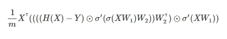

The delta of W1 given after backprop.

几个月过去了，不久前我开始研究一个玩具 OCaml 神经网络库，即使我的数学水平在一年内略有提高，我自己也无法用微积分为上面的表达式找到真正的数学依据。即使是在数学方面，我认为一个开发者不应该在没有尝试理解的情况下使用如此基础的东西。Andrej Karpathy 的[“是的，你应该理解 back prop”](https://medium.com/@karpathy/yes-you-should-understand-backprop-e2f06eab496b)让我决定，我应该调查一个更好的理由来寻找平静。

## 寻找表达矩阵导数的方法

我们这里真正的问题是，有没有办法把一个成本函数 w.r.t 对 W1 求偏导数，更一般地说，有没有办法把一个矩阵值函数 w.r.t 对一个矩阵求导？

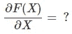

What’s the derivative?

我们可以说 F(X) w.r.t 对 X 的导数是一个具有 X 形状的矩阵:

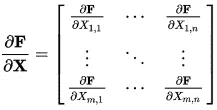

[Matrix derivative (wikipedia)](https://en.wikipedia.org/wiki/Matrix_calculus#Other_matrix_derivatives)

这个定义有些有趣。矩阵具有 X 的形状，这意味着我们的参数的更新将是直接的。然而，这个公式有一个缺陷:

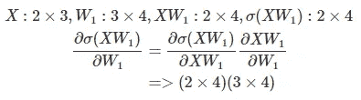

是的，它不允许链式法则，没有链式法则->没有后退。

我们需要一个链式法则，这就是 JR. Magnus 和 H. Neudecker 在[矩阵微分学(ch9.3)](http://www.janmagnus.nl/misc/mdc2007-3rdedition) 中给我们提供的。他们争论一些不好的符号和一个表示矩阵导数的好符号。他们基本上说对矩阵取矩阵值函数 w.r.t 的导数有些不一致，并主张将雅可比矩阵推广到矩阵:

Formula 1\. vec is the [vec operator](https://en.wikipedia.org/wiki/Vectorization_(mathematics))

如果 *F(X)* 具有形状 **p** x **q** 并且 *X* 具有形状 **m** x **n** ， *vec(F(X))* 将是具有形状 **pq 的列向量。** *转置(vec(X))* 将是具有形状 **mn** 的行向量，因此雅可比矩阵将具有形状 **pq** x **mn** 。虽然雅可比矩阵不完全是对 X 的偏导数，但它包含了我们获取它所需的所有信息，最重要的是，它允许一个链式法则:

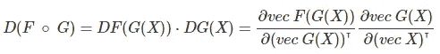

Formula 2\. Derivative of a composition

**注意**我们也可以说，我们正在寻找的导数是一个四阶张量(正如维基百科所指出的)，但我没有找到任何可理解的资源。

## 逐步展开链式法则

**警告/！这部分几乎只包含数学，可能不是很有趣。
现在我们有了一种表达矩阵导数的方法，我们可以陈述我们目前正在寻找的东西:**

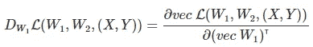

这个雅可比矩阵将为我们提供更新 W1 以进行梯度下降所需的一切。现在，让我们一步一步地展开链式法则:

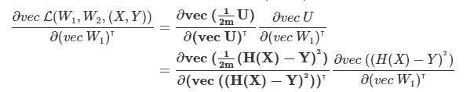

Step 1.

对于第一个块，我们可以看到我们正在寻找一个表达式的导数，该表达式只对矩阵 U(平方减法的占位符名称)执行元素级标量乘法。我们知道对于标量来说***ax***w . r . t***x***是***a***(***a***为常数)，但是对于矩阵来说我们有:

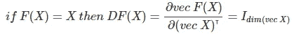

Formula 3\. The derivative of the identity function is the identity matrix(dim is dimension of a vector).

也就是单位矩阵。因此，我们只需:

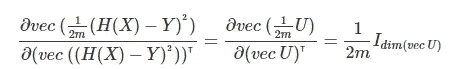

然后，对于第二块，我们寻找平方矩阵 V 的导数(平方是指元素乘积，而不是矩阵乘积):

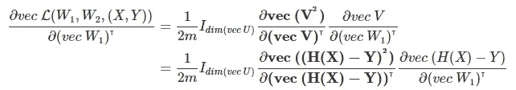

Step 2.

为了表示矢量化 Hadamard 乘积的导数，我们将使用允许我们将其表示为矩阵乘积的属性，以便我们可以使用众所周知的乘积规则导数:

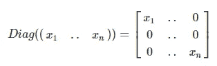

The Diag function takes a row vector and puts its elements along the diagonal of a square matrix full of zeros everywhere else.

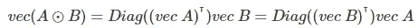

Formula 3\. Vectorized Hadamard product expressed as a matrix product.

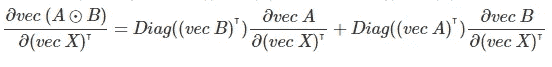

Formula 4\. Derivative of vectorized Hadamard product using formula 3

作为 A，在我们的例子中 B 和 X 都等于 V；因此，表达式简化为:

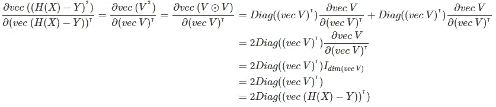

正如你在下面看到的，我们已经可以开始简化表达式了，但是让我们一次只做一件事。

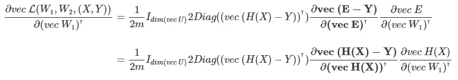

Step 3.

对于第一步，我们可以看到我们正在对减法求导，这是我们需要的明显公式:

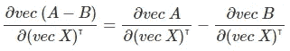

Formula 5\. Derivative of subtraction

然后经过简单的应用，我们得到:

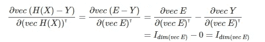

在展开链规则的损失函数部分后，我们的表达式看起来是这样的:

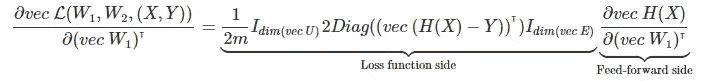

表达式已经开始变得相当长了，所以让我们把链式法则的展开部分放在一边，把注意力集中在前馈方面，一步一步地推导它:

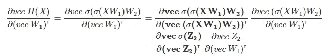

Step 4.

由于σ(A)是一个基于元素的函数应用，因此我们有:

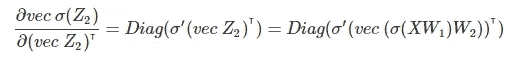

Formula 6\. Derivative of element-wise function

其中σ'是它的导数。

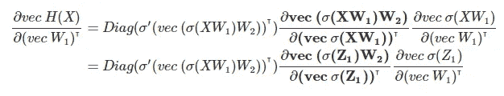

Step 5.

下一步，我们想要一个矢量化矩阵乘积的导数，那么我们该怎么做呢？首先，让我们介绍一些公式:

Formula 7 & 8\. Vectorized product of 3 matrices and its derivative.

这些公式的有趣之处在于它们允许使用已知的矩阵。但是当我们只有两个矩阵的乘积时，我们如何把它们应用到我们想要的偏导数上呢？这里有两个“窍门”:

**nrow(X)** is the number of rows in X

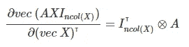

**ncol(X)** is the number of columns in X

我们在表达式的左侧添加一个带有单位矩阵的乘积，这允许我们使用上面的公式:

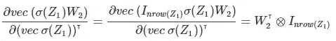

我们可能会问，是什么阻止了我们对两个矩阵之间的矢量化矩阵乘积求偏导数？好处是导数可以用已知的矩阵来表示，也因为我们不需要自己去推导。

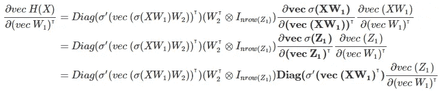

Step 6.

这一步非常简单，因为我们重用了已经使用过的公式(公式 6)。现在最后一步:

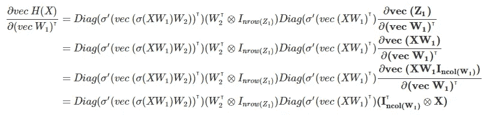

Step 7.

为了使用我们的公式(8 ),我们需要 W1 在中间，为了做到这一点，这次我们添加一个矩阵乘积，单位矩阵在右边。既然我们已经展开了所有的前馈侧，我们可以看一看整体表达式:

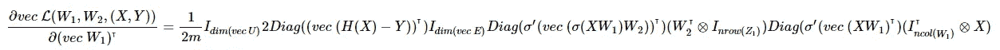

这相当大，所以让我们尽可能地减少它:

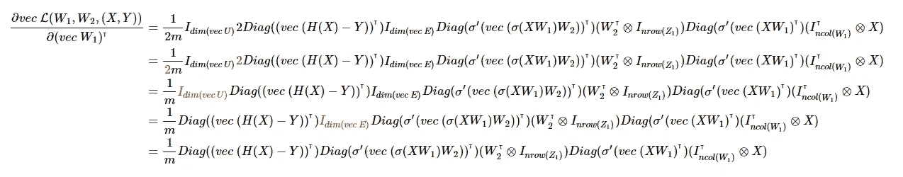

Reducing the expression.

请注意，我们可以继续减少，例如一个单位矩阵的转置本身，诊断可以合并等…

## 更新权重

好了，现在我们已经展开了链式法则，剩下一个雅可比矩阵，我们如何使用它来更新 W1(以及我们的参数)？

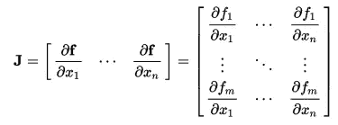

[A Jacobian matrix.](https://en.wikipedia.org/wiki/Jacobian_matrix_and_determinant)

如你所见，每一列都包含向量的一个元素的导数，因此为了得到这个元素的“总”导数，我们需要对行求和，我们可以用一个行向量来完成，这个向量包含的列数与雅可比矩阵包含的行数一样多:

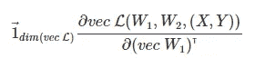

它给出了一个行向量，包含 W1 的每个元素的总导数 w.r.t。

为了更新 W1，我们需要得到一个具有相同形状的矩阵，因此我们需要的是 vec 的反函数:

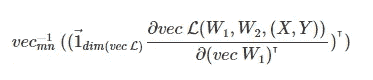

The [inverse of vec](https://math.stackexchange.com/a/1830212) reshape a column vector into a matrix.

现在我们有了一个与 W1 形状相同的矩阵，其中包含损耗 w.r.t 对每个矩阵元素的导数。注意，我们已经转置了行向量，因为 *vec* 输出一个列向量。

最后，让我们看看更新 W1 的最终表达式:

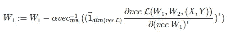

让我们回忆一下通过匹配尺寸找到的表达式:

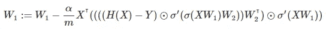

我们可以推导出表达式，并看到它们在理论上是等价的(我已经这样做了)，但这篇文章已经包含了很多数学，我不确定它是否值得。但是不要担心，我们将在实现中从数字上检查它们是否等价。

## 回到背面投影

到目前为止，我们专注于展开链规则，但是永远展开链规则不是反向传播，反向传播是一种算法，而不是公式，在某种意义上，它是它的计算效率的化身。反向传播是从损失函数误差开始，通过层和神经元将“误差”反向传播到权重。

回想一下，下面是通过匹配尺寸获得的反投影形式:

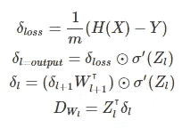

和更新语句:

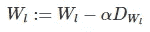

我们用矩阵运算找到的反投影形式是:

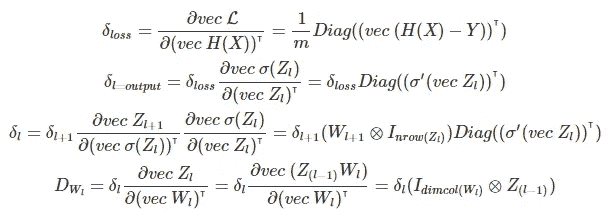

反向传播误差背后的直觉是，首先，我们有损失函数级别的误差，也就是说，在 *H(X)中损失随时间变化多少。*然后从输出层开始，回到第一个隐藏层，我们计算当前层神经元的误差。这是通过在下一层的误差(除了输出层 btw，因为误差来自损失函数而不是层)和激活函数相对于该层输入的导数之间执行矩阵乘积来完成的。然后对于这一层的权重，*w1*，总误差 w.r.t 权重是当前层的神经元及其输入的误差的乘积。

下面是我们的两层神经网络的反向传播步骤:

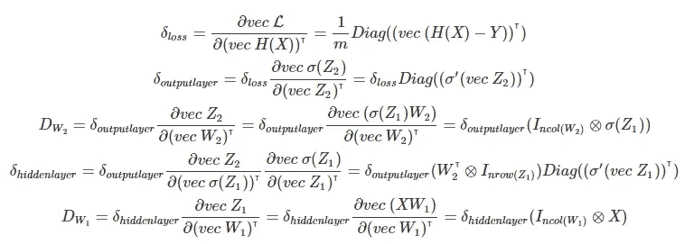

然后更新层的权重:

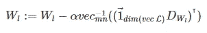

## 履行

以下要点是通过 XOR 问题的两种反向投影形式使用梯度下降训练的神经网络的数字实现。学习率为 1，我们不将 deltas 除以 1/4，以使神经网络收敛更快。 [np.kron](https://docs.scipy.org/doc/numpy/reference/generated/numpy.kron.html) 是 Kronecker 乘积， [np.diag](https://docs.scipy.org/doc/numpy/reference/generated/numpy.diag.html) 是 diag 函数， [np.eye](https://docs.scipy.org/doc/numpy/reference/generated/numpy.eye.html) 返回一个单位矩阵。

## 我们应该使用哪种反投影形式

我发现矢量化的导数更容易使用，也更有教育意义；你可以看到，我们从来没有解决一个矩阵元素 Aij，我们所做的就是展开链规则。然而，当然，我们应该使用通过使形状匹配找到的形式，因为它在内存和性能方面更有效。诊断矩阵和克罗内克产品的成本很高。

## 结论

很多人担心人工智能，担心它可能被用于不良目的，但我认为我们不应该忽视这样一个事实，即开发人员将人工智能算法用作黑盒也可能会无意中导致人工智能做坏事。这就是为什么我认为我们，开发者，至少应该试着理解模型是如何工作的。不需要成为一个数学家伙，你甚至可以阅读论文，并向你的朋友谷歌寻求帮助！现在在这个领域所做的事情是惊人的(DRL，GANs… ❤).开始永远不会太晚，我个人只是在去年看了钢铁侠电影后才对神经网络和人工智能产生了兴趣😅。