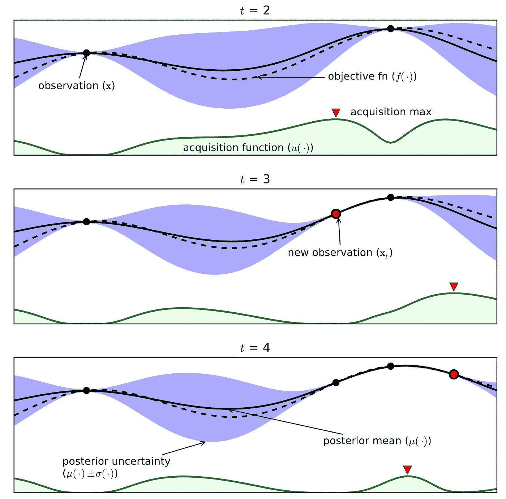
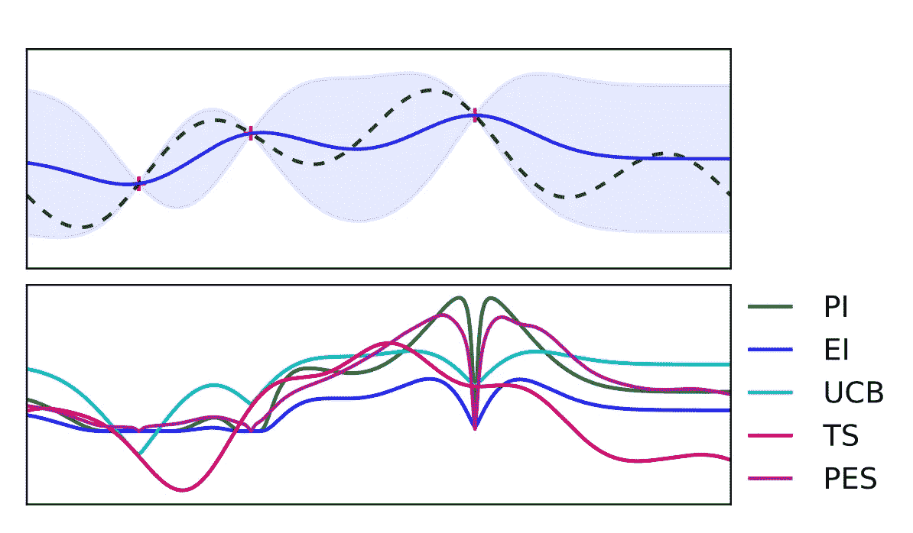
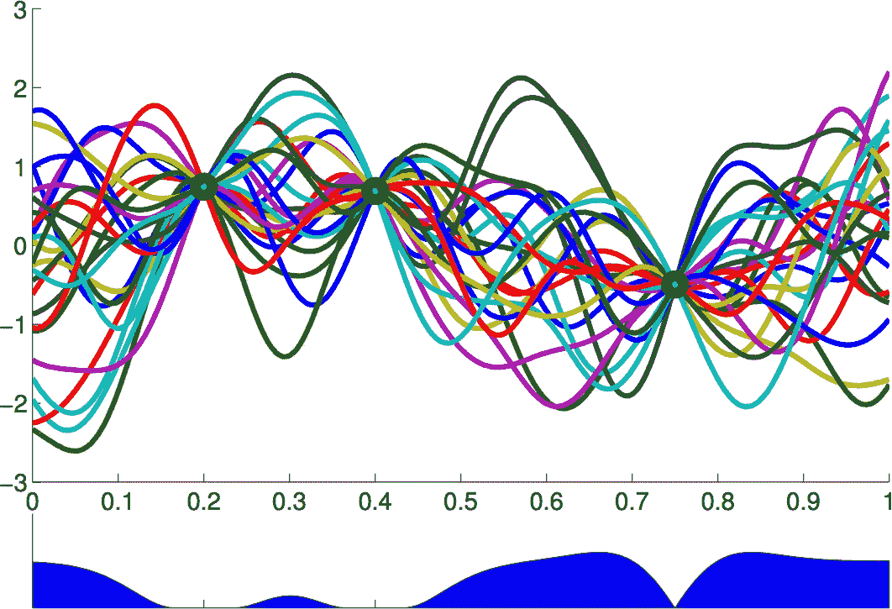
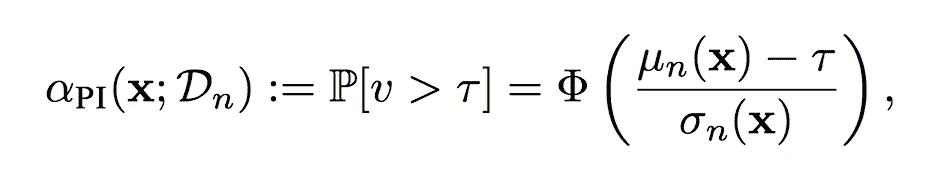
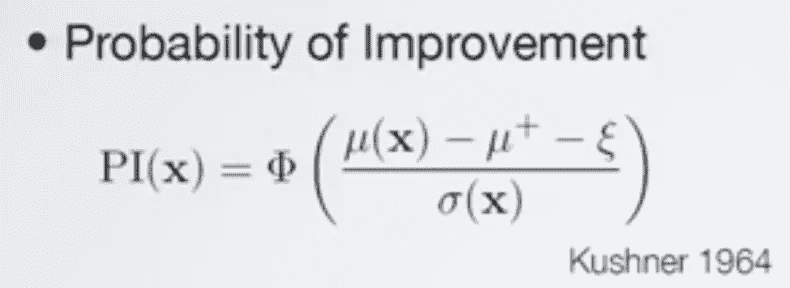
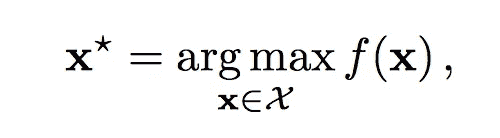
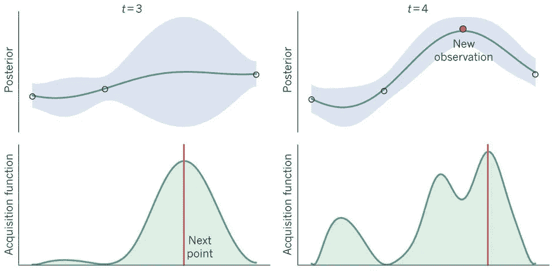
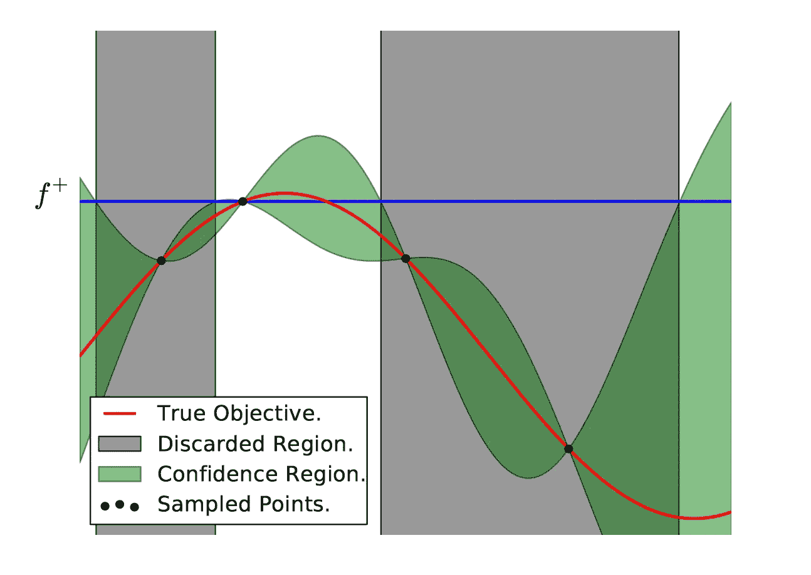
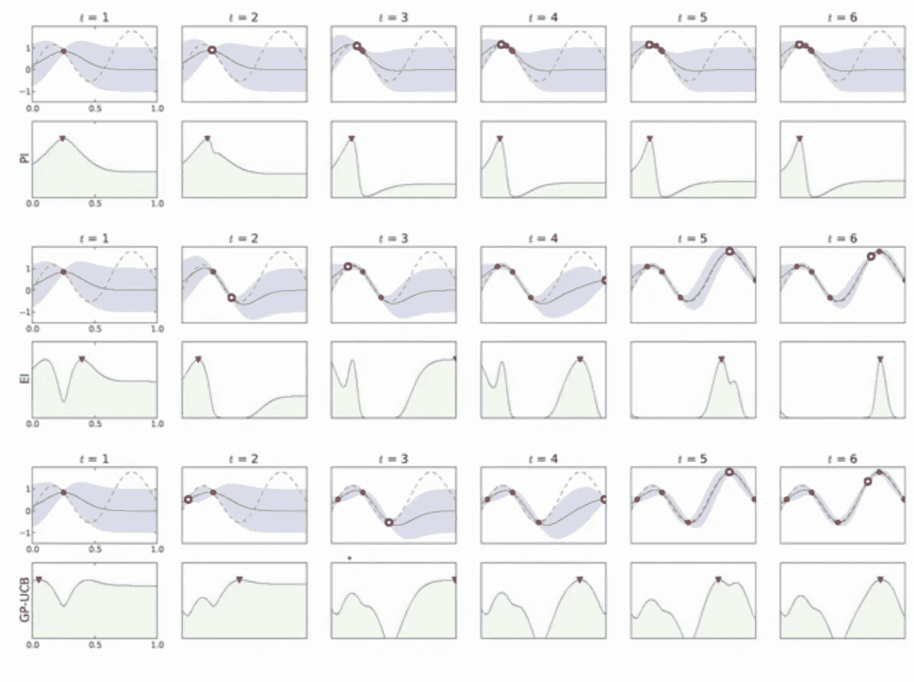

# 对贝叶斯优化的浅见

> 原文：<https://towardsdatascience.com/shallow-understanding-on-bayesian-optimization-324b6c1f7083?source=collection_archive---------1----------------------->

Sample data increases & Curve fitting gets improved.

## 预先知道的硬性条款

> 高斯过程
> 
> 无噪声全局优化
> 
> 噪声全局优化
> 
> 采集功能
> 
> 代理函数(/高斯过程)
> 
> 随机的
> 
> 贝叶斯回归

什么是高斯过程？？

这是一个贝叶斯回归

——这是一种**精确**插值**回归**的方法。

——是**线性**回归的**自然推广**。

*   它指定了一个**分配** **到** *功能*。

B 想象一下，如果我们不知道一个函数，我们通常会做什么？当然，我们会尝试用一些已知的先验知识来猜测或近似它。同样的想法背后是**后验概率**。这里的标准是我们有**观察**，其中的数据是一个记录接一个记录而来(**在线学习**)，所以我们需要训练这个模型。训练好的模型显然会服从一个函数。我们不知道的那个函数将完全依赖于**学习数据**。所以我们的任务是找到**最大化**学习模式的**超参数**。

我们这里有一些变量。一个是**观察记录(特征+标签)**，第二个是**参数**，定义模型。

# 例如。

> (比如说**中的 like y = MX+c**；m & c 是参数，y，x 是变量-标签&特征。我们有义务找到这些 m & c 来学习我们最好的模型)

贝叶斯优化有助于在众多模型中找到一个最佳模型。我们正在进行交叉验证。但是我们要在一个预先列表上尝试多少个样本来从中选择一个最好的模型。这就是为什么贝叶斯方法**通过减少计算任务来加速这个过程，并且不期望人们帮助猜测数值。这种优化技术基于**随机性**和**概率分布。****

用我的话来说，*第一个观测点*来到模型。我们划清界限。那么下一点就来了。我们把这两点连接起来，从之前的曲线画一条调整过的线。第三点来了，所以我们画一条非线性曲线。当观察点的数量增加时，可能曲线的组合数量增加。这类似于统计学中的抽样定理，我们从样本参数中估计总体参数。

我们绘制了另一条**直方图曲线**以及非线性目标函数曲线。这表明，对于给定的目标函数曲线，在所有过去的观察值中， **max** 值将出现在哪里(找到 **arg** max)。

**Histogram Curve**, that is the **Acquisition Function** (includes different acq functions).

我们这里的目标是**而不是**用尽可能多的观察点将目标函数(未知)完全确定为一条曲线。相反，我们需要最大值的**arg(max 函数的索引)。所以我们需要将注意力转向直方图函数。当目标函数曲线的可能组合增加时，直方图形成描述采集函数的分布。这是贝叶斯优化背后的思想。**

> 记住，我们的目标，首先需要确定最大值的 arg，其次选择下一个最好的最大值，它可能在函数曲线上。

**Many Random Ensemble Curves** that we could draw from the **above observed black samples.**

我们在图中看到许多**摇摆曲线**。这告诉函数曲线的范围**下一个点可以位于给定采样点的**。方差给出了函数曲线上平均值的分布。

当我们通过将观测值叠加在未知函数曲线上进行估计时，那么这就是**无噪声优化**。但是当我们需要考虑**噪声优化**时，我们的未知函数会将观察点略微除以噪声误差值。

我们在许多测量下定义了**采集函数**，其中一些在这里，

> **1。PMAX**
> 
> **2。IEMAX**
> 
> **3。MPI =最大改善概率**
> 
> **4。MEI =最大预期改善值**
> 
> **5。UCB =置信上限**
> 
> **6。GP-对冲**
> 
> **MM =最大平均值**
> 
> **MUI =最大上限区间**

**采集标准** :- *接下来应该选择哪个样本*

**替代函数/响应面(模型)**

*   基于先前未观察到的点**的后验超过**。****
*   其**参数**可能基于先验。

# 采集功能:-

测量的是 ***改善的概率(PI)。***

**μ** + =过去点中**最佳** **观察到的**值。

我们正在寻找未知函数**的最大值**。但是在我们以往的观测当中，**下一个** **可能的**最大值应该大于**当前的最大观测值。**

**ε** = **非常小的任意值表示高斯分布中的点。**

# 我们的目标:-

Find the arg of the max of f(X)

**PI(x)** =发现**未知函数**的**下一个最大值**高于**最大观测值**加上**一些偏差的概率。**

这只是高斯分布与最大观测值的阈值边界的 1D 积分。

对于未知函数中的每个点，我们考虑在每个点样本上垂直放置一个高斯分布。这个分布在未知函数的值上有均值&某个确定的方差。

我们把这个标准化在上面的 ***库什纳 1964 年*** 方程中。

**探索&开发**是解释一种现象和优化算法的常用术语。这两者之间存在一种权衡。因此，我们**使用“**采集函数**”来平衡**这种折衷。

我们的**下一个选点(x )** 应该有**高均值** ( *开采* ) & **高方差** ( *勘探*)。

Choosing our next possible max point, with trade-off between **Exploration & Exploitation.**

因为我们在寻找高方差分布中的下一个点。这意味着探索 x 点。

高均值意味着我们选择了具有高偏移/偏差的下一个点(x ),因此我们应该给出一些开发权重来降低下一个点的均值。

The way we approach Bayesian Optimization.

上图给出了我们算法的一些直觉。红色曲线是我们的**真实目标**函数曲线。可惜我们不知道这个函数和它的方程。所以我们要用**高斯过程来近似它。**在我们的**采样点**(此处给出 4 个样本)中，我们绘制了一条与我们观察到的样本相符的直观/自信曲线。因此绿色区域显示了**置信区域**，在这里最有可能定位曲线点。根据上述**先验知识**，我们确定第二点( **f+** )为**最大观测值**。所以下一个最大值点应该在它上面或者等于它。我们在这里画一条蓝线。下一个最大值点应该在这条线以上。因此，从 **f+** 和**置信区域的**相交点**，我们可以假设 **f+** 以下的曲线样本应该与我们寻找 **arg max 的目标一起被丢弃。因此，现在我们已经缩小了调查范围。对下一个**采样点继续同样的过程。******

Data sample increases; comparison of different **Acquisition functions** with **Curve Fitting.**

# 参考:-