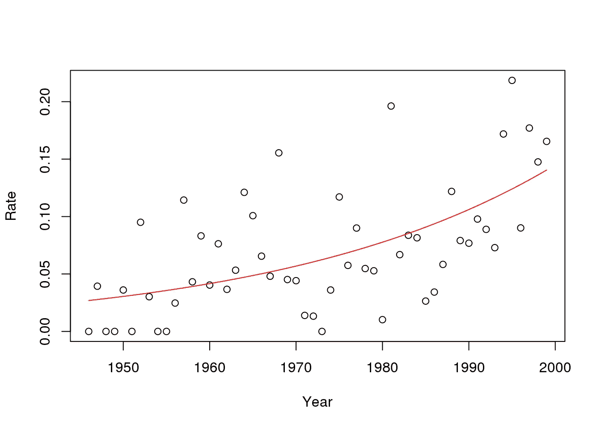

# 鲨鱼攻击—解释泊松回归的使用

> 原文：<https://towardsdatascience.com/shark-attack-explaining-the-use-of-poisson-regression-449739bf96da?source=collection_archive---------4----------------------->

没有什么比鲨鱼袭击更能破坏佛罗里达群岛的理想夏季游泳了。除了令人印象深刻的背鳍、巨大的“白色”牙齿和普遍的恐慌之外，过去三十年间鲨鱼袭击对佛罗里达海岸线居民的涌入有多大影响呢？你会在哪里寻找数据？更重要的是，数据科学家会选择哪种算法来预测结果，为什么？

佛罗里达自然历史博物馆保存了国际鲨鱼袭击档案，记录了自 1957 年以来世界范围内无端的鲨鱼袭击(以及由此造成的死亡)。使用这些数据，我们可以通过检查攻击率的模式，使用泊松回归来预测沿海人口的变化，而不是人口变化与攻击次数直接相关的可疑假设。抛开双关语，让我们来看看什么是泊松回归，为什么这种方法是合理的选择，它的假设是什么，以及在依赖这种方法时我们应该采取什么预防措施。

泊松回归是回归分析的广义线性模型形式，由西蒙·丹尼斯·泊松于 1837 年提出，以支持他探索错误刑事定罪原因的工作。泊松回归，在处理分类数据时也称为对数线性模型，现在在大多数分析包中很常见，建议在需要对计数数据建模或构建列联表时使用。例如，这种模型可以有效地用于预测推特数据的转发，或各种操作条件下核电站的故障，或再次预测可识别的学生群体的考试成功率。

*这个模型的假设是什么？*泊松回归类似于逻辑回归，因为它也有一个离散的响应变量。该模型假设其期望值的对数可以通过未知参数的线性组合来建模。记录的事件以已知的恒定速率发生，并且与自先前事件以来的时间无关。更重要的是，该模型假设期望值(响应变量)具有泊松分布，而不是正态分布。换句话说，响应变量的可能值将是 0、1、2、3 等非负整数。

*泊松回归有哪些用例？*该模型可用于可观察事件随时间随机发生的随机过程。事件在给定时间间隔内至少发生一次的可能性与每个时间间隔的长度成正比。在每个时间间隔内，该事件发生两次或多次的可能性应该很小，如果有的话。接受这些假设，我们可以认为在固定的时间间隔(距离、面积或体积)内事件发生次数的概率分布符合泊松分布。

*使用泊松回归模型时，我们应该采取什么预防措施？*我想到了测试人群的三个潜在特征。作为一名数据科学家，您应该警惕数据中潜在的异构性——是否有多个流程生成预期值？过度分散是需要考虑的第二个异常现象——拟合模型的方差是否大于您假设的预期值？最后，数据样本是否反映了分散不足，即由于相邻子群的自相关，数据是否比二项式分布中预期的变化更小？

在建议的鲨鱼袭击案例中，泊松模型的选择是合理的，因为这种可怕事件相对罕见。正如 Jeffrey Simonoff 所建议的，我们可以应用一个广义线性模型，假设泊松模型使用对数链接来连接泊松均值μμ和随时间变化的速率。将拟合的平均值除以人口规模得到一个比率模型。为了提高模型的准确性，我们可以在种群方程中为种群大小的对数引入一个偏移项。因此，由于使用了对数链接，预测的时间趋势遵循指数模式，而不是线性模式。

*Jeffrey Simonoff in his book Analyzing Categorical Data produced this summary output for the generalized model plus a transformed version — in this case the model predicts that the rate of shark attacks is rising by approximately 3% a year*.[[ii]](#_edn2)

商业分析实践是商业分析学院的核心和灵魂。在我们在巴约纳的[暑期学校](http://baisummer.com/)，以及我们在欧洲的[大师班](https://www.eventbrite.com/e/masterclass-the-high-road-to-gdpr-tickets-42719246416)，商业分析研究所专注于数字经济、数据驱动的决策、机器学习和视觉通信，将让分析为您和您的组织服务。

Lee Schlenker 是 http://baieurope.com 商业分析研究所的教授和负责人。他的 LinkedIn 个人资料可以在 www.linkedin.com/in/leeschlenker.[查看](http://www.linkedin.com/in/leeschlenker.)你可以在 https://twitter.com/DSign4Analytics[的 Twitter 上关注我们](https://twitter.com/DSign4Analytics)

________________

[【我】](#_ednref1)[https://www.floridamuseum.ufl.edu/shark-attacks/](https://www.floridamuseum.ufl.edu/shark-attacks/)

西蒙诺夫，杰弗里，2003，分析分类数据，施普林格