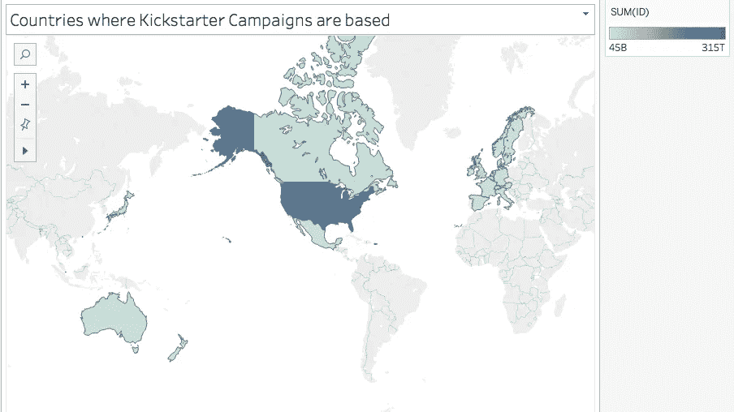
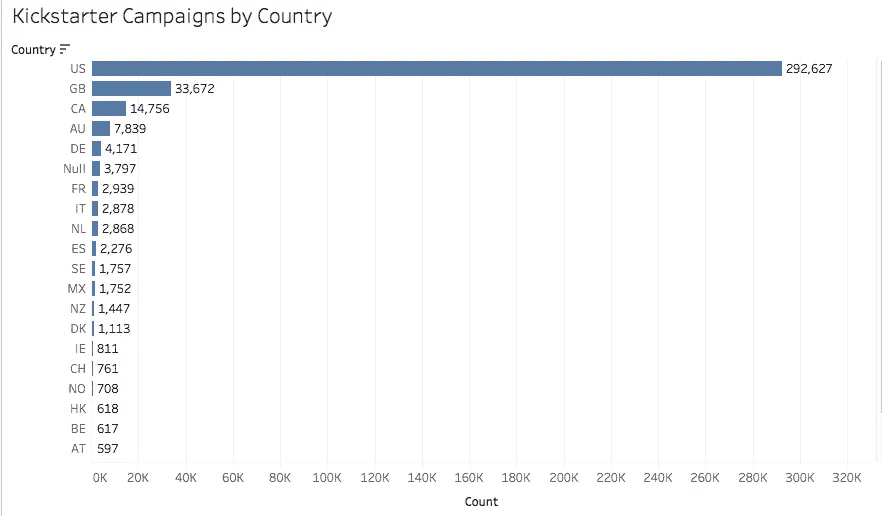
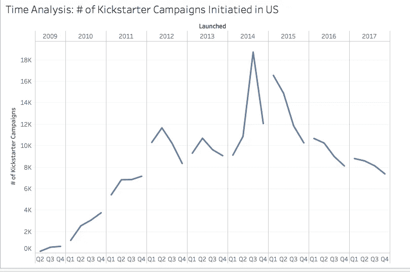
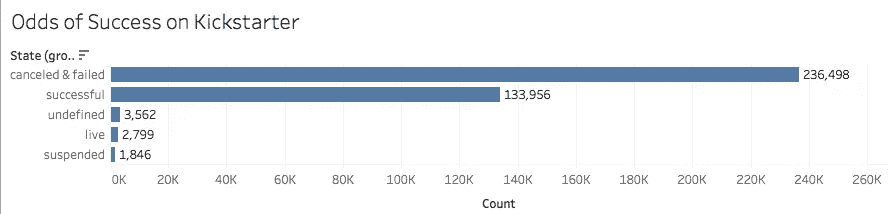
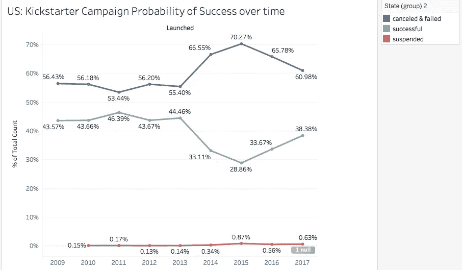
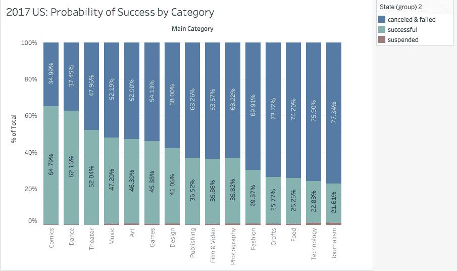
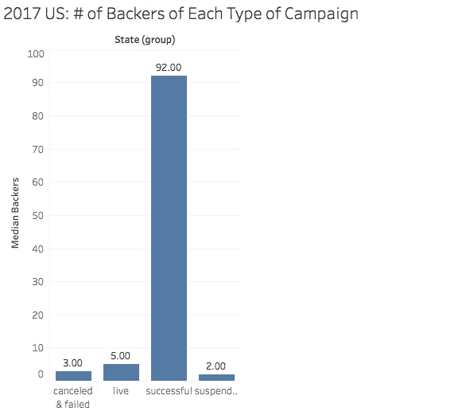
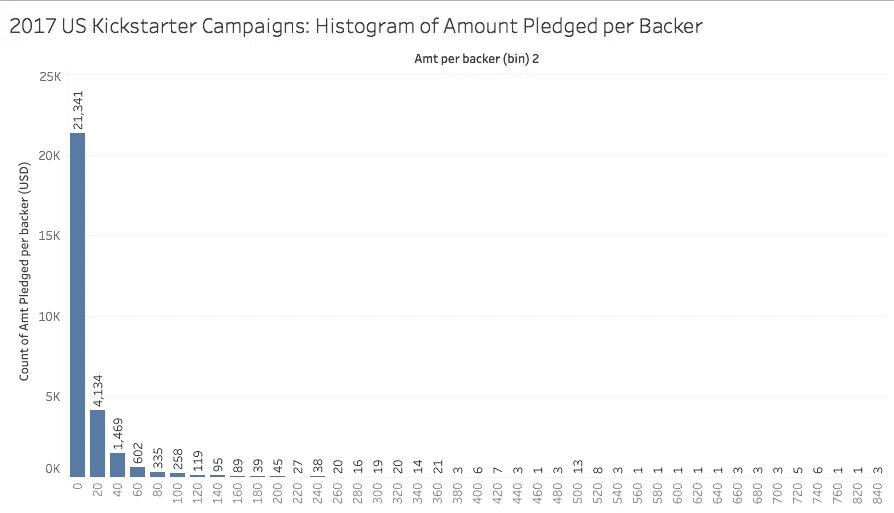
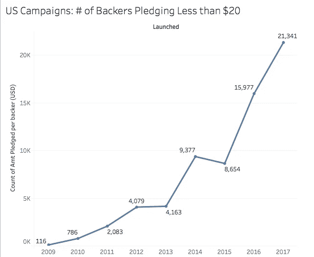
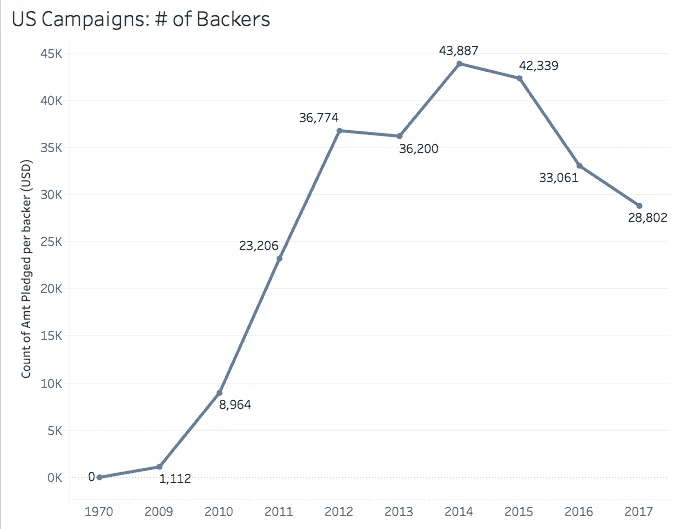

# 我应该用 Kickstarter 来资助我的想法吗？

> 原文：<https://towardsdatascience.com/should-i-use-kickstarter-to-fund-my-idea-2a56b40c9d44?source=collection_archive---------7----------------------->

image ” by [rawpixel](https://unsplash.com/@rawpixel?utm_source=medium&utm_medium=referral) on [Unsplash](https://unsplash.com?utm_source=medium&utm_medium=referral)

我在实践中学习，所以我一直在寻找有趣的数据集来分析，这样我就可以不断建立我的数据分析技能集并展示它。自然，我很高兴在 Kaggle 上看到关于 Kickstarter 活动的数据集。我听说过很多关于 Kickstarter 作为一种为自己的企业融资的方式，我想知道它实际上是一种多么成功的方式。以下是从数据中获得的一些见解。

# **Kickstarter 活动通常是由美国人发起的。**

其他公司位于北美、澳大利亚和西欧。Kickstarter 在亚洲(日本除外)、南美或非洲几乎没有业务。

The largest market for Kickstarter campaigns is the US with almost 300k campaigns, almost 10x the next largest market of Great Britain.

# **Kickstarter 作为众筹平台的受欢迎程度在 2014 年达到顶峰**

我惊讶地发现，Kickstarter 活动在 2014 年达到顶峰，此后一直稳步下降，每季度约 8 千英镑。是什么导致了这样的下降？一种假设可能是由于 2014 年 2 月的[数据泄露](https://www.recode.net/2014/2/15/11623534/kickstarter-says-it-was-hacked)，这可能导致宣誓者和活动所有者对该公司失去信任。另一个假设是一个视频游戏开发商(克里斯·罗伯茨)在 2014 年年中公布的 WordPress 众筹插件。最后，这种下降也可能是由于竞争对手网站 GoFundMe 的崛起，该网站[在 2014 年第四季度超过](http://www.sandiegouniontribune.com/sdut-gofundme-top-crowdfunding-site-kickstarter-2015jan12-htmlstory.html#) KickStarter 成为最受欢迎的众筹网站。

# **成功达到 Kickstarter 目标的几率有多大？**

大约三分之一，尽管它因 Kickstarter 的类别而异，并随着时间的推移而变化。

For every successful Kickstarter campaign, there are roughly two failed or canceled campaigns.

近年来，成功率已上升至 38%，但仍低于 2011 年 46%的峰值。

# 什么类型的活动最有可能成功？

漫画和舞蹈有超过 60%的成功几率。有趣的是，舞蹈是 2017 年美国最不受欢迎的 Kickstarter 类型，只有不到 300 个活动。

成功的竞选活动也有较高的支持者中位数。

在美国，成功竞选的每位支持者承诺的金额中值是 42 美元！大多数人的认捐额在 0-20 美元之间。

这些年来，认捐少于 20 美元的支持者人数一直在上升，而支持者总数却在下降。

Total number of backers per campaign has decreased recently

# 结论:

如果符合以下条件，Kickstarter 将是为你的想法提供资金的好方法:

1.  你的想法与舞蹈或漫画有关
2.  你有一个庞大的网络
3.  你的目标很小
4.  你期望每个支持者贡献大约 20 美元或更少。