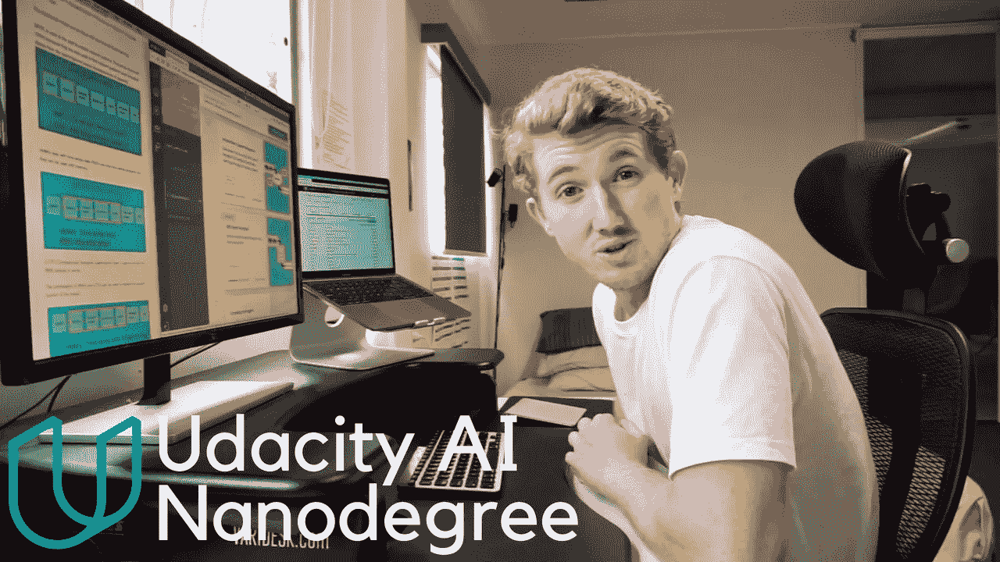

# 应该读 Udacity AI 纳米学位还是 AI 硕士学位？

> 原文：<https://towardsdatascience.com/should-you-do-a-udacity-ai-nanodegree-or-an-ai-masters-degree-6c39bb7101ec?source=collection_archive---------6----------------------->

我创造了自己的[人工智能硕士学位](http://bit.ly/AIMastersDegree)。其中包括两个 Udacity 纳米学位，以及其他课程。

1.  Udacity 深度学习纳米学位
2.  人造纳米度

Udacity 的课是我上过的质量最高的课。

我从未获得过真正的硕士学位，但无论如何让我们比较一下。

# **成本**

我去我大学的开放日看研究生学习。我调查的计算机科学项目是两年内每年 42，000 美元。你需要先付 50%。

我没有多余的 42，000 美元。所以我去了别处。

创建我自己的学习路径，我总共花了 3500 美元。各种课程、书籍和工具。3500 美元不是免费的，但远低于 84000 美元。

预先支付一切意味着我也没有任何债务。

# **时间**

如果我报名参加计算机科学项目，至少需要 2 年才能完成。

我自己的课程已经学了一年，快完成了。

然而，学习这些技术是永无止境的。每周都有一个新的艺术基准要了解。每周！很好玩。

# **学习**

我想学习计算机科学，因为我想了解人工智能。这比什么都更能激发我的兴趣。

但是大学提供的课程似乎什么都教，除了我所追求的。

上网后，我可以研究任何我想研究的东西。我直奔我想学的东西的来源。这很难。但是学习新事物总是很难。你不妨把精力投入到你想学的东西上。

# **反馈**

在我的本科学位期间，我交了作业，有时三个月都得不到反馈。到那时，这对我来说已经不重要了。考试也是如此。

Udacity 的评审人员会在你提交项目后的 24 小时内给你反馈和建议，有时会在一小时内。更不用说 Udacity 论坛和 Slack 频道了。这些对我的学习是非常宝贵的。与其一次在一个问题上坚持几个星期，不如(几乎)立即就能得到帮助。

# **质量**

我是视觉学习者。我必须亲眼目睹事情的发生才能理解它们。阅读大量的课堂笔记对我来说不是最好的学习方式。

Udacity 的动画团队做了大量的工作来配合他们的讲座。我经常发现自己反复观看观想十几次，让这个概念在我的脑海中扎根。

Udacity 还与行业专家合作。在我参加的纳米学位课程中，有来自 IBM 和 Google 的人提供了他们的见解。

# **内容**

我自己的硕士学位是否可以和真正的硕士学位相提并论？

我不知道答案，但是这样看。

大学硕士学位经受住了时间的考验。它们是为你将来的学习和研究做准备的。许多公司仍然认为它们是有价值的，甚至是必需的证书。

当然，我的硕士学位会有一些漏洞，纳米学位不会涵盖你需要知道的一切，因此得名。但更重要的是，我创造了自己的道路，其中包含了我想学的东西。这使得学习变得更加愉快。

最好的课程是那些激发你兴趣去拓展知识的课程。Udacity 课程为我做到了这一点。

# **机遇**

两个月前，我开始做机器学习工程师。从那以后，我从事了一系列需要我在纳米学位中学到的技能的项目。

然而，我也不得不根据项目的要求学习更多的东西。

有了硕士学位，我能申请更多的机会吗？可能吧。但是我没有。

相反，我知道我正在学习的技能是有价值的，并确保建立一个在线文件夹来作为我工作的证明。

Udacity 也与科技公司合作，并提供职业服务来帮助你找到一个角色，然而，我还没有利用这些。

# **进一步学习**

我只记得我所学的 1%。这就是为什么我的口号是*继续学习*。

现实世界中的大多数数据并不像你在一些课程中发现的那样整齐地打包，包括纳米学位。你必须不断地想出新的方法来以一种可以使用人工智能技术的格式获取数据。

从纳米学位或硕士学位毕业并不是你学习旅程的结束，而是一个新旅程的起点。

你永远不会为你所接受的挑战做好充分准备，但是有了你所获得的基础技能，你将能够学到你所需要的。

# **总结**

完成 AI 纳米学位后，我是不是最好的人工智能工程师？

号码

我读传统的人工智能硕士会不会更好？

也许吧，但我不打算做。

我能按要求学习新技术并应用于新问题吗？

是的。

我学的课程让我兴奋吗？

是的。

我的知识中有陷阱吗？

是的，但是我可以和在这些方面比我强的人在一起，并向他们学习。或者，我可以找出我的弱点，并加以解决。

如果你想节省成本和时间，直接进入人工智能的前沿，我会推荐人工智能纳米学位等课程。

如果你想接受更传统、更全面的教育，并有望继续深造、攻读博士学位之类的课程，那就去攻读人工智能硕士学位吧。

你可以用这些技能解决很多问题。它们需求量大是有原因的。

不断学习。

本帖开始是[我对](http://qr.ae/TUIIFC) [*问题的回答*](https://www.quora.com/What-is-the-difference-between-a-Udacity-Nanodegree-and-a-master-s-degree-with-artificial-intelligence)一个 Udacity 纳米学位和一个人工智能硕士学位有什么区别？*Quora 上。*

*在 [LinkedIn](http://bit.ly/DanielBourkeOnLinkedIn) 上与我联系。*

*在 YouTube[上看我](http://bit.ly/DanielBourkeOnYouTube)。*