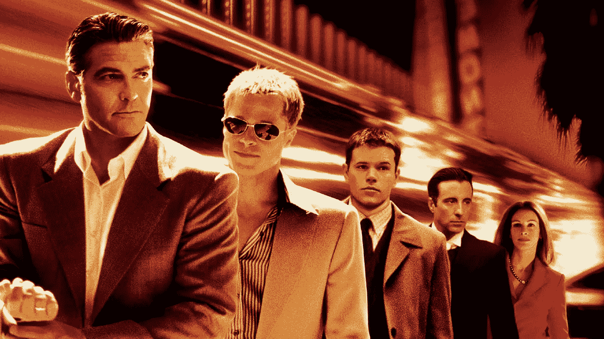
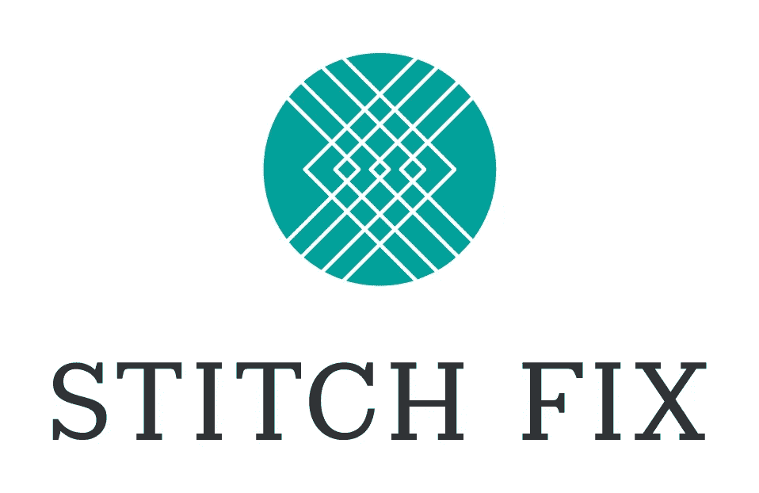
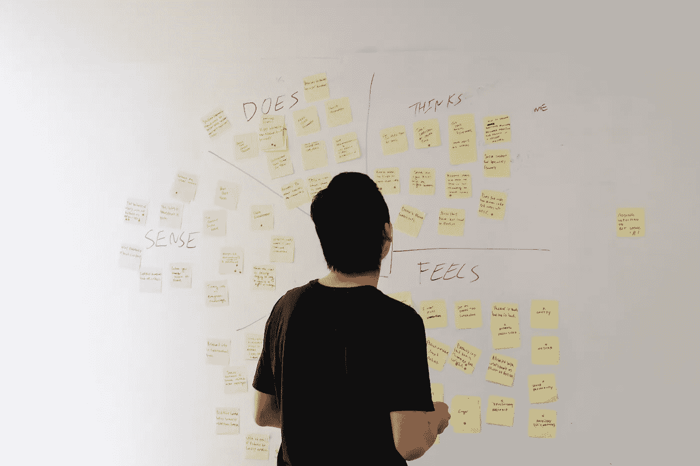

# 你的顾客应该被人类还是人工智能欺骗？

> 原文：<https://towardsdatascience.com/should-your-customers-be-conned-by-a-human-or-ai-6a87fbecdefe?source=collection_archive---------14----------------------->

## 《礼宾》vs《绿野仙踪》MVP

> “从我的脑海中，我会说你正在寻找一个博斯基，一个吉姆·布朗，一个戴西小姐，两个叶忒罗和一个利昂·斯平克斯，更不用说有史以来最大的艾拉·费兹杰拉！”

使用“礼宾”或“绿野仙踪”这样的行话感觉就像 11(或 12 或 13)罗汉[在讨论他们将要实施的骗局](https://www.quora.com/What-are-the-names-and-meanings-of-all-the-cons-in-the-Oceans-movie-trilogy)，这是[受到真实的信心诡计](https://en.wikipedia.org/wiki/List_of_confidence_tricks)的启发。

MVP 和原型制作与诈骗没有太大区别。我们希望从前期投资很少的人那里获得诚实的反馈金，以避免构建一切。你应该考虑人们有什么问题以及他们的解决方案。

# 人工智能大会

谈到 AI 通常从奇点或它是如何变得神奇开始。当真正的讨论开始时，关注的焦点是自动化，因为它可以削减成本或节省人员。我们应该考虑人工智能如何成为辅助的、增强的、[代理的](http://rosenfeldmedia.com/books/designing-agentive-technology/)，甚至是为人类需求而生成的。

通过 MVP，您可以了解人们面临的真正问题，因此您可以迭代地构建解决这些问题的东西。人类为机器提供目的。大多数情况下，人需要参与解决机器不能很好处理的异常情况。

对于具有人工智能的产品，你需要问一些重要的问题:你的客户会信任人类优先还是机器优先的系统？你想让人们期待一个有着各种怪癖的人会出现吗？还是想从机器上冷效率和缺乏偏见？

我们将讨论每个模型的优缺点，以及如何避免在构建人工智能、机器学习、深度学习和其他机器智能时的常见陷阱。

# 看门人

Connie, Hilton’s robot concierge.

“礼宾”是你自己解决顾客问题的方式。你把界面简化为人类和顾客之间的直接交流。以人性化的方式解决顾客的问题。

特别是，你正在学习如何通过自己动手来解决这些问题。在礼宾解决方案的情况下，最有价值的学习来自于接触所有你在构思服务时没有想到的案例。

人工智能通常会扮演自动化或辅助角色，帮助扮演门房的人更快地完成工作。随着时间的推移，服务得到了改进，使更多的人类任务从机械到复杂实现了自动化，并消除了决策过程中的干扰。

StitchFix 是一家采用礼宾模式来提供服务的公司的典范。随着时间的推移，他们在如何决定库存哪些服装方面变得更有创造力。 [StitchFix 的算法](http://algorithms-tour.stitchfix.com/)帮助设计师决定给顾客送什么衣服。

Brad Klingenberg，造型算法总监，做了一个关于人工智能循环使用中的人类的精彩演讲。不仅仅是一个人工智能反馈周期，还有多个包括设计师、客户、仓库等的工具。：

当你需要大规模的时候，门房 MVP 技术就失效了。一般来说，这是一个很好的问题，但这表明你需要找到另一种方式来做事情，而不仅仅是增加人数。

当计划使用人工智能时，您可能无法访问数据，或者无法训练正确的模型来取代大量的人工干预。

# 绿野仙踪

《绿野仙踪》就是你让它看起来像是由一台机器完成的，但实际上是一个人在幕后操纵。你构建了一个服务的 UX 外观，看起来是全机械化的，但实际上是有人在幕后操作。当您知道基础知识并将其构建到外观中时，这是最好的，但不要假设很多例外。

客户的期望是，这是一项应该能够正常工作的服务。如果它不起作用，它会把错误很好地传达给他们。他们不期望与一个人(或自主代理)进行复杂的对话。

《绿野仙踪》人工智能 MVP 的强大之处在于，幕后的人类正在从交互中创建带标签的数据。人类将采取机器最终应该采取的理想行动。

[Expensify](https://www.expensify.com/) ，一个伟大的费用管理服务，是他们收据智能扫描技术的一个很好的例子。当他们第一次开始解析收据的照片时，他们会自动做一些事情，但会使用 Mechanical Turk 来解析收据([除了一些争议](https://www.theverge.com/2017/11/28/16703962/expensify-receipts-amazon-turk-privacy-controversy))。如果你不熟悉机械土耳其人，这是亚马逊的一项服务，它将短期任务外包给真人，每项任务收取几分钱。

MTs 人工协助存在一些与零工经济相关的问题。当你不知道人类在做这项工作时，人们不会担心把他们当人看待。

虽然《绿野仙踪》并不总是适合这项服务。大多数聊天机器人就是一个很好的例子。他们在与客户的对话中提出了自动化系统的想法，但最初确实需要人类来驱动大部分系统。这是对《绿野仙踪》的错误使用，因为你没有正确设定期望值。

# 门房大战绿野仙踪

总之，MVP 模型最大化了不同的东西，但仍然试图抓住客户需求的核心。

你对顾客和他们的问题了解得越少，礼宾部就能更好地帮助你发现问题。

你认为你越了解你的顾客和他们的问题,《绿野仙踪》就能越好地帮助你验证和否定这些知识。

关于这两位 MVP 的更深入的背景，请查看由[艾伦·程](https://www.allencheng.com/concierge-mvp/)和[蚱蜢牧人](https://grasshopperherder.com/concierge-vs-wizard-of-oz-test/)发表的一些伟大的帖子。

# 人类优先还是 AI 优先？

Human head and horse body or horse head with human body?

除了了解你的客户和他们的问题之外，你还可以测试他们对人类优先或人工智能优先界面的感受。不管怎样，你都应该建造结合了人类和机器精华的半人马系统。

当考虑这两个选项时，你需要考虑随着时间的推移你将建立的信任。再问一次:你想让人们期待一个有着各种怪癖的人是可以得到的吗？还是想从机器上冷效率和缺乏偏见？

最后，它归结为你试图融入人们生活的利基。当与客户谈论你的 MVP、进行用户研究或测试你的原型时，这里有一些问题:

*   你更信任谁来做这件事:人还是机器？为什么？上一次是什么时候？
*   你更相信专家还是机器？为什么？上一次是什么时候？
*   解决这个问题时，异常有多重要？你上一次不得不处理异常是什么时候？
*   上次出了问题，你需要知道什么？什么类型的解释有帮助？哪些类型的解释没有？

Empathy Mapping for the Machine during our NYC Media Lab Summit workshop.

和你的最终客户一起跑步锻炼也是有益的。在 Philosophie，我们已经使用机器的[移情映射来帮助理解与服务交互的人类的期望。](https://uxdesign.cc/robots-need-love-too-empathy-mapping-for-ai-59585ad3548d)[混淆映射](/robots-are-wrong-too-confusion-mapping-for-the-worst-case-2e01b7e19936)可以帮助理解系统的错误案例如何影响客户结果。这些练习通过询问与客户实际需求相关的注重结果的问题，避免了人工智能术语。

人类应该在处理异常的循环中，但我们应该始终考虑如何以有意义的方式解决人们的问题。你需要考虑你的客户是想要一个人还是一台机器来帮助他们解决问题。